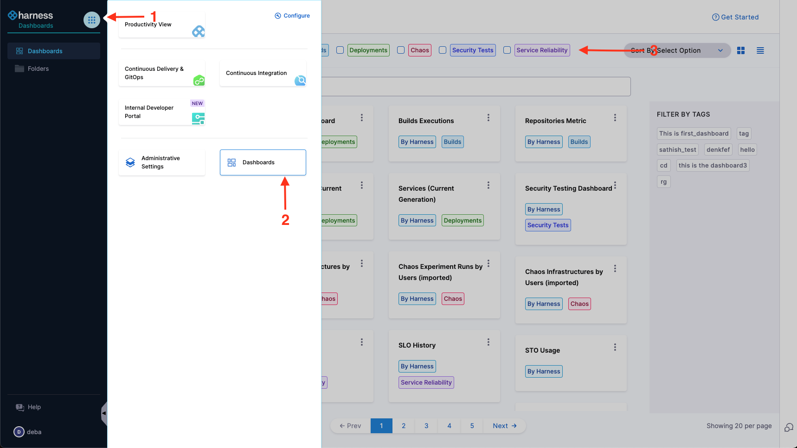
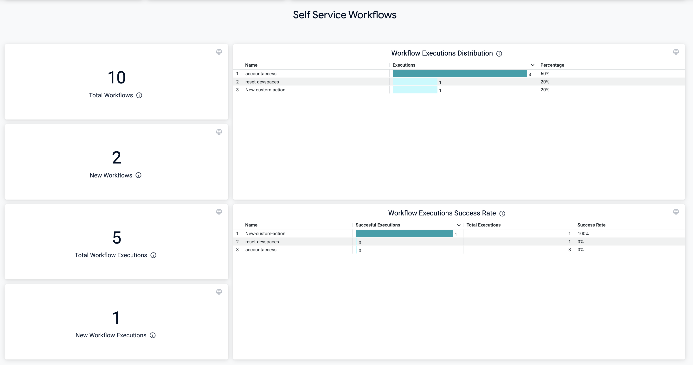
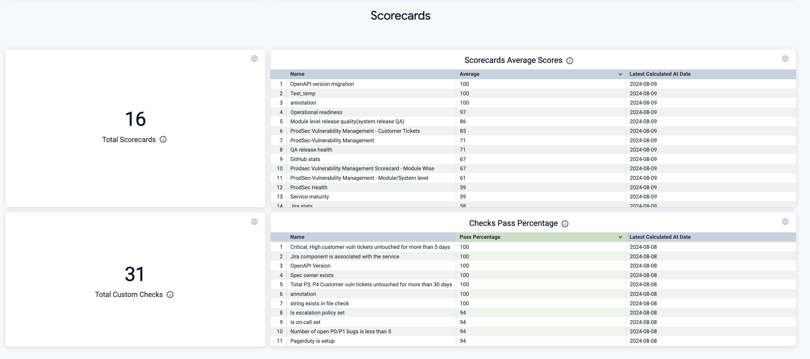
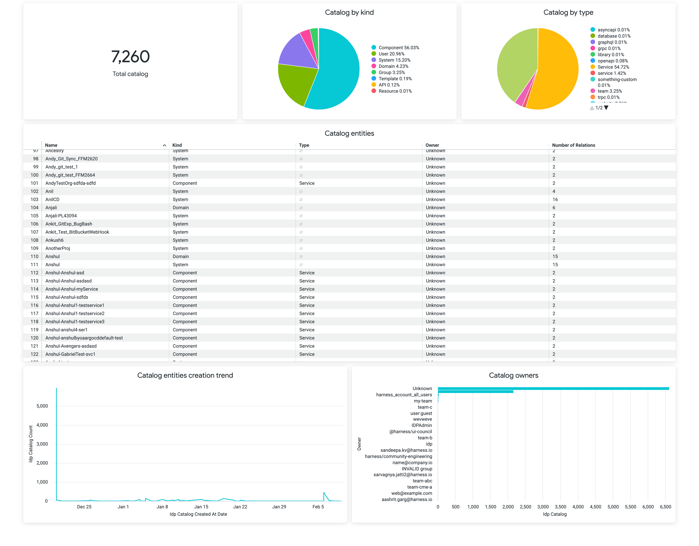
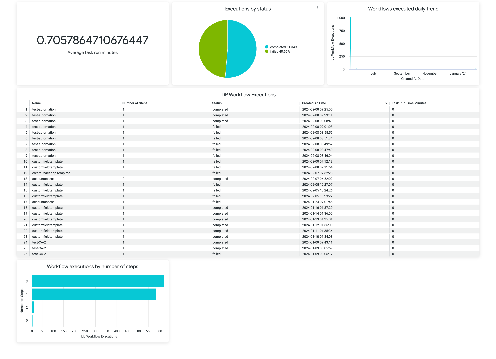

## Introduction

Dashboards is a Harness Platform Feature, that allows you to visualize key metrics and data related to your module. You can customize the dashboards to show specific metrics and data relevant to your needs, and access them from a central location. The Harness Dashboards provide actionable insights out of your IDP, so you can enable good developer experience in your org. Dashboards also allow you to setup scheduled delivery of reporting and alerts for your executives and stakeholders.

:::info

- You can create custom dashboards at the **account** scope only.
- Make sure you have the `Manage` permissions for **Dashboards** to create, edit, and delete custom dashboards.
- Make sure you have the `View` permissions for **Dashboards** to view the custom dashboards.

:::

## Navigate to Dashboards

To view and access dashboards, select **DASHBOARDS** from the left navigation in your Harness account. You can filter the data on the dashboards for IDP module by selecting the module name from the top of the page. 

#### Old Left Nav

#### New Left Nav

### Out of the Box Dashboards

At present we provide 3 out of the box dashboards for IDP. 

1. Adoption Dashboard: Track how Developers are using IDP, you get to know **active users** during the selected **Aggregation Period** along with insights on each of the key features 

  - Software Catalog
  
  

  - Self Service Workflows 

  

  - Scorecards

  

2. Dashboard describing the state of catalog, which includes, Number of registered entities, catalog kind and type. 

3. Dashboard describing the Workflow Execution details

## Create Dashboard
It is recommended to refer [this documentation](https://developer.harness.io/docs/platform/dashboards/create-dashboards) first to get a basic overview on how to create dashboards.

### Explore

An Explore is a starting point for a query that is designed to explore a particular subject area. This topic describes the various explores available for monitoring your developer portal, and the data the provide. The following is list of explores available for visualizing IDP data.

1. IDP Catalog
2. IDP Plugins
3. IDP Workflow Executions 

Follow this [documentation](https://developer.harness.io/docs/platform/dashboards/create-visualizations-and-graphs) to create visualizations and graphs

## Dashboard Best Practices

Follow this [documentation](https://developer.harness.io/docs/platform/dashboards/dashboard-best-practices) to know more. 

