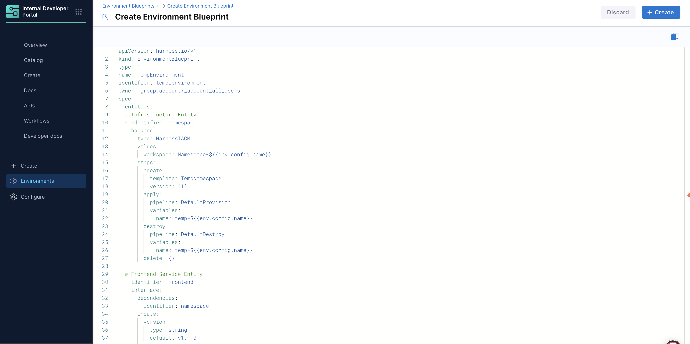

An **Environment Blueprint** is a collection of infrastructure templates, services, their configurations and lifecycle management details of each. When a blueprint is orchestrated, it generates running instances of Environments. Blueprints are typically owned by the **Platform Engineering** team. 

## Environment Blueprint YAML

An Environment Blueprint is defined using a **declarative YAML format**. The YAML structure defines infrastructure templates, services, dependencies, and lifecycle management for environments. 

---

### Core Components
An environment blueprint YAML has the following core components: 

**1. API Definition**
- `apiVersion`: Always `harness.io/v1` for Environment Blueprints
- `kind`: Must be `EnvironmentBlueprint`
- `name`: Human-readable name for the blueprint
- `identifier`: Unique identifier for the blueprint (auto-generated)
- `owner`: Access control specification (group or user)

**2. Specification (`spec`)**
- `entities`: List of infrastructure, service components and other entities
- `inputs`: User-configurable parameters for the blueprint

```YAML {8,9}
apiVersion: harness.io/v1
kind: EnvironmentBlueprint
type: ''
name: <blueprint-name>
identifier: <blueprint-identifier>
owner: group:account/_account_all_users
spec:
  entities: []
  inputs: {}
```

---

### Entity Specification

Each entity in an Environment Blueprint represents a component (infrastructure or service) that will be provisioned or deployed. Entities are the building blocks that define what gets created and how they interact with each other.

---

#### Entity Structure

Each entity in the blueprint is composed of **2 main parts**:

**1. Backend** - Describes the lifecycle implementation of the entity
- Defines **how** the entity is provisioned, deployed, or managed
- Specifies the **backend type** (`HarnessIACM` for infrastructure, `Catalog` for services). Go to [Backend Types](/docs/internal-developer-portal/environment-management/blueprints/env-blueprint-yaml#backend-types) to learn more.
- Contains configuration values and operational steps

**2. Interface** - Defines how the entity relates to other entities specified in the blueprint
- Declares dependencies on other entities
- Specifies **entity-level** user-configurable inputs
- Defines the entity's interaction model

```yaml
entities:
- identifier: <entity-name>
  interface:              # How entity relates to others
    dependencies: []      # List of entities this depends on
    inputs: {}           # User-configurable parameters
  backend:                # Lifecycle implementation
    type: <backend-type>  # HarnessIACM or Catalog
    values: {}           # Configuration and settings
    steps: {}            # Operational steps (for IaCM)
```

---

#### Entity Parameters

| Parameter | Type | Description | Example |
|-----------|------|-----------|---------|
| `identifier` | string | Unique name for the entity within the blueprint | `namespace`, `frontend`, `backend` |
| `interface` | object | Defines entity relationships and user inputs | See Interface Parameters below |
| `backend` | object | Defines the lifecycle implementation of the entity | See Backend Parameters below |

**Interface Parameters**

| Parameter | Type | Description | Example |
|-----------|------|-----------|---------|
| `dependencies` | array | List of entity identifiers this entity depends on | `[{"identifier": "namespace"}]` |
| `inputs` | object | User-configurable parameters with types and defaults at the entity level | `{"replicas": {"type": "integer", "default": 1}}` |

**Backend Parameters**

| Parameter | Type | Description | Example |
|-----------|------|-----------|---------|
| `type` | string | Backend type for entity provisioning | `HarnessIACM`, `Catalog` |
| `values` | object | Configuration settings specific to the backend type | Varies by backend type |
| `steps` | object | Operational steps for lifecycle management **(IaCM only)** | `{"create": {"template": "MyTemplate"}}` |

---

### Backend Types

Environment Blueprints support two main **backend types**:

---

#### 1. HarnessIACM Backend (Infrastructure)

Used for provisioning infrastructure resources using Infrastructure as Code Management. 

In this definition, `backend.type` is set to `HarnessIACM`.

**YAML Structure**

```YAML {4}
entities:
- identifier: namespace
  backend:
    type: HarnessIACM
    values:
      workspace: Namespace-${{env.config.name}}
    steps:
      create:
        template: TempNamespace  # Workspace Template ID
        version: '1'
      apply:
        pipeline: DefaultProvision  # Provision pipeline ID
        variables:
          name: temp-${{env.config.name}}
      destroy:
        pipeline: DefaultDestroy  # Destroy pipeline ID
        variables:
          name: temp-${{env.config.name}}
      delete: {}
      pause: {}
      resume: {}
```

**HarnessIACM Backend Parameters (`backend.values`)**

| Parameter | Type | Description | Example |
|-----------|------|-------------|----------|
| `workspace` | string | Workspace name for IaCM operations | `Namespace-${{env.config.name}}` |

**HarnessIACM Backend Steps (`backend.steps`)**

| Step | Required | Description | Parameters |
|------|----------|-------------|------------|
| `apply` | Yes | Provisions infrastructure with "upsert" behavior - creates initially and updates on changes | `pipeline`, `variables` |
| `destroy` | Yes | Destroys previously provisioned infrastructure | `pipeline`, `variables` |
| `create` | No | Initializes infrastructure (e.g., IaCM Workspace) before first provisioning | `template`, `version` |
| `delete` | No | Deletes initialized but unprovisioned infrastructure | None |

**Step Dependencies:**
- `create` must be executed before first `apply` operation
- `delete` must be executed after `destroy` operation  
- `create` and `delete` steps must be used together (both or neither)

**Example Configuration:**
```yaml
steps:
  create:
    template: TempNamespace
    version: '1'
  apply:
    pipeline: DefaultProvision
    variables:
      name: temp-${{env.config.name}}
  destroy:
    pipeline: DefaultDestroy
    variables:
      name: temp-${{env.config.name}}
  delete: {}
```

**Referencing Resources Across Scopes**

When referencing Harness resources (such as IaCM workspace templates or catalog entities) in your blueprint, you can reference resources from different organizational scopes using scope prefixes:

- **Project scope** (default): Use just the identifier - `MyResource`
- **Organization scope**: Prefix with `org.` - `org.MyResource`
- **Account scope**: Prefix with `account.` - `account.MyResource`

This enables you to reference shared resources across your Harness hierarchy while maintaining proper access control. For example, environments created at the project level can reference IaCM workspace templates or catalog entities defined at the organization or account level.

:::info Scope Hierarchy
Resources must respect the Harness organizational hierarchy. A project-level environment can reference resources from its parent organization or account, but resources maintain their defined scope boundaries and access permissions.
:::

---

#### 2. Catalog Backend (Services)

Used for deploying application services from the IDP catalog.

In this definition, `backend.type` is set to `Catalog`.

**YAML Structure**

```yaml {14}
entities:
- identifier: frontend
  interface:
    dependencies:
    - identifier: namespace  # Depends on infrastructure
    inputs:
      version:
        type: string
        default: v1.1.0
      replicas:
        type: integer
        default: 1
  backend:
    type: Catalog
    values:
      identifier: frontend  # Component ID from catalog
      variables:
        replicas: ${{entity.config.replicas}}
        version: ${{entity.config.version}}
      environment:
        identifier: mycluster
        infra:
          identifier: ssemteamdelegate
          namespace: ${{dependencies.namespace.output.name}}
    steps:
      apply:
        pipeline: DeployService
      destroy:
        pipeline: UninstallService
```

**Catalog Backend (`backend.values`)**

| Parameter | Type | Description | Example |
|-----------|------|-------------|----------|
| `identifier` | string | Component (service) ID from the IDP catalog | `frontend`, `backend` |
| `variables` | object | Input variables passed to the component | `{"replicas": "${{entity.config.replicas}}"}` |
| `environment` | object | Target deployment environment specification | See environment parameters below |

**Environment Parameters (`backend.values.environment`)**

| Parameter | Type | Description | Example |
|-----------|------|-------------|----------|
| `identifier` | string | CD Service Environment identifier where services will be deployed | `mycluster` |
| `infra` | object | Infrastructure specification within the environment | See infra parameters below |

**Infrastructure Parameters (`backend.values.environment.infra`)**

| Parameter | Type | Description | Example |
|-----------|------|-------------|----------|
| `identifier` | string | Infrastructure identifier | `ssemteamdelegate` |

**Catalog Backend Steps (`backend.steps`)**

| Step | Required | Description | Parameters |
|------|----------|-------------|------------|
| `apply` | Yes | Deploys the service using the specified pipeline | `pipeline` |
| `destroy` | Yes | Removes the deployed service using the specified pipeline | `pipeline` |

---

### Configure TTL (time-to-live)

You can configure TTL for environments in the environment blueprint. Defining a TTL specifies how long an environment can run before it is **automatically paused**. This helps control costs and prevents lingering environments.

Based on the TTL specification, there are two environment types: **Ephemeral** and **Long-lived**. Go to [Types of Environments](/docs/internal-developer-portal/environment-management/environments.md#types-of-environments) to learn more.

#### Set TTL in an Environment Blueprint

To define a TTL, add the `spec.ttl` field to the environment blueprint YAML. The `ttl` field is specified as follows:

**1. TTL specification**

```yaml
spec:
  ttl:
    kind: <ttl-kind>
    default: <default-ttl-duration>   # Optional
    max: <max-ttl-duration>           # Optional
```

Durations support hours, minutes, and seconds (e.g., `1h`, `30m`, `1h30m`).

**2. TTL kinds**

* **`fixed`** — A fixed, preconfigured duration in the blueprint. Users **cannot** change it when creating an environment.
* **`custom`** — A user-configurable duration chosen at environment creation time.
* **`none`** — No TTL. The environment is **long-lived** and is only paused/stopped when a user does so explicitly.

**3. TTL parameters**

* **`default`** — The default TTL duration for the blueprint (optional).
* **`max`** — The maximum allowed TTL duration for the blueprint (optional).

**4. Examples**

Fixed 1-hour TTL; the environment pauses automatically after 1 hour:

```yaml
spec:
  ttl:
    kind: fixed
    default: 1h
    max: 24h
```

User-defined TTL with a default of 3 hours (if no input is provided) and a 24-hour cap:

```yaml
spec:
  ttl:
    kind: custom
    default: 3h
    max: 24h
```

Long-lived environment (no automatic pause):

```yaml
spec:
  ttl:
    kind: none
```

**Note:** When you update an environment’s configuration, the environment is **re-provisioned** and the TTL is **reset**. The new TTL countdown starts from the time of the update.

---


### YAML Templating System

Environment Blueprints use a powerful templating system for dynamic configuration:

#### Template Variables

| Variable Type | Example | Description |
|---------------|---------|-------------|
| Environment Config | `${{env.config.name}}` | Access environment-level inputs |
| Entity Config | `${{entity.config.replicas}}` | Access entity-specific inputs |
| Dependency Outputs | `${{dependencies.namespace.output.name}}` | Reference outputs from dependent entities |

#### Example Usage

```yaml
# Dynamic workspace naming
workspace: Namespace-${{env.config.name}}

# Variable mapping from inputs
variables:
  replicas: ${{entity.config.replicas}}
  version: ${{entity.config.version}}

# Dependency resolution
namespace: ${{dependencies.namespace.output.name}}
```

---

### Scope & Hierarchy
Environment Blueprints live at the **account scope**, while environments can only be created at the **project scope**. 

In an environment blueprint, all the entities, workspace templates, pipelines, etc. are also created at the **project scope**.

#### Environment Management RBAC

Harness IDP provides granular Role-Based Access Control (RBAC) for environment management, allowing you to control who can view, create, edit, or delete environment blueprints and environments. The RBAC model follows the Harness platform hierarchy with different scopes for blueprints and environments.

##### Permissions Hierarchy

The environment management RBAC is structured across two main resource types:

| Resource Type | Scope | Available Permissions | Resource Group Options |
|---------------|-------|----------------------|------------------------|
| **Environment Blueprint** | Account Level | <ul><li>**VIEW**: View environment blueprints</li><li>**CREATE/EDIT**: Create new blueprints or edit existing ones</li><li>**DELETE**: Delete environment blueprints</li></ul> | <ul><li>All Environment Blueprints</li><li>Specific Environment Blueprints</li></ul> |
| **Environment** | Project Level | <ul><li>**VIEW**: View environments</li><li>**CREATE/EDIT**: Create new environments or edit existing ones</li><li>**DELETE**: Delete environments</li></ul> | <ul><li>All Environments</li><li>Specific Environments</li></ul> |

For a complete overview of all IDP resources and their permissions across different scopes, refer to the [Permissions & Resources table](/docs/internal-developer-portal/rbac/scopes#permissions--resources-idp-20) in the IDP RBAC documentation.

##### Configuring RBAC for Environment Management

To configure access control for environment management:

1. **For Environment Blueprints (Account Level)**:
   - Navigate to **Account Settings** > **Access Control** > **Roles**
   - Create or edit a role and assign Environment Blueprint permissions (VIEW, CREATE/EDIT, DELETE)
   - Create a **Resource Group** and select either:
     - **All Environment Blueprints** - Grants access to all blueprints in the account
     - **Specific Environment Blueprints** - Grants access to selected blueprints only
   - Assign the role and resource group to users or user groups

2. **For Environments (Project Level)**:
   - Navigate to **Project Settings** > **Access Control** > **Roles**
   - Create or edit a role and assign Environment permissions (VIEW, CREATE/EDIT, DELETE)
   - Create a **Resource Group** and select either:
     - **All Environments** - Grants access to all environments in the project
     - **Specific Environments** - Grants access to selected environments only
   - Assign the role and resource group to users or user groups

:::tip
For more information on configuring RBAC in Harness, refer to the [RBAC documentation](https://developer.harness.io/docs/platform/role-based-access-control/rbac-in-harness).
:::  

---

### Example Blueprint YAML

```yaml
apiVersion: harness.io/v1
kind: EnvironmentBlueprint
type: ''
name: TempEnvironment
identifier: temp_environment
owner: group:account/_account_all_users
spec:
  entities:
  # Infrastructure Entity
  - identifier: namespace
    backend:
      type: HarnessIACM
      values:
        workspace: Namespace-${{env.config.name}}
      steps:
        create:
          template: TempNamespace
          version: '1'
        apply:
          pipeline: DefaultProvision
          variables:
            name: temp-${{env.config.name}}
        destroy:
          pipeline: DefaultDestroy
          variables:
            name: temp-${{env.config.name}}
        delete: {}
  
  # Frontend Service Entity
  - identifier: frontend
    interface:
      dependencies:
      - identifier: namespace
      inputs:
        version:
          type: string
          default: v1.1.0
        replicas:
          type: integer
          default: 1
    backend:
      type: Catalog
      values:
        identifier: frontend
        variables:
          replicas: ${{entity.config.replicas}}
          version: ${{entity.config.version}}
        environment:
          identifier: mycluster
          infra:
            identifier: ssemteamdelegate
            namespace: ${{dependencies.namespace.output.name}}
        steps:
          apply:
            pipeline: DeployService
          destroy:
            pipeline: UninstallService
  
  # Backend Service Entity
  - identifier: backend
    interface:
      dependencies:
      - identifier: namespace
      inputs:
        version:
          type: string
          default: v1.3.2
        replicas:
          type: integer
          default: 1
    backend:
      type: Catalog
      values:
        identifier: backend
        variables:
          replicas: ${{entity.config.replicas}}
          version: ${{entity.config.version}}
        environment:
          identifier: mycluster
          infra:
            identifier: ssemteamdelegate
            namespace: ${{dependencies.namespace.output.name}}
      steps:
        apply:
          pipeline: DeployService
        destroy:
          pipeline: UninstallService
  
  # Blueprint-level inputs
  inputs:
    name:
      type: string
      default: demo
```

---

## Create Environment Blueprints
In Harness IDP (Environments), navigate to the **Environments** section, and hit **“Create”** and then **“Environment Blueprint”**. Use the [YAML provided above](/docs/internal-developer-portal/environment-management/blueprints/env-blueprint-yaml#example-blueprint-yaml) to create the environment blueprint.

