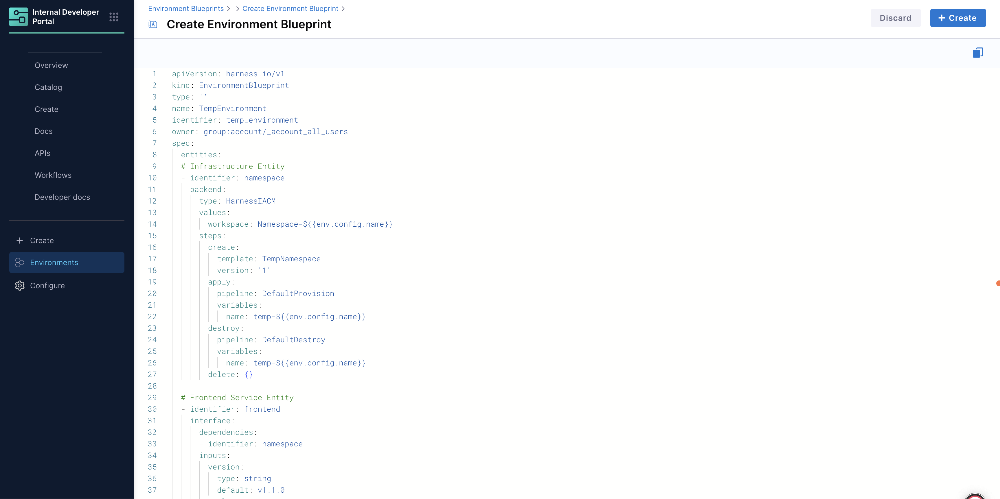

An **Environment Blueprint** is a collection of infrastructure templates, services, their configurations and lifecycle management details of each. When a blueprint is orchestrated, it generates running instances of Environments. Blueprints are typically owned by the **Platform Engineering** team. 

## Environment Blueprint YAML

An Environment Blueprint is defined using a **declarative YAML format**. The YAML structure defines infrastructure templates, services, dependencies, and lifecycle management for environments. 

---

### Core Components
An environment blueprint YAML has the following core components: 

**1. API Definition**
- `apiVersion`: Always `harness.io/v1` for Environment Blueprints
- `kind`: Must be `EnvironmentBlueprint`
- `name`: Human-readable name for the blueprint
- `identifier`: Unique identifier for the blueprint (auto-generated)
- `owner`: Access control specification (group or user)

**2. Specification (`spec`)**
- `entities`: List of infrastructure, service components and other entities
- `inputs`: User-configurable parameters for the blueprint

```YAML {8,9}
apiVersion: harness.io/v1
kind: EnvironmentBlueprint
type: ''
name: <blueprint-name>
identifier: <blueprint-identifier>
owner: group:account/_account_all_users
spec:
  entities: []
  inputs: {}
```

---

### Entity Specification

Each entity in an Environment Blueprint represents a component (infrastructure or service) that will be provisioned or deployed. Entities are the building blocks that define what gets created and how they interact with each other.

---

#### Entity Structure

Each entity in the blueprint is composed of **2 main parts**:

**1. Backend** - Describes the lifecycle implementation of the entity
- Defines **how** the entity is provisioned, deployed, or managed
- Specifies the **backend type** (`HarnessIACM` for infrastructure, `Catalog` for services). Go to [Backend Types](/docs/internal-developer-portal/environment-management/env-blueprint-yaml.md#backend-types) to learn more.
- Contains configuration values and operational steps

**2. Interface** - Defines how the entity relates to other entities specified in the blueprint
- Declares dependencies on other entities
- Specifies **entity-level** user-configurable inputs
- Defines the entity's interaction model

```yaml
entities:
- identifier: <entity-name>
  interface:              # How entity relates to others
    dependencies: []      # List of entities this depends on
    inputs: {}           # User-configurable parameters
  backend:                # Lifecycle implementation
    type: <backend-type>  # HarnessIACM or Catalog
    values: {}           # Configuration and settings
    steps: {}            # Operational steps (for IaCM)
```

---

#### Entity Parameters

| Parameter | Type | Description | Example |
|-----------|------|-----------|---------|
| `identifier` | string | Unique name for the entity within the blueprint | `namespace`, `frontend`, `backend` |
| `interface` | object | Defines entity relationships and user inputs | See Interface Parameters below |
| `backend` | object | Defines the lifecycle implementation of the entity | See Backend Parameters below |

**Interface Parameters**

| Parameter | Type | Description | Example |
|-----------|------|-----------|---------|
| `dependencies` | array | List of entity identifiers this entity depends on | `[{"identifier": "namespace"}]` |
| `inputs` | object | User-configurable parameters with types and defaults at the entity level | `{"replicas": {"type": "integer", "default": 1}}` |

**Backend Parameters**

| Parameter | Type | Description | Example |
|-----------|------|-----------|---------|
| `type` | string | Backend type for entity provisioning | `HarnessIACM`, `Catalog` |
| `values` | object | Configuration settings specific to the backend type | Varies by backend type |
| `steps` | object | Operational steps for lifecycle management **(IaCM only)** | `{"create": {"template": "MyTemplate"}}` |

---

### Backend Types

Environment Blueprints support two main **backend types**:

---

#### 1. HarnessIACM Backend (Infrastructure)

Used for provisioning infrastructure resources using Infrastructure as Code Management. 

In this definition, `backend.type` is set to `HarnessIACM`.

**YAML Structure**

```YAML {4}
entities:
- identifier: namespace
  backend:
    type: HarnessIACM
    values:
      workspace: Namespace-${{env.config.name}}
    steps:
      create:
        template: TempNamespace  # Workspace Template ID
        version: '1'
      apply:
        pipeline: DefaultProvision  # Provision pipeline ID
        variables:
          name: temp-${{env.config.name}}
      destroy:
        pipeline: DefaultDestroy  # Destroy pipeline ID
        variables:
          name: temp-${{env.config.name}}
      delete: {}
      pause: {}
      resume: {}
```

**HarnessIACM Backend Parameters (`backend.values`)**

| Parameter | Type | Description | Example |
|-----------|------|-------------|----------|
| `workspace` | string | Workspace name for IaCM operations | `Namespace-${{env.config.name}}` |

**HarnessIACM Backend Steps (`backend.steps`)**

| Step | Required | Description | Parameters |
|------|----------|-------------|------------|
| `apply` | Yes | Provisions infrastructure with "upsert" behavior - creates initially and updates on changes | `pipeline`, `variables` |
| `destroy` | Yes | Destroys previously provisioned infrastructure | `pipeline`, `variables` |
| `create` | No | Initializes infrastructure (e.g., IaCM Workspace) before first provisioning | `template`, `version` |
| `delete` | No | Deletes initialized but unprovisioned infrastructure | None |

**Step Dependencies:**
- `create` must be executed before first `apply` operation
- `delete` must be executed after `destroy` operation  
- `create` and `delete` steps must be used together (both or neither)

**Example Configuration:**
```yaml
steps:
  create:
    template: TempNamespace
    version: '1'
  apply:
    pipeline: DefaultProvision
    variables:
      name: temp-${{env.config.name}}
  destroy:
    pipeline: DefaultDestroy
    variables:
      name: temp-${{env.config.name}}
  delete: {}
```

---

#### 2. Catalog Backend (Services)

Used for deploying application services from the IDP catalog.

In this definition, `backend.type` is set to `Catalog`.

**YAML Structure**

```yaml {14}
entities:
- identifier: frontend
  interface:
    dependencies:
    - identifier: namespace  # Depends on infrastructure
    inputs:
      version:
        type: string
        default: v1.1.0
      replicas:
        type: integer
        default: 1
  backend:
    type: Catalog
    values:
      identifier: frontend  # Component ID from catalog
      variables:
        replicas: ${{entity.config.replicas}}
        version: ${{entity.config.version}}
      environment:
        identifier: mycluster
        infra:
          identifier: ssemteamdelegate
          namespace: ${{dependencies.namespace.output.name}}
    steps:
      apply:
        pipeline: DeployService
      destroy:
        pipeline: UninstallService
```

**Catalog Backend (`backend.values`)**

| Parameter | Type | Description | Example |
|-----------|------|-------------|----------|
| `identifier` | string | Component (service) ID from the IDP catalog | `frontend`, `backend` |
| `variables` | object | Input variables passed to the component | `{"replicas": "${{entity.config.replicas}}"}` |
| `environment` | object | Target deployment environment specification | See environment parameters below |

**Environment Parameters (`backend.values.environment`)**

| Parameter | Type | Description | Example |
|-----------|------|-------------|----------|
| `identifier` | string | CD Service Environment identifier where services will be deployed | `mycluster` |
| `infra` | object | Infrastructure specification within the environment | See infra parameters below |

**Infrastructure Parameters (`backend.values.environment.infra`)**

| Parameter | Type | Description | Example |
|-----------|------|-------------|----------|
| `identifier` | string | Infrastructure identifier | `ssemteamdelegate` |

**Catalog Backend Steps (`backend.steps`)**

| Step | Required | Description | Parameters |
|------|----------|-------------|------------|
| `apply` | Yes | Deploys the service using the specified pipeline | `pipeline` |
| `destroy` | Yes | Removes the deployed service using the specified pipeline | `pipeline` |

---

### YAML Templating System

Environment Blueprints use a powerful templating system for dynamic configuration:

#### Template Variables

| Variable Type | Example | Description |
|---------------|---------|-------------|
| Environment Config | `${{env.config.name}}` | Access environment-level inputs |
| Entity Config | `${{entity.config.replicas}}` | Access entity-specific inputs |
| Dependency Outputs | `${{dependencies.namespace.output.name}}` | Reference outputs from dependent entities |

#### Example Usage

```yaml
# Dynamic workspace naming
workspace: Namespace-${{env.config.name}}

# Variable mapping from inputs
variables:
  replicas: ${{entity.config.replicas}}
  version: ${{entity.config.version}}

# Dependency resolution
namespace: ${{dependencies.namespace.output.name}}
```

---

### Example Blueprint YAML

```yaml
apiVersion: harness.io/v1
kind: EnvironmentBlueprint
type: ''
name: TempEnvironment
identifier: temp_environment
owner: group:account/_account_all_users
spec:
  entities:
  # Infrastructure Entity
  - identifier: namespace
    backend:
      type: HarnessIACM
      values:
        workspace: Namespace-${{env.config.name}}
      steps:
        create:
          template: TempNamespace
          version: '1'
        apply:
          pipeline: DefaultProvision
          variables:
            name: temp-${{env.config.name}}
        destroy:
          pipeline: DefaultDestroy
          variables:
            name: temp-${{env.config.name}}
        delete: {}
  
  # Frontend Service Entity
  - identifier: frontend
    interface:
      dependencies:
      - identifier: namespace
      inputs:
        version:
          type: string
          default: v1.1.0
        replicas:
          type: integer
          default: 1
    backend:
      type: Catalog
      values:
        identifier: frontend
        variables:
          replicas: ${{entity.config.replicas}}
          version: ${{entity.config.version}}
        environment:
          identifier: mycluster
          infra:
            identifier: ssemteamdelegate
            namespace: ${{dependencies.namespace.output.name}}
        steps:
          apply:
            pipeline: DeployService
          destroy:
            pipeline: UninstallService
  
  # Backend Service Entity
  - identifier: backend
    interface:
      dependencies:
      - identifier: namespace
      inputs:
        version:
          type: string
          default: v1.3.2
        replicas:
          type: integer
          default: 1
    backend:
      type: Catalog
      values:
        identifier: backend
        variables:
          replicas: ${{entity.config.replicas}}
          version: ${{entity.config.version}}
        environment:
          identifier: mycluster
          infra:
            identifier: ssemteamdelegate
            namespace: ${{dependencies.namespace.output.name}}
      steps:
        apply:
          pipeline: DeployService
        destroy:
          pipeline: UninstallService
  
  # Blueprint-level inputs
  inputs:
    name:
      type: string
      default: demo
```

---

## Create Environment Blueprints
In Harness IDP (Environments), navigate to the **Environments** section, and hit **“Create”** and then **“Environment Blueprint”**. Use the [YAML provided above](/docs/internal-developer-portal/environment-management/env-blueprint-yaml.md#example-blueprint-yaml) to create the environment blueprint.

