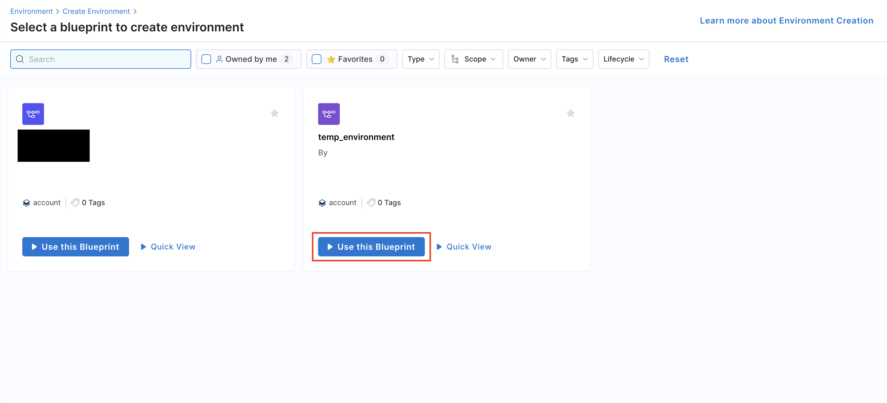
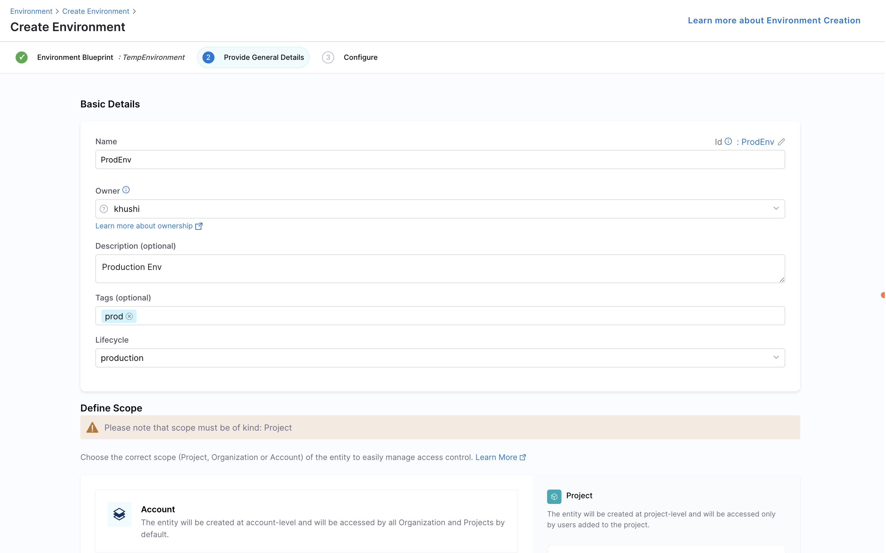
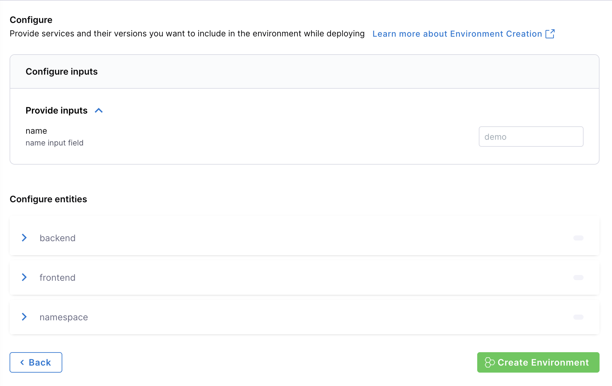
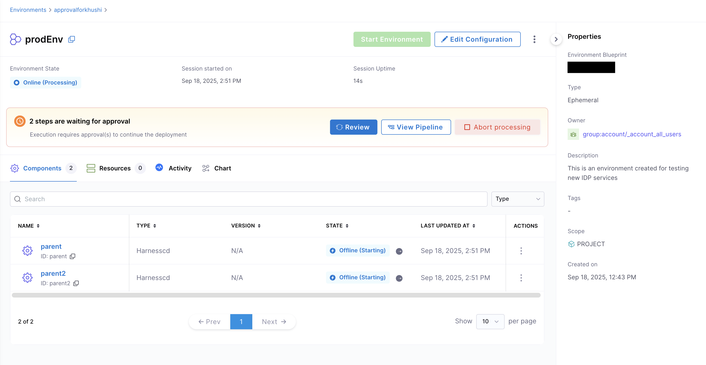
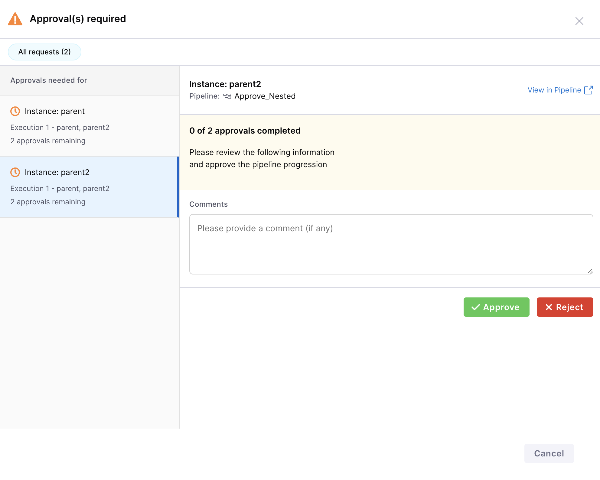
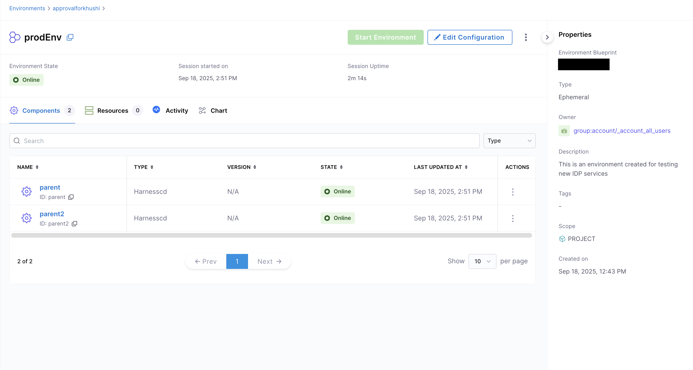

An **Environment** is instantiated using an **Environment Blueprint**, consider it as a running instance of environment blueprint. It represents the deployed infrastructure and services, as defined in the blueprint. It is a collection of software services deployed using CD tools and executed on infrastructure provisioned through IaCM tools.

---

## Create Environments
Using the [Environment Blueprint](/docs/internal-developer-portal/environment-management/env-blueprint-yaml.md) we can now create and spin up an ephemeral environment. 

1. In Harness IDP (Environments), hit “Create” in the right corner, then “Environment, then select your new “Environment Blueprint”.

2. Give your environment a Name, select owners, input lifecycle (add a new one if the dropdown list is empty), and choose your project as a scope and then Click “Configure Environment”.

3. On the new screen, you can choose and configure your inputs to the environment, and when you are satisfied, hit “Create Environment”. 

The Environment should now be creating, and you can follow the progress by viewing the instances and their states, or you can dive deeper into the pipeline, by following the link next to the environment state.

---

## Delete Environments
When are are ready to delete the environment, go to the Environment page and from the Options menu at the top right, hit “Delete”. It will destroy the namespace and delete the environment.

---

## Use Pipeline Approvals in Environments

Environment management in Harness IDP enables integration with **[Harness Pipeline Approvals](https://developer.harness.io/docs/platform/approvals/approvals-tutorial)**.
This feature allows you to add approvers in the CD service pipeline and control the environment creation process through pipeline approvals and rejections.

1. Ensure that you have an **approval step/stage** added in your CD service pipeline. Refer to [Approvals](https://developer.harness.io/docs/platform/approvals/approvals-tutorial) for more details.
2. Use the same pipeline details in your environment blueprint steps `apply` and `destroy` for your [CD services](/docs/internal-developer-portal/environment-management/env-blueprint-yaml.md#2-catalog-backend-services).
3. Create a new environment using the same environment blueprint. You will be prompted to approve the pipeline deployment for your service instances.
)
4. Approve the pipeline execution for your service instances.

5. Once approved, your environment will be successfully created.
