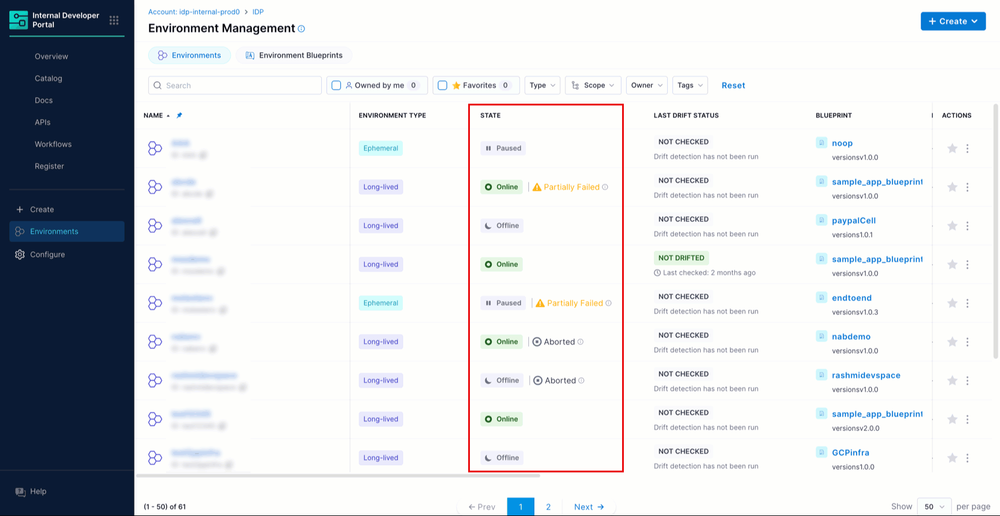

import DocImage from '@site/src/components/DocImage';

An **Environment** is instantiated using an **Environment Blueprint**, consider it as a running instance of environment blueprint. It represents the deployed infrastructure and services, as defined in the blueprint. It is a collection of software services deployed using CD tools and executed on infrastructure provisioned through IaCM tools.

---

## Types of environments

Based on the time-to-live (TTL) duration, Harness IDP environment management supports two types of environments:

* **Ephemeral environments**: Short-lived environments that are created and paused on demand. They run only for a specific time interval configured by the user. When the TTL expires, the environment moves to an `Offline | TTL Expired` state automatically. Go to [Environment states](#environment-states) to view all possible states.
* **Long-lived environments**: Environments that run indefinitely and are not paused automatically. They are paused only when the user explicitly does so.

Go to [Configure TTL](/docs/internal-developer-portal/environment-management/blueprints/env-blueprint-yaml#configure-ttl-time-to-live) to learn more. 

**Note:** When you update an environment’s configuration, the environment is **re-provisioned** and the TTL is **reset**. The new TTL countdown starts from the time of the update.

---

## Create environments
Using the [Environment Blueprint](/docs/internal-developer-portal/environment-management/blueprints/env-blueprint-yaml) we can now create and spin up an ephemeral environment. 

1. In Harness IDP (Environments), click **+ Create** in the right corner, then select **Environment**.

2. A list of available environment blueprints will be visible. Select your new environment by clicking the **Use this Blueprint** option beneath it.

3. Give your environment a name, select the blueprint version to use, choose an owner, and set the project scope. Then click **Next: Configure Environment**.

    :::info Blueprint Scope Prefixes
    When an environment references a blueprint, the blueprint identifier includes a scope prefix to indicate where it lives:
    * `account.my-blueprint`: references a blueprint at the account scope
    * `org.my-blueprint`: references a blueprint at the org scope
    * `my-blueprint` (no prefix): references a blueprint at the same scope as the environment (project level)

    Existing environments that previously referenced blueprints without a prefix have been automatically migrated to use the `account.` prefix, since all pre-existing blueprints were at account level.
    :::
<!--  -->
4. On the new screen, you can choose and configure your inputs to the environment, and when you are satisfied, click **Create Environment**. 

5. Configure TTL (if enabled): If TTL is enabled for the environment blueprint, you can configure/use the TTL duration for the environment. 

The Environment should now be creating, and you can follow the progress by viewing the instances and their states, or you can dive deeper into the pipeline, by following the link next to the environment state.

---

## The environment detail page

When you open an environment, you land on its detail page. Understanding this page is essential for both monitoring your environment and taking action on it.

The top of the page shows a metadata row with these fields: **Environment State**, **Drift status**, **Session started on**, **Session Uptime**, **Last Updated On**, and **Expires on** (populated only for ephemeral environments with a fixed TTL).

To the right of the main content, a **Properties** panel shows the **Environment Blueprint** the environment was created from (linked), the **Blueprint Version** it is pinned to (with a STABLE badge if that version is marked stable), **Type**, **Owner**, **Description**, **Tags**, **Scope**, and **Created on**.

### Environment states

The environment state reflects the current health and operational status of your environment. It appears in the **STATE** column on the environments list and in the **Environment State** field on the environment detail page.

* **Environment Status:** High-level operational state (online, offline, paused)
* **Environment State:** Sub-state providing additional context (updating, stopping, starting, failed, partially_failed, aborted, ttl_expired, or empty)

| Environment Status | Environment State | When It Appears | Description |
|---|---|---|---|
| **Online** | (empty) | All instances running, no operations in progress | All resources and services are running. No operations are in progress. |
| **Online** | *Updating* | Environment is running and an update operation is in progress | Changes are being applied to the environment. Some services may restart during this process. |
| **Online** | *Stopping* | Environment is running and a destroy/stop operation is in progress | The environment is stopping. Running services will shut down shortly. |
| **Online** | *Partially Failed* | Environment is running but some instances failed | The environment is running, but some services failed and may be unavailable. |
| **Online** | *Aborted* | Environment is running but last operation was aborted | The environment is running, but the last operation was interrupted before completion. Some changes may not have been applied. |
| **Offline** | (empty) | All instances inactive, no operations in progress | No resources or services are running. It can be resumed. |
| **Offline** | *Updating* | Environment is offline and an update is being applied | Changes are being applied to the environment. |
| **Offline** | *Starting* | Environment is being provisioned or resumed | The environment is starting up. |
| **Offline** | *Failed* | Environment failed to start or update failed | The environment is stopped due to a failed update. Review logs to identify the issue. |
| **Offline** | *Aborted* | Environment is stopped, last operation was interrupted | The environment is stopped. The last operation was interrupted before completion. |
| **Offline** | *TTL Expired* | Environment was automatically paused due to TTL expiry | The environment is paused because the TTL expired. Services are not active. |
| **Paused** | (empty) | Environment was manually paused by a user | The environment is paused. Services are not active. |

### Action buttons and menus

Two action surfaces exist, and they offer different actions:

The list page kebab menu (⋮) on each environment row provides: **Edit** (opens the Edit Environment dialog), **Copy URL** (copies a direct link to the environment), and **Check for Drift**.

The detail page kebab menu (⋮) next to the Edit Configuration button provides: **Check for Drift**, **Stop Environment**, and **Delete Environment**.

**Start Environment** and **Edit Configuration** appear as primary buttons on the detail page. Start Environment is available only when the environment is stopped or paused.

### Tabs: Explained

The six tabs on the detail page give you different lenses on your running environment. Each tab corresponds directly to how the environment's blueprint is structured.

1. **Chart** - A visual dependency graph of all entities defined in the blueprint. Each node shows the entity identifier and backend type, and reflects the entity's current state. Use this to understand provisioning order and see at a glance whether all entities are healthy.

2. **Components** - Lists every entity your blueprint defined with `backend.type: Catalog`. These are your CD-deployed application services. Columns: Name, Type (always Catalog), Version, State, Last Updated At, Actions. Use this to check which services are running, skipped, or failed.

3. **Resources** - Lists every entity your blueprint defined with `backend.type: HarnessIACM`. These are your IaCM-provisioned infrastructure pieces such as Kubernetes namespaces and workspaces. Columns: Name, Type (always HarnessIACM), State, Last Updated At, Actions. Use this to check infrastructure provisioning state.

4. **Outputs** - Shows the output values produced by the environment's entities once they finish provisioning (IaCM workspaces) or deploying (CD services). These are the resolved values that your blueprint's `${{dependencies.ENTITY_ID.output.FIELD_NAME}}` expressions read at runtime. For example, if your blueprint uses `${{dependencies.namespace.output.name}}` to pass a namespace name to a dependent service, the resolved value appears here after the namespace workspace provisions successfully. The tab shows **No Outputs available** until at least one entity has finished provisioning or deploying.

5. **Drift Detection** - Shows the drift check results for each HarnessIACM entity. The tab displays Last Drift Status, a count of Resources Changed, and a searchable list of resources. Selecting a resource shows whether drift was detected and which attributes have diverged from the expected state. Use this to identify unauthorized infrastructure changes after an environment has been running.

6. **Activity** - Shows the full execution history of pipeline runs triggered by environment actions (create, update, destroy, and so on). Columns: ID, By, View Pipeline, Started At, Stopped At, State. Use this to audit who triggered what action and when, and to investigate failures by following the View in Pipeline link.

---

## Environment actions

Since environments are treated as managed entities, platform teams and developers can control their lifecycle directly from the platform. This includes stopping, starting, updating, and deleting environments as needed.

The exact steps that execute during each action are defined in the blueprint as pipelines. These actions help ensure environments remain consistent, compliant, and aligned with infrastructure and application changes.

* [Edit Environment Configuration](#edit-environment-configuration)
* [Check for Drift](#drift-detection)
* [Stop Environment](#stop-environments)
* [Start Environment](#start-environments)
* [Apply Updates](#apply-updates)
* [Dependency Change Notifications](#dependency-change-notifications)
* [Delete Environment](#delete-environments)

### Edit environment configuration

If you wish to make changes to your environment, go to your environment and click **Edit Configuration**. In the dialog that opens, you can:

* Change or update inputs to the environment.
* Update the blueprint version that the environment uses.
* Toggle **Reference from environment** on any input field to pull that field's value from another environment's output instead of entering it manually. This is the mechanism for cross-environment input references.

When done, click **Update Environment**.

Depending on the scope of the change, this may trigger a full environment update or only update the affected resources and components.

:::info
When you update an environment’s configuration, the environment is re-provisioned and the TTL is reset. The new TTL countdown starts from the time of the update.
:::

### Drift detection

Drift detection helps you identify when your environment's actual infrastructure state has diverged from its intended configuration. This feature is essential for maintaining infrastructure consistency, improving security by identifying unauthorized changes, and enabling compliance tracking across your environments.

:::info Prerequisites
Before you can detect drift, each workspace must have an available drift detection pipeline. These pipelines can be specified at different levels:
- **Workspace level**: Configure a drift detection pipeline directly on the workspace
- **Workspace template level**: Define a drift detection pipeline in the workspace template
- **Project level**: Set a default drift detection pipeline at the project level

Learn how to [create a drift detection pipeline in IaCM](/docs/infra-as-code-management/pipelines/operations/drift-detection#detect-drift).
:::

To detect drift, navigate to your environment in Harness IDP, and from the kebab menu (**:**) at the top right, click **Check for Drift**. Alternatively, this option is also available under the **Drift Detection** tab of your selected environment. 

The system chains and dynamically executes drift detection pipelines for each workspace (environment resource) in your environment. Each pipeline checks its corresponding infrastructure resource against its expected state and highlights any discrepancies. You can view drift details resource-by-resource to see which attributes have changed, making it easy to understand what has drifted and take corrective action.

:::tip How to resolve drift
When drift is detected, you can resolve it by:
- Go to [IaCM Drift Detection documentation](/docs/infra-as-code-management/pipelines/operations/drift-detection/) to follow the drift resolution workflows in IaCM.
- Triggering an environment update, which will re-provision all workspaces and bring them back in sync with the desired configuration
:::

To review results after running drift detection, open the **Drift Detection** tab on the environment detail page. The tab shows the Last Drift Status, a count of Resources Changed, and a resource list. Select any resource to see whether drift was detected and which attributes have diverged.

### Stop environments

If you wish to temporarily suspend the activity of an environment, you may stop it. This triggers the pipelines defined in the `destroy` step of IaCM resources and `delete` step of CD components.

Go to your environment, and from the kebab menu (**:**) at the top right, click **Stop Environment**. It will fully wind down an environment while retaining the ability to bring it back later.

### Start environments

You may start an environment if you wish to bring it back online from a stopped state. This runs the `create` step defined in the blueprint for each resource and `apply` step for each component.

Go to your environment, and from the kebab menu (**:**) at the top right, click **Start Environment**. When starting an environment, the system fetches the latest blueprint for the configured version and provisions accordingly. If the blueprint has been updated since the environment was last running, those changes are applied automatically. 

:::info
Both [Start Environment](#start-environments) and [Apply Updates](#apply-updates) use delta-only re-provisioning. Rather than re-running every entity, the system compares the previously applied blueprint against the latest version and only re-provisions entities where actual differences are detected. Unchanged entities are left untouched. This makes updates faster, safer, and minimizes disruption to running workloads.
:::

### Apply updates

When updates are available for a running environment, a banner appears on the environment detail page prompting you to apply them. There are two scenarios which will trigger this banner:

1. Update to the current blueprint the environment is using
2. New stable version of the blueprint

**Apply Updates** evaluates the differences between the current environment state and the latest blueprint, then only updates the components or resources that have changed. Unchanged entities are left alone. Note that some changes may require updating underlying infrastructure, which could lead to temporary environment downtime.

:::info
You can also trigger updates for an individual component or resource. Updating an entity will automatically update any downstream entities connected to it. For example, updating a namespace will also update the backend and frontend components deployed within it.
:::

### Dependency change notifications

Your environment may depend on external entities such as IaCM workspace templates, CD services, pipelines, and other environments. If any of these are updated, a notification banner appears at the top of the environment detail page showing what was updated. The same applies if any of these become unavailable.

<DocImage path={require('./static/dependency-notification-banner.png')} />

Click **View Details** to open the **Dependency Changes** panel, which shows what changed and what action to take. If multiple dependencies have changed, all notifications are grouped together in the same panel.

<DocImage path={require('./static/dependency-changes-panel-v2.png')} />

Each entry in the panel shows the affected dependency name, a description of what changed, and a recommendation for what to do. Click **View Change Details** on any entry to see a before/after YAML diff of that dependency.

In the diff view, red lines show the previous state and green lines show the current state. Lines with no highlight are unchanged. After you review the diff, close it to return to the panel, then follow the **Recommendation** for that entry before clicking **Update**.

<DocImage path={require('./static/dependency-change-details.png')} />

:::info
This is different from the [Apply Updates](#apply-updates) banner. Apply Updates notifies you when the environment's blueprint itself has changed. Dependency change notifications alert you when an external entity that the blueprint references has changed or been removed.
:::

#### How it works

IDP tracks a baseline snapshot of all external dependencies each time your environment is deployed or updated. The system checks for changes approximately every 60 seconds. When a dependency differs from the saved baseline, a notification appears on the environment detail page.

Dependencies can be referenced at different scopes using the following identifier prefixes. Notification behavior is the same regardless of scope.

- Project scope (default): `myservice`
- Org scope: `org.myservice`
- Account scope: `account.myservice`

#### When a notification appears

A notification is raised when any of the following changes are detected:

- **IaCM (Infrastructure)**
    - The IaCM workspace used by this environment no longer exists.
    - The workspace template referenced in the blueprint has been deleted.
    - The workspace template has changed and requires reconciliation (for example, due to Terraform module updates or input/output changes).

- **CD (Services)**
    - A CD service referenced in the blueprint has been deleted from Harness.
    - A Harness CD environment referenced in the blueprint has been updated or deleted.
    - An infrastructure definition referenced in the blueprint has been updated or deleted.

- **Pipelines**
    - A Deploy, Destroy, Provision, or Uninstall pipeline referenced in the blueprint has been deleted.
    - An InputSet referenced in the blueprint has been deleted.

- **Cross-environment dependencies**
    - This environment references an output from another environment, and that environment has been stopped, deleted, or its output variable has been removed or changed.

:::tip How to resolve a notification?
The recommended action depends on what changed:

- **Referenced environment is offline**: Start the referenced environment. Once it is back online and its outputs are available, the notification clears automatically.
- **Template, service, pipeline, or InputSet deleted**: Restore the deleted entity in the respective Harness module, or contact your platform engineer to update the blueprint to remove the dependency.
- **Template requires reconciliation**: Contact your platform engineer to review and reconcile the workspace template in IaCM.
- **CD environment or infra definition changed**: Verify the deployment targets are still valid. Contact your platform engineer if the blueprint needs to be updated.
:::

Once you have reviewed the changes and are ready to proceed, click **Update** in the **Dependency Changes** panel to apply the latest dependency versions to your environment. All notifications are cleared immediately after clicking **Update**. If no pipeline re-execution is required, the update completes instantly.

Closing the panel without clicking **Update** does not clear the notification permanently. For all cases except a referenced environment coming back online, the banner reappears on the next page load as long as the dependency issue remains.

### Delete environments

You can decommission the environment and clean up all associated services and infrastructure resources when you no longer need the environment. This corresponds to the `delete` definition in the blueprint yaml of IACM entities.

Go to your environment, and from the kebab menu (**:**) at the top right, click **Delete Environment**. It will destroy the namespace and delete the environment.

---

## Cross-Environment output references

An environment can consume output values from another environment in the same project. This lets you build layered environments where one environment provides shared infrastructure and other environments depend on it.

For example, a shared networking environment might expose its cluster name as an output. A dependent application environment can then pull that cluster name as an input rather than hardcoding it.

### How it works

Cross-environment references use this syntax: `${{environment.<env_identifier>.<output_variable_name>}}`

Where `<env_identifier>` is the identifier of the environment whose outputs you want to read, and `<output_variable_name>` is a key defined in that environment's blueprint `spec.outputs` block.

### Important constraint

Cross-environment references can only be specified in environment overrides when creating or editing an environment. They cannot be placed in a blueprint directly. Blueprints are reusable templates and must not depend on specific environment instances.

In practice, this means you use the **Reference from environment** toggle on any input field in the **Create Environment** or **Edit Configuration** dialog. Toggling it on lets you select an environment and its output variable as the source for that field, instead of entering a static value.

### Requirements for the referenced environment

For the reference to resolve successfully, the environment being referenced must:

- Exist in the same project
- Be running with at least one successful execution
- Have a `spec.outputs` block in its blueprint that defines the variable you are referencing

If any of these conditions are not met, the environment creation or update will fail with a descriptive error indicating which condition was not satisfied.

### Scope

Cross-environment references currently work within the same project only. Cross-project references are not supported.

---

## Use pipeline approvals in environments

Environment management in Harness IDP enables integration with **[Harness Pipeline Approvals](/docs/platform/approvals/approvals-tutorial)**.
This feature allows you to add approvers in the CD service pipeline and control the environment creation process through pipeline approvals and rejections.

1. Ensure that you have an **approval step/stage** added in your CD service pipeline. Go to [Approvals](/docs/platform/approvals/approvals-tutorial) for more details.
2. Use the same pipeline details in your environment blueprint steps `apply` and `destroy` for your [CD services](/docs/internal-developer-portal/environment-management/blueprints/env-blueprint-yaml#2-catalog-backend-services).
3. Create a new environment using the same environment blueprint. You will be prompted to approve the pipeline deployment for your service instances.

4. Approve the pipeline execution for your service instances.

5. Once approved, your environment will be successfully created.
