An **Environment** is instantiated using an **Environment Blueprint**, consider it as a running instance of environment blueprint. It represents the deployed infrastructure and services, as defined in the blueprint. It is a collection of software services deployed using CD tools and executed on infrastructure provisioned through IaCM tools.

---

## Types of Environments

Based on the time-to-live (TTL) duration, Harness IDP environment management supports two types of environments:

* **Ephemeral environments**: Short-lived environments that are created and paused on demand. They run only for a specific time interval configured by the user.
* **Long-lived environments**: Environments that run indefinitely and are not paused automatically. They are paused only when the user explicitly does so.

Go to [Configure TTL](/docs/internal-developer-portal/environment-management/blueprints/env-blueprint-yaml#configure-ttl-time-to-live) to learn more. 

**Note:** When you update an environment’s configuration, the environment is **re-provisioned** and the TTL is **reset**. The new TTL countdown starts from the time of the update.

---

## Create Environments
Using the [Environment Blueprint](/docs/internal-developer-portal/environment-management/blueprints/env-blueprint-yaml) we can now create and spin up an ephemeral environment. 

1. In Harness IDP (Environments), click **+ Create** in the right corner, then select **Environment**.
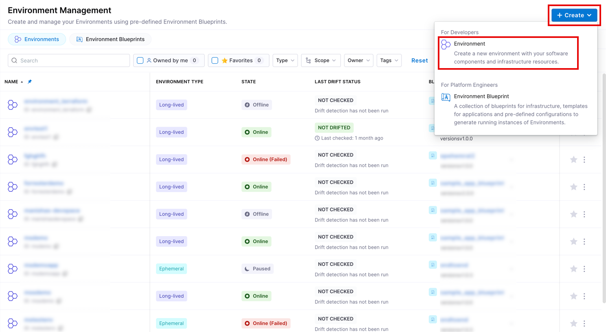

2. A list of available environment blueprints will be visible. Select your new environment by clicking the **Use this Blueprint** option beneath it.
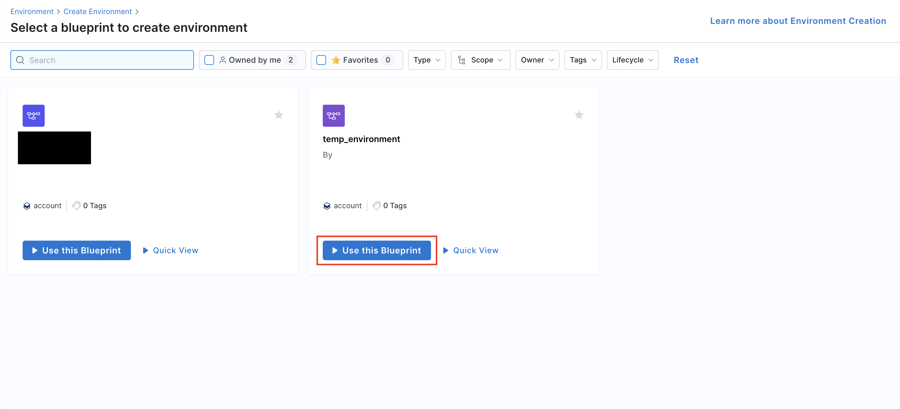

3. Give your environment a Name, select owners, input lifecycle (add a new one if the dropdown list is empty), and select the project scope for your environment. Then click "Configure Environment".

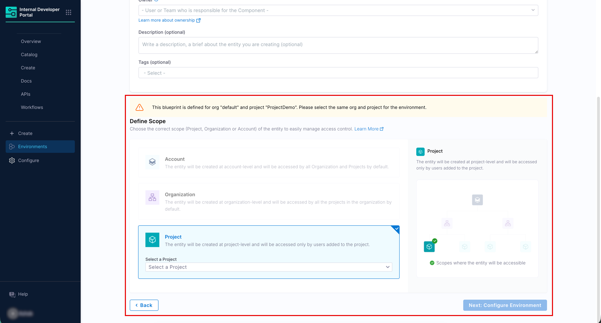

    :::info Blueprint Scope Prefixes
    When an environment references a blueprint, the blueprint identifier includes a scope prefix to indicate where it lives:
    * `account.my-blueprint`: references a blueprint at the account scope
    * `org.my-blueprint`: references a blueprint at the org scope
    * `my-blueprint` (no prefix): references a blueprint at the same scope as the environment (project level)

    Existing environments that previously referenced blueprints without a prefix have been automatically migrated to use the `account.` prefix, since all pre-existing blueprints were at account level.
    :::
<!-- 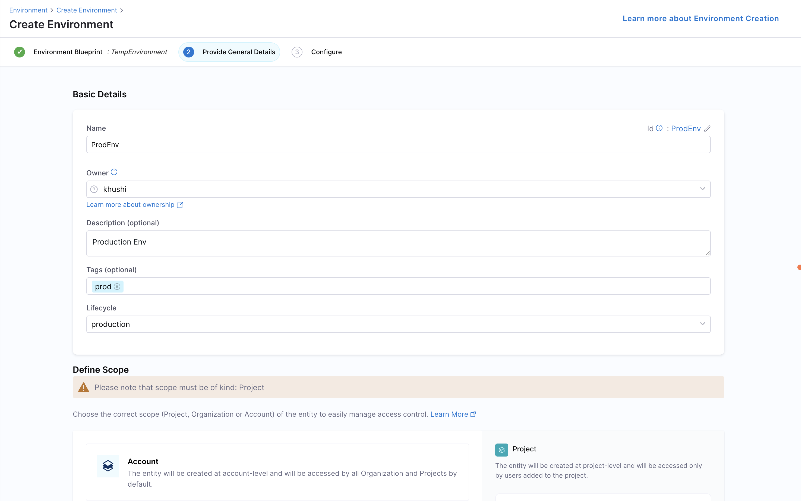 -->
4. On the new screen, you can choose and configure your inputs to the environment, and when you are satisfied, click **Create Environment**. 
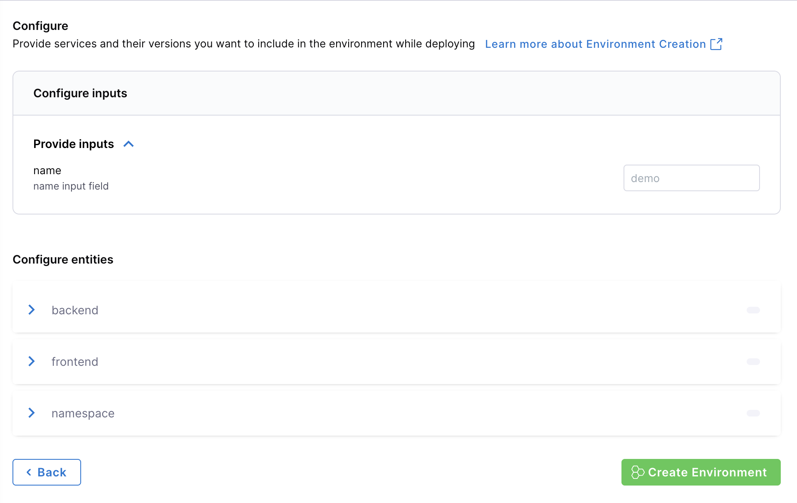

5. Configure TTL (if enabled): If TTL is enabled for the environment blueprint, you can configure/use the TTL duration for the environment. 
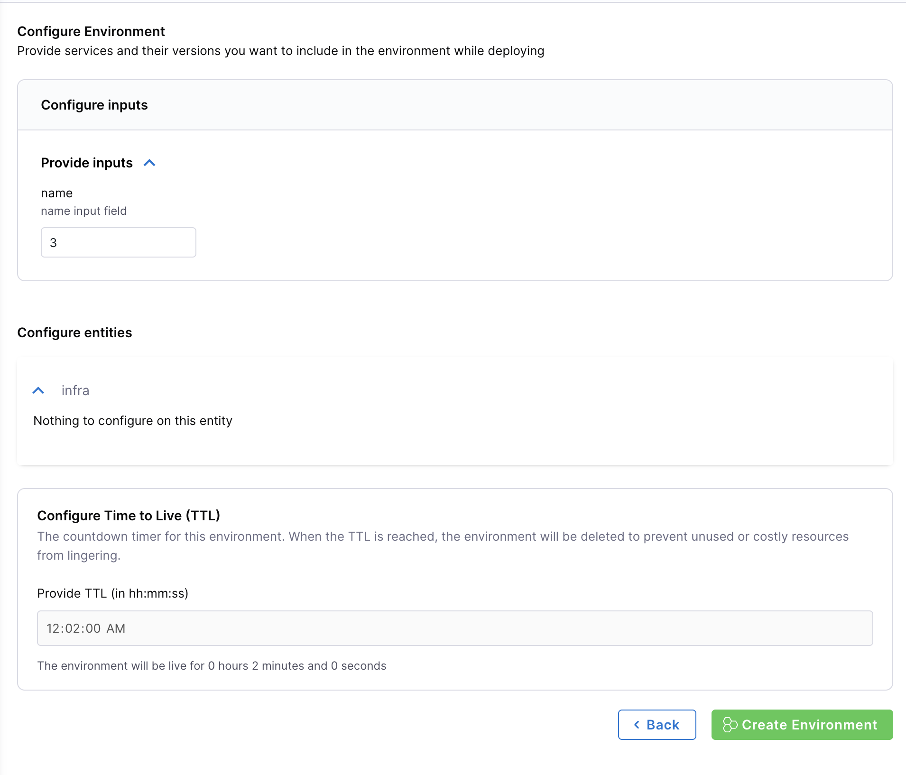

The Environment should now be creating, and you can follow the progress by viewing the instances and their states, or you can dive deeper into the pipeline, by following the link next to the environment state.

---

## Environment Actions

Since environments are treated as managed entities, platform teams and developers can control their lifecycle directly from the platform. This includes stopping, starting, updating, and deleting environments as needed.

The exact steps that execute during each action are defined in the blueprint as pipelines. These actions help ensure environments remain consistent, compliant, and aligned with infrastructure and application changes.

* [Edit Environment Configuration](#edit-environment-configuration)
* [Check for Drift](#drift-detection)
* [Stop Environment](#stop-environments)
* [Start Environment](#start-environments)
* [Apply Updates](#apply-updates)
* [Delete Environment](#delete-environments)

### Edit Environment Configuration

If you wish to make changes to your environment, go to your environment and click **Edit Configuration**. It helps you perform the following:
* Change or update inputs to the environment
* Update the blueprint version that the environment uses

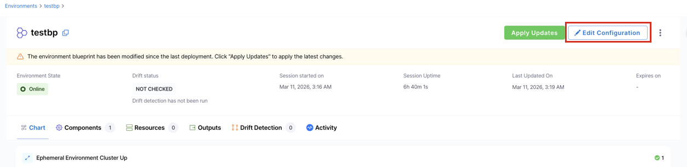

Depending on the scope of the change, this may trigger a full environment update or only update the affected resources and components.

:::note
When you update an environment’s configuration, the environment is **re-provisioned** and the TTL is **reset**. The new TTL countdown starts from the time of the update.
:::

### Drift Detection

Drift detection helps you identify when your environment's actual infrastructure state has diverged from its intended configuration. This feature is essential for maintaining infrastructure consistency, improving security by identifying unauthorized changes, and enabling compliance tracking across your environments.

:::note Prerequisites
Each workspace that you want to detect drift on must have an available drift detection pipeline. These pipelines can be specified at different levels:
- **Workspace level**: Configure a drift detection pipeline directly on the workspace
- **Workspace template level**: Define a drift detection pipeline in the workspace template
- **Project level**: Set a default drift detection pipeline at the project level

Learn how to [create a drift detection pipeline in IaCM](https://developer.harness.io/docs/infra-as-code-management/pipelines/operations/drift-detection/#detect-drift).
:::

To detect drift, navigate to your environment in Harness IDP, and from the kebab menu (**:**) at the top right, click **Check for Drift**. Alternatively, this option is also available under the **Drift Detection** tab of your selected environment. 
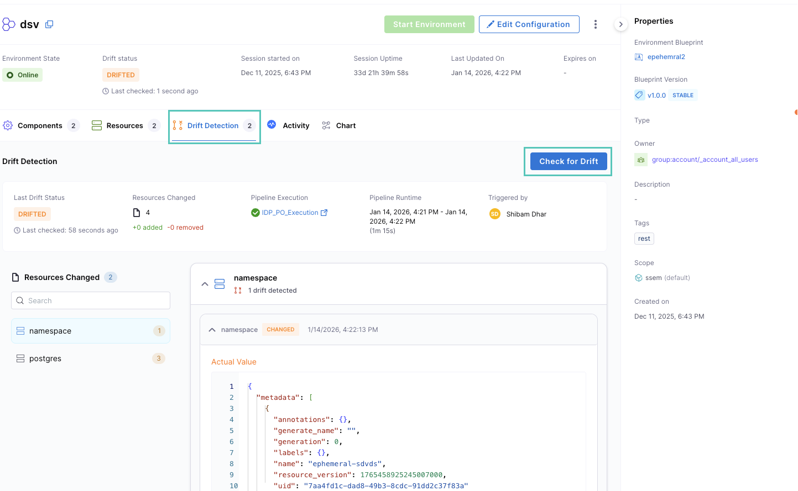

The system chains and dynamically executes drift detection pipelines for each workspace (environment resource) in your environment. Each pipeline checks its corresponding infrastructure resource against its expected state and highlights any discrepancies. You can view drift details resource-by-resource to see which attributes have changed, making it easy to understand what has drifted and take corrective action.

:::tip How to resolve drift
When drift is detected, you can resolve it by:
- Following the drift resolution workflows in IaCM (see [IaCM Drift Detection documentation](https://developer.harness.io/docs/infra-as-code-management/pipelines/operations/drift-detection/))
- Triggering an environment update, which will re-provision all workspaces and bring them back in sync with the desired configuration
:::

### Stop Environments

If you wish to temporarily suspend the activity of an environment, you may stop it. This triggers the pipelines defined in the `destroy` step of IaCM resources and `delete` step of CD components.

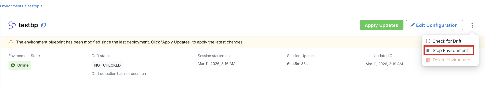

Go to your environment, and from the kebab menu (**:**) at the top right, click **Stop Environment**. It will fully wind down an environment while retaining the ability to bring it back later.

### Start Environments

You may start an environment if you wish to bring it back online from a stopped state. This runs the `create` step defined in the blueprint for each resource and `apply` step for each component.

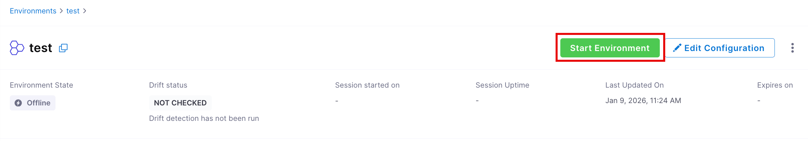

Go to your environment, and from the kebab menu (**:**) at the top right, click **Start Environment**. When starting an environment, the system fetches the latest blueprint for the configured version and provisions accordingly. If the blueprint has been updated since the environment was last running, those changes are applied automatically. 

:::note
Both [Start Environment](#start-environments) and [Apply Updates](#apply-updates) use delta-only re-provisioning. Rather than re-running every entity, the system compares the previously applied blueprint against the latest version and only re-provisions entities where actual differences are detected. Unchanged entities are left untouched. This makes updates faster, safer, and minimises disruption to running workloads.
:::

### Apply Updates

When updates are available for a running environment, a banner appears on the environment detail page prompting you to apply them. There are two scenarios which will trigger this banner:

1. Update to the current blueprint the environment is using
2. New stable version of the blueprint

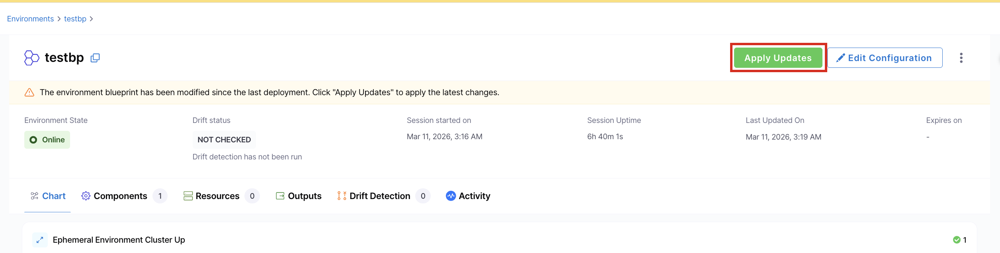

**Apply Updates** evaluates the differences between the current environment state and the latest blueprint, then only updates the components or resources that have changed. Unchanged entities are left alone. Note that some changes may require updating underlying infrastructure, which could lead to temporary environment downtime.

:::note
You can also trigger updates for an individual component or resource. Updating an entity will automatically update any downstream entities connected to it. For example, updating a namespace will also update the backend and frontend components deployed within it.
:::

### Delete Environments

You can decommission the environment and clean up all associated services and infrastructure resources when you no longer need the environment. This corresponds to the `delete` definition in the blueprint yaml of IACM entities.

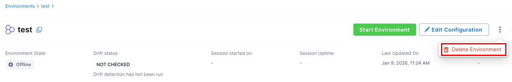

Go to your environment, and from the kebab menu (**:**) at the top right, click **Delete Environment**. It will destroy the namespace and delete the environment.

---

## Use Pipeline Approvals in Environments

Environment management in Harness IDP enables integration with **[Harness Pipeline Approvals](https://developer.harness.io/docs/platform/approvals/approvals-tutorial)**.
This feature allows you to add approvers in the CD service pipeline and control the environment creation process through pipeline approvals and rejections.

1. Ensure that you have an **approval step/stage** added in your CD service pipeline. Refer to [Approvals](https://developer.harness.io/docs/platform/approvals/approvals-tutorial) for more details.
2. Use the same pipeline details in your environment blueprint steps `apply` and `destroy` for your [CD services](/docs/internal-developer-portal/environment-management/blueprints/env-blueprint-yaml#2-catalog-backend-services).
3. Create a new environment using the same environment blueprint. You will be prompted to approve the pipeline deployment for your service instances.
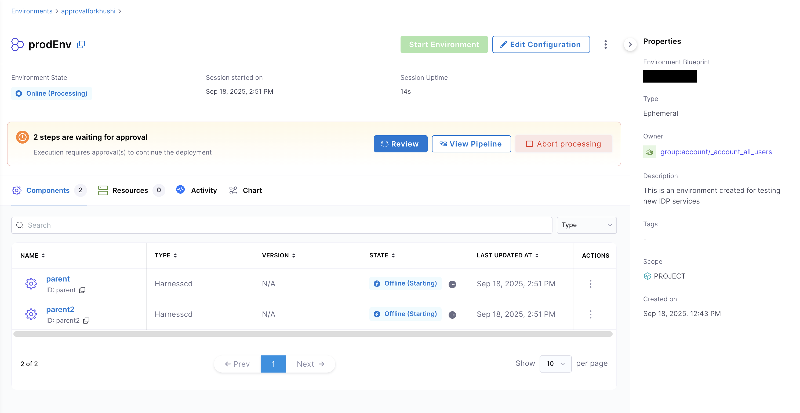
4. Approve the pipeline execution for your service instances.
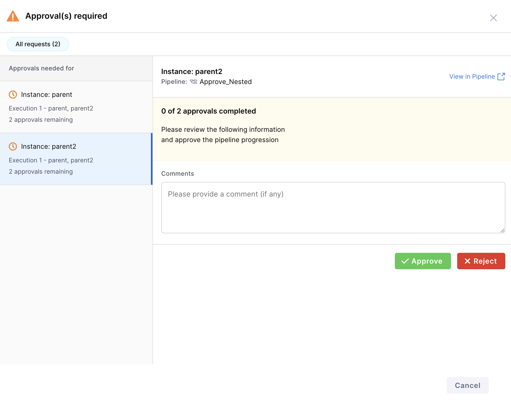
5. Once approved, your environment will be successfully created.
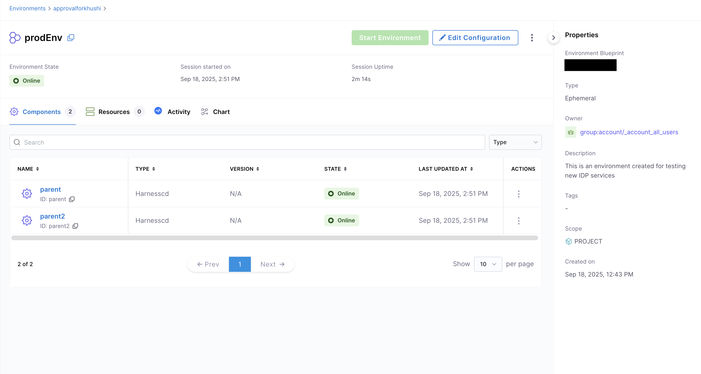