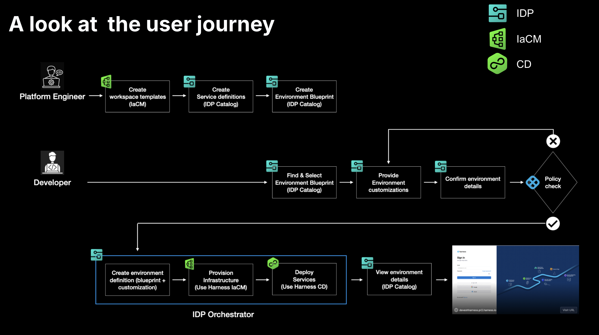

:::info
**Harness IDP Environment Management** is currently behind the feature flag `IDP_SSEM`. Contact [Harness Support](mailto:support@harness.io) to enable this feature flag.
:::

Welcome to **Getting Started with Environment Management**. This document will guide you through the environment management capabilities in Harness IDP. To understand the core features and key concepts of Environment Management in IDP, refer to [Overview & Key Concepts](/docs/internal-developer-portal/environment-management/overview.md).

An environment is a collection of software services deployed using CD and executed on infrastructure provisioned through IaCM. Environment Management provides **developers** with a self-service way to create and manage environments, while **platform engineers** define the standards behind them. Together, these modules ensure that every environment is consistent, secure, and easy to use.



## Prerequisites

Before you begin, ensure you have the following prerequisites setup: 

- CD, IaCM and IDP modules enabled in your account. Contact [Harness Support](mailto:support@harness.io) to enable the modules. 
- Ensure you have a Kubernetes cluster setup. 
- Harness Delegates installed on the cluster. Go to [Install Delegates](/docs/platform/delegates/install-delegates/overview/) to read more. 
- Cloud and Kubernetes connectors created in Harness using the installed Delegates. Go to [Connectors References](/docs/category/cloud-providers) to learn more. 
- Git Connector to read terraform files for IaCM. Ensure you check “Enable API Access” in the connector settings. Go to [Get Started with IaCM](/docs/infra-as-code-management/get-started/#add-connectors) to learn more. 
- The following feature flags for your Harness account are required to be enabled (we can enable these for you). Contact [Harness Support](mailto:support@harness.io) to enable the feature flags.
    - `IDP_SSEM`
    - `IDP_2_0`
    - `PIPE_DYNAMIC_PIPELINES_EXECUTION`
    - `IACM_1984_WORKSPACE_TEMPLATES`
- Set “Enable Pipeline Dynamic Executions” to `True` in Account Settings -> Default Settings -> Pipeline. Go to [Pipeline Dynamic Executions](/docs/platform/pipelines/dynamic-execution-pipeline/) to learn more.
- Ensure Harness Secret Manager is **NOT disabled** in your account. Environment Management uses the Harness secret manager to store some system-generated keys. Go to [Harness Secret Manager Overview](/docs/platform/secrets/secrets-management/harness-secret-manager-overview) to learn more.
- A new Harness project where you have **Project Admin** role assigned, where you can create all the necessary Harness resources.

## Get Started
Using this guide, we will create new ephemeral environments using IDP environment management by leveraging CD for service deployment and IaCM for infrastructure management. Services will be deployed inside a namespace of an existing Kubernetes cluster. 

For the purpose of this tutorial, we will create and use all Harness resources in a single sandbox project i.e. Environment Blueprint, Environments, Component, Service, Pipelines, etc. Connectors and Secrets can live at higher scopes.

In this tutorial, we will setup the following resources: 
- **IaCM Workspace Template & Default Pipelines**: To provision and destroy infrastructure (Kubernetes Namespace). 
- **CD Service & Pipeline**: To deploy services inside the namespace. 
- **Environment Blueprint**: To standardize environment configurations. 
- **Environment**: To create a new environment. 

### Provision Infrastructure in IaCM
In the following steps, we will create an IaCM Workspace template and default pipelines to provision and destroy infrastructure - in this case, a Kubernetes namespace.

#### 1. Create a new Workspace Template
We need a **workspace template** to standardize IaCM workspace configurations by predefining essential variables, configuration settings, and other workspace options. Go to [Workspace Templates](/docs/infra-as-code-management/workspaces/workspace-tempates/) to learn more. 

Follow the instructions below to create a new workspace template:
1. Go to Project Settings and under “Project-level Resources”, choose “Templates”.
2. Create a new Template of type “Infra Workspace”
3. Provide the name, a version e.g. v1 and save to the Project.
4. Under the “Provider” section, add your cloud connector and choose Terraform and its latest version.
5. In the “Repository” section, setup your git repository where we will store the terraform files necessary to create a new Kubernetes namespace.
6. Lastly add an overridable terraform variable with the key “name”. 

<details>
<summary>Sample Terraform File (main.tf)</summary>

These **Terraform files** have been written for GKE with workload identity in mind. 

**main.tf**
```
provider "google" {
  project = "idp-play"
  region = "us-west1"
}

data "google_client_config" "default" {
}

locals {
  endpoint = "<where does this come from?>"
  cluster_ca_certificate        = “<>“
}

provider "kubernetes" {
  host                   = "https://${local.endpoint}"
  token                  = data.google_client_config.default.access_token
  cluster_ca_certificate = local.cluster_ca_certificate
}


resource "kubernetes_namespace" "namespace" {
  metadata {
    name = "${var.name}"
  }
}
```
</details>

<details>
<summary>Sample Terraform File (outputs.tf)</summary>

These **Terraform files** have been written for GKE with workload identity in mind. 

**outputs.tf**
```
output "name" {
  value = kubernetes_namespace.namespace.metadata[0].name
}
```
</details>

<details>
<summary>Sample Terraform File (variables.tf)</summary>

These **Terraform files** have been written for GKE with workload identity in mind. 

**variables.tf**
```
variable "name" {
  type = string
}
```
</details>

#### 2. Create IaCM “Provision” Pipeline
We are going to create a simple IaCM pipeline which can provision infrastructure. Go to [IaCM Default Pipelines](/docs/infra-as-code-management/pipelines/default-pipelines) to learn more. 

1. Navigate to “IaCM” module, go to “Pipelines” and hit “Create new pipeline”.
2. Choose “Infrastructure” Stage and name it “Provisioner”
3. In the Infrastructure tab, choose “Kubernetes” and select the cluster. This will ensure that the pipeline executes in your infrastructure and the authentication will be taken care of.
4. In the “Workspace tab”, choose Runtime Input i.e. `<+input>`.
5. In the Execution tab, choose “Provision” from the common operations screen which will give you 3 steps - Init, Plan and Apply.
6. Save the pipeline.

<details>
<summary>Sample Pipeline YAML (Default Provision Pipeline)</summary>

:::info
Note that the **infrastructure spec** must be changed according to your setup. 
:::

```YAML
pipeline:
  projectIdentifier: test
  orgIdentifier: default
  tags: {}
  stages:
    - stage:
        name: apply
        identifier: apply
        description: ""
        type: IACM
        spec:
          infrastructure:
            type: KubernetesDirect
            spec:
              connectorRef: ssemclusterk8s
              namespace: harness-delegate-ng
              volumes: []
              serviceAccountName: delegate
              annotations: {}
              labels: {}
              automountServiceAccountToken: true
              nodeSelector: {}
              containerSecurityContext:
                capabilities:
                  drop: []
                  add: []
              os: Linux
              hostNames: []
          workspace: <+input>
          execution:
            steps:
              - step:
                  type: IACMTerraformPlugin
                  name: init
                  identifier: init
                  timeout: 10m
                  spec:
                    command: init
              - step:
                  type: IACMTerraformPlugin
                  name: plan
                  identifier: plan
                  timeout: 10m
                  spec:
                    command: plan
              - step:
                  type: IACMTerraformPlugin
                  name: apply
                  identifier: apply
                  timeout: 10m
                  spec:
                    command: apply
        tags: {}
  identifier: DefaultProvision
  name: DefaultProvision
```
</details>

#### 3. Create IaCM “Destroy” Pipeline
We are going to create another IaCM pipeline used to destroy infrastructure. Follow the steps in the above step (step no.2) except when you are adding the steps, choose “Destroy” instead of “Provision” in the “Common Operations”.

<details>
<summary>Sample Pipeline YAML (Default Destroy Pipeline)</summary>

:::info
Note that the **infrastructure spec** must be changed according to your setup. 
:::

```YAML
pipeline:
  name: DefaultDestroy
  identifier: DefaultDestroy
  projectIdentifier: test
  orgIdentifier: default
  tags: {}
  stages:
    - stage:
        name: destroy
        identifier: destroy
        description: ""
        type: IACM
        spec:
          execution:
            steps:
              - step:
                  type: IACMTerraformPlugin
                  name: init
                  identifier: init
                  timeout: 10m
                  spec:
                    command: init
              - step:
                  type: IACMTerraformPlugin
                  name: planDestroy
                  identifier: planDestroy
                  timeout: 10m
                  spec:
                    command: plan-destroy
              - step:
                  type: IACMTerraformPlugin
                  name: destroy
                  identifier: destroy
                  timeout: 10m
                  spec:
                    command: destroy
          infrastructure:
            type: KubernetesDirect
            spec:
              connectorRef: ssemclusterk8s
              namespace: harness-delegate-ng
              volumes: []
              serviceAccountName: delegate
              annotations: {}
              labels: {}
              automountServiceAccountToken: true
              nodeSelector: {}
              containerSecurityContext:
                capabilities:
                  drop: []
                  add: []
              os: Linux
              hostNames: []
          workspace: <+input>
        tags: {}
```
</details>

#### 4. Set IaCM Default Pipelines
We are going to use the **Provision** and **Destroy** pipelines as default pipelines for the workspaces that Environment Management will create from the template. This is done by navigating to project settings, where you will enter **IaCM Defaults**, and input the the two pipelines in their respective Terraform Default.

:::info
Validate the pipelines and Workspace template, by creating a new workspace from the template, and provisioning and destroy. This can be repeated until namespace is fully provisioned. Cleanup the workspace when done.
:::

### Create Services in CD
In the following steps, we will create two CD services “frontend” and “backend” and couple of CD pipelines - “DeployService” to install them and “UninstallService” to uninstall them. We will use the same pipeline for both the services, which is the “Golden Pipeline” model where service will be a runtime input. However, it’s possible to have multiple pipelines deploying individual services as well.

#### 1. Create two CD Services
This step is to create CD Services.Go to [Create Services](/docs/continuous-delivery/x-platform-cd-features/services/create-services) to learn more on creating CD services. 

1. Switch to the Continuous Delivery module, and ensure you are in your sandbox project. Go to the “Services” tab and hit “Create Service”. Name one “frontend” and the other “backend” and choose “Inline” store for now. You can switch to Remote entity later for Git experience.
2. In the service definition, choose “Native Helm” as deployment type. We will use [Native Helm](https://developer.harness.io/docs/continuous-delivery/deploy-srv-diff-platforms/helm/native-helm-quickstart/) as deployment type for this tutorial, but you should be able to use Kubernetes type as well.
3. In the Manifests section below, click on “New Manifest” and select “Helm Chart”. In the next step, choose your Git provider where you have helm charts stored e.g. GitHub. (Take a look at this [public GitHub repository](https://github.com/Munklinde96/demo) where we have provided 2 toy ngnix helm charts which you can also use in this tutorial)
4. After you have selected the Git Connector, we will now configure the Git repository details for the chart path. In the Manifest configuration screen,
    - use “backend” and “frontend” respectively for the “Manifest Identifier”.
    - In the “Repository Name”, depending upon the connector type you can provide a repository name or a complete HTTP/SSH URL to the repository.
    - Use “Latest from Branch” in the Git Fetch Type and provide branch name.
    - In the chart path, provide relative path to the chart directory e.g. `/backend/chart` or `/frontend/chart`.
    - Use Helm Version 3
5. Additionally, you can also add a Values override file to be stored in Harness file store. Under “Manifests” section of the service configuration, click on “Add Additional Override File”. Choose “Values YAML”. You can choose your Git provider or just use Harness built-in file store by clicking “Harness”. The file content of this override values YAML can be as simple as
```YAML
 replicaCount: <+serviceVariables.replicas>
```
6. Lastly, under “Advanced” section, add a new variable called “replicas” and choose runtime input (i.e. value can be `<+input>`).

<details>
<summary>Sample Frontend Service YAML</summary>

```YAML
service:
  name: frontend
  identifier: frontend
  orgIdentifier: default
  projectIdentifier: test
  serviceDefinition:
    spec:
      manifests:
        - manifest:
            identifier: frontend
            type: HelmChart
            spec:
              store:
                type: Github
                spec:
                  connectorRef: account.ssem
                  gitFetchType: Branch
                  folderPath: /demo/frontend/chart
                  branch: main
              subChartPath: ""
              skipResourceVersioning: false
              enableDeclarativeRollback: false
              helmVersion: V3
              fetchHelmChartMetadata: false
        - manifest:
            identifier: frontendvalues
            type: Values
            spec:
              store:
                type: Harness
                spec:
                  files:
                    - /frontend
      variables:
        - name: replicas
          type: String
          description: ""
          required: false
          value: <+input>
    type: NativeHelm
```
</details>
<details>
<summary>Sample Backend Service YAML</summary>

```YAML
service:
  name: backend
  identifier: backend
  orgIdentifier: default
  projectIdentifier: test
  serviceDefinition:
    spec:
      manifests:
        - manifest:
            identifier: backend
            type: Values
            spec:
              store:
                type: Harness
                spec:
                  files:
                    - /values.yaml
        - manifest:
            identifier: backendmain
            type: HelmChart
            spec:
              store:
                type: Github
                spec:
                  connectorRef: account.ssem
                  gitFetchType: Branch
                  folderPath: /demo/backend/chart
                  branch: main
              subChartPath: ""
              skipResourceVersioning: false
              enableDeclarativeRollback: false
              helmVersion: V3
              fetchHelmChartMetadata: false
      variables:
        - name: replicas
          type: String
          description: ""
          required: false
          value: <+input>
    type: NativeHelm
```
</details>

#### 2. Create a CD Environment
Next we need to create a CD environment where the CD pipelines will execute. Go to [Create Environments](/docs/continuous-delivery/x-platform-cd-features/environments/create-environments) to learn more on creating CD Environments. 

1. Click on “Environments” and create a new environment.
2. Choose “Pre-production” in the environment type. You can choose “Inline” as the store type.
3. Once the environment is created, switch to the “Infrastructure Definitions” tab and then create new infrastructure definition.
4. Choose the Deployment type “Native Helm“.
5. Under “Infrastructure Type” choose GKE/EKS depending upon your cloud provider. Choose your connector. Choose your Cluster. Provide a namespace where the CD pipelines will execute. Finally set the “Release Name” to `<+service.name>`.

#### 3. Create CD Pipelines
Create a Deployment pipeline with a single deploy stage of type **Native Helm**. For both service and environment choose `<+input>`. For the execution strategy choose rolling. Go to [CD Pipeline Modelling Overview](/docs/continuous-delivery/get-started/cd-pipeline-modeling-overview/) to learn more. 

In order to demonstrate EM’s lifecycle management, we will create an additional Uninstall pipeline of similar configuration, but after choosing the execution strategy, remove the Helm Deploy step. Instead, add a `helm delete` step, where you should set `Release name` to `<+service.name>`. 

:::info
Validate the pipelines and services by first running the deploy pipeline with a service and the configured environment, and then run the delete pipeline.
:::

<details>
<summary>Sample "DeployService" Pipeline YAML</summary>

```YAML
pipeline:
  name: DeployService
  identifier: DeployService
  projectIdentifier: <....>
  orgIdentifier: <...>
  tags: {}
  stages:
    - stage:
        name: deploy
        identifier: deploy
        description: ""
        type: Deployment
        spec:
          deploymentType: NativeHelm
          service:
            serviceRef: <+input>
            serviceInputs: <+input>
          environment:
            environmentRef: <+input>
            deployToAll: false
            environmentInputs: <+input>
            serviceOverrideInputs: <+input>
            infrastructureDefinitions: <+input>
          execution:
            steps:
              - step:
                  name: Helm Deployment
                  identifier: helmDeployment
                  type: HelmDeploy
                  timeout: 10m
                  spec:
                    skipDryRun: false
                    ignoreReleaseHistFailStatus: false
            rollbackSteps:
              - step:
                  name: Helm Rollback
                  identifier: helmRollback
                  type: HelmRollback
                  timeout: 10m
                  spec: {}
        tags: {}
        failureStrategies:
          - onFailure:
              errors:
                - AllErrors
              action:
                type: StageRollback
```
</details>
<details>
<summary>Sample "UninstallService" Pipeline YAML</summary>

```YAML
pipeline:
  projectIdentifier: <...>
  orgIdentifier: <...>
  tags: {}
  stages:
    - stage:
        name: uninstall
        identifier: uninstall
        description: ""
        type: Deployment
        spec:
          deploymentType: NativeHelm
          service:
            serviceRef: <+input>
            serviceInputs: <+input>
          environment:
            environmentRef: <+input>
            deployToAll: false
            environmentInputs: <+input>
            serviceOverrideInputs: <+input>
            infrastructureDefinitions: <+input>
          execution:
            steps:
              - step:
                  type: HelmDelete
                  name: HelmDelete_1
                  identifier: HelmDelete_1
                  spec:
                    dryRun: false
                    releaseName: <+service.name>
                  timeout: 10m
            rollbackSteps:
              - step:
                  name: Helm Rollback
                  identifier: helmRollback
                  type: HelmRollback
                  timeout: 10m
                  spec: {}
        tags: {}
        failureStrategies:
          - onFailure:
              errors:
                - Unknown
              action:
                type: Ignore
          - onFailure:
              errors:
                - AllErrors
              action:
                type: MarkAsFailure
  variables:
    - name: service
      type: String
      description: ""
      required: false
      value: <+input>
  identifier: UninstallService
  name: UninstallService
```
</details>

### Configure Environments in IDP
In the following steps, we will use Harness IDP to create IDP catalog components and configure environments using Environment Management. 

#### 1. Create Components in IDP 
Behind the scenes, Catalog Components are entities backed by CD. This basically means, that it is possible for catalog components to reference a CD service. In our example we will have a **frontend** and a **backend** Components, both referencing their respective harness services. If the identifier of the CD service, the config is as simple as adding `deploymentPipelines` in the component spec.

:::info
Please note that in a couple of months after **CD based auto-discovery**, every CD service will automatically appear as Catalog Components, so you will not have to create them manually.
:::

Switch to the IDP module, and use “Create” from the sidebar. Choose “Component” and use the following YAML to create the Catalog entities. Go to [Create Catalog Entities](/docs/internal-developer-portal/catalog/manage-catalog.md#creating-entities-idp-20) to learn more. 

<details>
<summary>Sample Frontend Component YAML</summary>

```YAML
apiVersion: harness.io/v1
kind: Component
type: service
name: frontend
identifier: frontend
owner: group:account/_account_all_users
projectIdentifier: <...>
orgIdentifier: <...>
spec:
  lifecycle: ephemeral
  deploymentPipelines:
    - identifier: DeployService
    - identifier: UninstallService
      type: uninstall
metadata:
  description:
  # annotations:
```
</details>

<details>
<summary>Sample Backend Component YAML</summary>

```YAML
apiVersion: harness.io/v1
kind: Component
type: service
name: backend
identifier: backend
owner: group:account/_account_all_users
projectIdentifier: <...>
orgIdentifier: <...>
spec:
  lifecycle: ephemeral
  deploymentPipelines:
    - identifier: DeployService
    - identifier: UninstallService
      type: uninstall
metadata:
  description:
  # annotations:
```
</details>

#### 2. Create Environment Blueprint
With all that we have done so far, we are now ready to **define our environment blueprint**, containing the IaCM Namespace, and the CD backed IDP components.

In Harness IDP, navigate to the Environments section, and hit “Create” and then “Environment Blueprint”. You can use the Environment blueprint YAML below.
<details>
<summary>Environment Blueprint YAML</summary>

```YAML
apiVersion: harness.io/v1
kind: EnvironmentBlueprint
type: ''
name: TempEnvironment
identifier: temp_environment
owner: group:account/_account_all_users
spec:
  entities:
  - identifier: namespace
    backend:
      type: HarnessIACM
      values:
        workspace: Namespace-${{env.config.name}}
      steps:
        create:
          template: TempNamespace  # Ensure this is same as Workspace Template ID
          version: '1'
        apply:
          pipeline: DefaultProvision  # Ensure this is same as Provision pipeline ID
          variables:
            name: temp-${{env.config.name}}
        destroy:
          pipeline: DefaultDestroy  # Ensure this is same as Destroy pipeline ID
          variables:
            name: temp-${{env.config.name}}
        delete: {}
        pause: {}
        resume: {}
  - identifier: frontend
    interface:
      dependencies:
      - identifier: namespace
      inputs:
        version:
          type: string
          default: v1.1.0
        replicas:
          type: integer
          default: 1
    backend:
      type: Catalog
      values:
        identifier: frontend  # Ensure this is same as Component ID
        variables:
          replicas: ${{entity.config.replicas}}
          version: ${{entity.config.version}}
        environment:
          identifier: mycluster
          infra:
            identifier: ssemteamdelegate
            namespace: ${{dependencies.namespace.output.name}}
  - identifier: backend
    interface:
      dependencies:
      - identifier: namespace
      inputs:
        version:
          type: string
          default: v1.3.2
        replicas:
          type: integer
          default: 1
    backend:
      type: Catalog
      values:
        identifier: backend
        variables:
          replicas: ${{entity.config.replicas}}
          version: ${{entity.config.version}}
        environment:
          identifier: mycluster
          infra:
            identifier: ssemteamdelegate
            namespace: ${{dependencies.namespace.output.name}}
  ownedBy:
  - group:account/_account_all_users
  inputs:
    name:
      type: string
      default: demo
```
</details>

To sum up, the blueprint contains:
- A namespace entity of an IaCM backend with a workspace that is created from the Workspace Template “TempNamespace“, is provisioned using the “DefaultProvision” pipeline, and can be deleted using the "DefaultDestroy“ pipeline.
        - Ensure that the identifier of the IaCM pipelines `DefaultProvision` and `DefaultDestroy` and the Workspace Template matches with what you have. Line number 16, 19, 23.
- A frontend entity of a Catalog backend that depends on the namespace entity.
- A backend entity of a Catalog backend that also depends on the namespace entity.

#### 3. Create new Environment
Using the Environment Blueprint we can now create and spin up an ephemeral environment. 

1. Hit “Create” in the right corner, then “Environment, then select your new “Environment Blueprint”.
2. Give your environment a Name, select owners, input lifecycle (add a new one if the dropdown list is empty), and choose your project as a scope and then Click “Configure Environment”.
3. On the new screen, you can choose your inputs to the environment, and when you are satisfied, hit “Create Environment”. 

The Environment should now be creating, and you can follow the progress by viewing the instances and their states, or you can dive deeper into the pipeline, by following the link next to the environment state.

Lastly you can confirm that everything is running by connecting to your k8s cluster, or verifying in your GCP/AWS console.

#### 4. Delete the Environment
When are are ready to delete the environment, go to the Environment page and from the Options menu at the top right, hit “Delete”. It will destroy the namespace and delete the environment.

