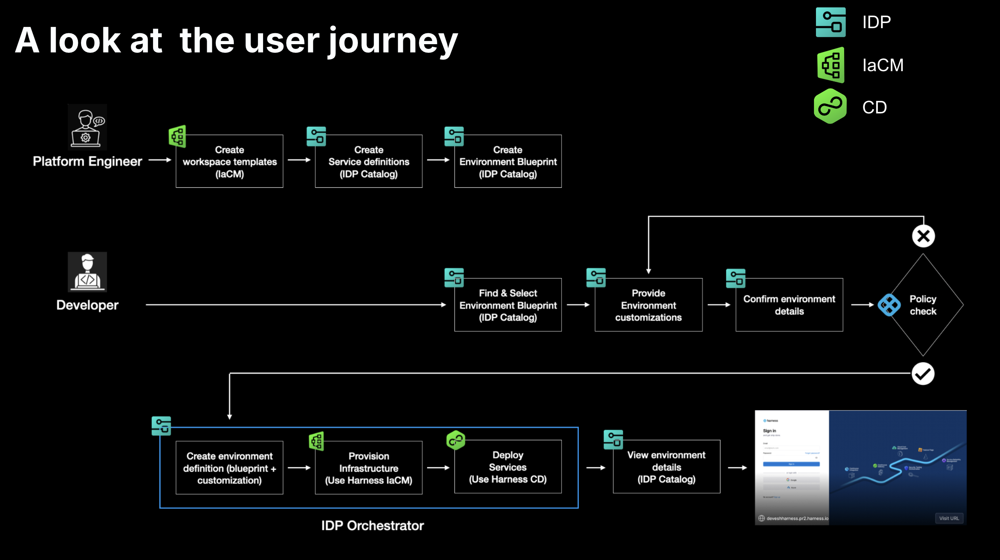

import Tabs from '@theme/Tabs';
import TabItem from '@theme/TabItem';

Welcome to **Getting Started with Environment Management**. This document will guide you through the environment management capabilities in Harness IDP. To understand the core features and key concepts of Environment Management in IDP, go to [Overview & Key Concepts](/docs/internal-developer-portal/environment-management/overview.md).

An environment is a collection of software services deployed using CD and executed on infrastructure provisioned through IaCM. Environment Management provides **developers** with a self-service way to create and manage environments, while **platform engineers** define the standards behind them. Together, these modules ensure that every environment is consistent, secure, and easy to use.

## How environment management works for you

* **Platform Engineers** - You can design and maintain Environment Blueprints. A blueprint is a declarative YAML template that defines which infrastructure resources (IaCM workspaces) and services (IDP Catalog components) make up an environment, how they depend on each other, and how they are provisioned and torn down. Before creating a blueprint, platform engineers set up the underlying resources in Harness: workspace templates in IaCM, CD services, and deployment pipelines. These are then referenced in the blueprint YAML. Go to [Create an Environment Blueprint](/docs/internal-developer-portal/environment-management/blueprints/create-environment-blueprint) to get started.

* **Developers** - You can create environments from blueprints your platform team has published. You select a blueprint, provide the required inputs (such as a name or service version), and the system provisions infrastructure and deploys services in the correct dependency order. Go to [Environments](/docs/internal-developer-portal/environment-management/environments#create-environments) to create your first environment.

---

## Before you begin

Use the checklist below to ensure your setup is complete before getting started.

### Required Harness modules

* **Internal Developer Portal (IDP)** - For environment blueprints and catalog
* **Continuous Delivery (CD)** - For service deployments
* **Infrastructure as Code Management (IaCM)** - For infrastructure provisioning

### Required feature flags

Enable these feature flags in your Harness account:

* `PIPE_DYNAMIC_PIPELINES_EXECUTION` - Dynamic pipeline execution. [Click here](/docs/platform/pipelines/dynamic-execution-pipeline/) to learn more.
* `IACM_1984_WORKSPACE_TEMPLATES` - Workspace template support

### Infrastructure requirements

* Infrastructure with Harness Delegate installed
* [Cloud provider connector](/docs/category/cloud-providers) configured (GCP, AWS, or Azure)
* Kubernetes connector for the target cluster
* Git connector with API access (for storing manifests and state)

For more details on how to configure connectors, visit [Connectors](/docs/category/connectors/)

### Secrets & secret manager
 
* Ensure **Harness Secret Manager** is enabled in your account. Environment Management uses it to store some system-generated keys. Go to [Harness Secret Manager Overview](/docs/platform/secrets/secrets-management/harness-secret-manager-overview/) to learn more.
* If Harness Secret Manager is not enabled, create a secret `IDP_PO_API_KEY` in the same project where environments will be created. The secret must contain a Service Account Token with the following IaCM Workspace permissions: `Create`, `Update`, and `Delete`. This ensures the token has exactly the permissions needed to manage IaCM Workspaces in that project.

### Permissions

Click below to view the permissions you would require for each area: IDP, CD, and Platform.

<Tabs>
  <TabItem value="idp" label="IDP Permissions">

Permissions required to manage entities within the IDP

| Resource | Permissions |
|---|---|
| IDP Environment | `View` `Create` `Edit` `Delete` |
| IDP Environment Blueprint | `View` `Create` `Edit` `Delete` |
| IDP Catalog | `View` `Create/Edit` `Delete` |

  </TabItem>
  <TabItem value="cd" label="CD Permissions">

Permissions required for managing CD resources.

| Resource | Permissions |
|---|---|
| Pipeline | `View` `Create/Edit` `Delete` `Execute` |
| Service | `View` `Create/Edit` `Delete` `Access` |
| Environment | `View` `Create/Edit` `Delete` `Access` |

  </TabItem>
  <TabItem value="platform" label="Platform Permissions">

Permissions required for managing platform-level configurations and shared resources.

| Resource | Permissions | Notes |
|---|---|---|
| Connector | `View` `Create/Edit` `Delete` | If using a Harness managed code repository for Git based configuration, repository level access may also be required. |
| Secrets | `View` `Create/Edit` `Delete` | |
| Templates | `View` `Create/Edit` `Delete` `Access` `Copy` | |
| Delegates | `View` `Create/Edit` `Delete` | Required if delegates are used with connectors. |

  </TabItem>
</Tabs>

Additionally, permissions in Cloud (AWS, GCP etc) to create and manage resources, workloads would be needed.
 
Once the setup is complete, additional users can be granted the required permissions within Environment Management. For more details, refer to the [RBAC section in the Environment Management Overview](/docs/internal-developer-portal/environment-management/overview#rbac-for-environment-management).
 
---
 
## Tutorials
 
| Name | Description |
|---|---|
| [Tutorial 1 - Build an Ephemeral Developer Testing Environment](./tutorials/tutorial1.md) | Set up a self-service ephemeral environment system that automatically provisions isolated test environments for PRs and deletes them after a stipulated time period. |

---

## Quick start path

If you are setting up environment management for the first time, follow this sequence:

1. **Platform Engineers**: [Create an Environment Blueprint](/docs/internal-developer-portal/environment-management/blueprints/create-environment-blueprint) to define the infrastructure and service template for your team's environments.
2. **Developers**: [Create an Environment](/docs/internal-developer-portal/environment-management/environments#create-environments) using an available blueprint.
3. Manage the environment lifecycle from the [Environments](/docs/internal-developer-portal/environment-management/environments) page, including starting, stopping, updating, and deleting environments.