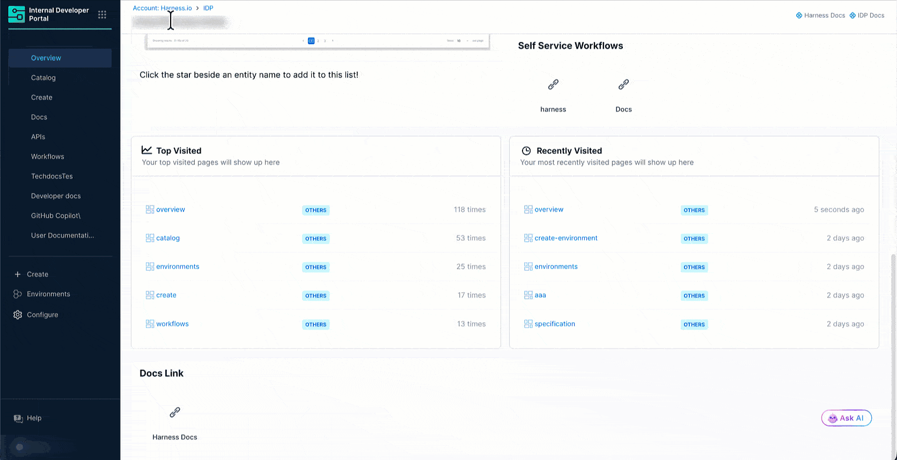
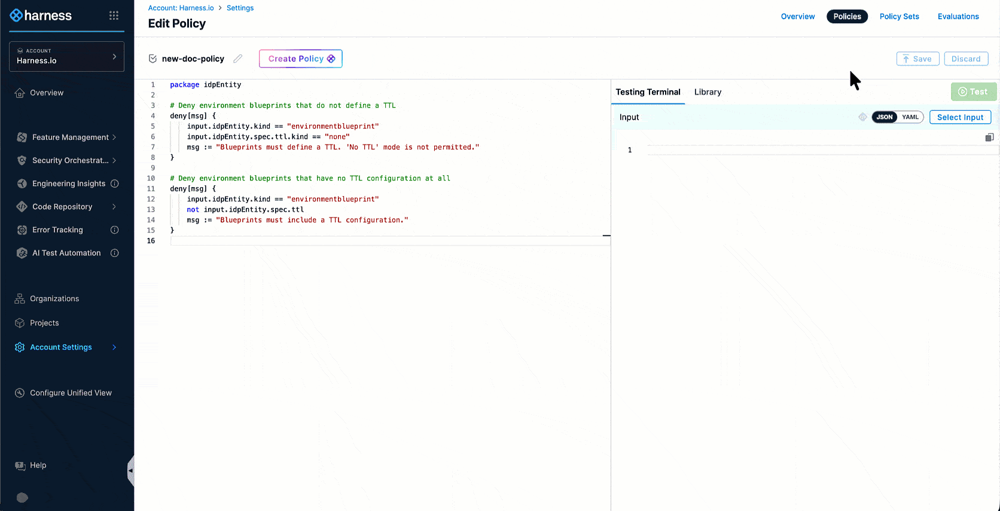
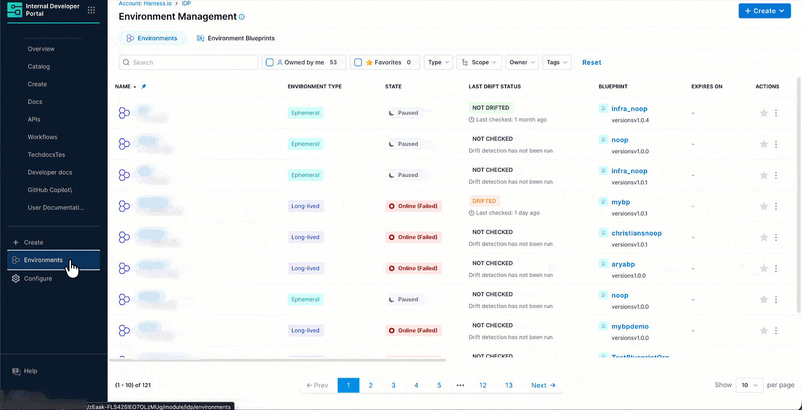

## Introduction

Platform engineers lose visibility when development teams author blueprints. A blueprint that skips TTL, uses a wrong tag, or breaks a naming standard can slip through and affect every environment built from it.

OPA policies let you catch and block these misconfigurations before they are saved, across all teams and projects. Harness IDP integrates with [Harness OPA Governance](/docs/platform/governance/policy-as-code/harness-governance-overview) to let you define and enforce policies on [environment blueprints](/docs/internal-developer-portal/environment-management/blueprints/env-blueprint-yaml) and [environments](/docs/internal-developer-portal/environment-management/environments).

Policies run automatically every time a catalog entity (blueprint or environment) is created or updated, ensuring each one meets your organization's standards.

:::caution Prerequisites

1. Familiarity with [Harness Policy As Code](/docs/platform/governance/policy-as-code/harness-governance-quickstart).
2. Policies use the OPA authoring language Rego. Go to [OPA Policy Authoring](https://academy.styra.com/courses/opa-rego) to learn the Rego language.
3. Familiarity with [Environment Blueprints](/docs/internal-developer-portal/environment-management/blueprints/env-blueprint-yaml) and [Environments](/docs/internal-developer-portal/environment-management/environments) in IDP.
:::

:::info Feature Flag
This feature requires the feature flag `IDP_OPA_CATALOG_ENTITY_GOVERNANCE` to be enabled for your account. Contact [Harness Support](mailto:support@harness.io) to enable it. When disabled, no OPA evaluation occurs and existing behavior is unchanged.
:::

---

## Setup

### Create a Policy



1. In Harness, navigate to **Account Settings** (or Org Settings / Project Settings) → **Security and Governance** → **Policies** and click the **Policies** tab on the top-right.

2. Click **+ New Policy**.

3. Give the policy a name, select **Inline** (stored in Harness) or **Remote** (stored in your Git repository), and click **Apply**.

4. In the policy editor, write your Rego policy. The policy receives the full entity payload under `input.idpEntity`. See the [Policy Input Schema](#policy-input-schema) section for available fields.

:::tip
* The **Library** tab on the right panel includes ready-to-use IDP sample policies (e.g., `IDP - Blueprint Require TTL`). You can load any of these directly instead of writing from scratch.

* Use the **Testing Terminal** tab to test your policy against a sample entity payload before enforcing it. Paste a JSON representation of your entity under **Input** and click **Test**.
:::

### Create a Policy Set

:::info Difference between 'Policy' and 'Policy Set'
A policy is a single Rego rule that defines one check. A policy set groups one or more policies together and defines what entity type they apply to, when they run, and what to do when a check fails. A policy works only after adding it to a policy set.
:::



1. On the same page as [policy](#create-a-policy), click the **Policy Sets** tab on the top-right.

2. Click **+ New Policy Set** and fill in the **Overview**:
   * **Name**: Give the policy set a descriptive name.
   * **Entity Type**: Select **IDP Entity**.
   * **Event**: The event for IDP entities is **On Save**, which covers create and update.

3. Click **Continue**.

4. In **Policy evaluation criteria**, click **+ Add Policy**.

5. Select the [policy you created earlier](#create-a-policy).

6. Set the failure behavior from the dropdown:
   | Option | What Happens |
   |---|---|
   | **Warn and continue** | The entity is saved. The UI shows a warning but the action proceeds. |
   | **Error and exit** | The entity is not saved. The UI shows an error with the exact policy and rule that failed. |

7. Click **Apply** and then **Finish**.

:::caution Remember 
To enforce the policy set, make sure the **Enforced** toggle is enabled on the Policy Sets list page. When the toggle is off, the policy set is created but not evaluated.
:::

### Policy Enforcement at Runtime



Once the policy set is active, enforcement happens automatically. Now in IDP, when a developer attempts to save a blueprint that violates a policy, they will see a **Policy Set Evaluations** modal with the list of failing policies and the specific violation messages defined in your Rego rules.

---

## Policy Input Schema

Policies receive the full catalog entity payload as `input.idpEntity`. The following fields are available:

```
input.idpEntity.kind                  # Entity kind: "environmentblueprint" or "environment"
input.idpEntity.identifier            # Unique entity identifier
input.idpEntity.name                  # Display name
input.idpEntity.spec                  # Full spec object
input.idpEntity.spec.ttl              # TTL configuration (blueprints only)
input.idpEntity.spec.ttl.kind         # TTL mode: "fixed", "custom", or "none"
input.idpEntity.spec.inputs.ttl       # TTL input value set by the user (environments only)
input.idpEntity.ttl_default_hours     # Computed: default TTL in hours (blueprints)
input.idpEntity.ttl_max_hours         # Computed: maximum TTL in hours (blueprints)
input.idpEntity.ttl_hours             # Computed: TTL in hours (environments)
input.idpEntity.metadata.tags         # Entity tags
input.idpEntity.orgIdentifier         # Org scope identifier
input.idpEntity.projectIdentifier     # Project scope identifier
```

The `ttl_default_hours`, `ttl_max_hours`, and `ttl_hours` fields are **computed by the system** at evaluation time. You do not need to calculate them yourself in Rego; use them directly in your deny or warn conditions.

---

## Example Policies

### Require TTL on All Blueprints

Deny any blueprint that uses the `none` TTL mode. 

```rego
package idpEntity

deny[msg] {
    input.idpEntity.kind == "environmentblueprint"
    input.idpEntity.spec.ttl.kind == "none"
    msg := "Blueprints must define a TTL. 'No TTL' mode is not permitted."
}
```

### Enforce a Maximum TTL on Blueprints

Deny blueprints whose default TTL exceeds 7 days (168 hours).

```rego
package idpEntity

deny[msg] {
    input.idpEntity.kind == "environmentblueprint"
    input.idpEntity.ttl_default_hours > 168
    msg := sprintf(
        "Blueprint default TTL of %.1f hours exceeds the maximum allowed 168 hours (7 days).",
        [input.idpEntity.ttl_default_hours]
    )
}
```

### Enforce a Maximum TTL on Environments

Deny environments whose TTL exceeds 7 days (168 hours).

```rego
package idpEntity

deny[msg] {
    input.idpEntity.kind == "environment"
    input.idpEntity.ttl_hours > 168
    msg := sprintf(
        "Environment TTL of %.1f hours exceeds the maximum allowed 168 hours (7 days).",
        [input.idpEntity.ttl_hours]
    )
}
```

### Warn When Blueprint TTL Exceeds 3 Days

Warn (but allow) when a blueprint's default TTL exceeds 72 hours. Use this as a soft limit before enforcing a hard deny.

```rego
package idpEntity

warn[msg] {
    input.idpEntity.kind == "environmentblueprint"
    input.idpEntity.ttl_default_hours > 72
    msg := sprintf(
        "Blueprint default TTL of %.1f hours exceeds the recommended 72 hours (3 days). Consider reducing it.",
        [input.idpEntity.ttl_default_hours]
    )
}
```

---

## Policy Scope

Policies can be scoped at **account**, **org**, or **project** level. The scope determines which entities the policy set applies to:

| Scope | Applies To |
|---|---|
| **Account** | All IDP catalog entities across the entire account |
| **Org** | All entities within all projects under the specified org |
| **Project** | Only entities within the specified project |

A common pattern is to set hard deny rules at account scope for organization-wide standards, and layer project-scoped warn policies for team-specific limits.
