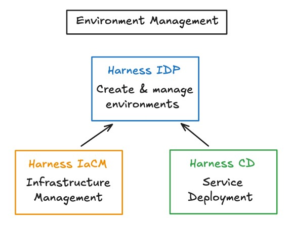

:::info
**Harness IDP Environment Management** feature is currently behind the feature flag `IDP_SSEM`. Contact [Harness Support](mailto:support@harness.io) to enable this feature flag.
:::

## Overview

Environment Management in Harness IDP enables developers and platform engineers to **create, configure, and manage environments from a single point of control**. An environment is a collection of software services deployed using CD tools and executed on infrastructure provisioned through IaCM tools. This feature provides a **self-service, automated, and repeatable** way to manage environments efficiently.

### Impact and Benefits

In modern software delivery, environments sit at the very core of every developer’s workflow. Maintaining the right balance between **governance, consistency, and accessibility** is critical. Without environment management, setup becomes slow, inconsistent, and difficult to track - leaving developers dependent on other teams, while driving up costs and risks.

Harness IDP Environment Management solves this by making environments **easy to create, consistent, and secure**, while giving developers autonomy and speeding up delivery. By adopting Environment Management, organizations gain the following benefits:

* **Improved Developer Experience**: Developers can work independently without relying on other teams, enabling faster iterations and quicker delivery.
* **Built-in Guardrails & Governance**: Security and compliance are enforced through guardrails and policies baked into the environment lifecycle, with access controlled via RBAC.
* **Improved Software Quality & Reliability**: Standardized, repeatable setups eliminate drift, making it easier to catch issues early and ship with greater confidence.

### Environment Management Stack
Environment Management is a core feature of Harness IDP. It gives developers a self-service way to create and manage environments, while platform engineers define the standards behind them.

**Harness IDP** is the control center for this feature, but it works closely with other Harness modules to make it powerful:
- **IaCM (Infrastructure Management)**: Provisions and manages the infrastructure needed for service deployment.
- **CD (Service Deployment)**: Deploys services into those environments with the target infrastructure points.
- **Harness IDP**: Enables developers to create, configure and manage environments.

Together, these modules ensure every environment is consistent, secure, and easy to use, from infra setup to service deployment, while keeping the developer experience simple and self-service.

### Key Features
Environment Management in Harness IDP brings together various features to make environments easy to create, manage, and operate.

1. **Environment Blueprints**: 
Templates that define how environments should be created (e.g. Infrastructure Workspace Templates, Service Deployment Pipelines). Blueprints standardize environment setup and ensure consistency across teams.
2. **Lifecycle Management**:
Supports Day 2 operations such as creating, updating, and deleting infrastructure and services. 
3. **Platform Orchestrator**:
Handles provisioning and cleanup of infrastructure resources with complex interdependencies. It abstracts away deployment order and dependencies so environments work reliably end-to-end.
4. **Native to IDP**:
Tightly integrated with the IDP Catalog, giving developers a simple, unified interface to discover and provision environments, while enabling platform teams to enforce standards.
5. **Native to Harness**: 
Built as a core feature of Harness IDP, while leveraging the strengths of Harness **CD** and **IaCM** for infrastructure provisioning, service deployment, and governance.

## Key Concepts

### Environment Blueprint
An Environment Blueprint is a collection of infrastructure templates, services, their configurations and lifecycle management details of each. When a blueprint is orchestrated, it generates running instances of Environments. Blueprints are typically owned by the Platform Engineering team.

### Environment
An Environment is instantiated using an Environment Blueprint and represents the deployed infrastructure and services, as defined in the blueprint. It is a collection of software services deployed using CD tools and executed on infrastructure provisioned through IaCM tools.

### Environment Config 
Environment Config is a collection of user-provided inputs that uniquely determine how the environment should be created. This Config is typically owned by the end-user Application Developers.

### Service (IDP Component)
A Component in IDP Catalog represents a service or any other type of software component. For Environment Management use-cases, an IDP Component represents the service being deployed using CD.

### Workspace
IaCM Workspace is a container for your infrastructure resources. It integrates IaC code, variables, cloud provider connections, state files, and workflows. In Terraform, each workspace has its own state file, which tracks the status of its managed resources. 

### Workspace Templates
With IaCM Workspace Templates, you can standardize workspace configurations across your projects by predefining essential variables, configuration settings, and other workspace options.

