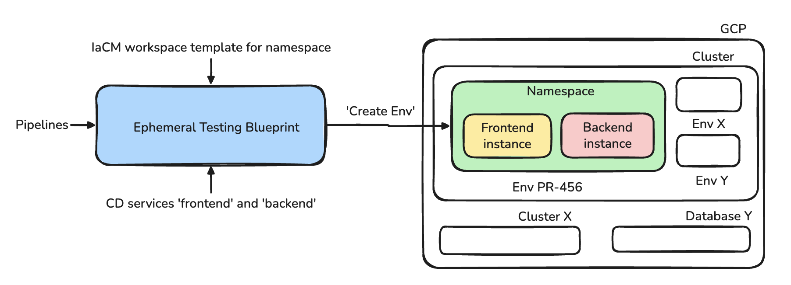
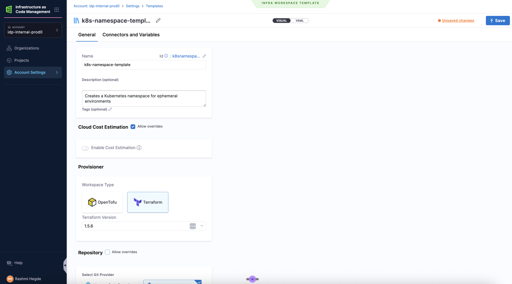
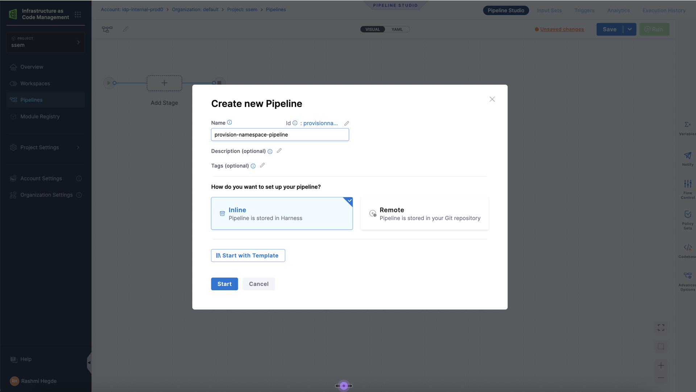
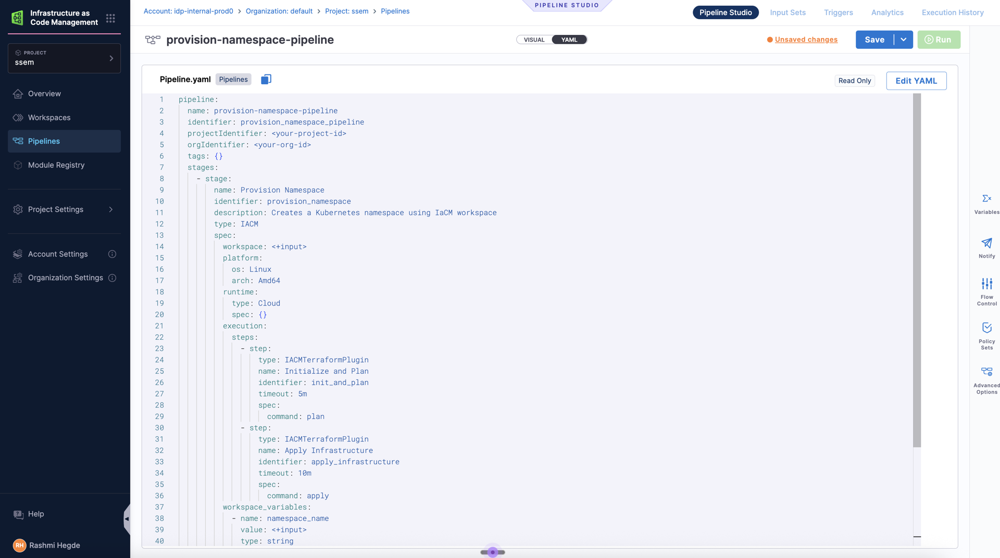
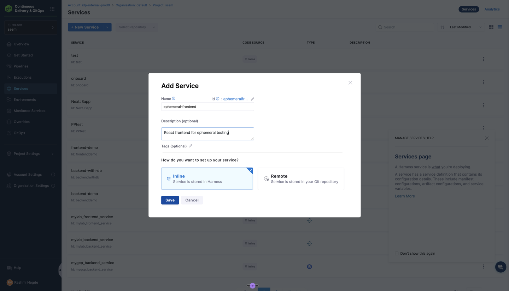
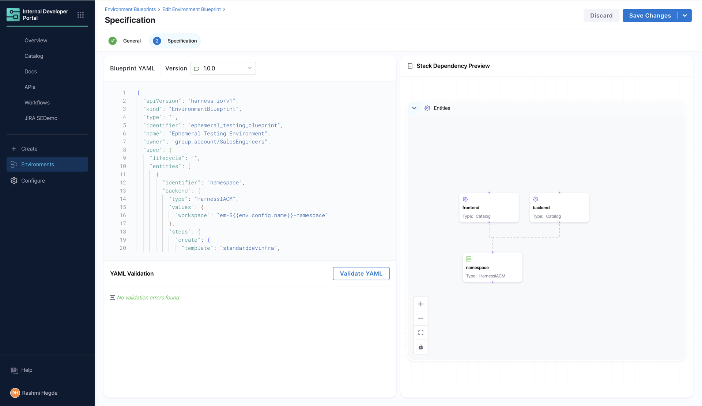
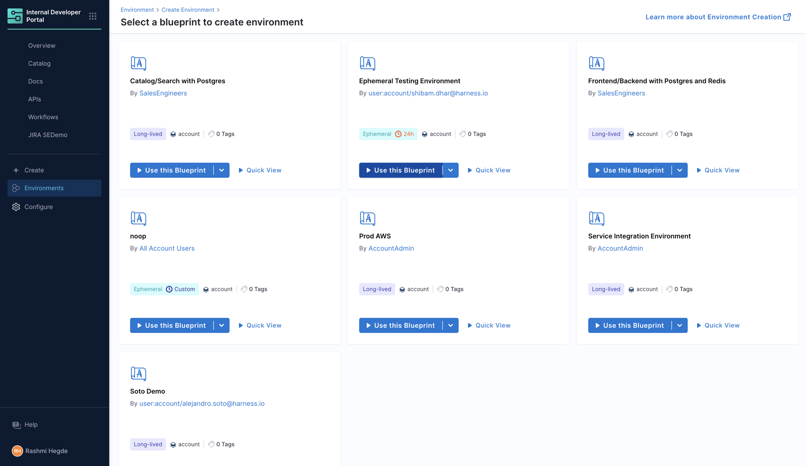
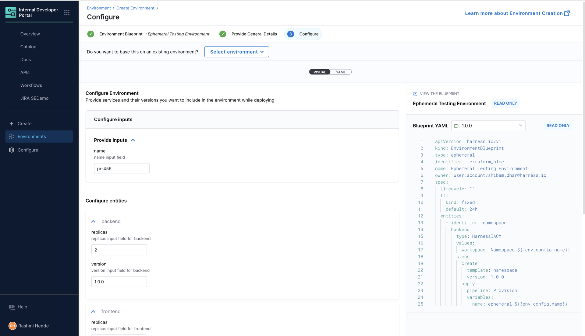

## Overview

This tutorial shows you how to eliminate PR testing bottlenecks by building a self-service ephemeral environment system. Instead of developers struggling over shared staging environments and manual cleanups, you'll create automated environments that provision in 5 minutes and delete themselves after 24 hours.

### The Problem Scenario

Your development team of 12 engineers ships a web application with 30+ pull requests per week. Currently, PR testing is painful:

* **2 shared "staging" environments** → developers wait 2-4 hours for availability
* **Manual environment creation** takes 30-45 minutes (create namespace, deploy services, configure DNS)
* **No cleanup process** → 15+ old test namespaces consuming resources and cost
* **Inconsistent setup** → each developer configures differently ("works on my machine")
* **QA bottleneck** → QA team can only test 1-2 PRs at a time

### The End Result

A complete self-service environment system where developers can:

* Click a button to get an isolated test environment (namespace + frontend + backend)
* Test their PR without waiting or manual setup
* Have the environment automatically deleted after 24 hours (TTL)

---

## What You'll Build

* IaCM workspace templates for Kubernetes namespace provisioning
* Provision and destroy pipelines for infrastructure lifecycle
* CD services for a web application (frontend + backend)
* Environment Blueprints combining infrastructure and services
* TTL based Ephemeral Environments



## Prerequisites
:::caution Make Sure You Fulfill The Requirements

Before proceeding with the tutorial steps, ensure you have completed the [prerequisites outlined](../get-started.md#prerequisites) in the [**Get Started with Environment Management**](../get-started.md) guide:

* ☑ Required modules and feature flags enabled
* ☑ Connector and delegate configured
* ☑ Infrastructure requirements met
* ☑ Permissions set across IDP, CD, and platform resources

### Knowledge Prerequisites

* ☑ Basic understanding of Kubernetes concepts (namespaces, deployments)
* ☑ Familiarity with Harness CD services and pipelines
* ☑ Basic knowledge of Helm charts
:::

---

## Component Breakdown

1. **IaCM Workspace Template** - Defines reusable infrastructure patterns. Here we use it for Kubernetes namespaces, in principle this can be used for any infrastructure resource using Terraform/OpenTofu
2. **CD Services** - Define the applications to deploy (frontend + backend)
3. **Pipelines** - Create/destroy the namespaces, frontend, backend. This can be used to deploy any infrastructure resources, services
4. **Environment Blueprint** - Orchestrates all components with proper dependencies
5. **TTL Configuration in Blueprint** - Automatic environment cleanup after specified time period

---

## Who Benefits

* **Developers** - Focus completely on coding instant test environments, no manual cleanup
* **Platform Team** - Consistent environment configurations with clear audit trail (who created what, when)
* **QA Engineers** - Test multiple PRs in parallel with predictable, consistent testing conditions
* **Finance Team** - Reduction in test environment costs

---

## Step-by-Step Walkthrough

:::note
Update variables (marked as `<your-*>`) in code snippets with relevant reference to your set up
:::

### Step 1: Create the Namespace Terraform Module

Create the Terraform code that the workspace will use. You can use an existing git repository or create a new one. Here we'll use an existing repository in Harness Code Repository. In your Git repository at `terraform/k8s-namespace/`, create the following files:

```hcl title="File: main.tf"
provider "google" {
  project = <your_project_name>
  region  = <your_region_name>
}

data "google_client_config" "default" {}

data "google_container_cluster" "gke_cluster" {
  name     = <your_cluster_name>
  location = <your_region_name>
}

provider "kubernetes" {
  host = "https://${data.google_container_cluster.gke_cluster.endpoint}"

  token = data.google_client_config.default.access_token

  cluster_ca_certificate = base64decode(
    data.google_container_cluster.gke_cluster.master_auth[0].cluster_ca_certificate
  )
}

resource "kubernetes_namespace_v1" "ephemeral" {
  metadata {
    name = "${var.name}"
  }
}
```


```hcl title="File: variables.tf"
variable "name" {
  description = "Name of the Kubernetes namespace to create"
  type        = string
}
```


```hcl title="File: outputs.tf"
output "name" {
  description = "The name of the created namespace"
  value       = kubernetes_namespace_v1.ephemeral.metadata[0].name
}
```

Commit and push these files to your Git repository.


### Step 2: Create the IaCM Workspace Template

The workspace template defines the infrastructure pattern for creating Kubernetes namespaces.

1. Go to **Project Settings** and under **Project-level Resources**, choose **Templates**. You can also use templates at Account and Org level.

2. Create a new Template of type **Infra Workspace**.

3. Configure the template:
   - **Name:** `k8s-namespace-template`
   - **Version:** `v1`
   - **Description:** `Creates a Kubernetes namespace for ephemeral environments`
   - **Terraform/OpenTofu Version:** `1.5.6` (or your preferred version)

    

4. In the **Repository** section, choose Harness Code Repository and:
   - **Repository:** Your infrastructure repository.
   - **Branch:** `main`
   - **Folder Path:** `terraform/k8s-namespace` (where your Terraform code resides)
5. In the **Variables** section, add:
   - An overridable Terraform variable:
     - `name` (string, no default) - The namespace to create
   - Your GCP connector with the required permission to create/update namespaces in your cluster

6. Click **Save** to create the template

Note the identifiers:
- **Template Name:** `k8s-namespace-template`
- **Template Version:** `v1`

You'll need these in [Step 10](#step-10-create-the-environment-blueprint) when creating the Environment Blueprint.


### Step 3: Create the IaCM Provision Pipeline

This pipeline creates the namespace when an environment is provisioned. In principle, you can use the pipeline to create workspaces for any resource, so long as the template has its terraform code.

1. Navigate to **Infrastructure as Code** module, go to **Pipelines** and hit **Create new pipeline** with name `provision-namespace-pipeline`

2. Select **Inline** storage type

    

3. Switch to **YAML** view and paste the following. Note that you can update the infrastructure, stages or even use existing pipelines here.

```yaml
pipeline:
  name: provision-namespace-pipeline
  identifier: provision_namespace_pipeline
  description: Pipeline used for provisioning EM infra
  projectIdentifier: <your-project-id>
  orgIdentifier: <your-org-id>
  tags: {}
  stages:
    - stage:
        name: Provision Namespace
        identifier: provision_namespace
        description: Creates a Kubernetes namespace using IaCM workspace
        type: IACM
        spec:
          workspace: <+input>
          platform:
            os: Linux
            arch: Amd64
          runtime:
            type: Cloud
            spec: {}
          execution:
            steps:
              - step:
                  type: IACMTerraformPlugin
                  name: Initialize
                  identifier: init
                  timeout: 5m
                  spec:
                    command: init
              - step:
                  type: IACMTerraformPlugin
                  name: Plan
                  identifier: plan
                  timeout: 5m
                  spec:
                    command: plan
              - step:
                  type: IACMTerraformPlugin
                  name: Apply Infrastructure
                  identifier: apply
                  timeout: 10m
                  spec:
                    command: apply
        tags: {}
```

4. Click **Save** to create the pipeline

    

Note the identifier:
- **Pipeline identifier:** `provision_namespace_pipeline`


### Step 4: Create the Destroy Pipeline

This pipeline cleans up the namespace when the environment is deleted or TTL expires.

1. Create a new pipeline named `destroy-namespace-pipeline`
2. Use this YAML:

```yaml
pipeline:
  name: destroy-namespace-pipeline
  identifier: destroy_namespace_pipeline
  projectIdentifier: <your-project-id>
  orgIdentifier: <your-org-id>
  tags: {}
  stages:
    - stage:
        name: Destroy Namespace
        identifier: destroy_namespace
        description: Destroys the Kubernetes namespace and all resources
        type: IACM
        spec:
          workspace: <+input>
          platform:
            os: Linux
            arch: Amd64
          runtime:
            type: Cloud
            spec: {}
          execution:
            steps:
              - step:
                  type: IACMTerraformPlugin
                  name: init
                  identifier: init
                  timeout: 10m
                  spec:
                    command: init
              - step:
                  type: IACMTerraformPlugin
                  name: planDestroy
                  identifier: planDestroy
                  timeout: 10m
                  spec:
                    command: plan-destroy
              - step:
                  type: IACMTerraformPlugin
                  name: destroy
                  identifier: destroy
                  timeout: 1h
                  spec:
                    command: destroy
        tags: {}
```

3. Click **Save** to create the destroy pipeline

Note the identifier:
- **Pipeline identifier:** `destroy_namespace_pipeline`


### Step 5: Create CD Services

Now we'll create two CD services for our sample application with the help of 2 toy nginx helm charts available here.

#### Frontend Service

1. Navigate to **Continuous Delivery > Services**

2. Click **+ New Service**

3. Configure:
   - **Name:** `ephemeral-frontend`
   - **Description:** `React frontend for ephemeral testing`

4. Select **Inline** storage type

    

5. In the **Service Definition:**
   - **Deployment Type:** `Native Helm`
   - **Manifests:** Click Add Manifest
     - **Manifest Type:** `Helm Chart`
     - **Manifest Source:** `Github` and select your Git connector or create a new one.
     - **Manifest Identifier:** `helm-frontend`
     - **Repository Name:**
     - **Git Fetch Type:** `Latest from Branch`
     - **Branch:** `main`
     - **Chart Path:** `/frontend`
     - **Helm Version:** `V3`

6. Click **Save** to create the frontend service

#### Backend Service

1. Create another service named `ephemeral-backend` and follow the same steps as above.
2. **Service Definition:**
   - **Deployment Type:** `Native Helm`
   - **Manifests:** Click Add Manifest
     - **Manifest Type:** `Helm Chart`
     - **Manifest Source:** `Github` and select your Git connector or create a new one.
     - **Manifest Identifier:** `helm-backend`
     - **Repository Name:** `<your-repository-name>` (e.g., `demo`)
     - **Git Fetch Type:** `Latest from Branch`
     - **Branch:** `main`
     - **Chart Path:** `/backend`
     - **Helm Version:** `V3`
3. Click **Save** to create the backend service

Note the identifiers:
- **Frontend service:** `ephemeral-frontend`
- **Backend service:** `ephemeral-backend`


### Step 6: Create a CD Environment and Infrastructure Definition

The CD environment defines where your services will be deployed. We'll create an environment with an infrastructure definition pointing to your Kubernetes cluster.

#### Create the Environment:

1. Navigate to **Continuous Delivery > Environments**
2. Click **+ New Environment**
3. Configure the environment:
   - **Name:** `ephemeral-env`
   - **Description:** `Environment for ephemeral testing deployments`
   - **Environment Type:** Select `Pre-Production`
4. Choose **Inline** as the store type
5. Click **Save** to create the environment

#### Create the Infrastructure Definition:

1. In the newly created environment, switch to the **Infrastructure Definitions** tab
2. Click **+ Infrastructure Definition**
3. Configure the infrastructure:
   - **Name:** `ephemeral-infra`
   - **Deployment Type:** Select `Native Helm`
4. Under **Infrastructure Type**, choose based on your cloud provider. In our example, we'll use **Direct Connection** for vendor-agnostic Kubernetes
5. Configure the cluster details:
   - **Connector:** Select your Kubernetes or cloud provider connector (or create a new one)
   - **Namespace:** Mark as runtime input.
   - **Release Name:** Set to `<+service.name>` (this ensures each service gets a unique Helm release name)
6. Click **Save** to create the infrastructure definition

Note the identifiers:
- **Environment identifier:** `ephemeral_env`
- **Infrastructure definition identifier:** `ephemeral_infra`

You'll need these identifiers in [Step 10](#step-10-create-the-environment-blueprint) when creating the Environment Blueprint.


### Step 7: Create Service Deployment and Delete Pipelines

Create deployment and delete pipelines for both services. Note that you can update this pipeline based on your needs or even use your existing pipelines here.

```yaml title="Deployment Pipeline YAML"
pipeline:
  name: deploy-service
  identifier: deploy_service
  projectIdentifier: <your-project-id>
  orgIdentifier: <your-org-id>
  tags: {}
  stages:
    - stage:
        name: Deploy
        identifier: Deploy
        description: ""
        type: Deployment
        spec:
          deploymentType: NativeHelm
          service:
            serviceRef: <+input>
            serviceInputs: <+input>
          environment:
            environmentRef: <+input>
            deployToAll: false
            environmentInputs: <+input>
            serviceOverrideInputs: <+input>
            infrastructureDefinitions: <+input>
          execution:
            steps:
              - step:
                  name: Helm Deployment
                  identifier: helmDeployment
                  type: HelmDeploy
                  timeout: 10m
                  spec:
                    skipDryRun: false
            rollbackSteps:
              - step:
                  name: Helm Rollback
                  identifier: helmRollback
                  type: HelmRollback
                  timeout: 10m
                  spec: {}
        tags: {}
        failureStrategies:
          - onFailure:
              errors:
                - AllErrors
              action:
                type: StageRollback
```

```yaml title="Delete Pipeline YAML"
pipeline:
  name: delete-service
  identifier: delete_service
  projectIdentifier: <your-project-id>
  orgIdentifier: <your-org-id>
  tags: {}
  stages:
    - stage:
        name: uninstall
        identifier: uninstall
        description: ""
        type: Deployment
        spec:
          deploymentType: NativeHelm
          service:
            serviceRef: <+input>
            serviceInputs: <+input>
          environment:
            environmentRef: <+input>
            deployToAll: false
            environmentInputs: <+input>
            serviceOverrideInputs: <+input>
            infrastructureDefinitions: <+input>
          execution:
            steps:
              - step:
                  type: HelmDelete
                  name: HelmDelete_1
                  identifier: HelmDelete_1
                  spec:
                    dryRun: false
                    releaseName: <+service.name>
                  timeout: 10m
            rollbackSteps:
              - step:
                  name: Helm Rollback
                  identifier: helmRollback
                  type: HelmRollback
                  timeout: 10m
                  spec: {}
        tags: {}
        failureStrategies:
          - onFailure:
              errors:
                - AllErrors
              action:
                type: StageRollback
```

Note the identifiers:
- **Deploy pipeline:** `deploy_service`
- **Delete pipeline:** `delete_service`

You'll need these in Step 9 when updating the Catalog entities.


### Step 8: Enable CD Auto-discovery to Register Catalog entities

CD Auto-discovery will automatically discover and import CD services as Catalog components in IDP. For more information on how to do this, refer to [Catalog Auto-Discovery with Harness CD Services](https://developer.harness.io/docs/internal-developer-portal/catalog/create-entity/catalog-discovery/harness-cd/)


### Step 9: Update Catalog entities with deployment pipelines

Catalog entities should have the necessary deployment pipelines in the Catalog Info YAML.

1. Navigate to **Internal Developer Portal > Catalog**
2. Search for the entities `ephemeral-frontend` and `ephemeral-backend`
3. Click to **Edit**, switch to YAML and paste the following under `spec`:

```yaml
deploymentPipelines:
  - identifier: deploy_service
  - identifier: delete_service
    type: uninstall
```


### Step 10: Create the Environment Blueprint

Now we'll assemble all components into an environment blueprint that developers can use.

1. Navigate to **Internal Developer Portal > Environments**
2. Click **Create > Environment Blueprint**
3. **Name:** `ephemeral-testing-blueprint`, **Version:** `1.0.0`, **Owner:** `<Your team>`
4. Click **Configure Environment Blueprint** and paste YAML:

```yaml
apiVersion: harness.io/v1
kind: EnvironmentBlueprint
type: ephemeral
name: Ephemeral Testing Environment
identifier: ephemeral_testing_blueprint
owner: <your-team-name>
spec:
  ttl:
    kind: fixed
    default: 24h
  entities:
    - identifier: namespace
      backend:
        type: HarnessIACM
        values:
          workspace: Namespace-${{env.config.name}}
        steps:
          create:
            template: k8s-namespace-template  # Workspace Template created in Step 2
            version: v1
          apply:
            pipeline: provision_namespace_pipeline  # Provision pipeline from Step 3
            variables:
              name: ephemeral-${{env.config.name}}
          destroy:
            pipeline: destroy_namespace_pipeline  # Destroy pipeline from Step 4
            variables:
              name: ephemeral-${{env.config.name}}
          delete: {}
          pause: {}
          resume: {}
    - identifier: ephemeral_frontend
      interface:
        dependencies:
          - identifier: namespace
        inputs:
          version:
            type: string
            default: 1.0.0
          replicas:
            type: integer
            default: 1
      backend:
        type: Catalog
        values:
          identifier: ephemeral-frontend  # Frontend service from Step 5
          variables:
            replicas: ${{entity.config.replicas}}
            version: ${{entity.config.version}}
          environment:
            identifier: <your-environment-id>  # CD Environment from Step 6
          infra:
            identifier: <your-infra-definition-id>  # Infrastructure Definition from Step 6
            namespace: ${{dependencies.namespace.output.name}}
    - identifier: ephemeral_backend
      interface:
        dependencies:
          - identifier: namespace
        inputs:
          version:
            type: string
            default: 1.0.0
          replicas:
            type: integer
            default: 1
      backend:
        type: Catalog
        values:
          identifier: ephemeral-backend  # Backend service from Step 5
          variables:
            version: ${{entity.config.version}}
            replicas: ${{entity.config.replicas}}
          environment:
            identifier: <your-environment-id>  # CD Environment from Step 6
          infra:
            identifier: <your-infra-definition-id>  # Infrastructure Definition from Step 6
            namespace: ${{dependencies.namespace.output.name}}
  ownedBy:
    - <your-owner-name>
  inputs:
    name:
      type: string
      default: demo
```



5. Click **Save Blueprint**


### Step 11: Provision an Ephemeral Environment

Now let's create an environment instance from the blueprint.

1. Navigate to **Internal Developer Portal > Environments**

2. Click **Create > Environment**

3. Select **Ephemeral Testing Environment** blueprint

    

4. Fill in the configuration:
   - **Name:** `pr-456`
   - For each service:
     - **Replicas:** `2`
     - **Version:** `1.0.0`

    

5. Click **Create Environment** and then **Start Environment**

6. The provisioning process will begin:
   - **Namespace Creation:** IaCM runs the provision pipeline
   - **Frontend Deployment:** CD deploys the frontend service
   - **Backend Deployment:** CD deploys the backend service

7. Once complete, you'll see the environment dashboard with **Environment status:** `Online`

**Congratulations! You've successfully created an ephemeral environment system.**

---

## Recommended Reading

* [Environment Management Overview | Harness Developer Hub](/docs/internal-developer-portal/environment-management/overview)
* [Get Started with Environment Management | Harness Developer Hub](/docs/internal-developer-portal/environment-management/get-started/)
* [Workspace Templates | Harness Developer Hub](/docs/infra-as-code-management/workspaces/workspace-templates)
