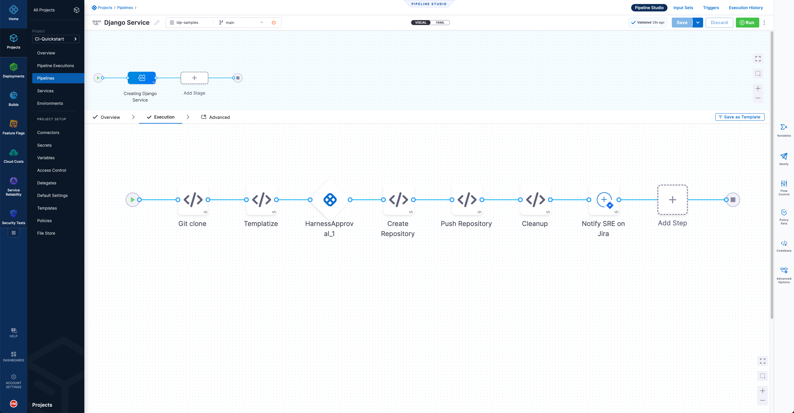

In Harness IDP, a service onboarding pipeline (also known as a software template) enables platform engineers to automate the process of service creation. As a platform engineer, you can create a template that prompts developers for details and creates a repository with a basic setup that includes a CI/CD process. The template is defined in a YAML file named `template.yaml`. The syntax of the template definition is owned by [backstage.io](https://backstage.io/docs/features/software-templates/writing-templates) while the workflow runs on a Harness pipeline of your choice.

<!-- See it in action: Demo video -->

**To get started, check out the tutorial to [create your first service onboarding pipeline](/tutorials/internal-developer-portal/service-onboarding-pipeline).**

## Template registration

A template is a kind of entity that exists in the software catalog. You can create a `template.yaml` file and register the URL with the catalog. For information about registering a template, go to [Add a new software component to the catalog](../getting-started/register-a-new-software-component.md).

## Available template actions

Harness IDP ships the following actions to be used in the software template steps.

- `trigger:harness-custom-pipeline`
- `harness:create-secret`
- `harness:delete-secret`

Learn more about how to use them in the [service onboarding tutorial](/tutorials/internal-developer-portal/using-secret-as-an-input).

## Available UI pickers

Harness IDP ships the following custom UI pickers that can be used in the template form for developers to select from.

- `HarnessOrgPicker`
- `HarnessProjectPicker`

You can use these UI fields in the `ui:field` option of your `template.yaml` file. Read more about how to use these [custom field extensions](https://backstage.io/docs/features/software-templates/writing-custom-field-extensions#using-the-custom-field-extension) or take a look at [this example](https://github.com/bhavya-sinha/scaffolder-sample-templates/blob/5f52718ec49cb2c27a87e2fbeae075873701911c/fieldExtension.yaml#L78-L85).
