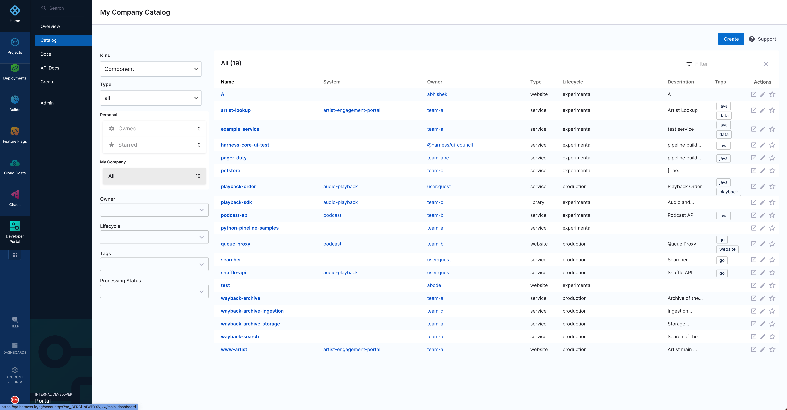
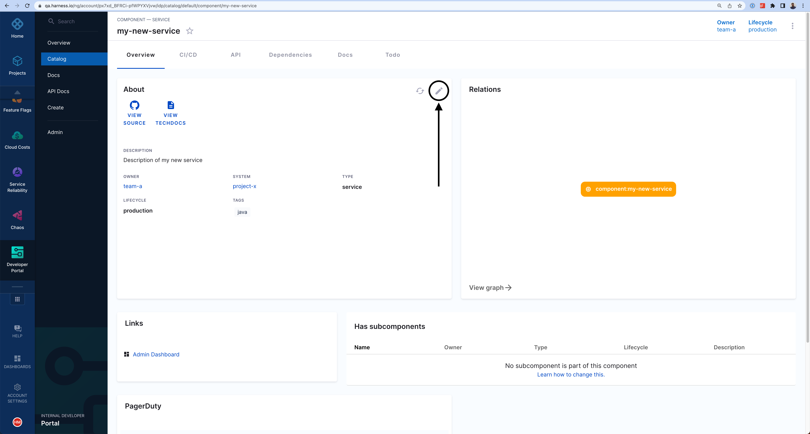

The software catalog is a centralized registry for all your software (services, websites, libraries, data pipelines, and so on), and it helps you track their ownership, metadata, and dependencies. The catalog is built from metadata YAML files, each of which is stored with its code and owned by a team. It is powered by the [Backstage Software Catalog](https://backstage.io/docs/features/software-catalog/).

## Component definition YAML

The definition for any component in the software catalog is stored in a YAML file (usually `catalog-info.yaml`) in your git repository. Usually the YAML files resides in the same repository as the software code. Following is a typical definition file:

```yaml
# file: catalog-info.yaml
apiVersion: backstage.io/v1alpha1
kind: Component
metadata:
  name: my-new-service
  description: Description of my new service
  annotations:
    pagerduty.com/integration-key: <sample-service-integration-key>
  tags:
    - java
  links:
    - url: https://admin.example-org.com
      title: Admin Dashboard
      icon: dashboard
      type: admin-dashboard
spec:
  type: service
  lifecycle: production
  owner: team-a
  system: project-x
```

For information about how to register a software component, go to [register a new software component](../getting-started/register-a-new-software-component.md). For YAML reference documentation, go to [backstage.io](https://backstage.io/docs/features/software-catalog/descriptor-format).

## Software ecosystem modelling

The catalog is home to several types of software components such as services, websites, libraries, APIs, and even resources such as databases. Every component is owned by a team and is part of a system. When configured properly, the catalog is a graph of your entire software ecosystem. For information about how to model your software ecosystem, go to [backstage.io](https://backstage.io/docs/features/software-catalog/system-model).

## API access

You can access catalog APIs to retrieve software components from the catalog, register new components, or build your automation on top of it.

Start by generating a Harness API Key as described in [Add and manage API keys](/docs/platform/user-management/add-and-manage-api-keys/). Then, by using your Harness account ID and the API Key, you can make requests to the IDP catalog APIs as follows:

```
curl --location 'https://idp.harness.io/{ACCOUNT_IDENTIFIER}/idp/api/catalog/locations' \
--header 'x-api-key: {X_API_KEY}' \
--header 'Harness-Account: {ACCOUNT_IDENTIFIER}'
```

To learn more about the available catalog APIs supported by Backstage, go to [API](https://backstage.io/docs/features/software-catalog/software-catalog-api/).

## FAQs

### How can I update the definition of a software component?

Anyone can update the definition of a software component by updating the component's `catalog-info.yaml` file. You can also use the edit button on the catalog page to go to the component's source location.



Committed changes reflect on the catalog in a couple of minutes. You can also press the refresh button on the catalog page to instantly sync the system with Git.

### How does the catalog read files from my Git repository?

IDP uses the Git connector you selected during the module onboarding process. To view or update the configured connector, go to **Internal Developer Portal** > **Admin** > **Connectors**.
