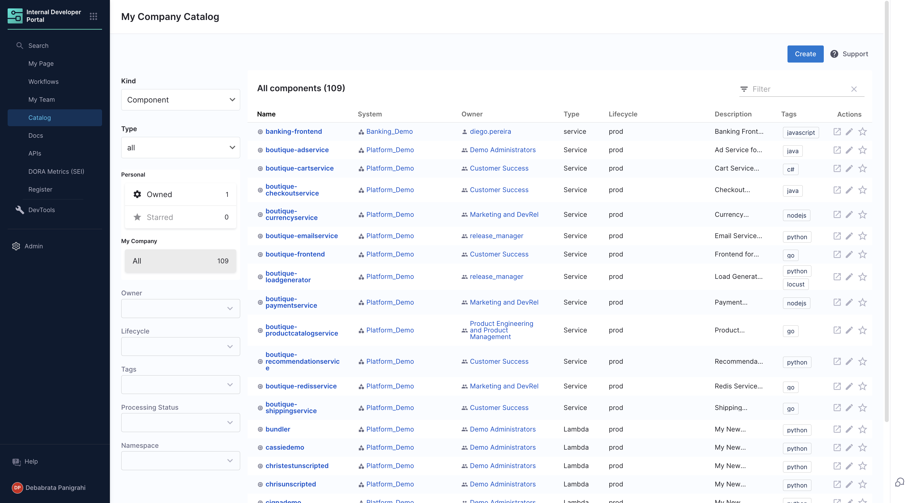

The software catalog is a centralized registry for all your software (services, websites, libraries, data pipelines, and so on), and it helps you track their ownership, metadata, and dependencies. The catalog is built from metadata YAML files, each of which is stored with its code and owned by a team. It is powered by the [Backstage Software Catalog](https://backstage.io/docs/features/software-catalog/).

## Component definition YAML

The definition for any component in the software catalog is stored in a YAML file (usually `catalog-info.yaml`) in your git repositories. Usually the YAML lives in the same repository where the code for the software lives. A typical definition file looks as follows

```yaml
# file: catalog-info.yaml
apiVersion: backstage.io/v1alpha1
kind: Component
metadata:
  name: my-new-service
  description: Description of my new service
  annotations:
    pagerduty.com/integration-key: <sample-service-integration-key>
  tags:
    - java
  links:
    - url: https://admin.example-org.com
      title: Admin Dashboard
      icon: dashboard
      type: admin-dashboard
spec:
  type: service
  lifecycle: production
  owner: team-a
  system: project-x
```

You can read more about how to [register a new software component](../getting-started/register-a-new-software-component.md) or checkout the reference documentation of the YAML on [backstage.io](https://backstage.io/docs/features/software-catalog/descriptor-format).

## Software ecosystem modelling

The catalog is home for several types of software components for example services, websites, libraries, APIs and even resources like databases. Every component is owned by a team and is part of a system. When configured properly, the catalog is a graph of your entire software ecosystem. Read more about how to think about modelling your software ecosystem on [backstage.io](https://backstage.io/docs/features/software-catalog/system-model).

## FAQs

### How can I update the definition of a software component?

Anyone can update the definition of a software component by updating the `catalog-info.yaml` file corresponding to the component. You can also use the pencil button on the catalog page to go to the source location.


Once the change has been committed, it should automatically reflect on the catalog in a couple of minutes. Or you can press the refresh button on the catalog page to instantly sync the system with git.

### How does the catalog read files from my git system?

IDP uses the git connector you had chosen during the module onboarding process. Go to the "Admin" -> "Connectors" page in the IDP module and you can find the configured connector. You can also update the connector from the page.
