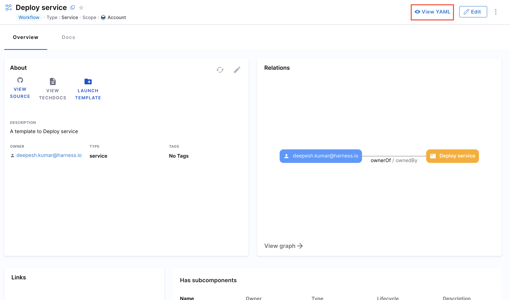
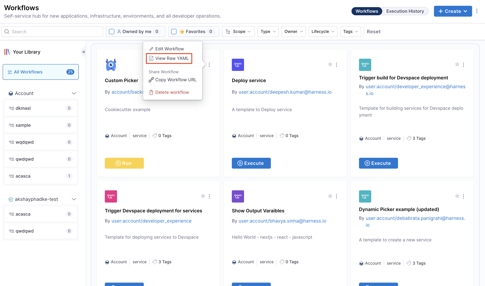
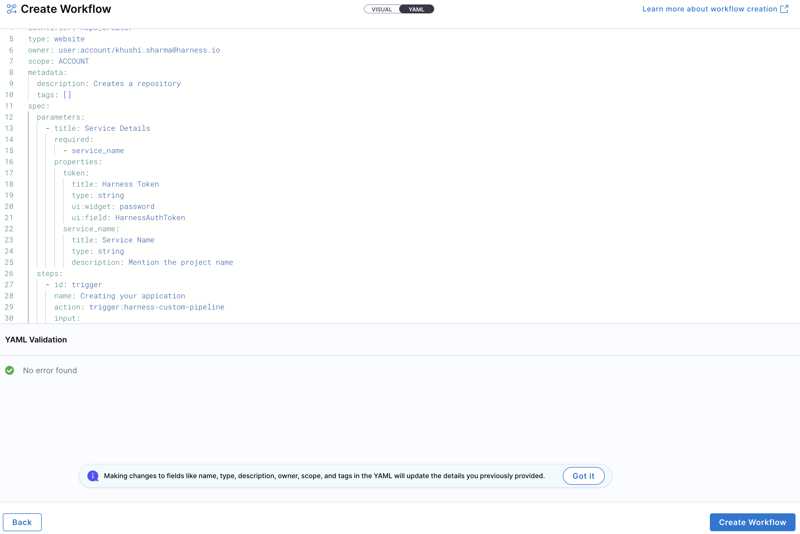
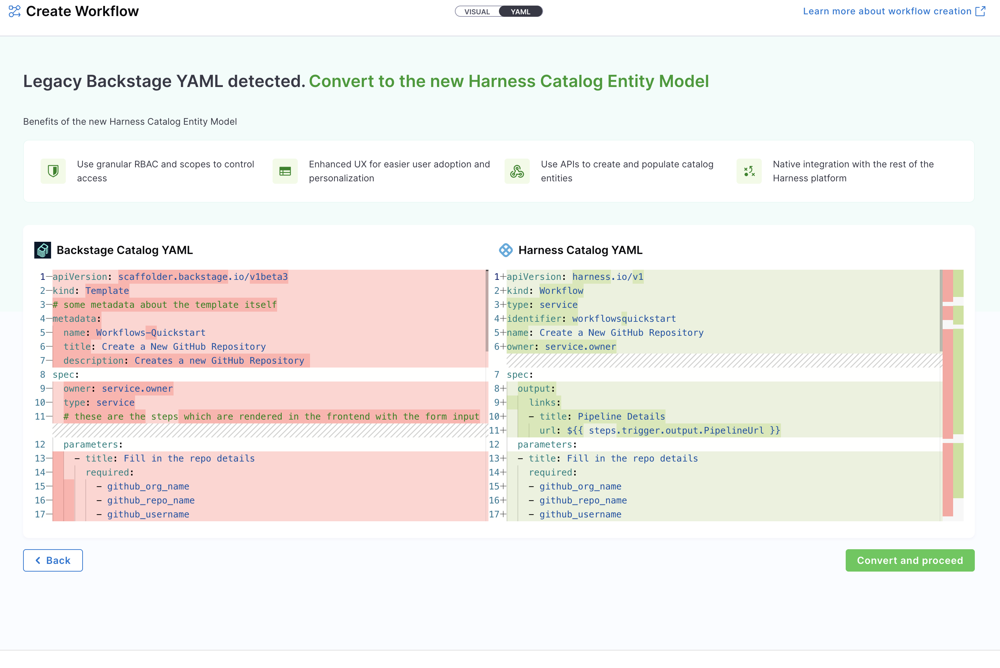
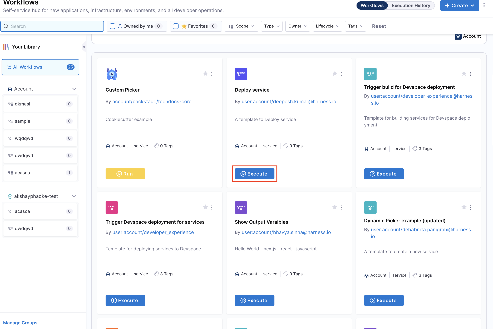
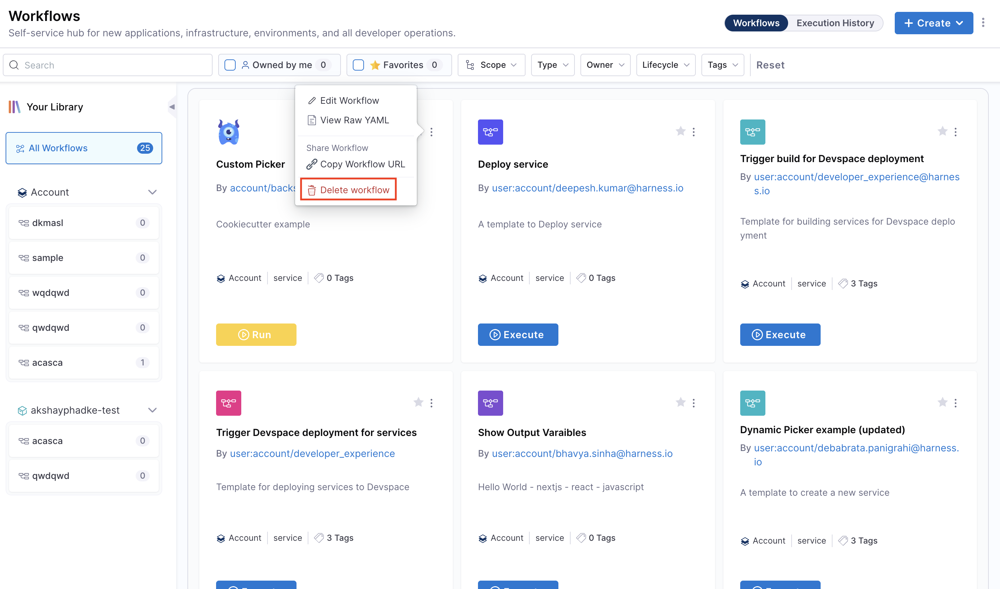
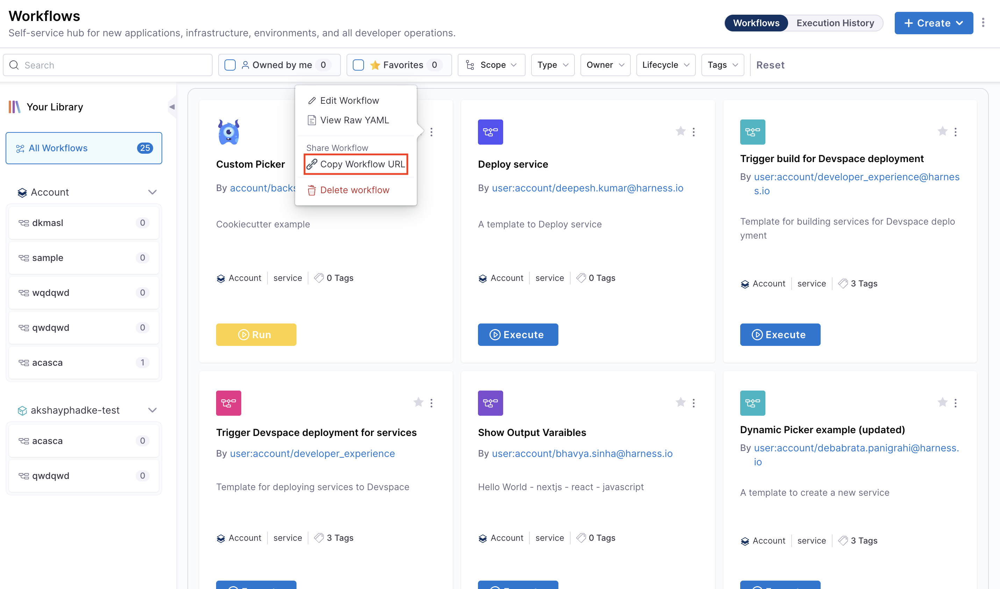

import RedirectIfStandalone from '@site/src/components/DynamicMarkdownSelector/RedirectIfStandalone';

<RedirectIfStandalone label="IDP 2.0" targetPage="/docs/internal-developer-portal/flows/manage-workflow-2o" />

:::tip For IDP 2.0 Customers
If you're using Harness IDP 2.0, please ensure you have reviewed the [IDP 2.0 Overview guide](/docs/internal-developer-portal/idp-2o-overview/2-0-overview-and-upgrade-path.md) and are familiar with the key steps for [upgrading to IDP 2.0](/docs/internal-developer-portal/idp-2o-overview/migrating-idp-2o.md). To enable IDP 2.0, you must raise a support ticket to activate the `IDP_2_0` feature flag for your account.
:::

Workflows enable **developer self-service** by automating manual tasks and processes. Using Workflows, platform engineering teams can:

- Automate new **service onboarding**.
- Simplify **Day 2 operations** for developers.
- Provide developers with **golden paths to production** that include guardrails and best practices.

This guide will walk you through the process of registering and managing your Workflows directly from Harness IDP. Let's dive in!

---
## Workflows in Software Catalog 
Once a workflow is registered, it is stored in the Software Catalog under the kind **"Workflow"**.

### Access Workflows 

1. Navigate to the **Catalog** page in Harness IDP.  
2. Select **Workflows** from the Catalog filter categories to view all registered Workflows.  
3. Use additional filters (e.g., owner, tags) to narrow down the list.

---

### View Workflow YAML
You can inspect the Workflow YAML in two ways:

1. From the **Catalog**, select the desired Workflow and click **View YAML**.  

2. From the **Workflows** page, click the three-dot menu on the Workflow and choose **View RAW YAML**. 

---

## Manage Workflows 

### Create Workflows 
With IDP 2.0, we are moving towards a Harness-native Data Model designed for enterprise scale and access control. To learn more about the different changes in the schema, go to [Data Model](/docs/internal-developer-portal/catalog/data-model/data-model). 

There are two ways for you to add and create a new Workflow in your IDP:
- **Create a Workflow via the Harness IDP UI**: Use the Harness UI to create Workflows directly—no YAML required. This method offers a streamlined, code-free experience for adding entities.
- **Create a Workflow using your Workflow YAML**: You can still create Workflows using your existing Workflow YAML files. Harness will automatically convert legacy Backstage YAML into the new Harness-native Data Model and register the corresponding Workflow.

Let's try creating a **Workflow** using both the methods: 

<Tabs>
  <TabItem value="UI" label="Harness IDP UI">
  To create a new **Workflow**, navigate to the Harness IDP portal and click on **"Create"** from the side-bar menu. Choose **Workflow** from the panel, and follow these steps:
  1. You'll be redirected to the **"Visual View"**, where you can input basic Workflow details and begin the creation process.
  2. Enter the required Workflow information. The **Visual view** is synced in real-time with the **YAML view** for full transparency.
  
  3. Define the **Workflow scope** — choose whether the Workflow should reside at the Account, Project, or Organization level. For this use-case, let's select the Account scope. Read more about Workflow RBAC.
  
  4. You now have two options for managing your Workflow configuration:
    * **Inline (default):** Manage the Workflow YAML directly within Harness.
    * **Remote:** Choose to store your Workflow YAML in a Git repository for version control, collaboration, and change tracking.
    You can either use a **Harness Code Repository** or connect to a **Third-party Git provider** like GitHub or GitLab by selecting a Git connector, repository, branch, and YAML path.
        
     > The Git Experience is ideal for teams who prefer to manage Workflows as code, with full version control and Git-native workflows. The changes are reflected in both YAML and execution views, via a [webhook](/docs/internal-developer-portal/git-experience/gitx-journey#workflow-execution-visibility-and-webhook-requirement) which is automatically configured on the Git connector. Learn more in the [Git Experience Journey documentation](/docs/internal-developer-portal/git-experience/gitx-journey).

  5. Click on **"Review YAML"** to view the auto-generated YAML. Since there's a live sync between the Visual and YAML views, changes in one will reflect in the other. 
  6. You can configure your Workflow by editing the YAML directly—add inputs, backend actions, and outputs as needed. This allows you to fully customize the Workflow behavior. Learn more about the [components of a Workflow](/docs/internal-developer-portal/flows/worflowyaml.md#components-of-workflow-yaml) and its [YAML structure](/docs/internal-developer-portal/flows/worflowyaml.md#workflow-yaml-definition) here.  
  

  :::info
  **YAML validation** is performed to ensure compatibility with the **Harness-native Data Model**. Any errors will be shown in the Validation logs. Ensure your `identifier` follows [naming rules](https://developer.harness.io/docs/platform/references/entity-identifier-reference/#identifier-naming-rules). Invalid identifiers may lead to entity registration errors.
  :::

  6. Once everything is set, click **"Create Workflow"** to finalize and create the Workflow.
  </TabItem>
  <TabItem value="YAML" label="Workflow YAML">
  To create a new entity using the Workflow YAML, navigate to the Harness IDP portal and click **"Create"** from the side-bar menu. Choose **Workflow** from the panel.
  
  :::info
  If you have a **legacy Backstage YAML**, you can still use it to create a **Workflow**. Harness will automatically convert it into the **Harness-native Data Model** format.
  :::

1. You'll be redirected to the **Visual View**. You can switch to the **YAML View** using the toggle at the top of the screen. This allows you to directly edit the Workflow's YAML definition.

2. If you're using a **legacy Backstage YAML**, paste it into the YAML view. Harness will convert it into the **Harness-native format** automatically. You can then proceed to finalize and create the Workflow. Since the Visual and YAML views are **live-synced**, changes made in one view will reflect in the other.

4. You can configure your Workflow by editing the YAML directly—add inputs, backend actions, and outputs as needed. This allows you to fully customize the Workflow behavior. Learn more about the [components of a Workflow](/docs/internal-developer-portal/flows/worflowyaml.md#components-of-workflow-yaml) and its [YAML structure](/docs/internal-developer-portal/flows/worflowyaml.md#workflow-yaml-definition) here.  

3. Define the **scope** of the Workflow in two ways: either switch to the Visual View and select the desired scope, or specify the **[projectIdentifier](/docs/internal-developer-portal/catalog/catalog-yaml.md#projectidentifier)** or **[orgIdentifier](/docs/internal-developer-portal/catalog/catalog-yaml.md#orgidentifier)** directly in the YAML to set the project or organization scope.

4. You now have two options for managing your Workflow configuration:
    * **Inline (default):** Manage the Workflow YAML directly within Harness.
    * **Remote:** Choose to store your Workflow YAML in a Git repository for version control, collaboration, and change tracking.
    You can either use a **Harness Code Repository** or connect to a **Third-party Git provider** like GitHub or GitLab by selecting a Git connector, repository, branch, and YAML path.
    
    > The Git Experience is ideal for teams who prefer to manage Workflows as code, with full version control and Git-native workflows. The changes are reflected in both YAML and execution views, via a [webhook](/docs/internal-developer-portal/git-experience/gitx-journey#workflow-execution-visibility-and-webhook-requirement) which is automatically configured on the Git connector. Learn more in the [Git Experience Journey documentation](/docs/internal-developer-portal/git-experience/gitx-journey).

:::info
Note: **YAML validation** is automatically performed to ensure compatibility with the **Harness-native Catalog YAML model**. Any validation errors will be displayed in the Validation Logs.
:::

6. Once all details are complete, click **"Create Workflow"** to finalize and register your Workflow in the catalog.
  </TabItem>
</Tabs>

---

### Execute Workflows 
Once a Workflow is created, it can be executed from:

1. The **Catalog** – Click the Workflow entry from the Catalog, then click **Launch Template** on the details page.  

2. The **Workflows** page – Locate the Workflow from the Workflows page and click **Execute**.

#### Execute Workflows with different branches

When Workflows are stored in a Git repository, you can execute them from different branches. If you've created Workflows from multiple branches of the same repository, the **branch selector** feature enables you to switch between branches and execute the corresponding Workflow version.

**How to execute Workflows from different branches:**

1. Navigate to the **Workflows** page. 
2. Locate and select the Workflow you want to execute. 
3. Use the **branch selector** dropdown to switch to your desired branch. 
4. If a Workflow exists for that specific branch, it will appear. 
5. Click **Execute** to run the Workflow from the selected branch. 

---

### Execution View

:::info
This feature is behind a feature flag `IDP_WORKFLOW_EXECUTION_V2`. Please contact [Harness Support](mailto:support@harness.io) to enable this feature flag.
:::

Once you execute a Workflow, you'll be taken to the **Workflow execution view** where you can monitor the progress in real-time. 

The top bar of the execution view displays key information about the Workflow run like:
- **Branch**: The branch from which the Workflow is being executed
- **Execution ID**: A unique identifier for this specific Workflow run
- **Status**: Current execution status (Running, Success, Failed)
- **Estimated Time**: Estimated time to complete the Workflow
- **Started By**: Details of the user who initiated the Workflow execution

The execution view is mainly organized into three tabs:

**1. Inputs:**

The **Inputs** tab displays all the details provided by the user when executing the Workflow. This includes all **input parameters** entered during Workflow execution. 

**2. Actions:**

The **Actions** tab shows **real-time status** of all pipeline executions triggered by the Workflow. Here you can:
- View the status of each pipeline action (Running, Success, Failed). 
- Access **live logs** for each action as they execute.
- Expand individual actions to see detailed execution logs.
- Click **"View Details"** in the top right corner to navigate directly to the **pipeline execution** in Harness.

:::info Access Requirements

To view pipeline logs and details, you must have the appropriate **permissions and RBAC (Role-Based Access Control)** configured in Harness. If you don't have the necessary permissions, you won't be able to access the pipeline execution details or logs.

:::

**3. Outputs:**

The **Outputs** tab displays the **results and outputs** configured in the Workflow after execution completes. This includes:
- Success confirmation message
- Pipeline **execution summary and reports**
- Any **output variables** generated by the Workflow
- Links to pipeline details for further investigation

You can navigate between these tabs at any time during or after execution to monitor progress and review results.

:::note

You can cancel a running Workflow at any time by clicking the **"Cancel Run"** button in the top-right corner of the execution view. This will stop the Workflow execution and terminate any running pipeline actions.

:::

---

### Rerun Failed Workflows

When a Workflow execution fails at a specific stage in the pipeline, you can retry the execution from the failed stage instead of starting from scratch. This saves time and resources by resuming the Workflow from where it failed.

**How to rerun a failed Workflow:**

1. Navigate to the **Workflow execution view** of the failed run.
2. In the **Actions** tab, identify the failed pipeline stage.
3. Click the **Retry** button from the side three dots menu to trigger the pipeline with a retry from the failed stage.
4. The Workflow will resume execution from the point of failure, skipping any previously successful stages.

This feature is particularly useful for workflows that encounter temporary issues (e.g., network failures, transient API errors) or when you need to make quick fixes and rerun without repeating the entire workflow process.

---

### Edit Workflows
1. Go to the **Workflows** page.  
2. Click the three-dot menu on the Workflow you want to edit.  
3. Select **Edit Workflow** to open it in edit mode.

---

### Delete Workflows 
1. Go to the **Workflows** page.  
2. Click the three-dot menu on the Workflow you want to delete.  
3. Select **Delete Workflow** and confirm the action.

---

### Share Workflows 
You can share Workflows by copying their direct URL:

1. On the **Workflows** page, click the three-dot menu for the Workflow.  
2. Select **Copy URL**.  
3. Share the link, keeping in mind scope-level access and RBAC permissions.

---
