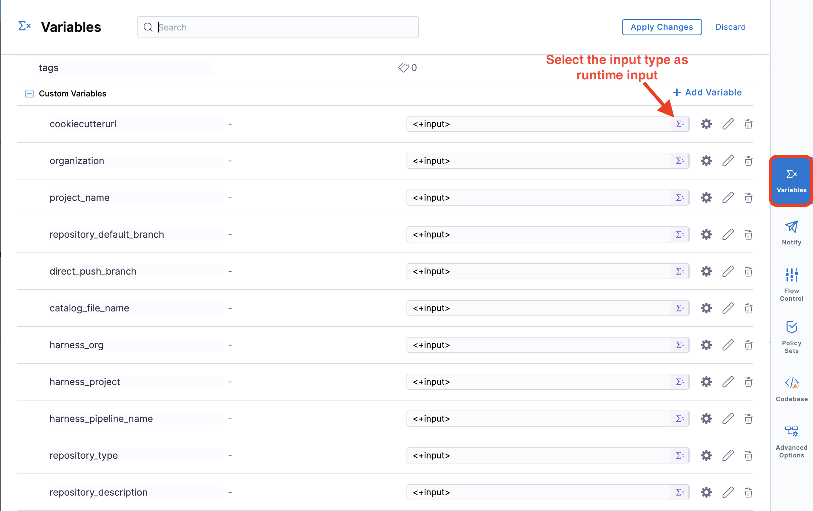
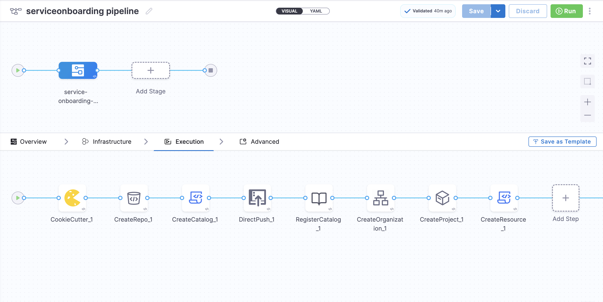

<DocsTag  backgroundColor= "#cbe2f9" text="Tutorial"  textColor="#0b5cad"  />

This tutorial is designed to help a platform engineer to get started with Harness IDP. We will create a basic service onboarding pipeline that uses a software template and provisions an application templated by cookiecutter for a developer. After you create the software template, developers can choose the template on the **Workflow** page and enter details such as a name for the application and the path to their Git repository. The service onboarding pipeline creates a new repository and adds a `catalog-info.yaml` to it and registers it back into your software catalog all using the new **Developer Portal** stage. 

Users (developers) must perform a sequence of tasks to create the application. First, they interact with a software template. A software template is a form that collects a user's requirements. After a user submits the form, IDP executes a Harness pipeline that onboard the new service. Usually the pipeline fetches a cookiecutter template code, creates a new repository, and interacts with third-party providers such as cloud providers, Jira, and Slack.

## Prerequisites

Before you begin this tutorial, make sure that you have completed the following requirements:

- Enable Harness IDP for your account.
- Make sure you are assigned the [IDP Admin Role](https://developer.harness.io/docs/internal-developer-portal/rbac/resources-roles#1-idp-admin) or another role that has full access to all IDP resources. 
- Create a **GitHub** connector named `democonnector` at the **account scope**. This connector should be configured for a GitHub organization (personal accounts are currently not supported by this tutorial). 
- [Create a new text secret](https://developer.harness.io/docs/platform/secrets/add-use-text-secrets/#add-a-text-secret) under the **account scope** and add the [Harness PAT](https://developer.harness.io/docs/platform/automation/api/add-and-manage-api-keys/#create-personal-api-keys-and-tokens) as the **Secret Value** also add the **Secret Name** as `harness-x-api-key`


## Create a Pipeline

Begin by creating a pipeline for onboarding the service.

To create a **Developer Portal** stage, perform the following steps:

1. Go to **Admin** section under IDP, select **Projects**, and then select a project.

You can also create a new project for the service onboarding pipelines. Eventually, all the users in your account should have permissions to execute the pipelines in this project. For information about creating a project, go to [Create organizations and projects](/docs/platform/organizations-and-projects/create-an-organization/).


2. Then select **Create a Pipeline**, add a name for the pipeline and select the type as **Inline**


3. Define the pipeline via Pipeline YAML or via the Pipeline UI

import Tabs from '@theme/Tabs';
import TabItem from '@theme/TabItem';

<Tabs queryString="self-service-onboarding-pipeline">
<TabItem value="pipeline-yaml" label="Pipeline YAML">

The YAML below defines an IDP Stage with a number of steps ([as described here](https://developer.harness.io/docs/internal-developer-portal/flows/idp-stage/#execution-steps)) that will perform the actions to onboard the new service. Copy the YAML below, then in the Harness Pipeline Studio go to the YAML view and paste it, just replace the `projectIdentifier` and `orgIdentifier` with the org and project you're creating the pipeline on. 

:::info

You need to have completed all the steps under **[Prerequisites](#prerequisites)** for the below given YAML to work properly. 

If your GitHub connector is not named `democonnector` or is not at the account level, please update all `connectorRef: account.democonnector` instances to refer to your connector.

If you're not using GitHub, please update the `Create Repo`, `Push Code into Repo` and `Register Component in Catalog` steps with the correct SCM type. 

:::

```YAML
pipeline:
  name: service onboarding pipeline
  identifier: service_onboarding_pipeline
  projectIdentifier: REPLACE_WITH_THE_PROJECT_ID_FROM_URL
  orgIdentifier: REPLACE_WITH_THE_ORG_ID_FROM_URL
  tags: {}
  stages:
    - stage:
        name: service-onboarding-step
        identifier: serviceonboardingstep
        description: ""
        type: IDP
        spec:
          platform:
            os: Linux
            arch: Amd64
          runtime:
            type: Cloud
            spec: {}
          execution:
            steps:
              - step:
                  type: CookieCutter
                  name: CookieCutter
                  identifier: CookieCutter_1
                  spec:
                    templateType: public
                    publicTemplateUrl: <+pipeline.variables.cookiecutterurl>
                    cookieCutterVariables:
                      app_name: <+pipeline.variables.project_name>
              - step:
                  type: CreateRepo
                  name: Create Repo
                  identifier: CreateRepo_1
                  spec:
                    connectorType: Github
                    connectorRef: account.democonnector
                    organization: <+pipeline.variables.organization>
                    repository: <+pipeline.variables.project_name>
                    repoType: <+pipeline.variables.repository_type>
                    defaultBranch: <+pipeline.variables.repository_default_branch>
                    personalAccount: false
              - step:
                  type: CreateCatalog
                  name: Create Component YAML
                  identifier: CreateCatalog_1
                  spec:
                    fileName: <+pipeline.variables.catalog_file_name>
                    filePath: <+pipeline.variables.project_name>
                    fileContent: |-
                      apiVersion: backstage.io/v1alpha1
                      kind: Component
                      metadata:
                        name: <+pipeline.vars.project_name>
                        description: <+pipeline.variables.repository_description>
                        annotations:
                          backstage.io/techdocs-ref: dir:.
                      spec:
                        type: service
                        owner: <+pipeline.variable.owner>
                        lifecycle: experimental
              - step:
                  type: DirectPush
                  name: Push Code into Repo
                  identifier: DirectPush_1
                  spec:
                    connectorType: Github
                    forcePush: true
                    connectorRef: account.democonnector
                    organization: <+pipeline.variables.organization>
                    repository: <+pipeline.variables.project_name>
                    codeDirectory: <+pipeline.variables.project_name>
                    branch: <+pipeline.variables.repository_default_branch>
              - step:
                  type: RegisterCatalog
                  name: Register Component in Catalog
                  identifier: RegisterCatalog_1
                  spec:
                    connectorType: Github
                    connectorRef: account.democonnector
                    organization: <+pipeline.variables.organization>
                    repository: <+pipeline.variables.project_name>
                    filePath: <+pipeline.variables.catalog_file_name>
                    branch: <+pipeline.variables.direct_push_branch>
              - step:
                  type: CreateOrganization
                  name: Create Organization
                  identifier: CreateOrganization_1
                  spec:
                    orgName: <+pipeline.variables.harness_org>
                    xApiKey: account.harness-x-api-key
              - step:
                  type: CreateProject
                  name: Create Project
                  identifier: CreateProject_1
                  spec:
                    projectName: <+pipeline.variables.project_name>
                    orgIdentifier: <+pipeline.stages.serviceonboardingstep.spec.execution.steps.CreateOrganization_1.output.outputVariables.orgIdentifier>
                    xApiKey: account.harness-x-api-key
                    orgType: prevStepOrg
              - step:
                  type: CreateResource
                  name: Create Pipeline
                  identifier: CreateResource_1
                  spec:
                    resourceDefinition: |-
                      resource "harness_platform_pipeline" "example" {
                        identifier = "<+pipeline.variables.harness_pipeline_name>"
                        org_id     = "<+pipeline.stages.serviceonboardingstep.spec.execution.steps.CreateOrganization_1.output.outputVariables.orgIdentifier>"
                        project_id = "<+pipeline.stages.serviceonboardingstep.spec.execution.steps.CreateProject_1.output.outputVariables.projectIdentifier>"
                        name       = "<+pipeline.variables.harness_pipeline_name>"
                        yaml = <<-EOT
                            pipeline:
                                name: <+pipeline.variables.harness_pipeline_name>
                                identifier: <+pipeline.variables.harness_pipeline_name>
                                allowStageExecutions: false
                                projectIdentifier: <+pipeline.stages.serviceonboardingstep.spec.execution.steps.CreateProject_1.output.outputVariables.projectIdentifier>
                                orgIdentifier: <+pipeline.stages.serviceonboardingstep.spec.execution.steps.CreateOrganization_1.output.outputVariables.orgIdentifier>
                                tags: {}
                                stages:
                                    - stage:
                                        name: dep
                                        identifier: dep
                                        description: ""
                                        type: Deployment
                                        spec:
                                            serviceConfig:
                                                serviceRef: service
                                                serviceDefinition:
                                                    type: Kubernetes
                                                    spec:
                                                        variables: []
                                            infrastructure:
                                                environmentRef: testenv
                                                infrastructureDefinition:
                                                    type: KubernetesDirect
                                                    spec:
                                                        connectorRef: idptest
                                                        namespace: default
                                                        releaseName: release-<+INFRA_KEY>
                                                allowSimultaneousDeployments: false
                                            execution:
                                                steps:
                                                    - stepGroup:
                                                            name: Canary Deployment
                                                            identifier: canaryDepoyment
                                                            steps:
                                                                - step:
                                                                    name: Canary Deployment
                                                                    identifier: canaryDeployment
                                                                    type: K8sCanaryDeploy
                                                                    timeout: 10m
                                                                    spec:
                                                                        instanceSelection:
                                                                            type: Count
                                                                            spec:
                                                                                count: 1
                                                                        skipDryRun: false
                                                                - step:
                                                                    name: Canary Delete
                                                                    identifier: canaryDelete
                                                                    type: K8sCanaryDelete
                                                                    timeout: 10m
                                                                    spec: {}
                                                            rollbackSteps:
                                                                - step:
                                                                    name: Canary Delete
                                                                    identifier: rollbackCanaryDelete
                                                                    type: K8sCanaryDelete
                                                                    timeout: 10m
                                                                    spec: {}
                                                    - stepGroup:
                                                            name: Primary Deployment
                                                            identifier: primaryDepoyment
                                                            steps:
                                                                - step:
                                                                    name: Rolling Deployment
                                                                    identifier: rollingDeployment
                                                                    type: K8sRollingDeploy
                                                                    timeout: 10m
                                                                    spec:
                                                                        skipDryRun: false
                                                            rollbackSteps:
                                                                - step:
                                                                    name: Rolling Rollback
                                                                    identifier: rollingRollback
                                                                    type: K8sRollingRollback
                                                                    timeout: 10m
                                                                    spec: {}
                                                rollbackSteps: []
                                        tags: {}
                                        failureStrategies:
                                            - onFailure:
                                                    errors:
                                                        - AllErrors
                                                    action:
                                                        type: StageRollback
                        EOT
                      }
                    xApiKey: account.harness-x-api-key
          cloneCodebase: false
        tags: {}
  variables:
    - name: project_name
      type: String
      description: ""
      required: true
      value: <+input>
    - name: cookiecutterurl
      type: String
      description: ""
      required: true
      value: <+input>
    - name: organization
      type: String
      description: ""
      required: true
      value: <+input>
    - name: repository_type
      type: String
      description: ""
      required: true
      value: <+input>
    - name: repository_description
      type: String
      description: ""
      required: false
      value: <+input>
    - name: repository_default_branch
      type: String
      description: ""
      required: true
      value: <+input>
    - name: direct_push_branch
      type: String
      description: ""
      required: true
      value: <+input>
    - name: catalog_file_name
      type: String
      description: ""
      required: true
      value: <+input>
    - name: harness_org
      type: String
      description: ""
      required: true
      value: <+input>
    - name: harness_project
      type: String
      description: ""
      required: true
      value: <+input>
    - name: harness_pipeline_name
      type: String
      description: ""
      required: true
      value: <+input>

```

</TabItem>
<TabItem value="pipeline-ui" label="Pipeline UI">

  <iframe 
    src="https://app.tango.us/app/embed/6897dd40-9c14-45b4-820e-c2867caea7e1" 
    title="Service Onboarding Pipeline" 
    style={{minHeight:'640px'}}
    width="100%" 
    height="100%" 
    referrerpolicy="strict-origin-when-cross-origin" 
    frameborder="0" 
    webkitallowfullscreen="webkitallowfullscreen" 
    mozallowfullscreen="mozallowfullscreen" 
    allowfullscreen="allowfullscreen"></iframe>

The instruction guide above shows how to create and configure variables in steps 16-27. Make sure to create all the variables listed below:

- project_name
- organization
- cookiecutterurl
- repository_type
- repository_description
- repository_default_branch
- direct_push_branch
- harness_org
- harness_project
- harness_pipeline_name
- catalog_file_name
- owner



</TabItem>


</Tabs>


4. Now Save the pipeline. 




:::info

Software Templates currently support pipelines that are composed only of [IDP Stage](https://developer.harness.io/docs/internal-developer-portal/flows/idp-stage), [Custom Stage](https://developer.harness.io/docs/platform/pipelines/add-a-stage/#add-a-custom-stage) and [CI Stage with Run Step](https://developer.harness.io/docs/continuous-integration/use-ci/run-step-settings/#add-the-run-step) with codebase disabled. Additionally, all inputs, except for [pipeline input as variables](https://developer.harness.io/docs/platform/variables-and-expressions/harness-variables/#pipeline-expressions), must be of [fixed value](https://developer.harness.io/docs/platform/variables-and-expressions/runtime-inputs/#fixed-values).


:::

## Create a Software Template

Now let's create the UI counterpart in IDP. This is powered by the [Backstage Software Template](https://backstage.io/docs/features/software-templates/writing-templates). Create a `template.yaml` file anywhere in your Git repository. Usually, that would be the same place as your cookiecutter template. Harness IDP uses the [react-jsonschema-form playground](https://rjsf-team.github.io/react-jsonschema-form/) to build the template. [Nunjucks](https://mozilla.github.io/nunjucks/) is templating engine for the IDP templates.

[Source](https://github.com/harness-community/idp-samples/blob/main/template-self-service-flow-with-pipeline-provisioning.yaml)

```YAML
apiVersion: scaffolder.backstage.io/v1beta3
kind: Template
metadata:
  name: new-service
  title: Create a new service
  description: A template to create a new service
  tags:
    - nextjs
    - react
    - javascript
spec:
  owner: owner@company.com
  type: service
  parameters:
    - title: Service Details
      required:
        - project_name
        - organization_name
        - public_template_url
        - repository_type
        - repository_description
        - repository_default_branch
        - direct_push_branch
        - harness_org
        - harness_project
        - harness_pipeline_name
        - catalog_file_name
      properties:
        public_template_url:
          title: Public Cookiecutter Template URL
          type: string
          default: https://github.com/devesh-harness/test-cookicutter
          description: URL to a Cookiecutter template. For the tutorial you can use the default input     
        organization_name:
          title: Git Organization
          type: string
          description: Name of your organization in Git      
        project_name:
          title: Name of your service
          type: string
          description: Your repo will be created with this name
        repository_type:
          type: string
          title: Repository Type
          enum:
            - public
            - private
          default: public
        repository_description:
          type: string
          title: Add a description to your repo
        repository_default_branch:
          title: Name of your Default Branch
          type: string
          default: main 
        direct_push_branch:
          title: Name of your Develop branch
          type: string
          default: develop  
        catalog_file_name:
          title: Give a name to your catalog file
          type: string
          default: catalog-info.yaml
        harness_org:
          title: Add the name of the new org you want to create to add your project to
          type: string
          description: Add the name of the new org you want to create to add your project to
        harness_project:
          title: Add the name of the new project where you want to create your pipeline
          type: string 
          description: Add the name of the new org you want to create to add your project to
        harness_pipeline_name:
          title: Add the name of the new the pipeline
          type: string 
          description: make sure you dont add any space in between the pipeline name 
        service_owner:
          title: Choose an Owner for the Service
          type: string
          ui:field: OwnerPicker
          ui:options:
            allowedKinds:
              - Group
        # This field is hidden but needed to authenticate the request to trigger the pipeline
        token:
          title: Harness Token
          type: string
          ui:widget: password
          ui:field: HarnessAuthToken
  steps:
    - id: trigger
      name: Bootstrapping your new service
      action: trigger:harness-custom-pipeline
      input:
        url: "YOUR PIPELINE URL HERE"
        inputset:
          organization: ${{ parameters.organization_name }}
          project_name: ${{ parameters.project_name }}
          cookiecutterurl: ${{ parameters.public_template_url }}
          repository_type: ${{ parameters.repository_type }}
          repository_description: ${{ parameters.repository_description }}
          repository_default_branch: ${{ parameters.repository_default_branch }}
          direct_push_branch: ${{ parameters.direct_push_branch }}
          catalog_file_name: ${{ parameters.catalog_file_name }}
          harness_org: ${{ parameters.harness_org }} 
          harness_project: ${{ parameters.harness_project }}
          harness_pipeline_name: ${{ parameters.harness_pipeline_name }}
          owner: ${{ parameters.service_owner }}
        apikey: ${{ parameters.token }}

  output:
    links:
      - title: Pipeline Details
        url: ${{ steps.trigger.output.PipelineUrl }}
```

Replace the `YOUR PIPELINE URL HERE` with the pipeline URL that you created.


This YAML code is governed by Backstage. You can change the name and description of the software template. The template has the following parts:

1. Input from the user
2. Execution of pipeline


Let's take a look at the inputs that the template expects from a developer. The inputs are written in the `spec.parameters` field. It has two parts, but you can combine them. The keys in `properties` are the unique IDs of fields (for example, `github_repo` and `project_name`). If you recall, they are the pipeline variables that we set as runtime inputs earlier. This is what we want the developer to enter when creating their new application.

The YAML definition includes fields such as cloud provider and database choice. They are for demonstration purposes only and are not used in this tutorial.

### Authenticating the Request to the Pipeline

The Software Template contains a single action which is designed to trigger the pipeline you created via an API call. Since the API call requires authentication, Harness has created a custom component to authenticate based of the logged-in user's credentials.

The following YAML snippet under `spec.parameters.properties` automatically creates a token field without exposing it to the end user.

```yaml
token:
  title: Harness Token
  type: string
  ui:widget: password
  ui:field: HarnessAuthToken
```

:::info

The `token` property we use to fetch **Harness Auth Token** is hidden on the Review Step using `ui:widget: password`, but for this to work the token property needs to be mentioned under the first `page` in-case you have multiple pages.

```
# example workflow.yaml
...
parameters:
  - title: <PAGE-1 TITLE>
    properties:
      property-1:
        title: title-1
        type: string
      property-2:
        title: title-2
    token:
      title: Harness Token
      type: string
      ui:widget: password
      ui:field: HarnessAuthToken
  - title: <PAGE-2 TITLE>
    properties:
      property-1:
        title: title-1
        type: string
      property-2:
        title: title-2
  - title: <PAGE-n TITLE>  
...
```
:::

That token is then used as part of `steps` as `apikey`

```yaml
  steps:
    - id: trigger
      name: ...
      action: trigger:harness-custom-pipeline
      input:
        url: ...
        inputset:
          key: value
          ...
        apikey: ${{ parameters.token }}
```

### Register the Template in IDP

Use the URL to the `template.yaml` created above and register it by using the same process for [registering a new software component](/docs/internal-developer-portal/get-started/register-a-new-software-component).

## Use the Software Template via Self Service Workflows

Now navigate to the **Workflows** page in IDP. You will see the newly created template appear. Click on **Choose**, fill in the form, click **Next Step**, then **Create** to trigger the automated pipeline. Once complete, you should be able to see the new repo created and bootstrapped in your target GitHub organization!

## Additional Information

### Conditional Inputs in Workflows
1. One Of: Helps you create a dropdown in the Workflow, where only one of all the options available could be selected. 

```YAML
dependencies:
  technology:
    oneOf:
      - properties:
          technology:
            enum:
              - java
          java version:
            type: "string"
            enum:
              - java8
              - java11
```
2. All Of: Helps you create a dropdown in the Workflow, where only all the options available could be selected.

```YAML
type: object
allOf:
- properties:
    lorem:
      type:
      - string
      - boolean
      default: true
- properties:
    lorem:
      type: boolean
    ipsum:
      type: string
```
3. Any Of: Helps you to select from multiple properties where both can't be selected together at once. 

```YAML
type: object
properties:
  age:
    type: integer
    title: Age
  items:
    type: array
    items:
      type: object
      anyOf:
      - properties:
          foo:
            type: string
      - properties:
          bar:
            type: string
anyOf:
- title: First method of identification
  properties:
    firstName:
      type: string
      title: First name
      default: Chuck
    lastName:
      type: string
      title: Last name
- title: Second method of identification
  properties:
    idCode:
      type: string
      title: ID code
```

For more such references and validate your conditional steps take a look at the [react-json schema project](https://rjsf-team.github.io/react-jsonschema-form/). 

### Upload a File in a Workflow

There are 3 types of file upload. 

1. Single File
2. Multiple Files
3. Single File with Accept Attribute 

```YAML
#Example
title: Files
type: object
properties:
  file:
    type: string
    format: data-url
    title: Single file
  files:
    type: array
    title: Multiple files
    items:
      type: string
      format: data-url
  filesAccept:
    type: string
    format: data-url
    title: Single File with Accept attribute
```

### Pass an Array of Inputs to a Harness Pipeline 

Harness Pipelines variables can only be 3 types, string, number and secrets, in case you want to add multiple strings and comma separated values you need to [join](https://mozilla.github.io/nunjucks/templating.html#join) them and send as single input parameters. 

In the following template I want to pick the enum and parse the `exampleVar` as a string and use it as comma separated value in the inputset for pipeline. 
As you could see in the example below under `inputset`, `exampleVar` takes input as `${{ parameters.exampleVar.join(',') }}`. 

```YAML
    - title: Pass Variables Here      
      properties:
        exampleVar:
          title: Select an option
          type: array
          items:
            type: string
            enum:
              - Option1
              - Option2
              - Option3
          default: 
            - Option1
      ui:
        exampleVar:
          title: Select Options
          multi: true
  steps:
    - id: trigger
      name: Call a harness pipeline, and pass the variables from above
      action: trigger:harness-custom-pipeline
      input:
        url: 'https://app.harness.io/ng/account/*********/home/orgs/default/projects/*************/pipelines/*************/pipeline-studio/?storeType=INLINE'
        inputset:
          exampleVar: ${{ parameters.exampleVar.join(',') }}
          owner: ${{ parameters.owner }}
        apikey: ${{ parameters.token }}
```

### Unregister/Delete Workflow

1. Navigate to the **Catalog** page, and select **Template** under Kind.


2. Select the Workflow Name you want to Unregister.
3. Now on the Workflow overview page, click on the 3 dots on top right corner and select **Unregister Entity**.


4. Now on the Dialog box select **Unregister Location**.


5. This will delete the Workflow.