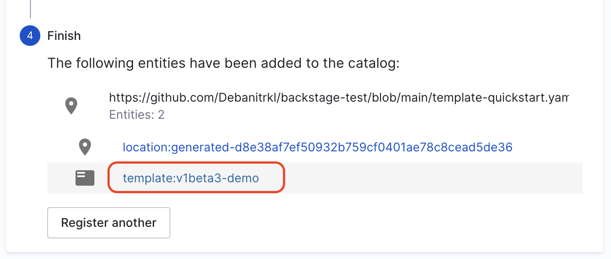
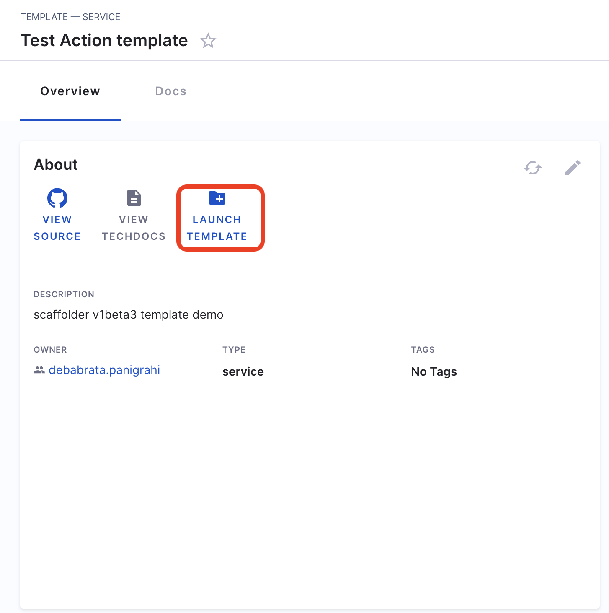
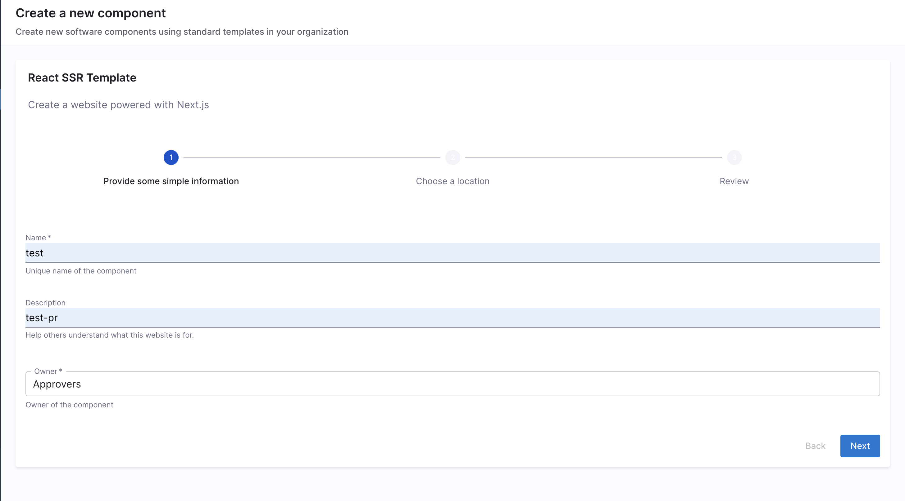
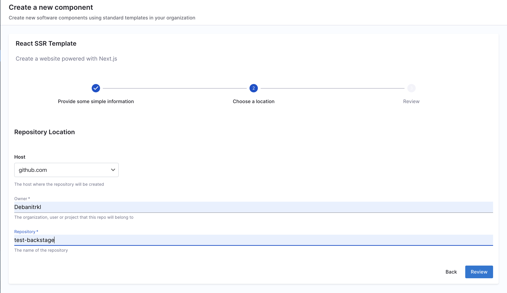
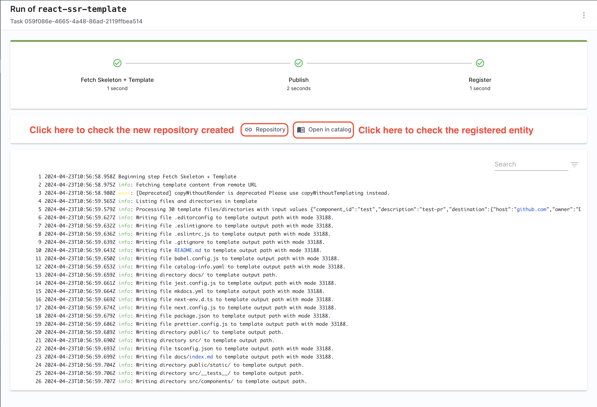

<DocsTag  backgroundColor= "#cbe2f9" text="Tutorial"  textColor="#0b5cad"  />

## Goal

This tutorial will help you create an IDP Self Service Workflow which automates GitHub Repo Onboarding for users. This is also an example to demonstrate that you can build IDP Flows by using Backstage Scaffolder actions and without using Harness pipelines. This however, is not our recommended approach as we recommend using a Harness pipeline to leverage features like Access Control and Governence.

## Pre-requisite

### Add Connector

1. Go to **Admin -> Git Integrations**.
2. Add a **New Git Integration** with type as **GitHub**.
3. Now Select the GitHub **Connector** and **Save Changes**, [follow the steps to add a new connector](https://developer.harness.io/docs/internal-developer-portal/get-started/setup-git-integration#connector-setup) 

:::info

Make sure the Connector URL used here is pointed towards the org where you want to create the new repo and the token used have write permission for the repo also **Enable the API** while creating connector.

:::

## Create Template

**If you want to use our sample workflow you can skip this step and go to "Register Template in IDP" step***

The template is defined in a YAML file named `template.yaml`. The [syntax](https://developer.harness.io/docs/internal-developer-portal/flows/service-onboarding-pipelines#how-to-write-idp-templates) of the template definition is owned by [backstage.io](https://backstage.io/docs/features/software-templates/writing-templates) while the workflow runs on a Harness pipeline of your choice.


```YAML
apiVersion: scaffolder.backstage.io/v1beta3
kind: Template
metadata:
  name: react-ssr-template
  title: React SSR Template
  description: Create a website powered with Next.js
  tags:
    - recommended
    - react
spec:
  owner: web@example.com
  type: website
  parameters:
    - title: Provide some simple information
      required:
        - component_id
        - owner
      properties:
        component_id:
          title: Name
          type: string
          description: Unique name of the component
          ui:field: EntityNamePicker
        description:
          title: Description
          type: string
          description: Help others understand what this website is for.
        owner:
          title: Owner
          type: string
          description: Owner of the component
          ui:field: OwnerPicker
          ui:options:
            allowedKinds:
              - Group
    - title: Choose a location
      required:
        - repoUrl
      properties:
        repoUrl:
          title: Repository Location
          type: string
          ui:field: RepoUrlPicker
          ui:options:
            allowedHosts:
              - github.com
  steps:
    - id: template
      name: Fetch Skeleton + Template
      action: fetch:template
      input:
        url: ./skeleton
        copyWithoutRender:
          - .github/workflows/*
        values:
          component_id: ${{ parameters.component_id }}
          description: ${{ parameters.description }}
          destination: ${{ parameters.repoUrl | parseRepoUrl }}
          owner: ${{ parameters.owner }}

    - id: publish
      name: Publish
      action: publish:github
      input:
        allowedHosts: ["github.com"]
        description: This is ${{ parameters.component_id }}
        repoUrl: ${{ parameters.repoUrl }}

    - id: register
      name: Register
      action: catalog:register
      input:
        repoContentsUrl: ${{ steps.publish.output.repoContentsUrl }}
        catalogInfoPath: "/catalog-info.yaml"

  output:
    links:
      - title: Repository
        url: ${{ steps.publish.output.remoteUrl }}
      - title: Open in catalog
        icon: catalog
        entityRef: ${{ steps.register.output.entityRef }}
```

In the above template we have used the [GitHub based Custom Actions](https://www.npmjs.com/package/@backstage/plugin-scaffolder-backend-module-github), `fetch:template` and `publish:github`. 

1. Copy the above template file in your git provider, and save it as `template.yaml`. 

## Register Template in IDP

2. In the left navigation, select **Create**, and then select **Register Software Component**.


3. Enter the URL to your new `template.yaml`. You can as well try to register this [already available template](https://github.com/backstage/software-templates/blob/main/scaffolder-templates/react-ssr-template/template.yaml). 


4. Select **Import**.


5. Now click on the template name



## Use Workflows to Create a Repo

6. Once you're on the entity page for template, **Launch the Template**.



7. Now fill the fields as displayed in the image below
  - Name: Name of the component that will be registered in the IDP 
  - Description: Describe the usage of the component
  - Owner (Dropdown): Select an user group as the owner of the component being created.
  - Owner: The GitHub org under which you want to create the new repository. The org is usually picked from the URL used in tge **Connector**. 
  - Repository: Give a name to the newly created repository. 





8. Now Trigger the flow, it will create a repository and register it back in your software catalog. 



## Delete the Template

If you want to unregister or delete the template follow the steps mentioned [here](https://developer.harness.io/docs/internal-developer-portal/flows/service-onboarding-pipelines#deleteunregister-template). 

## Further Reading

Self Service Onboarding in IDP is powered by scaffolder templates and Harness Pipeline([IDP Stage](https://developer.harness.io/docs/internal-developer-portal/flows/idp-stage)) . Follow the tutorials to learn more about it. 

1. [Create a service onboarding pipeline (using IDP Stage)](https://developer.harness.io/docs/internal-developer-portal/flows/create-a-new-service-using-idp-stage)

2. [Getting started with service onboarding pipeline (using Custom Stage)](https://developer.harness.io/docs/internal-developer-portal/flows/create-a-service)

3. [Use Harness IDP for self serviced Harness CI/CD onboarding](https://developer.harness.io/docs/internal-developer-portal/flows/self-service-onboarding-pipeline-tutorial)
