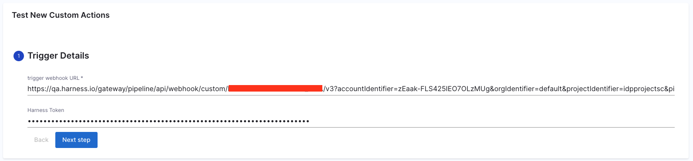
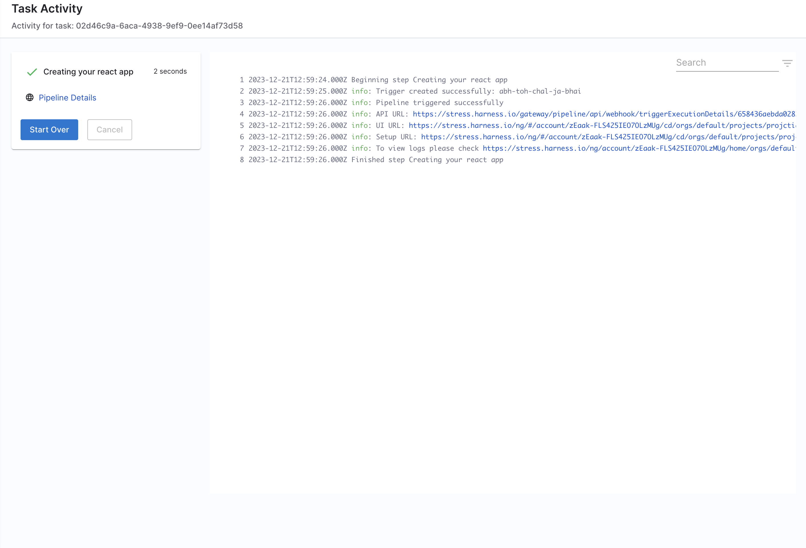

## Introduction

The Flows comes with several built-in actions for fetching content, registering in the catalog and of course actions for creating and publishing a git repository.

There are several repository providers supported out of the box such as **GitHub**, **Azure**, **GitLab** and **Bitbucket**.


## How To View Supported Actions

A list of all registered custom actions can be found under 

`Workflows/Create/Self Service` -> `Installed Actions`


## Harness Specific Custom Actions

### 1. `trigger:harness-custom-pipeline`

This custom action requires **pipeline variables**(`<+pipeline.variables.VARIABLE_IDENTIFIER>`) as input along with the pipeline url, and then trigger the pipeline based in the inputset obtained from the user. 

```YAML
...
## Example
steps:
  - id: trigger
      name: Creating your react app
      action: trigger:harness-custom-pipeline
      input:
      url: "https://app.harness.io/ng/account/vpCkHKsDSxK9_KYfjCTMKA/home/orgs/default/projects/communityeng/pipelines/IDP_New_NextJS_app/pipeline-studio/?storeType=INLINE"
      inputset:
          project_name: ${{ parameters.project_name }}
          github_repo: ${{ parameters.github_repo }}
          cloud_provider: ${{ parameters.provider }}
          db: ${{ parameters.db }}
          cache: ${{ parameters.cache }}
      apikey: ${{ parameters.token }}
      showOutputVariables: true
output:
  text:
    - title: Output Variable
      content: |
        Output Variable **test2** is `${{ steps.trigger.output.test2 }}` 
    - title: Another Output Variable
      content: |
        Output Variable **test1** with fqnPath is `${{ steps.trigger.output['pipeline.stages.testci.spec.execution.steps.Run_1.output.outputVariables.test1'] }}`      
...
```

:::info 

In the above example the `apikey` parameter takes input from Harness Token which is specified under spec as a mandatory paramenter as mentioned below

```YAML
...
token:
    title: Harness Token
    type: string
    ui:widget: password
    ui:field: HarnessAuthToken
    ...

```
Without the above parameter input the pipeline won't be executed. Please [take a look at this example](https://github.com/Debanitrkl/backstage-test/blob/0d4dbb877d683ad8764a4a89e636bcf99d16eb32/template.yaml#L58C1-L62C37) 

:::

#### Output

1. `Title` : Name of the Pipeline. 
2.  `url` : Execution URL of the Pipeline eg: `https://app.harness.io/ng/account/********************/module/idp-admin/orgs/default/projects/communityeng/pipelines/uniteddemo/executions/**********/pipeline?storeType=INLINE`

Once you create the workflow with this custom action, you can see the pipeline URL running in the background and executing the flow. 


3. You can as well configure the output to display the pipeline [output variables](https://developer.harness.io/docs/platform/variables-and-expressions/harness-variables/#input-and-output-variables), by setting the `showOutputVariables: true` under `inputs`and adding `output` as shown in the example below:

```YAML
...
output:
  text:
    - title: Output Variable
      content: |
        Output Variable **test2** is `${{ steps.trigger.output.test2 }}` 
    - title: Another Output Variable
      content: |
        Output Variable **test1** with fqnPath is `${{ steps.trigger.output['pipeline.stages.testci.spec.execution.steps.Run_1.output.outputVariables.test1'] }}` 
...
```

:::info

Only **user defined output variables** are allowed, but you can as well use the system generated variables by assigning them as a new variable under shell script step as displayed below. For eg. we have mentioned the system generated output as `jira_id` and under **Optional Configuration** added a **test-var** which becomes a user defined output variable and could be displayed as output in the IDP workflows.


:::

There are two ways in which you can add the output variable to the template syntax. 

1. You can directly mention the output variable name `${{ steps.trigger.output.test2 }}`, here `test2` is the output variable name we created in the pipeline. 

2. You can copy the JEXL expression of the output variable and remove the JEXL constructs, `${{ steps.trigger.output['pipeline.stages.testci.spec.execution.steps.Run_1.output.outputVariables.test1'] }}`, here the part `pipeline.stages.testci.spec.execution.steps.Run_1.output.outputVariables.test1` comes from `<+pipeline.stages.testci.spec.execution.steps.Run_1.output.outputVariables.test2>` copied from execution logs. 


### 2. `trigger:trigger-pipeline-with-webhook`

This custom action could be used to trigger a pipeline execution based on the [webhook url](https://developer.harness.io/docs/platform/triggers/trigger-deployments-using-custom-triggers/#trigger-a-deployment-using-the-curl-command-for-a-custom-trigger) input for [custom triggers](https://developer.harness.io/docs/platform/triggers/trigger-deployments-using-custom-triggers/#create-the-custom-trigger). 




```YAML
## Example
...
steps:
- id: trigger
    name: Creating your react app
    action: trigger:trigger-pipeline-with-webhook
    input:
    triggerWebhookurl: ${{ parameters.triggerWebhookurl }}
    x_api_key: ${{ parameters.x_api_key }}
...

```

In the above example API key is an optional parameter, and is required in case of **Mandate Authorization for Custom Webhook Triggers** is set to **true** for **Pipeline** under **Default Settings** in **Account Settings**.  

Here's an [example template](https://github.com/Debanitrkl/backstage-test/blob/main/temp-new-trigger.yaml) using the above mentioned custom action.

#### Output

1. `Title` : Name of the Pipeline. 
2.  `url` : Execution URL of the Pipeline eg: `https://app.harness.io/ng/account/********************/module/idp-admin/orgs/default/projects/communityeng/pipelines/uniteddemo/executions/**********/pipeline?storeType=INLINE`

Once you create the workflow with this custom action, you can see the pipeline URL running in the background and executing the flow. 




### 3. `harness:create-secret`

### 4. `harness:delete-secret`


### Custom Actions Usage Limitations

| **Custom Action**                      | **Pipelines and Stages**    |
|----------------------------------------|-----------------------------|
| trigger:harness-custom-pipeline        | Supports only [custom stage](https://developer.harness.io/docs/platform/pipelines/add-a-stage/#add-a-custom-stage) and codebase disabled [CI stage with Run step](https://developer.harness.io/docs/continuous-integration/use-ci/run-step-settings) |
| trigger:trigger-pipeline-with-webhook  | Supports all the pipelines with a custom webhook based trigger          | 

