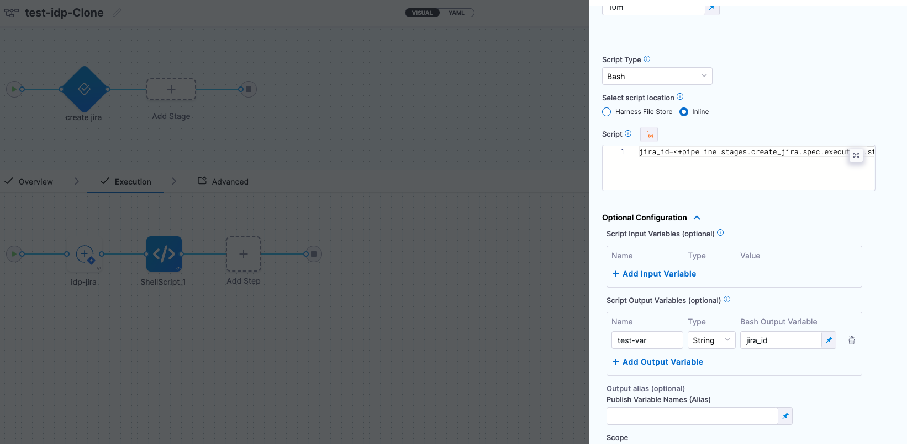

## Introduction

The Workflows comes with several built-in actions for fetching content, registering in the catalog and of course actions for creating and publishing a git repository.

There are several repository providers supported out of the box such as **GitHub**, **Azure**, **GitLab** and **Bitbucket**.


## How To View Supported Actions

A list of all registered custom actions can be found under 

`Workflows/Create/Self Service` -> `Installed Actions`


## Harness Specific Custom Actions

### 1. `trigger:harness-custom-pipeline`

:::info

This action currently supports only [IDP Stage](https://developer.harness.io/docs/internal-developer-portal/flows/idp-stage) along with the [custom stage](https://developer.harness.io/docs/platform/pipelines/add-a-stage/#add-a-custom-stage)(**Available with Harness CD License or Free Tier usage**) and [codebase disabled](/docs/continuous-integration/use-ci/codebase-configuration/create-and-configure-a-codebase.md#disable-clone-codebase-for-specific-stages) **CI stage(Only Available with Harness CI License)** with [Run step](https://developer.harness.io/docs/continuous-integration/use-ci/run-step-settings).

:::

This custom action requires **pipeline variables**(`<+pipeline.variables.VARIABLE_IDENTIFIER>`) as input along with the **pipeline url**(for pipelines using [Git Experience](https://developer.harness.io/docs/platform/git-experience/git-experience-overview) make sure your url includes `branch` and `repoName` eg, `https://app.harness.io/ng/account/accountID/module/idp/orgs/orgID/projects/projectID/pipelines/pipelineID?repoName=repo-name&branch=branch`), and then trigger the pipeline based in the `inputset` obtained from the user. 

```YAML
...
## Example
steps:
  - id: trigger
      name: Creating your react app
      action: trigger:harness-custom-pipeline
      input:
      url: "https://app.harness.io/ng/account/vpCkHKsDSxK9_KYfjCTMKA/home/orgs/default/projects/communityeng/pipelines/IDP_New_NextJS_app/pipeline-studio/?storeType=INLINE"
      inputset:
          project_name: ${{ parameters.project_name }}
          github_repo: ${{ parameters.github_repo }}
          cloud_provider: ${{ parameters.provider }}
          db: ${{ parameters.db }}
          cache: ${{ parameters.cache }}
      apikey: ${{ parameters.token }}
      showOutputVariables: true
output:
  text:
    - title: Output Variable
      content: |
        Output Variable **test2** is `${{ steps.trigger.output.test2 }}` 
    - title: Another Output Variable
      content: |
        Output Variable **test1** with fqnPath is `${{ steps.trigger.output['pipeline.stages.testci.spec.execution.steps.Run_1.output.outputVariables.test1'] }}`      
...
```

:::info 

In the above example the `apikey` parameter takes input from Harness Token which is specified under spec as a mandatory paramenter as mentioned below

```YAML
...
token:
    title: Harness Token
    type: string
    ui:widget: password
    ui:field: HarnessAuthToken
    ...

```
Without the above parameter input the pipeline won't be executed. [Take a look at this example](https://github.com/harness-community/idp-samples/blob/eb9988020d3917c0bca7daccb354ba670626221b/tutorial-self-service-flow-template.yaml#L64-L68) 

:::

The `token` property we use to fetch **Harness Auth Token** is hidden on the **Review Step** using `ui:widget: password`, but for this to work the token property needs to be mentioned under the first `page`  in-case you have multiple pages.

```
# example workflow.yaml
...
parameters:
  - title: <PAGE-1 TITLE>
    properties:
      property-1:
        title: title-1
        type: string
      property-2:
        title: title-2
    token:
      title: Harness Token
      type: string
      ui:widget: password
      ui:field: HarnessAuthToken
  - title: <PAGE-2 TITLE>
    properties:
      property-1:
        title: title-1
        type: string
      property-2:
        title: title-2
  - title: <PAGE-n TITLE>  
...
```

#### Output

1. `Title` : Name of the Pipeline. 
2.  `url` : Execution URL of the Pipeline eg: `https://app.harness.io/ng/account/********************/module/idp-admin/orgs/default/projects/communityeng/pipelines/uniteddemo/executions/**********/pipeline?storeType=INLINE`

Once you create the workflow with this custom action, you can see the pipeline URL running in the background and executing the flow. 


You can now optionally remove the pipeline url from the workflow execution logs, for this you need to use the boolean property `hidePipelineURLLog` and set the value as `true`.

```YAML
## Example
steps:
- id: trigger
    name: Creating your react app
    action: trigger:harness-custom-pipeline
    input:
    url: "Pipeline URL"
    hidePipelineURLLog: true
    inputset:
        project_name: ${{ parameters.project_name }}
    apikey: ${{ parameters.token }}
```

3. You can as well configure the output to display the pipeline [output variables](https://developer.harness.io/docs/platform/variables-and-expressions/harness-variables/#input-and-output-variables), by setting the `showOutputVariables: true` under `inputs`and adding `output` as shown in the example below:

```YAML
...
output:
  text:
    - title: Output Variable
      content: |
        Output Variable **test2** is `${{ steps.trigger.output.test2 }}` 
    - title: Another Output Variable
      content: |
        Output Variable **test1** with fqnPath is `${{ steps.trigger.output['pipeline.stages.testci.spec.execution.steps.Run_1.output.outputVariables.test1'] }}` 
...
```

:::info

Only **user defined output variables** are allowed, but you can as well use the system generated variables by assigning them as a new variable under shell script step as displayed below. For eg. we have mentioned the system generated output as `jira_id` and under **Optional Configuration** added a **test-var** which becomes a user defined output variable and could be displayed as output in the IDP workflows.



:::

There are two ways in which you can add the output variable to the template syntax. 

1. You can directly mention the output variable name `${{ steps.trigger.output.test2 }}`, here `test2` is the output variable name we created in the pipeline. 

2. You can copy the JEXL expression of the output variable and remove the JEXL constructs, `${{ steps.trigger.output['pipeline.stages.testci.spec.execution.steps.Run_1.output.outputVariables.test1'] }}`, here the part `pipeline.stages.testci.spec.execution.steps.Run_1.output.outputVariables.test1` comes from `<+pipeline.stages.testci.spec.execution.steps.Run_1.output.outputVariables.test2>` copied from execution logs. 


### 2. `trigger:trigger-pipeline-with-webhook`

This custom action could be used to trigger a pipeline execution based on the **input-set identifier** and a webhook name. Usually a single deployment pipeline has different input-set as per the environment it's going to be deployed and developers can just specify the input-set id aligning with the environment name to trigger the deployment pipeline. 


Developers need to mention the input set identifier instead of the name in the workflows input, usually identifier are names devoid of any special characters and spaces, eg, `input set-test` name would have an identifier as `inputsettest`. It is suggested to provide all the available input-set as `enums` in the template to avoid any ambiguity by developers.  

 

Here's an example workflow based on this workflows [template](https://github.com/harness-community/idp-samples/blob/main/workflows-ca-inputset.yaml). 


```YAML
## Example
...
steps:
  - id: trigger
    name: Creating your react app
    action: trigger:trigger-pipeline-with-webhook
    input:
      url: "YOUR PIPELINE URL"
      inputSetName: ${{ parameters.inputSetName }}
      triggerName: ${{ parameters.triggerName }}
      apikey: ${{ parameters.token }}
...

```

:::info 

In the above example the `apikey` parameter takes input from Harness Token which is specified under spec as a mandatory paramenter as mentioned below

```YAML
...
token:
    title: Harness Token
    type: string
    ui:widget: password
    ui:field: HarnessAuthToken
    ...

```
Without the above parameter input the pipeline won't be executed. [Take a look at this example](https://github.com/harness-community/idp-samples/blob/eb9988020d3917c0bca7daccb354ba670626221b/tutorial-self-service-flow-template.yaml#L64-L68) 

:::

#### Output

1. `API URL:` : The webhook URL used to execute the pipeline. 
2. `Pipeline Details` : Redirects you to the pipeline in Harness Pipeline Editor. 
3. `UI URL`: Lists all the recent executions of the pipeline. 

Once you create the workflow with this custom action, you can see the pipeline URL running in the background and executing the flow. 


### 3. `harness:create-secret`

### 4. `harness:delete-secret`


### Custom Actions Usage Limitations

| **Custom Action**                      | **Pipelines and Stages**    |
|----------------------------------------|-----------------------------|
| trigger:harness-custom-pipeline        | Supports only [custom stage](https://developer.harness.io/docs/platform/pipelines/add-a-stage/#add-a-custom-stage) and codebase disabled [CI stage with Run step](https://developer.harness.io/docs/continuous-integration/use-ci/run-step-settings) |
| trigger:trigger-pipeline-with-webhook  | Supports all the pipelines with a custom webhook based trigger          | 

