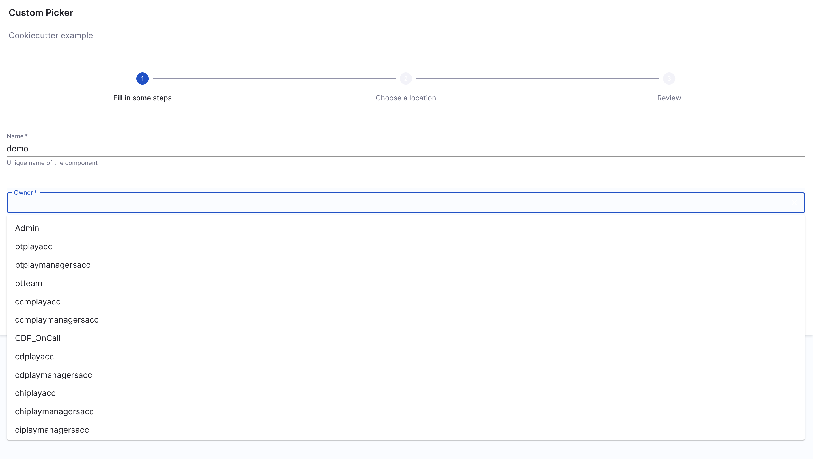

## Workflow UI Pickers

Collecting input from the user is a very large part of the scaffolding process and Software Templates as a whole. Sometimes the built in components and fields just aren't good enough, and sometimes you want to enrich the form that the users sees with better inputs that fit better.

This is where Workflow UI Pickers come in.

### The Repository Picker

In order to make working with repository providers easier, we've built a custom
picker that can be used by overriding the `ui:field` option in the `uiSchema`
for a `string` field. Instead of displaying a text input block it will render
our custom component that we've built which makes it easy to select a repository
provider, and insert a project or owner, and repository name.

You can see it in the above full example which is a separate step and it looks a
little like this:

```yaml
- title: Choose a location
  required:
    - repoUrl
  properties:
    repoUrl:
      title: Repository Location
      type: string
      ui:field: RepoUrlPicker
      ui:options:
        allowedHosts:
          - github.com
```

The `allowedHosts` part should be set to where you wish to enable this template
to publish to. And it can be any host that is listed in your `integrations`
config in `app-config.yaml`.

Besides specifying `allowedHosts` you can also restrict the template to publish to
repositories owned by specific users/groups/namespaces by setting the `allowedOwners`
option. With the `allowedRepos` option you are able to narrow it down further to a
specific set of repository names. A full example could look like this:

```yaml
- title: Choose a location
  required:
    - repoUrl
  properties:
    repoUrl:
      title: Repository Location
      type: string
      ui:field: RepoUrlPicker
      ui:options:
        allowedHosts:
          - github.com
        allowedOwners:
          - backstage
          - someGithubUser
        allowedRepos:
          - backstage
```

For a list of all possible `ui:options` input props for `RepoUrlPicker`, please visit [here](https://backstage.io/docs/features/software-templates/ui-options-examples/).


#### Using the Users `oauth` token

There's a little bit of extra magic that you get out of the box when using the
`RepoUrlPicker` as a field input. You can provide some additional options under
`ui:options` to allow the `RepoUrlPicker` to grab an `oauth` token for the user
for the required `repository`.

This is great for when you are wanting to create a new repository, or wanting to
perform operations on top of an existing repository.

A sample template that takes advantage of this is like so:

<details>
<summary>Example YAML</summary>

```yaml
apiVersion: scaffolder.backstage.io/v1beta3
kind: Template
metadata:
  name: v1beta3-demo
  title: Test Action template
  description: scaffolder v1beta3 template demo
spec:
  owner: backstage/techdocs-core
  type: service

  parameters:
    ...

    - title: Choose a location
      required:
        - repoUrl
      properties:
        repoUrl:
          title: Repository Location
          type: string
          ui:field: RepoUrlPicker
          ui:options:
            # Here's the option you can pass to the RepoUrlPicker
            requestUserCredentials:
              secretsKey: USER_OAUTH_TOKEN
              additionalScopes:
                github:
                  - workflow
            allowedHosts:
              - github.com
    ...

  steps:
    ...

    - id: publish
      name: Publish
      action: publish:github
      input:
        allowedHosts: ['github.com']
        description: This is ${{ parameters.name }}
        repoUrl: ${{ parameters.repoUrl }}
        # here's where the secret can be used
        token: ${{ secrets.USER_OAUTH_TOKEN }}

    ...
```
</details>

You will see from above that there is an additional `requestUserCredentials`
object that is passed to the `RepoUrlPicker`. This object defines what the
returned `secret` should be stored as when accessing using
`${{ secrets.secretName }}`, in this case it is `USER_OAUTH_TOKEN`. And then you
will see that there is an additional `input` field into the `publish:github`
action called `token`, in which you can use the `secret` like so:
`token: ${{ secrets.USER_OAUTH_TOKEN }}`.

There's also the ability to pass additional scopes when requesting the `oauth`
token from the user, which you can do on a per-provider basis, in case your
template can be published to multiple providers.

Note, that you will need to configure an **connector** for your source code management (SCM) service to make this feature work.


### OwnerPicker

`OwnerPicker` is used for developers to pick a User Group from the list of Groups that exist in the account.



#### `allowArbitraryValues`

Whether to allow arbitrary user input. Defaults to true.

`allowArbitraryValues` provides input validation when selecting an owner as the values you enter will correspond to a valid owner.

- Adding a valid owner with `allowArbitraryValues` as `false`

```yaml
owner:
  title: Owner
  type: string
  description: Owner of the component
  ui:field: OwnerPicker
  ui:options:
    allowArbitraryValues: false
```

- Adding an arbitrary owner with `allowArbitraryValues` as `true` (default value)

```yaml
owner:
  title: Owner
  type: string
  description: Owner of the component
  ui:field: OwnerPicker
  ui:options:
    allowArbitraryValues: true
```

#### `catalogFilter`

`catalogFilter` supports filtering options by any field(s) of an entity.

- Get all entities of kind `Group`

```yaml
owner:
  title: Owner
  type: string
  description: Owner of the component
  ui:field: OwnerPicker
  ui:options:
    catalogFilter:
      - kind: Group
```

- Get entities of kind `Group` and spec.type `team`

```yaml
owner:
  title: Owner
  type: string
  description: Owner of the component
  ui:field: OwnerPicker
  ui:options:
    catalogFilter:
      - kind: Group
        spec.type: team
```

#### `defaultNamespace`

The ID of a namespace that the owner belongs to. The default value is `default`.

- Listing owners in the `default` namespace (default value)

```yaml
owner:
  title: Owner
  type: string
  description: Owner of the component
  ui:field: OwnerPicker
  ui:options:
    catalogFilter:
      - kind: Group
    defaultNamespace: default
```

- Listing owners in the `payment` namespace

```yaml
owner:
  title: Owner
  type: string
  description: Owner of the component
  ui:field: OwnerPicker
  ui:options:
    catalogFilter:
      - kind: Group
    defaultNamespace: payment
```

### EntityPicker

:::info

Only **string** data `type` is supported for the EntityPicker.

:::

The input props that can be specified under `ui:options` for the `EntityPicker` field extension.

#### `allowArbitraryValues`

Whether to allow arbitrary user input. Defaults to true.

`allowArbitraryValues` provides input validation when selecting an entity as the values you enter will correspond to a valid entity.

- Adding a valid entity with `allowArbitraryValues` as `false`

```yaml
entity:
  title: Entity
  type: string
  description: Entity of the component
  ui:field: EntityPicker
  ui:options:
    allowArbitraryValues: false
```
- Adding an arbitrary entity with `allowArbitraryValues` as `true` (default value)

```yaml
entity:
  title: Entity
  type: string
  description: Entity of the component
  ui:field: EntityPicker
  ui:options:
    allowArbitraryValues: true
```

#### `catalogFilter`

`catalogFilter` supports filtering options by any field(s) of an entity.

- Get all entities of kind `Group`

```yaml
entity:
  title: Entity
  type: string
  description: Entity of the component
  ui:field: EntityPicker
  ui:options:
    catalogFilter:
      - kind: Group
```

- Get entities of kind `Group` and spec.type `team`

```yaml
entity:
  title: Entity
  type: string
  description: Entity of the component
  ui:field: EntityPicker
  ui:options:
    catalogFilter:
      - kind: Group
        spec.type: team
```

#### `defaultKind`

The default entity kind.

```yaml
system:
  title: System
  type: string
  description: System of the component
  ui:field: EntityPicker
  ui:options:
    catalogFilter:
      kind: System
    defaultKind: System
```

#### `defaultNamespace`

The ID of a namespace that the entity belongs to. The default value is `default`.

- Listing all entities in the `default` namespace (default value)

```yaml
entity:
  title: Entity
  type: string
  description: Entity of the component
  ui:field: EntityPicker
  ui:options:
    defaultNamespace: default
```

### `MultiEntityPicker`

The input props that can be specified under `ui:options` for the `MultiEntityPicker` field extension.

#### `allowArbitraryValues`

Whether to allow arbitrary user input. Defaults to true.

`allowArbitraryValues` provides input validation when selecting an entity as the values you enter will correspond to a valid entity.

- Adding a valid entity with `allowArbitraryValues` as `false`

```yaml
entity:
  title: Entities
  type: array
  description: Entities of the component
  ui:field: MultiEntityPicker
  ui:options:
    allowArbitraryValues: false
```

- Adding an arbitrary entity with `allowArbitraryValues` as `true` (default value)

```yaml
entity:
  title: Entities
  type: array
  description: Entities of the component
  ui:field: MultiEntityPicker
  ui:options:
    allowArbitraryValues: true
```

#### `catalogFilter`

`catalogFilter` supports filtering options by any field(s) of an entity.

- Get all entities of kind `Group`

```yaml
entity:
  title: Entities
  type: array
  description: Entities of the component
  ui:field: MultiEntityPicker
  ui:options:
    catalogFilter:
      - kind: Group
```

- Get entities of kind `Group` and spec.type `team`

```yaml
entity:
  title: Entities
  type: array
  description: Entities of the component
  ui:field: MultiEntityPicker
  ui:options:
    catalogFilter:
      - kind: Group
        spec.type: team
```

#### `defaultKind`

The default entity kind.

```yaml
system:
  title: System
  type: array
  description: Systems of the component
  ui:field: MultiEntityPicker
  ui:options:
    catalogFilter:
      kind: System
    defaultKind: System
```

#### `defaultNamespace`

The ID of a namespace that the entity belongs to. The default value is `default`.

- Listing all entities in the `default` namespace (default value)

```yaml
entity:
  title: Entity
  type: array
  description: Entities of the component
  ui:field: MultiEntityPicker
  ui:options:
    defaultNamespace: default
```

- Listing all entities in the `payment` namespace

```yaml
entity:
  title: Entity
  type: array
  description: Entities of the component
  ui:field: MultiEntityPicker
  ui:options:
    defaultNamespace: payment
```

## Harness Specific Custom Extensions

### 1. `EntityFieldPicker`


:::info

Only **string** data `type` is supported for the EntityPicker.

:::

The input props that can be specified under `ui:options` for the `EntityFieldPicker` field extension.

#### `displayField`

This is used to fetch the value from catalog dynamically, corresponding to the key mentioned.

```YAML
system:
    title: System
    type: string
    description: System of the component
    ui:field: EntityFieldPicker
    ui:displayField: spec.owner
    ui:options:
      catalogFilter:
          kind:
          - System
          - Component
          - Service
          - API
```

In the above example it will fetch all the owners for the software components `kind` mentioned under `catalogFilter`.

#### `allowArbitraryValues`

Whether to allow arbitrary user input. Defaults to true.

`allowArbitraryValues` provides input validation when selecting an entity as the values you enter will correspond to a valid entity.

- Adding a valid entity with `allowArbitraryValues` as `false`

```yaml
entity:
  title: Entity
  type: string
  description: Entity of the component
  ui:field: EntityFieldPicker
  ui:options:
    allowArbitraryValues: false
```

- Adding an arbitrary entity with `allowArbitraryValues` as `true` (default value)

```yaml
entity:
  title: Entity
  type: string
  description: Entity of the component
  ui:field: EntityFieldPicker
  ui:options:
    allowArbitraryValues: true
```

#### `catalogFilter`

`catalogFilter` supports filtering options by any field(s) of an entity.

- Get all entities of kind `Group`

```yaml
entity:
  title: Entity
  type: string
  description: Entity of the component
  ui:field: EntityFieldPicker
  ui:options:
    catalogFilter:
      - kind: Group
```

- Get entities of kind `Group` and spec.type `team`

```yaml
entity:
  title: Entity
  type: string
  description: Entity of the component
  ui:field: EntityFieldPicker
  ui:options:
    catalogFilter:
      - kind: Group
        spec.type: team
```

#### `defaultKind`

The default entity kind.

```yaml
system:
  title: System
  type: string
  description: System of the component
  ui:field: EntityFieldPicker
  ui:options:
    catalogFilter:
      kind: System
    defaultKind: System
```

#### `defaultNamespace`

The ID of a namespace that the entity belongs to. The default value is `default`.

- Listing all entities in the `default` namespace (default value)

```yaml
entity:
  title: Entity
  type: string
  description: Entity of the component
  ui:field: EntityFieldPicker
  ui:options:
    defaultNamespace: default
```

### 2. `HarnessOrgPicker`

Fetches all the org ID dynamically.

```YAML
#Example
apiVersion: scaffolder.backstage.io/v1beta3
kind: Template
metadata:
  name: your-workflow
  ...
spec:
  ...
  parameters:
    - title: Details
       properties:
         projectId:
           title: Project Identifier
           description: Harness Project Identifier
           type: string
           ui:field: HarnessProjectPicker
         orgId:
            title: Org Identifier
            type: string
            ui:field: HarnessOrgPicker
    ...
```

### 3. `HarnessProjectPicker`

Fetches all the project ID dynamically.

```YAML
# Example template.yaml file
apiVersion: scaffolder.backstage.io/v1beta3
kind: Template
metadata:
  name: your-workflow
  ...
spec:
  ...
  parameters:
    - title: Details
       properties:
         projectId:
           title: Project Identifier
           description: Harness Project Identifier
           type: string
           ui:field: HarnessProjectPicker
```

### 4. `HarnessAutoOrgPicker`

It auto populates org ID on project selection. So now when you select an project ID as an input the org ID gets selected automatically if required as an input.

1. For `HarnessAutoOrgPicker` to work, it is suggested to name the Project Identifier under Properties as `projectId` and using the `HarnessProjectPicker`.

```YAML
# Example template.yaml file
apiVersion: scaffolder.backstage.io/v1beta3
kind: Template
metadata:
  name: your-workflow
  ...
spec:
  ...
  parameters:
    - title: Details
       properties:
         projectId:
           title: Project Identifier
           description: Harness Project Identifier
           type: string
           ui:field: HarnessProjectPicker
         orgId:
           title: Org Identifier
           description: Harness org Identifier
           type: string
           ui:field: HarnessAutoOrgPicker

```

2. In case the properties Project Identifier is named something else other than `projectId` in that case for the custom action to function as desired we need to add it as a dependency under `projectPickerRef`

```YAML
# Example template.yaml file
properties:
    <ANY NAME OTHER THAN projectId>:
        title: Project Identifier
        description: Harness Project Identifier
        type: string
        ui:field: HarnessProjectPicker
    orgId:
        title: Org Identifier
        description: Harness org Identifier
        type: string
        ui:field: HarnessAutoOrgPicker
        dependencies:
          projectPickerRef:
            - 'project_name'
```
