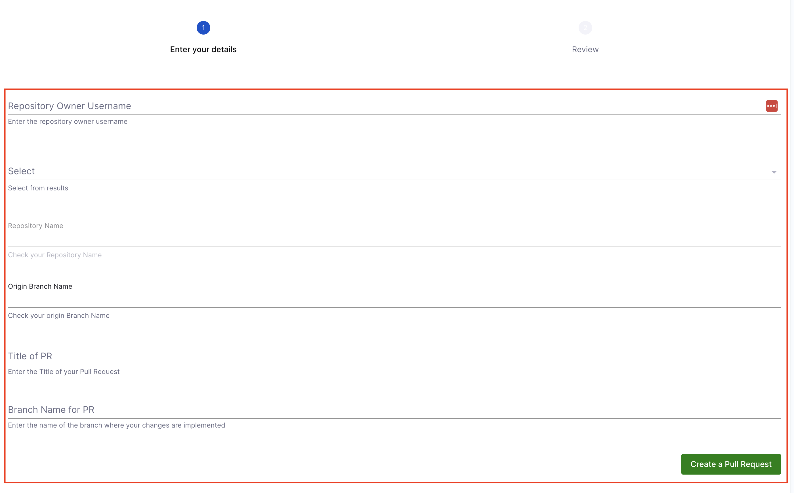

import Tabs from '@theme/Tabs';
import TabItem from '@theme/TabItem';

It is quite common to create a UI field in [IDP Workflow](http://developer.harness.io/docs/internal-developer-portal/flows/service-onboarding-pipelines#specparameters---formstep--formstep) forms which shows a static list options to the user. For example -

```yaml
properties:
  repository_type:
    type: string
    title: Repository Type
    enum:
      - public
      - private
```

will generate the following


However, often times a static list does not provide much value to the user. Here are some of the use-cases -

- Choose your Repository
- Choose your Bitbucket Project
- Choose your Jenkins Pipeline
- Choose your Infrastructure Component
- Choose a Jira Project

As a creator of the workflow, you want to provide real-time options for these input fields for a better user experience. This would also allow you to expect the results in a consistent format and leave no room for user formatting errors.

This is where our Dynamic Workflow Picker comes into play. Let's see how it works.


The Workflow UI makes a request to our [Backend Proxy](https://developer.harness.io/docs/internal-developer-portal/plugins/delegate-proxy/) which you can configure as a way to securely make requests to third party APIs and get a response. The UI Picker allows you to customize the response a bit and present it as a list in the dropdown.

## Creating a Dynamic Workflow Picker

There are two steps to adding a dynamic workflow picker in Harness IDP.

1. **Define a Backend Proxy** so that requests from the UI can be populated with authorization headers and forwarded to the third party APIs.
2. **Create the dynamic field in the workflow form**, consuming the backend proxy and the API response.

### Step 1: Create a Backend Proxy

The first step is to declare a new Backend Proxy so that the Workflow forms UI can make authenticated requests to our third party provider. Let's assume you are trying to make requests to GitHub.

Go to IDP Admin -> Plugins. Find the plugin called "Configure Backend Proxies".


Inside the plugin, you get three options (like any other [IDP plugin configuration](https://developer.harness.io/docs/internal-developer-portal/plugins/overview)).

1. Declare a Backend Proxy (HTTP Proxy) endpoint and headers
2. Configure necessary secrets
3. Configure Delegate Proxy (Delegate HTTP Proxy) (in case the API is not publicly accessible, or the secret is on your infrastructure)

In order to set up a HTTP proxy to connect with GitHub APIs, you can add the following in the configuration YAML

```yaml
proxy:
  endpoints:
    /github-api:
      target: https://api.github.com
      pathRewrite:
        /api/proxy/github-api/?: /
      headers:
        Authorization: token ${PROXY_GITHUB_TOKEN}
```

Here the `github-api` is the unique name of the endpoint of this Backend proxy. We will need it next.

The `target` should point to the API base URL of your 3rd party provider e.g. `api.github.com`, `https://api.bitbucket.org/2.0` etc.

The `pathRewrite` is field used by the system to ensure the API requests are correctly rerouted. It needs to be of the format `/api/proxy/<endpoint_name>/?: /` as shown above.

In the `headers` you can add an Authorization header. Ensure you use a unique token name here as variables are `GITHUB_TOKEN` or `BITBUCKET_TOKEN` are system defined. The token name does not matter, as long as a secret is set up for the corresponding variable.


Configure a Delegate HTTP Proxy to route traffic through an HTTP proxy using Delegate. This is useful when we need to access private endpoints not publicly accessible.

:::warning
Endpoints targeting the `harness.io` domain should **not** be configured behind a **Delegate HTTP Proxy**, as you are already in the Harness infrastructure. Using a Delegate HTTP Proxy in this case is unnecessary, as direct access is inherently available.
:::


Hit "Save Configuration" and now our backend proxy is ready to use!

You can verify this endpoint by making requests to the `proxy` endpoint at `https://idp.harness.io/<ACCOUNT_ID>/idp/api/proxy/`. For example in order to test the GitHub example above, you can make a request to

```
https://idp.harness.io/<ACCOUNT_ID>/idp/api/proxy/github-api/user
```

Here `https://idp.harness.io/<ACCOUNT_ID>/idp/api/proxy/github-api/` can be seen exactly as `https://api.github.com/`. So all the endpoint paths on the GitHub API can be used after the proxy endpoint URL. You can learn more about how to consume Harness IDP APIs on our [API Docs](/docs/internal-developer-portal/api-refernces/public-api).

### Step 2: Create the Dropdown Picker in Workflows Form

Now that our Backend proxy is ready, it is time to create that dropdown picker. Here is a small example to start with

```yaml
parameters:
  # ...
  properties:
    github_repo:
      type: string
      ui:field: SelectFieldFromApi
      ui:options:
        title: GitHub Repository
        description: Pick one of the GitHub Repositories
        placeholder: "Choose a Repository"
        path: proxy/github-api/users/OrkoHunter/repos
        valueSelector: full_name
```


Let us understand these properties in detail -

- `ui:field` - This has to be set to `SelectFieldFromApi`. This is the name of the UI Field Component responsible for rendering the API response based picker.
- `title`, `description` and `placeholder` are text fields responsible for telling the user what this field is about. See screenshot.
- `path` - This is the most important field and has to be of the format `proxy/<endpoint-name>/<API-path>`. Here the `endpoint-name` is `github-api` as we have defined above. And `users/OrkoHunter/repos` is the API endpoint path on `api.github.com`.
- `valueSelector` - This is an optional field. If the response of the API is an array of strings, then you do not need this field. If the response is an array of objects/map, then `valueSelector` can be used to point to the key in the object/map that needs to be used for the dropdown.

And that's it! We now have a Workflow dropdown where results are coming from an external API response.


## Conditional API Requests

**Dynamic Pickers** allow users to interact with input form fields and receive real-time options, ensuring validation for workflow creators. Users can dynamically select input values, making workflows more interactive.

In the background, Dynamic Pickers make an **API request** to fetch relevant data. However, there was a limitation:
- The **API URL was fixed**, meaning no query parameters could be used to filter results dynamically.
- Some use cases require **user inputs** to refine results, which wasn't previously possible.

#### Introducing Conditional API Requests
Workflow Dynamic Pickers now support **conditional API requests**, where one field's values depend on another. This enables:
- ✔ **Interactive workflows** – Users can dynamically filter results based on prior inputs.
- ✔ **Customizable API requests** – API URLs can now include query parameters derived from user input.


### Without vs. With Conditional API Requests

#### Without Conditional API Requests
Since **query parameters** couldn't be used in the **API URL**, input fields were independent of each other.

**For example**, consider a GitHub repository picker in a Harness IDP workflow. The repository picker consists of:
- **UI Picker** – Displays the list of repositories.
- **Proxy Backend** – Provides authentication and API access.

If the proxy backend is configured with an API URL like http://api.github.com, without conditional API requests, the UI Picker would look like this:
```YAML {10}
parameters:
 properties:
   github_repo:
     type: string
     ui:field: SelectFieldFromApi
     ui:options:
       title: GitHub Repository
       description: Pick one of the GitHub Repositories
       placeholder: "Choose a Repository"
       path: proxy/github-api/orgs/harness/repos
       valueSelector: full_name
```
**Limitations**

- The **``path``** field ``(proxy/github-api/orgs/harness/repos)`` is fixed to fetch repositories only from the **harness org**.
- Users **cannot filter** repositories based on **different organizations or projects**.

#### With Conditional API Requests
By enabling conditional API requests, users can create dependencies between input fields.
- API URLs can now include **dynamic query parameters** derived from user input.
- Users can **interactively** use Workflows.

**For example**, if users need to specify their GitHub organization to fetch repositories dynamically, the UI Picker would be updated as follows:
```YAML {13}
parameters:
  properties:
    github_org:
      type: string
      title: Provide GitHub Org
    github_repo:
      type: string
      ui:field: SelectFieldFromApi
      ui:options:
        title: GitHub Repository
        description: Pick one of the GitHub Repositories
        placeholder: "Choose a Repository"
        path: proxy/github-api/orgs/{{parameters.github_org}}/repos
        valueSelector: full_name
```
**Benefits**

- ✔ The **``path``** field now **dynamically updates** based on the selected **github_org**.
- ✔ Users can **filter repositories dynamically** instead of being restricted to a fixed org.
- ✔ Enables **interactive and responsive workflows**.


Let's deep dive into the details of how this feature can be implemented.

### Implementing Conditional API Requests
When a user selects or provides input in a form field, the **Form Context** updates with the relevant data. Other fields, typically read-only, can subscribe to this context and automatically update based on the latest information.

#### Implementation
- With Dynamic Workflow UI Pickers, users can reference previously entered form data using the following format in the ``path`` field:

  **``{{ parameters.[propertyId] }}``**

  Here, `propertyId` refers to the **ID of the input field** that you want to use as a dependency for the Dynamic Picker.

- This enables **dynamic values** in the ``path`` field of the Dynamic Picker, where variables retrieve values from other input fields.

:::info
You can also use conditional API requests across **multiple pages** using the **same format and references**. Please note these references only work with values provided through Dynamic UI pickers.
:::

### Example YAML
Let’s understand this with an example.
In a **Repository Picker** workflow, the user provides their **GitHub username**, and all the associated repositories for that username are dynamically displayed.

Below is the YAML configuration for this setup:

```YAML {15}
  parameters:
    - title: Fill in some steps
      properties:
        gitUsername:
          title: Github username
          description: Username
          type: string
        github_repo:
          type: string
          ui:field: SelectFieldFromApi
          ui:options:
            title: GitHub Repository
            description: Pick one of the GitHub Repositories
            placeholder: "Choose a Repository"
            path: proxy/github-api/users/{{parameters.gitUsername}}/repos
            valueSelector: full_name
  steps:
    - id: trigger
      name: using dynamic pickers
      action: trigger:harness-custom-pipeline
      input:
        url: <Your Pipeline URL>
        inputset:
          "username": ${{ parameters.gitusername }}
          "pipeline.stages.GitsyncStageTemplate.variables.greetings": ${{ parameters.github_repo }}
        apikey: ${{ parameters.token }}
        enableVariableMapping: true
  output:
    links:
      - title: Pipeline Details
        url: ${{ steps.trigger.output.PipelineUrl }}
```

#### YAML Breakdown
- In the above YAML, we have referenced the ```gitusername``` variable in the ``path`` of the dynamic picker field.
- This helps the dynamic picker field retrieve the input value to the ``gitusername`` field and show all the repositories associated with that username.

**Example API Path**
``path: proxy/github-api/users/{{ parameters.gitusername }}/repos``


## Updating Fields using Form Context

:::info
Please note that this feature flag is not supported in your [Workflow Playground Editor](/docs/internal-developer-portal/flows/worflowyaml.md#workflows-playground). You won't be able to implement or test this feature in the playground.
:::

With conditional API requests in **Dynamic Pickers**, you can create a **Workflow** with dependent input fields. This also allows you to configure a **Workflow** with a **Dynamic Picker** to automatically update other data fields in your **Workflow's frontend** based on previous input. All relevant information in your **Workflow's frontend** can be auto-filled from third-party sources based on your selection/input.

This functionality is powered by a global [**Form Context**](/docs/internal-developer-portal/flows/dynamic-picker.md#understanding-form-context). This global Form Context is **active per Workflow session**.
When a user selects or provides input in a form field, the **Form Context** updates with the relevant data. Other fields—typically read-only—can subscribe to this context and automatically update based on the latest information.

This release also includes a comprehensive **tutorial** designed to help you understand and **implement these features** effectively. Check it out here: [**Use Dynamic Pickers for a Pull Request Creator Workflow**](/docs/internal-developer-portal/flows/workflows-tutorials/pull-request-creator.md)

#### Example
If you are using a [**Repository Picker Workflow**](/docs/internal-developer-portal/flows/dynamic-picker.md#example-yaml-1) and enter your **GitHub Username**, the form dynamically fetches and displays all repositories linked to that username. Once entered, other dependent fields in the form can be auto-updated based on this selection.

### Understanding Form Context

1. Whenever you use a **Dynamic Picker**, an API call runs in the background to fetch relevant data. This data (returned in the **API Picker response**) is displayed in the form as picker dropdown options.
2. The **Form Context** is then updated with all the required data retrieved from the **API Picker Response Object**. You can configure which fields should be stored in **Form Context** from the API Picker response in the **Workflow YAML**.
3. The input fields in the **Workflow frontend** can then be auto-updated using **Form Context**.

### Implementing Form Context

You can follow these steps to implement **Form Context**:

#### 1. Choose Data Fields to Store in Form Context
Decide which API response fields should be stored in **Form Context** for your **Dynamic Picker field**. For instance, in a repository picker workflow, we need to extract the **repository name** and **branch** from the API response object. Based on this [API](https://docs.github.com/en/rest/repos/repos?apiVersion=2022-11-28#list-repositories-for-the-authenticated-user), we will define these values in the form context as retrieved from the API response: ``name`` and ``default_branch``.

#### 2. Set Context Data in Your Workflow YAML
You can define **Form Context** in the ``ui:options`` section using the ```setContextData``` field within the **Dynamic Picker field definition** in **Workflow YAML**:

```YAML {5}
dynamic-picker-name:
  ui:field: SelectFieldFromApi
  ui:options:
    path: dynamic-picker-field-path
    setContextData:
      repoName: name
      branchName: default_branch
      ...
```

#### **Syntax Breakdown**
- Define a **Dynamic Picker** using: ```ui:field: SelectFieldFromApi```
- ```repoName``` and ```branchName``` are identifiers in **Form Context** referring to API field values from the API Picker response.
- ```name``` and ```default_branch``` represent actual API response object field values.
- ```setContextData``` is used to define and store certain API response object fields in **Form Context**.

#### 3. Auto-Update Input Fields Using `getContextData`
Once **Context Data** is set, define **input fields** and use ```getContextData``` to auto-update these fields with values from the API response based on user input.

```YAML {12}
dynamic-picker-name:
  ui:field: SelectFieldFromApi
  ui:options:
    path: dynamic-picker-field-path
    setContextData:
      repoName: name
      branchName: default_branch
repositoryName:
  ui:field: ContextViewer
  readonly: true
  ui:options:
    getContextData: {{formContext.repoName}}
originBranchName:
  ui:field: ContextViewer
  ui:options:
    getContextData: {{formContext.branchName}}
    ...
```

:::info
We can make certain fields **non-editable** by adding `readonly: true` in their field definition, just like `repositoryName`. Conversely, to make fields **editable**, we simply omit this property, as seen with `originBranchName`. This allows users to validate the auto-fetched data, edit it if needed, and update the form context with the modified values.
:::

#### **Syntax Breakdown**
- ```repositoryName``` and ```originBranchName``` are input field names in the **Workflow frontend**.
- Define **Form Context** for these fields using: ```ui:field: ContextViewer```
- ```getContextData``` retrieves and auto-updates the input field with data from the API response.
- Reference values stored in **Form Context** using: ```formContext.repoName```

#### 4. Show Form Context Live in the Workflow Frontend
At any time, if you need to display the **Form Context** live in your Workflow Frontend for debugging purposes, you can use the following format:

```YAML {7}
formContext:
  title: Live Form Context
  description: DEBUG Context
  type: string
  ui:field: ContextViewer
  ui:options:
    getContextData: {{formContext}}
```

#### **Syntax Breakdown**
- `formContext` is the **field name** used to define the Form Context in your YAML.
- `ui:field` for this field should be set to `ContextViewer`.
- To display the Form Context **live in your frontend**, use `getContextData: {{formContext}}` under the `ui:options` property.

This ensures that the **current Form Context state** is visible in the Workflow UI for debugging.

### Example YAML
<Tabs>
<TabItem value="YAML" label="YAML" default>

```YAML {14,16,27,35,43,50}
parameters:
    - title: Repo Picker
      properties:
        gitUsername:
          title: Github username
          description: Enter your Github username
          type: string
        repoPicker:
          title: GitHub Repositories
          type: string
          description: Pick one of GitHub Repos
          ui:field: SelectFieldFromApi
          ui:options:
            path: proxy/github-api/users/{{parameters.gitUsername}}/repos
            valueSelector: full_name
            setContextData:
              repoName: name
              branch: default_branch
              type: visibility
        repositoryName:
          title: Repo Name
          readonly: true
          description: Repository Name
          type: string
          ui:field: ContextViewer
          ui:options:
            getContextData: {{formContext.repoName}}
        branchName:
          title: Default Branch
          readonly: true
          description: Default Branch
          type: string
          ui:field: ContextViewer
          ui:options:
            getContextData: {{formContext.branch}}
        typeName:
          title: Visibility
          readonly: true
          description: Visibility
          type: string
          ui:field: ContextViewer
          ui:options:
            getContextData: {{formContext.type}}
        formContext:
          title: Live Form Context
          description: DEBUG Context
          type: string
          ui:field: ContextViewer
          ui:options:
            getContextData: {{formContext}}
```
</TabItem>
<TabItem value="Workflow Frontend" label="Workflow Frontend">


</TabItem>
</Tabs>


## Live User Validation using API Requests

:::info
Please note that this feature flag is not supported in your [Workflow Playground Editor](/docs/internal-developer-portal/flows/worflowyaml.md#workflows-playground). You won't be able to implement or test this feature in the playground.
:::

You can configure Workflows to enable **user validation** for input form fields. If you want users to manually enter details and validate them instead of selecting from a drop-down, you can use this feature in your Workflow.

This functionality allows users to:
- Manually enter input field details for **live validation** (instead of selecting from a dynamic picker drop-down).
- Provide **feedback and validate auto-updated** input field details retrieved from [**Form Context**](/docs/internal-developer-portal/flows/dynamic-picker#updating-fields-using-form-context).

This process triggers an API call in the background with the user-provided details, parses the response, and **updates the Form Context** with the validated information. It ensures that input form fields are dynamically updated while enabling real-time validation of user inputs.

This feature release also includes a comprehensive **tutorial** designed to help you understand and **implement these features** effectively. Check it out here:  [**Use Dynamic Pickers for a Pull Request Creator Workflow**](/docs/internal-developer-portal/flows/workflows-tutorials/pull-request-creator.md)

**Example**

In a [**Pull Request Creator Workflow**](/docs/internal-developer-portal/flows/workflows-tutorials/pull-request-creator.md), you need the user to enter the name of the branch where changes are implemented. Additionally, you require a repository picker field that fetches repository details and updates the Form Context dynamically as selections are made.

To achieve this, you can add a **button** (e.g., "Create a PR"). When clicked, this button triggers an API call in the background using the user-provided branch details, stores additional data from the API response object in the Form Context, and sends a POST request to create a pull request. This helps users **validate their details** for the given use case.

### Implementing User Validation

You can implement user validation by adding a custom button using the following steps:

#### 1. Define the Button

A custom button allows users to manually enter their input details and validate them by clicking the button. You can define this button in your `workflow.yaml` as follows:

```YAML {3,5}
customValidationName:
  type: string
  ui:field: ValidateAndFetch
  ui:options:
    button:
      title: Title to be displayed on the button
    path: API call path
    request:
    ...
    setContextData:
      fieldname: value
```

#### 2. Configuration Details

1. **`ui:field`**
  For this feature, `ui:field` must be set to `ValidateAndFetch`.

2. **`ui:options`**
   You can configure various options under this field:
   - **`button`**: Defines and adds a button.
   - **`path`**: Specifies the API endpoint path that will be called when the button is clicked.
   - **`request`**: Defines the API request details. [Read more about making a POST API request here](/docs/internal-developer-portal/flows/dynamic-picker#post-method-support)
   - **`setContextData`**: Stores context data in **Form Context** while making the API call. [Learn more here](/docs/internal-developer-portal/flows/dynamic-picker#2-set-context-data-in-your-workflow-yaml)

### Example YAML
<Tabs>
<TabItem value="YAML" label="YAML" default>

```YAML {12,14,16,25,27,34,43,45,49,52}
parameters:
    - title: Enter your details
      properties:
        gitUsername:
          title: Repository Owner Username
          description: Enter the repository owner username
          type: string
        repoPicker:
          title: GitHub Repositories
          type: string
          description: Pick one of GitHub Repos
          ui:field: SelectFieldFromApi
          ui:options:
            path: proxy/github-api/users/{{parameters.gitUsername}}/repos
            valueSelector: full_name
            setContextData:
              repoName: name
              branch: default_branch
              type: visibility
        repositoryName:
          title: Repository Name
          readonly: true
          description: Check your Repository Name
          type: string
          ui:field: ContextViewer
          ui:options:
            getContextData: {{formContext.repoName}}
        originBranchName:
          title: Origin Branch Name
          description: Check your origin Branch Name
          type: string
          ui:field: ContextViewer
          ui:options:
            getContextData: {{formContext.branch}}
        titlePR:
          title: Title of PR
          description: Enter the Title of your Pull Request
          type: string
        newBranch:
          title: Branch Name for PR
          description: Enter the name of the branch where your changes are implemented
          type: string
        customValidate:
          type: string
          ui:field: ValidateAndFetch
          ui:options:
            button:
              title: Create a Pull Request
            path: proxy/github-api/repos/{{parameters.gitUsername}}/{{parameters.repositoryName}}/pulls
            contextData:
              prURL: html_url
            request:
              method: POST
              headers:
                Content-Type: application/json
              body:
                title: "{{parameters.titlePR}}"
                head: "{{parameters.newBranch}}"
                base: "{{parameters.originBranchName}}"
```
</TabItem>
<TabItem value="Workflow Frontend" label="Workflow Frontend">



</TabItem>
</Tabs>

## Supported Filters to parse API response

### `SelectFieldFromApi` Field

Here is an elaborate example of what all properties are possible with the `SelectFieldFromApi` field, showcasing how to parse values from an API response.

```YAML
properties:
  api-picker:
    type: string
    ui:field: SelectFieldFromApi

    ui:options:
      title: Title
      description: Description
      # (Optional) Mention about the type of API call POST/GET, GET is default if not mentioned
      request:
        method: POST
        headers:
          Content-Type: text/plain
        # Indicates the format of the request body being sent.
        body: This is a simple plain text message
      # The Path on the Harness IDP backend API and the parameters to fetch the data for the dropdown
      path: "proxy/proxy-endpoint/api-path"
      params:
        urlparamkey: "urlparamvalue"

      # (Optional) Renders the provided text as a placeholder value into the select box.
      placeholder: "Select from options"

      # (Optional) This field is used to point to the Array element inside the API response. It can be nested as shown here. If the response itself is an array, you can skip this.
      arraySelector: "object1.key1"

      # (Optional) If the response array is not an array of strings but rather an array of objects, valueSelector can be used to set the value of each selected item.
      valueSelector: "id"

      # (Optional) In case you want to show the user something else rather than the value itself, you can use the labelSelector for it.
      labelSelector: "name"
```

You can find the detailed docs on the [project's README](https://github.com/RoadieHQ/roadie-backstage-plugins/tree/main/plugins/scaffolder-field-extensions/scaffolder-frontend-module-http-request-field).

### POST and PUT Method Support

The **POST/PUT method** can be configured for Dynamic API Pickers, enabling users to interact with external APIs by sending data in the request body. This is particularly useful for fetching data via **GraphQL APIs**, invoking **Lambda functions**, etc. 

:::info
Kindly note that there are no restrictions on **HTTP methods**, except for the **DELETE** method, which is currently unsupported.
:::

#### Key Elements:
- **`method` field** - Used to specify the **POST** or **PUT** request method. 
- **`headers` field - `Content-Type`**: Specifies the request body's type.
  - In case of structured data (e.g., JSON) - `application/json` is used.
  - In case of plain text - `text/plain` is used.
- **`body` field**: Contains the data sent to the API.

#### POST Method Example: 
Here's how the **POST method** is used to fetch and populate dynamic pickers within forms:

```YAML {10}
custom1:
  title: GitHub Repos Single
  type: string
  description: Pick one of GitHub Repos
  ui:field: SelectFieldFromApi
  ui:options:
    path: proxy/github-api/users/{{parameters.gitusername}}/repos
    valueSelector: full_name
    request:
      method: POST
      headers:
        Content-Type: application/json
      body:
        secret: "{{parameters.formdata}}"
```

#### PUT Method Example: 
```YAML {10}
custom1:
  title: Repository Topics
  type: string
  description: Select or update repository topics
  ui:field: SelectFieldFromApi
  ui:options:
    path: proxy/github-api/repos/{{parameters.gitusername}}/{{parameters.repoName}}/topics
    arraySelector: names
    request:
      method: PUT
      headers:
        Accept: application/vnd.github+json
        Content-Type: application/json
      body:
        names:
          - ci
          - harness
          - devops
          - monitoring
          - github
```

Using these methods is particularly beneficial when transmitting complex or sensitive data, such as **API tokens, authentication headers, or data that triggers server-side actions** (e.g., filtering or updating records).

### Parsing API Response using filters

Let's look at some different types of API responses and how to create a picker based on that using the `arraySelector`, `valueSelector` and `labelSelector` filters.

#### Case 1: The response is an array

```json
["item1", "item2"]
```

This is the most straightforward case, and we do not need any of the additional filters here.

```yaml
properties:
  api-picker:
    type: string
    ui:field: SelectFieldFromApi
    ui:options:
      title: Title
      description: Description
      path: "proxy/proxy-endpoint/api-path"
```

#### Case 2: The response is an array of objects

```json
[
  {
    "id": "abc123",
    "name": "service A"
  },
  {
    "id": "abc124",
    "name": "service B"
  }
]
```

```yaml
properties:
  api-picker:
    type: string
    ui:field: SelectFieldFromApi
    ui:options:
      title: Title
      description: Description
      path: "proxy/proxy-endpoint/api-path"
      # We need to show `name` to the users
      valueSelector: "name"
```

If you want to show the user the names of the service here, but want to store the ID of the selected service to be used in the Pipeline execution later on, you can do this using

```yaml
properties:
  api-picker:
    type: string
    ui:field: SelectFieldFromApi
    ui:options:
      title: Title
      description: Description
      path: "proxy/proxy-endpoint/api-path"
      # We show the `name` to the users but store the `id` as the selected value
      valueSelector: "id"
      labelSelector: "name
```

#### Case 3: The response is a nested object of arrays

```json
"data": {
  "property": "cities",
  "array": [
    {
      "id": "city123",
      "name": "City A"
    },
    {
      "id": "city124",
      "name": "City B"
    }
  ]
}
```

```yaml
properties:
  api-picker:
    type: string
    ui:field: SelectFieldFromApi
    ui:options:
      title: Title
      description: Description
      path: "proxy/proxy-endpoint/api-path"
      # We need to point to the array inside the response
      arraySelector: "data.array"
      # We show the `name` to the users but store the `id` as the selected value
      valueSelector: "id"
      labelSelector: "name
```

## Notes

### Advanced processing the API response

If the filters here are not sufficient for your use case, and you require additional data processing of the response, then we recommend you setting up a Lambda function in your cloud provider or a lightweight backend to do this job. You can use your Backend Proxy and Delegate Proxy to communicate to your custom Lambda/Backend.

## Example Usage

### Fetch the list of Harness Services in Workflows

1. Configure the [Backend Proxy](#step-1-create-a-backend-proxy)

Set up a backend proxy in the plugin configuration to enable API calls to Harness.

```YAML
proxy:
  endpoints:
    /harness-api-endpoint:
      target: https://app.harness.io
      pathRewrite:
        /api/proxy/harness-api-endpoint/?: /
      headers:
        x-api-key: ${PROXY_HARNESS_TOKEN}
```

- `/harness-api-endpoint`: Proxy path for the Harness API.
- `x-api-key`: Add your Harness Personal Access Token as an environment variable(covered in the next step)..

2. Add the [Harness Personal Access Token](https://developer.harness.io/docs/platform/automation/api/add-and-manage-api-keys/#create-personal-api-keys-and-tokens) as a variable. Save the token as an environment variable named `PROXY_HARNESS_TOKEN`.

3. Update your Workflow definition YAML to include a dropdown for fetching the list of services.

```YAML
## Example workflows.yaml
...
properties:
  service:
    type: string
    ui:field: SelectFieldFromApi
    ui:options:
      title: Choose the service
      description: Pick one of the service you want to deploy
      placeholder: "Choose a service"
      allowArbitraryValues: true
      path: proxy/harness-api-endpoint/ng/api/servicesV2?page=0&size=100&accountIdentifier=ACCOUNT_ID&orgIdentifier=ORG_ID&projectIdentifier=PROJECT_ID&includeAllServicesAccessibleAtScope=true
      valueSelector: 'service.name'
      arraySelector: 'data.content'
...
```
- `ui:field`: Configures the dropdown to fetch data from an API.
- `path`: API endpoint for fetching the list of services. You need to add the account identifier in place of `ACCOUNT_ID`, organization identifier in place of `ORG_ID` and project identifier in-place of `PROJECT_ID`.
- `valueSelector`: Extracts the service name for the dropdown values.
- `arraySelector`: Extracts the array containing the services

For a complete example, refer to the [sample Workflows YAML](https://github.com/harness-community/idp-samples/blob/main/tutorial-dynamic-picker-examples.yaml).


