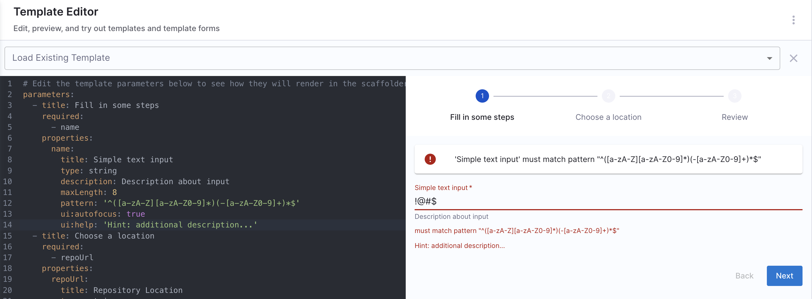
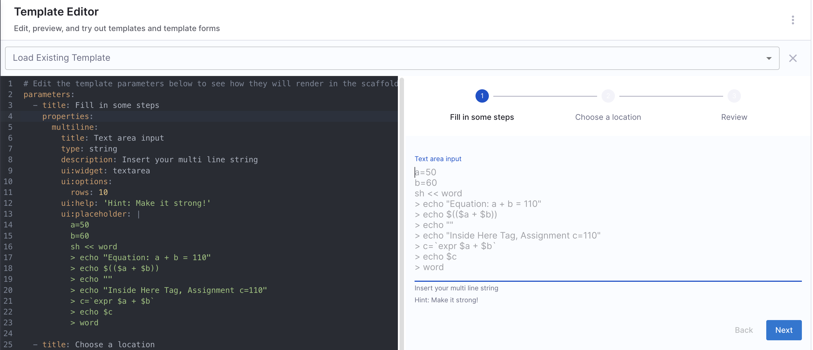
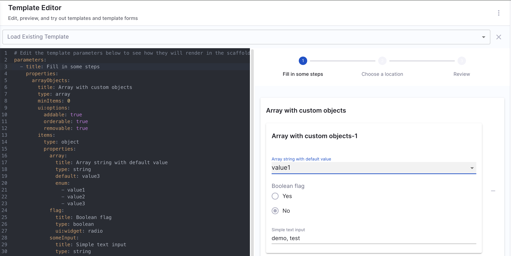
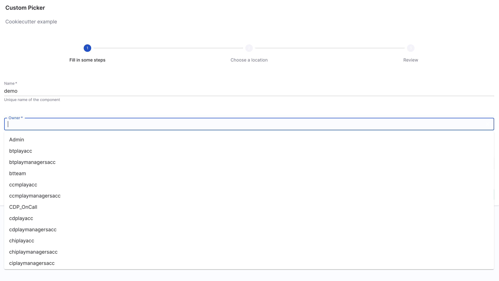

There are various ways in which you can take input from users in IDP Workflows. All types of form input types and examples are listed in this document.

## Simple text input

### Simple input with basic validations

Example [`workflows.yaml`](https://github.com/harness-community/idp-samples/blob/main/workflow-examples/text-input-pattern.yaml)

<details>
<summary>Example YAML</summary>

```yaml
parameters:
  - title: Fill in some steps
    properties:
      name:
        title: Simple text input
        type: string
        description: Description about input
        maxLength: 8
        pattern: "^([a-zA-Z][a-zA-Z0-9]*)(-[a-zA-Z0-9]+)*$"
        ui:autofocus: true
        ui:help: "Hint: additional description..."
```

</details>



### Multi-line text input

Example [`workflows.yaml`](https://github.com/harness-community/idp-samples/blob/main/workflow-examples/multi-line-input.yaml)

<details>
<summary>Example YAML</summary>

```YAMl
parameters:
  - title: Fill in some steps
    properties:
      multiline:
        title: Text area input
        type: string
        description: Insert your multi line string
        ui:widget: textarea
        ui:options:
          rows: 10
        ui:help: 'Hint: Make it strong!'
        ui:placeholder: |
          a=50
          b=60
          sh << word
          > echo "Equation: a + b = 110"
          > echo $(($a + $b))
          > echo ""
          > echo "Inside Here Tag, Assignment c=110"
          > c=`expr $a + $b`
          > echo $c
          > word
```

</details>



### Dynamically Fetch Values in Workflows

You can dynamically fetch values in the Workflows fields using UI Pickers, which are in-built. There are two kinds of UI Pickers:

1. [Standard Workflow UI Picker](/docs/internal-developer-portal/flows/flows-input#workflow-ui-pickers)
2. [API Based Dynamic Workflow UI Picker](/docs/internal-developer-portal/flows/dynamic-picker)

## Arrays options

### Array with strings

Example [`workflows.yaml`](https://github.com/harness-community/idp-samples/blob/main/workflow-examples/arrays.yaml)

### Array with distinct values

Values mentioned under `enum` needs to be distinct, duplicate values aren't allowed under `enum`.

<details>
<summary>Example YAML</summary>

```YAML
parameters:
  - title: Fill in some steps
    required:
      - name
    properties:
      name:
        title: Name
        type: string
        description: Unique name of the component
      volume:
        title: Volume Type
        type: string
        description: The volume type to be used
        default: 'Cold HDD'
        enum:
          - 'Provisioned IOPS'
          - 'Cold HDD'
          - 'Throughput Optimized HDD'
          - 'Magnetic'
```

</details>


### Array with duplicate values

<details>
<summary>Example YAML</summary>

```YAML
parameters:
  - title: Fill in some steps
    properties:
      volume_type:
        title: Volume Type
        type: string
        description: The volume type to be used
        default: gp2
        enum:
          - gp2
          - gp3
          - io1
          - io2
          - sc1
          - st1
          - standard
        enumNames:
          - 'General Purpose SSD (gp2)'
          - 'General Purpose SSD (gp3)'
          - 'Provisioned IOPS (io1)'
          - 'Provisioned IOPS (io2)'
          - 'Cold HDD (sc1)'
          - 'Throughput Optimized HDD (st1)'
          - 'Magnetic (standard)'
```

</details>


### A multiple choices list

Example [`workflows.yaml`](https://github.com/harness-community/idp-samples/blob/5140ef7993a3c932c49af9162562a99e16428080/workflow-examples/multi-choice-list.yaml#L24-L34)

<details>
<summary>Example YAML</summary>

```yaml
parameters:
  - title: Fill in some steps
    properties:
      name:
        title: Select environments
        type: array
        items:
          type: string
          enum:
            - production
            - staging
            - development
        uniqueItems: true
        ui:widget: checkboxes
```

</details>


### Array with Custom Objects

Example [`workflows.yaml`](https://github.com/harness-community/idp-samples/blob/5140ef7993a3c932c49af9162562a99e16428080/workflow-examples/multi-choice-list.yaml#L24-L34)

<details>
<summary>Example YAML</summary>

```yaml
parameters:
  - title: Fill in some steps
    properties:
      arrayObjects:
        title: Array with custom objects
        type: array
        minItems: 0
        ui:options:
          addable: true
          orderable: true
          removable: true
        items:
          type: object
          properties:
            array:
              title: Array string with default value
              type: string
              default: value3
              enum:
                - value1
                - value2
                - value3
            flag:
              title: Boolean flag
              type: boolean
              ui:widget: radio
            someInput:
              title: Simple text input
              type: string
```

</details>



## Boolean options

### Boolean

```yaml
parameters:
  - title: Fill in some steps
    properties:
      name:
        title: Checkbox boolean
        type: boolean
```


### Boolean Yes or No options (Radio Button)

```yaml
parameters:
  - title: Fill in some steps
    properties:
      name:
        title: Yes or No options
        type: boolean
        ui:widget: radio
```


### Boolean multiple options

<details>
<summary>Example YAML</summary>

```yaml
parameters:
  - title: Fill in some steps
    properties:
      name:
        title: Select features
        type: array
        items:
          type: boolean
          enum:
            - "Enable scraping"
            - "Enable HPA"
            - "Enable cache"
        uniqueItems: true
        ui:widget: checkboxes
```

</details>


## Conditional Inputs in Workflows

### Conditionally set parameters

The `if` keyword within the parameter uses [nunjucks templating](https://mozilla.github.io/nunjucks/templating.html#if). The `not` keyword is unavailable; instead, use javascript equality. eg: `${{ parameters.branchName if parameters.branchName else appendTimestamp("default-branch-name-") }}`

<details>
<summary>Example YAML</summary>

```YAML
spec:
  parameters:
    - title: Fill in some steps
      properties:
        path:
          title: path
          type: string

  steps:
    - id: fetch
      name: Fetch template
      action: fetch:template
      input:
        url: ${{ parameters.path if parameters.path else '/root' }}
```

</details>

### Use parameters as conditional for fields

<details>
<summary>Example YAML</summary>

```yaml
parameters:
  - title: Fill in some steps
    properties:
      includeName:
        title: Include Name?
        type: boolean
        default: true

    dependencies:
      includeName:
        allOf:
          - if:
              properties:
                includeName:
                  const: true
            then:
              properties:
                lastName:
                  title: Last Name
                  type: string
```

</details>


1. **`One Of`**: Helps you create a dropdown in the Workflow, where only one of all the options available could be selected.

Example [`workflows.yaml`](https://github.com/harness-community/idp-samples/blob/05d533cb9789d5abffbdc103d55530efea489161/workflow-examples/conditional-one-of.yaml#L11-L25)

<details>
<summary>Example YAML</summary>

```YAML
dependencies:
  technology:
    oneOf:
      - properties:
          technology:
            enum:
              - java
          java version:
            type: "string"
            enum:
              - java8
              - java11
```

</details>


2. **`All Of`**: Helps you create a dropdown in the Workflow, where only all the options available could be selected.

Example [`workflows.yaml`](https://github.com/harness-community/idp-samples/blob/70f70f32dfca3ad394677b19608d72706cc8d38c/workflow-examples/conditional-all-of.yaml#L54-L77)

<details>
<summary>Example YAML</summary>

```YAML
type: object
allOf:
- properties:
    lorem:
      type:
      - string
      - boolean
      default: true
- properties:
    lorem:
      type: boolean
    ipsum:
      type: string
```

</details>


3. **`Any Of`**: Helps you to select from multiple properties where both can't be selected together at once.

Example [`workflows.yaml`](https://github.com/harness-community/idp-samples/blob/4215c82f933af1d3c1675b89baa2f042e83a60a2/workflow-examples/conditional-any-of.yaml#L31-L46)

**The Example Workflow Explained**

1. **Parameters Structure**
   The parameters section includes `age` as an integer and `items` as an array. Each item in the array can contain either a `foo` or `bar` property, utilizing `anyOf`.

2. **Identification Methods**
   The Workflow allows for two methods of identification using `anyOf`. Users can provide either:

- A first name and last name (defaulting `firstName` to "Chuck"), or
- An ID code.

3. **Required Fields**
   The `age` field is required, while the fields under the two identification methods are optional but must comply with the `anyOf` logic.

4. **Display Step**
   The steps section includes a `debug:log` action to display the collected information based on the provided input.

<details>
<summary>Example YAML</summary>

```YAML
type: object
properties:
  age:
    type: integer
    title: Age
  items:
    type: array
    items:
      type: object
      anyOf:
      - properties:
          foo:
            type: string
      - properties:
          bar:
            type: string
anyOf:
- title: First method of identification
  properties:
    firstName:
      type: string
      title: First name
      default: Chuck
    lastName:
      type: string
      title: Last name
- title: Second method of identification
  properties:
    idCode:
      type: string
      title: ID code
```

</details>


For more such references and validate your conditional steps take a look at the [react-json schema project](https://rjsf-team.github.io/react-jsonschema-form/).

## Upload a file using Workflows

There are 3 types of file upload.

1. Single File
2. Multiple Files
3. Single File with Accept Attribute

<details>
<summary>Example YAML</summary>

```YAML
#Example
title: Files
type: object
properties:
  file:
    type: string
    format: data-url
    title: Single file
  files:
    type: array
    title: Multiple files
    items:
      type: string
      format: data-url
  filesAccept:
    type: string
    format: data-url
    title: Single File with Accept attribute
```

</details>

## Using Secrets

You may want to mark things as secret and make sure that these values are protected and not available through REST endpoints. You can do this by using the built in `ui:field: Secret` and `ui:widget: password`.

:::info
`ui:widget: password` needs to be mentioned under the first `page` in-case you have multiple pages.

```YAML {14}
# example workflow.yaml
...
parameters:
  - title: <PAGE-1 TITLE>
    properties:
      property-1:
        title: title-1
        type: string
      property-2:
        title: title-2
    token:
      title: Harness Token
      type: string
      ui:widget: password
      ui:field: HarnessAuthToken
  - title: <PAGE-2 TITLE>
    properties:
      property-1:
        title: title-1
        type: string
      property-2:
        title: title-2
  - title: <PAGE-n TITLE>
...
```

:::

You can define this property as any normal parameter, however the consumption of this parameter will not be available through `${{ parameters.myKey }}` you will instead need to use `${{ secrets.myKey }}` in your `workflow.yaml`.

Parameters will be automatically masked in the review step.

<details>
<summary>Example YAML</summary>

```YAML
apiVersion: scaffolder.backstage.io/v1beta3
kind: Template
metadata:
  name: v1beta3-demo
  title: Test Action Workflow
  description: Workflows Demo
spec:
  owner: backstage/techdocs-core
  type: service

  parameters:
    - title: Authenticaion
      description: Provide authentication for the resource
      required:
        - username
        - password
      properties:
        username:
          type: string
          # use the built in Secret field extension
          ui:field: Secret
        password:
          type: string
          ui:field: Secret

  steps:
    - id: setupAuthentication
      action: auth:create
      input:
        # make sure to use ${{ secrets.parameterName }} to reference these values
        username: ${{ secrets.username }}
        password: ${{ secrets.password }}
```

</details>

## Built in Filters

Workflow filters are functions that help you transform data, extract specific information,
and perform various operations in Workflows.

This section introduces the built-in filters provided by Backstage and offers examples of
how to use them in the Workflows. It's important to mention that Backstage also leverages the
native filters from the Nunjucks library. For a complete list of these native filters and their usage,
refer to the [Nunjucks documentation](https://mozilla.github.io/nunjucks/templating.html#builtin-filters).

### parseRepoUrl

The `parseRepoUrl` filter parse a repository URL into
its components, such as `owner`, repository `name`, and more.

**Usage Example:**

```YAML
- id: log
  name: Parse Repo URL
  action: debug:log
  input:
    extra: ${{ parameters.repoUrl | parseRepoUrl }}
```

- **Input**: `github.com?repo=backstage&org=backstage`
- **Output**: [RepoSpec](https://github.com/backstage/backstage/blob/v1.17.2/plugins/scaffolder-backend/src/scaffolder/actions/builtin/publish/util.ts#L39)

### parseEntityRef

The `parseEntityRef` filter allows you to extract different parts of
an entity reference, such as the `kind`, `namespace`, and `name`.

**Usage example**

1. Without context

```YAML
- id: log
  name: Parse Entity Reference
  action: debug:log
  input:
    extra: ${{ parameters.owner | parseEntityRef }}
```

- **Input**: `group:techdocs`
- **Output**: [CompoundEntityRef](https://github.com/backstage/backstage/blob/v1.17.2/packages/catalog-model/src/types.ts#L23)

2. With context

```YAML
- id: log
  name: Parse Entity Reference
  action: debug:log
  input:
    extra: ${{ parameters.owner | parseEntityRef({ defaultKind:"group", defaultNamespace:"another-namespace" }) }}
```

- **Input**: `techdocs`
- **Output**: [CompoundEntityRef](https://github.com/backstage/backstage/blob/v1.17.2/packages/catalog-model/src/types.ts#L23)

### pick

This `pick` filter allows you to select specific properties from an object.

**Usage Example**

```yaml
- id: log
  name: Pick
  action: debug:log
  input:
    extra: ${{ parameters.owner | parseEntityRef | pick('name') }}
```

- **Input**: `{ kind: 'Group', namespace: 'default', name: 'techdocs' }`
- **Output**: `techdocs`

### projectSlug

The `projectSlug` filter generates a project slug from a repository URL

**Usage Example**

```yaml
- id: log
  name: Project Slug
  action: debug:log
  input:
    extra: ${{ parameters.repoUrl | projectSlug }}
```

- **Input**: `github.com?repo=backstage&org=backstage`
- **Output**: `backstage/backstage`

## Workflow UI Pickers

Collecting input from the user is a very large part of the Workflows as a whole. Sometimes the built in components and fields just aren't good enough, and sometimes you want to enrich the form that the users sees with better inputs that fit better.

This is where Workflow UI Pickers come in.

### Harness Specific UI Pickers

### 1. `EntityFieldPicker`

:::info

Only **string** data `type` is supported for the EntityPicker.

:::

The input props that can be specified under `ui:options` for the `EntityFieldPicker` field extension.

#### `displayField`

This is used to fetch the value from catalog dynamically, corresponding to the key mentioned.

```YAML
jiraprojectID:
    title: Jira Project Key
    type: string
    description: The key for your JIRA project
    ui:field: EntityFieldPicker
    ui:displayField: metadata.jiraProjectId
    ui:options:
    catalogFilter:
        kind:
        - Component
        - Service
```

In the above example it will fetch all the `jiraProjectId` for the software components `kind` mentioned under `catalogFilter`.

#### `allowArbitraryValues`

Whether to allow arbitrary user input. Defaults to true.

`allowArbitraryValues` provides input validation when selecting an entity as the values you enter will correspond to a valid entity.

- Adding a valid entity with `allowArbitraryValues` as `false`

```yaml
entity:
  title: Entity
  type: string
  description: Entity of the component
  ui:field: EntityFieldPicker
  ui:options:
    allowArbitraryValues: false
```

- Adding an arbitrary entity with `allowArbitraryValues` as `true` (default value)

```yaml
entity:
  title: Entity
  type: string
  description: Entity of the component
  ui:field: EntityFieldPicker
  ui:options:
    allowArbitraryValues: true
```

#### `catalogFilter`

`catalogFilter` supports filtering options by any field(s) of an entity.

- Get all entities of kind `Group`

```yaml
entity:
  title: Entity
  type: string
  description: Entity of the component
  ui:field: EntityFieldPicker
  ui:options:
    catalogFilter:
      - kind: Group
```

- Get entities of kind `Group` and spec.type `team`

```yaml
entity:
  title: Entity
  type: string
  description: Entity of the component
  ui:field: EntityFieldPicker
  ui:options:
    catalogFilter:
      - kind: Group
        spec.type: team
```

#### `defaultKind`

The default entity kind.

```yaml
system:
  title: System
  type: string
  description: System of the component
  ui:field: EntityFieldPicker
  ui:options:
    catalogFilter:
      kind: System
    defaultKind: System
```

#### `defaultNamespace`

The ID of a namespace that the entity belongs to. The default value is `default`.

- Listing all entities in the `default` namespace (default value)

```yaml
entity:
  title: Entity
  type: string
  description: Entity of the component
  ui:field: EntityFieldPicker
  ui:options:
    defaultNamespace: default
```

### 2. `HarnessOrgPicker`

Fetches all the org ID dynamically.

```YAML
#Example
apiVersion: scaffolder.backstage.io/v1beta3
kind: Template
metadata:
  name: your-workflow
  ...
spec:
  ...
  parameters:
    - title: Details
       properties:
         projectId:
           title: Project Identifier
           description: Harness Project Identifier
           type: string
           ui:field: HarnessProjectPicker
         orgId:
            title: Org Identifier
            type: string
            ui:field: HarnessOrgPicker
    ...
```

### 3. `HarnessProjectPicker`

Fetches all the project ID dynamically.

```YAML
# Example workflow.yaml file
apiVersion: scaffolder.backstage.io/v1beta3
kind: Template
metadata:
  name: your-workflow
  ...
spec:
  ...
  parameters:
    - title: Details
       properties:
         projectId:
           title: Project Identifier
           description: Harness Project Identifier
           type: string
           ui:field: HarnessProjectPicker
```

### 4. `HarnessAutoOrgPicker`

It auto populates org ID on project selection. So now when you select an project ID as an input the org ID gets selected automatically if required as an input.

1. For `HarnessAutoOrgPicker` to work, it is suggested to name the Project Identifier under Properties as `projectId` and using the `HarnessProjectPicker`.

```YAML
# Example workflow.yaml file
apiVersion: scaffolder.backstage.io/v1beta3
kind: Template
metadata:
  name: your-workflow
  ...
spec:
  ...
  parameters:
    - title: Details
       properties:
         projectId:
           title: Project Identifier
           description: Harness Project Identifier
           type: string
           ui:field: HarnessProjectPicker
         orgId:
           title: Org Identifier
           description: Harness org Identifier
           type: string
           ui:field: HarnessAutoOrgPicker

```

2. In case the properties Project Identifier is named something else other than `projectId` in that case for the custom action to function as desired we need to add it as a dependency under `projectPickerRef`

```YAML
# Example workflow.yaml file
properties:
    <ANY NAME OTHER THAN projectId>:
        title: Project Identifier
        description: Harness Project Identifier
        type: string
        ui:field: HarnessProjectPicker
    orgId:
        title: Org Identifier
        description: Harness org Identifier
        type: string
        ui:field: HarnessAutoOrgPicker
        dependencies:
          projectPickerRef:
            - 'project_name'
```

### Other UI Pickers

### 1. `OwnerPicker`

`OwnerPicker` is used for developers to pick a User Group from the list of Groups that exist in the account.



#### `allowArbitraryValues`

Whether to allow arbitrary user input. Defaults to true.

`allowArbitraryValues` provides input validation when selecting an owner as the values you enter will correspond to a valid owner.

- Adding a valid owner with `allowArbitraryValues` as `false`

```YAML
owner:
  title: Owner
  type: string
  description: Owner of the component
  ui:field: OwnerPicker
  ui:options:
    allowArbitraryValues: false
```

- Adding an arbitrary owner with `allowArbitraryValues` as `true` (default value)

```YAML
owner:
  title: Owner
  type: string
  description: Owner of the component
  ui:field: OwnerPicker
  ui:options:
    allowArbitraryValues: true
```

#### `catalogFilter`

`catalogFilter` supports filtering options by any field(s) of an entity.

- Get all entities of kind `Group`

```YAML
owner:
  title: Owner
  type: string
  description: Owner of the component
  ui:field: OwnerPicker
  ui:options:
    catalogFilter:
      - kind: Group
```

- Get entities of kind `Group` and spec.type `team`

```YAML
owner:
  title: Owner
  type: string
  description: Owner of the component
  ui:field: OwnerPicker
  ui:options:
    catalogFilter:
      - kind: Group
        spec.type: team
```

#### `defaultNamespace`

The ID of a namespace that the owner belongs to. The default value is `default`.

- Listing owners in the `default` namespace (default value)

```YAML
owner:
  title: Owner
  type: string
  description: Owner of the component
  ui:field: OwnerPicker
  ui:options:
    catalogFilter:
      - kind: Group
    defaultNamespace: default
```

- Listing owners in the `payment` namespace

```YAML
owner:
  title: Owner
  type: string
  description: Owner of the component
  ui:field: OwnerPicker
  ui:options:
    catalogFilter:
      - kind: Group
    defaultNamespace: payment
```

### 2. `EntityPicker`

:::info

Only **string** data `type` is supported for the EntityPicker.

:::

The input props that can be specified under `ui:options` for the `EntityPicker` field extension.

#### `allowArbitraryValues`

Whether to allow arbitrary user input. Defaults to true.

`allowArbitraryValues` provides input validation when selecting an entity as the values you enter will correspond to a valid entity.

- Adding a valid entity with `allowArbitraryValues` as `false`

```YAML
entity:
  title: Entity
  type: string
  description: Entity of the component
  ui:field: EntityPicker
  ui:options:
    allowArbitraryValues: false
```

- Adding an arbitrary entity with `allowArbitraryValues` as `true` (default value)

```YAML
entity:
  title: Entity
  type: string
  description: Entity of the component
  ui:field: EntityPicker
  ui:options:
    allowArbitraryValues: true
```

#### `catalogFilter`

`catalogFilter` supports filtering options by any field(s) of an entity.

- Get all entities of kind `Group`

```YAML
entity:
  title: Entity
  type: string
  description: Entity of the component
  ui:field: EntityPicker
  ui:options:
    catalogFilter:
      - kind: Group
```

- Get entities of kind `Group` and spec.type `team`

```YAML
entity:
  title: Entity
  type: string
  description: Entity of the component
  ui:field: EntityPicker
  ui:options:
    catalogFilter:
      - kind: Group
        spec.type: team
```

#### `defaultKind`

The default entity kind.

```yaml
system:
  title: System
  type: string
  description: System of the component
  ui:field: EntityPicker
  ui:options:
    catalogFilter:
      kind: System
    defaultKind: System
```

#### `defaultNamespace`

The ID of a namespace that the entity belongs to. The default value is `default`.

- Listing all entities in the `default` namespace (default value)

```YAML
entity:
  title: Entity
  type: string
  description: Entity of the component
  ui:field: EntityPicker
  ui:options:
    defaultNamespace: default
```

### 3. `MultiEntityPicker`

The input props that can be specified under `ui:options` for the `MultiEntityPicker` field extension.

#### `allowArbitraryValues`

Whether to allow arbitrary user input. Defaults to true.

`allowArbitraryValues` provides input validation when selecting an entity as the values you enter will correspond to a valid entity.

- Adding a valid entity with `allowArbitraryValues` as `false`

```yaml
entity:
  title: Entities
  type: array
  description: Entities of the component
  ui:field: MultiEntityPicker
  ui:options:
    allowArbitraryValues: false
```

- Adding an arbitrary entity with `allowArbitraryValues` as `true` (default value)

```yaml
entity:
  title: Entities
  type: array
  description: Entities of the component
  ui:field: MultiEntityPicker
  ui:options:
    allowArbitraryValues: true
```

#### `catalogFilter`

`catalogFilter` supports filtering options by any field(s) of an entity.

- Get all entities of kind `Group`

```yaml
entity:
  title: Entities
  type: array
  description: Entities of the component
  ui:field: MultiEntityPicker
  ui:options:
    catalogFilter:
      - kind: Group
```

- Get entities of kind `Group` and spec.type `team`

```yaml
entity:
  title: Entities
  type: array
  description: Entities of the component
  ui:field: MultiEntityPicker
  ui:options:
    catalogFilter:
      - kind: Group
        spec.type: team
```

#### `defaultKind`

The default entity kind.

```yaml
system:
  title: System
  type: array
  description: Systems of the component
  ui:field: MultiEntityPicker
  ui:options:
    catalogFilter:
      kind: System
    defaultKind: System
```

#### `defaultNamespace`

The ID of a namespace that the entity belongs to. The default value is `default`.

- Listing all entities in the `default` namespace (default value)

```yaml
entity:
  title: Entity
  type: array
  description: Entities of the component
  ui:field: MultiEntityPicker
  ui:options:
    defaultNamespace: default
```

- Listing all entities in the `payment` namespace

```yaml
entity:
  title: Entity
  type: array
  description: Entities of the component
  ui:field: MultiEntityPicker
  ui:options:
    defaultNamespace: payment
```

### The Repository Picker

In order to make working with repository providers easier, we've built a custom
picker that can be used by overriding the `ui:field` option in the `uiSchema`
for a `string` field. Instead of displaying a text input block it will render
our custom component that we've built which makes it easy to select a repository
provider, and insert a project or owner, and repository name.

You can see it in the above full example which is a separate step and it looks a
little like this:

```yaml
- title: Choose a location
  required:
    - repoUrl
  properties:
    repoUrl:
      title: Repository Location
      type: string
      ui:field: RepoUrlPicker
      ui:options:
        allowedHosts:
          - github.com
```

The `allowedHosts` part should be set to where you wish to enable this Workflow
to publish to. And it can be any host that is listed in your `integrations`
config in `app-config.yaml`.

Besides specifying `allowedHosts` you can also restrict the Workflow to publish to
repositories owned by specific users/groups/namespaces by setting the `allowedOwners`
option. With the `allowedRepos` option you are able to narrow it down further to a
specific set of repository names. A full example could look like this:

```yaml
- title: Choose a location
  required:
    - repoUrl
  properties:
    repoUrl:
      title: Repository Location
      type: string
      ui:field: RepoUrlPicker
      ui:options:
        allowedHosts:
          - github.com
        allowedOwners:
          - backstage
          - someGithubUser
        allowedRepos:
          - backstage
```

For a list of all possible `ui:options` input props for `RepoUrlPicker`, please visit [here](https://backstage.io/docs/features/software-templates/ui-options-examples/).

#### Using the Users `oauth` token

There's a little bit of extra magic that you get out of the box when using the
`RepoUrlPicker` as a field input. You can provide some additional options under
`ui:options` to allow the `RepoUrlPicker` to grab an `oauth` token for the user
for the required `repository`.

This is great for when you are wanting to create a new repository, or wanting to
perform operations on top of an existing repository.

A sample Workflow that takes advantage of this is like so:

<details>
<summary>Example YAML</summary>

```yaml
apiVersion: scaffolder.backstage.io/v1beta3
kind: Template
metadata:
  name: v1beta3-demo
  title: Test Action Workflow
  description: Workflows Demo
spec:
  owner: backstage/techdocs-core
  type: service

  parameters:
    ...

    - title: Choose a location
      required:
        - repoUrl
      properties:
        repoUrl:
          title: Repository Location
          type: string
          ui:field: RepoUrlPicker
          ui:options:
            # Here's the option you can pass to the RepoUrlPicker
            requestUserCredentials:
              secretsKey: USER_OAUTH_TOKEN
              additionalScopes:
                github:
                  - workflow
            allowedHosts:
              - github.com
    ...

  steps:
    ...

    - id: publish
      name: Publish
      action: publish:github
      input:
        allowedHosts: ['github.com']
        description: This is ${{ parameters.name }}
        repoUrl: ${{ parameters.repoUrl }}
        # here's where the secret can be used
        token: ${{ secrets.USER_OAUTH_TOKEN }}

    ...
```

</details>

You will see from above that there is an additional `requestUserCredentials`
object that is passed to the `RepoUrlPicker`. This object defines what the
returned `secret` should be stored as when accessing using
`${{ secrets.secretName }}`, in this case it is `USER_OAUTH_TOKEN`. And then you
will see that there is an additional `input` field into the `publish:github`
action called `token`, in which you can use the `secret` like so:
`token: ${{ secrets.USER_OAUTH_TOKEN }}`.

There's also the ability to pass additional scopes when requesting the `oauth`
token from the user, which you can do on a per-provider basis, in case your Workflow can be published to multiple providers.

Note, that you will need to configure an **connector** for your source code management (SCM) service to make this feature work.

## Pre-fill workflows with URL Params

We can now automatically load IDP Workflow forms pre-filled using the `formData` URL query parameter. eg: `https://app.harness.io/ng/account/account_id/module/idp/create/templates/default/a-python-lambda?formData=%7B%22project_name%22%3A%22auto%20filled%22%7D`

The query parameters `?formData=%7B%22project_name%22%3A%22auto%20filled%22%7` in the end of the URL allow you to automatically fill in values of the form. Please see the below table for explanation of individual tokens in the query param.

| Item                | Example Value                           | Explanation                                                                                      |
| ------------------- | --------------------------------------- | ------------------------------------------------------------------------------------------------ |
| `formData`          | `formData`                              | Key of the query param.`formData` object is used to fill out IDP Workflow forms.                 |
| `{"key"%3A"value"}` | `{"title"%3A"Title from query params"}` | Value of the query param. A JSON object with invalid URL characters encoded.`:` encodes to `%3A` |

## Add Readonly Fields

Using automatically filled out values is handy when wanting to direct users to use IDP Workflows with known good values. This also allows automation to be constructed around the Workflows, where the automation can provide fully constructed IDP URLs to the user. You can also prevent user from modifying the form values inserted from query params by making the form fields `readonly`. See below example of a minimal form which would be filled using query params defined in the above explanation.

<details>
<summary>Example YAML</summary>

```YAML {15}
## Example Workflow
apiVersion: scaffolder.backstage.io/v1beta3
kind: Template
metadata:
  name: test-workflow-pipeline
  title: Test pipeline using Workflows
spec:
  owner: name.owner
  type: service
  parameters:
    - title: Repository Name
      properties:
        project_name:
          title: Name your project
          ui:readonly: true
          type: string
        token:
          title: Harness Token
          type: string
          ui:widget: password
          ui:field: HarnessAuthToken
  steps:
    - id: trigger
      name: Creating your github repository
      action: trigger:harness-custom-pipeline
      input:
        url: PIPELINE_URL
        inputset:
          github_org: ${{ parameters.project_name }}
        apikey: ${{ parameters.token }}
  output:
    links:
      - title: Pipeline Details
        url: ${{ steps.trigger.output.PipelineUrl }}

```

</details>

## For Use-Cases you don't find here

It is suggested to use the [react-jsonschema-form playground](https://rjsf-team.github.io/react-jsonschema-form/) to build the frontend(UI for Inputs) for use-cases that are not listed here. [Nunjucks](https://mozilla.github.io/nunjucks/) is templating engine for the Self Service Workflows.
