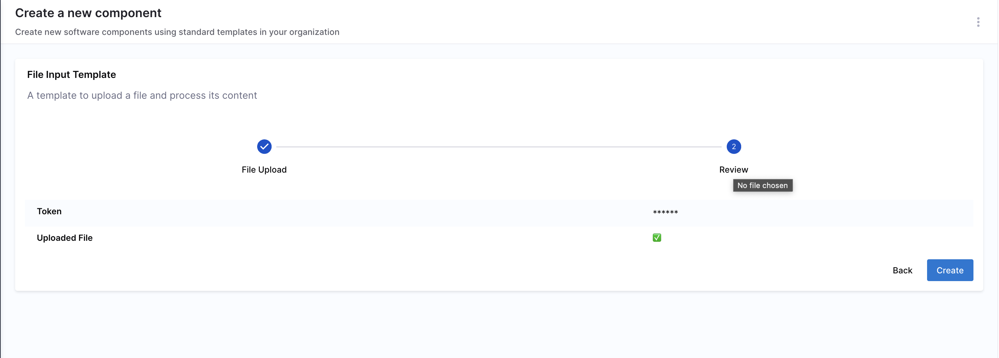
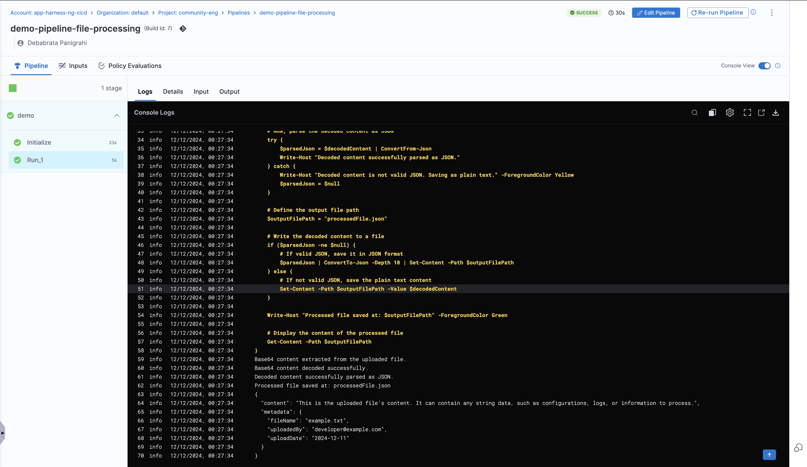

The frontend of **Harness IDP workflows** can be customized to accept different **input fields** based on specific requirements. It acts as the entry point where users provide details to run workflows using predefined input parameters.

A well-structured frontend improves the user experience by ensuring the right input types and validations. There are various input types and validation use cases. Let’s explore them in detail.

## Defining Workflow Inputs
You can define workflow inputs using the `spec.parameters` property in your `workflow.yaml`. Parameters are specified at the beginning of a workflow YAML file and define the inputs required from the user. These inputs allow users to pass values—such as repository names, versions, or other configurable items—that can be referenced throughout the workflow.

### YAML Syntax

#### Example YAML
```YAML
# Example of defining parameters
parameters:
  - title: Project Configuration
    properties:
      projectName:
        title: Project Name
        type: string
        description: The name of the new project
      githubRepo:
        title: GitHub Repository
        type: string
        description: The GitHub repository where the project will be initialized
      environment:
        title: Deployment Environment
        type: string
        enum:
          - dev
          - staging
          - production
        description: The environment for deployment
```
#### YAML Breakdown
- **`parameters`**: This key holds an array of parameter definitions. Each parameter is defined as an object that specifies its title, type, and additional details, such as whether it is required or has specific options like enums (choices).  

  - **`title`**: The title of the input form displayed in the frontend when prompting the user for input.  
  - **`properties`**: Defines individual input fields, where each property corresponds to a separate and specific input field.  
    - **`title`**: The label or name for the parameter input field, shown in the frontend.  
    - **`type`**: The expected data type of the input. Common types include:  
      - **`string`**: A free-text input field.  
      - **`number`**: Accepts numeric values.  
      - **`boolean`**: A true/false checkbox.  
    - **`description`**: A brief explanation of the parameter's purpose.  
    - **`required`**: Indicates whether the input is mandatory.  
    - **`enum`**: A list of predefined options the user can choose from, useful for fields like deployment environments (e.g., dev, staging, production).  
    - **`ui:widget`**: Specifies the UI element used for input (e.g., text field, dropdown).  

## Input Types
Here are the different ways to design form inputs in IDP workflows:

### Static Inputs
**Static inputs** are fields where users manually enter their details as defined in the frontend. These inputs come in various types:

- `string` – Single-line text input
- `textarea` – Multi-line text input
- `number` – Numeric input
- `boolean` – Checkbox (true/false)
- `enum` – Dropdown selection from a predefined list
- `array` – List of values (e.g., strings, numbers)
- `object` – Key-value pair inputs
- `password` – Masked input for sensitive values

### Dynamic Inputs
**Dynamic inputs** are fields that automatically retrieve data from external sources or runtime context, eliminating the need for manual entry.

1. **[Standard Workflow UI Picker](/docs/internal-developer-portal/flows/flows-input#workflow-ui-pickers)**
    - `Entity Picker` – Select an entity from the catalog
    - `Owner Picker` – Select a user or group
    - `Repository Picker` – Choose a repository from a version control provider

2. **[API Based Dynamic Workflow UI Picker](/docs/internal-developer-portal/flows/dynamic-picker)**

    - `Dynamic API Picker` – Fetch options dynamically via an API request
    - `Autocomplete Fields` – Suggestions based on previous inputs or external data fetched using Dynamic API Picker. 

## Workflows Playground
:::caution
The Workflows Playground **does not render accurate previews** for **advanced user inputs** and **complex use cases** such as conditional fields or complex input formats. It is recommended to use the editor only for **lightweight input previews**. For accurate validation of **advanced inputs**, test the Workflow Form Inputs in an **actual Workflow execution**.
:::

Harness IDP also provides a **built-in editor** to help you build your **Workflow's Frontend**. It offers a real-time preview of the corresponding UI based on the YAML definition. Here, you can create a new workflow or edit an existing one.  '

**Note:** The editor is for **preview purposes** only; changes made here cannot be saved. Once you have tested the modifications, you must manually copy the updated YAML and add it to the Workflow definition YAML stored in your Git provider.  

For more information on **accessing the Workflow Playground**, check out the details [here](/docs/internal-developer-portal/flows/worflowyaml.md).

## Input Examples

### Simple text input

#### Basic Input

Basic form inputs allow users to enter structured data while ensuring it meets predefined rules. You can enforce limits such as character counts, patterns, and UI hints to guide users in filling out the form accurately.

#### [Example `workflow.yaml`](https://github.com/harness-community/idp-samples/blob/main/workflow-examples/text-input-pattern.yaml)

This example demonstrates a simple text input field with:

- A `title` and `description` for clarity.
- A **maximum length constraint** (`maxLength: 8`).
- A r**egex pattern validation** (`pattern`) to enforce naming rules.
- **UI enhancements** like autofocus and helper text.

<details>
<summary>Example YAML</summary>

```YAML
parameters:
  - title: Fill in some steps
    properties:
      name:
        title: Simple text input
        type: string
        description: Description about input
        maxLength: 8
        pattern: "^([a-zA-Z][a-zA-Z0-9]*)(-[a-zA-Z0-9]+)*$"
        ui:autofocus: true
        ui:help: "Hint: additional description..."
```

</details>


#### Multi-line text input

Multi-line text inputs are useful for capturing larger blocks of text, such as descriptions, configuration snippets, or scripts. This example demonstrates how to use a textarea widget to enable multi-line input, with additional UI options for better usability.

Example [`workflows.yaml`](https://github.com/harness-community/idp-samples/blob/main/workflow-examples/multi-line-input.yaml)

This configuration includes:

- A textarea widget (`ui:widget: textarea`) for multi-line input.
- Custom row height (`ui:options: rows: 10`) for better visibility.
- A **placeholder example** showcasing a shell script.
- **Helper text** (`ui:help`) to guide users.

<details>
<summary>Example YAML</summary>

```YAMl
parameters:
  - title: Fill in some steps
    properties:
      multiline:
        title: Text area input
        type: string
        description: Insert your multi line string
        ui:widget: textarea
        ui:options:
          rows: 10
        ui:help: 'Hint: Make it strong!'
        ui:placeholder: |
          a=50
          b=60
          sh << word
          > echo "Equation: a + b = 110"
          > echo $(($a + $b))
          > echo ""
          > echo "Inside Here Tag, Assignment c=110"
          > c=`expr $a + $b`
          > echo $c
          > word
```

</details>


### Array options

Array inputs allow users to provide multiple values, either as strings, numbers, or complex objects. These can be structured to ensure uniqueness, predefined options, or flexible custom objects.

#### Array with strings

You can add an array to the workflow with string values, allowing users to select one option when filling out the workflow.

Example [`workflows.yaml`](https://github.com/harness-community/idp-samples/blob/main/workflow-examples/arrays.yaml)

#### Array with distinct values

Values mentioned under `enum` needs to be distinct, duplicate values aren't allowed under `enum`.

<details>
<summary>Example YAML</summary>

```YAML
parameters:
  - title: Fill in some steps
    required:
      - name
    properties:
      name:
        title: Name
        type: string
        description: Unique name of the component
      volume:
        title: Volume Type
        type: string
        description: The volume type to be used
        default: 'Cold HDD'
        enum:
          - 'Provisioned IOPS'
          - 'Cold HDD'
          - 'Throughput Optimized HDD'
          - 'Magnetic'
```

</details>


#### Array with duplicate values

Allows multiple values, including duplicates, by using `enumNames` to provide user-friendly labels.

<details>
<summary>Example YAML</summary>

```YAML
parameters:
  - title: Fill in some steps
    properties:
      volume_type:
        title: Volume Type
        type: string
        description: The volume type to be used
        default: gp2
        enum:
          - gp2
          - gp3
          - io1
          - io2
          - sc1
          - st1
          - standard
        enumNames:
          - 'General Purpose SSD (gp2)'
          - 'General Purpose SSD (gp3)'
          - 'Provisioned IOPS (io1)'
          - 'Provisioned IOPS (io2)'
          - 'Cold HDD (sc1)'
          - 'Throughput Optimized HDD (st1)'
          - 'Magnetic (standard)'
```

</details>


#### A multiple choices list with checkboxes

Users can select multiple predefined values from checkboxes.

Key Features:
- Supports **multiple selections**
- Uses **checkbox UI** for easy selection
- Ensures **unique selections** with `uniqueItems: true`

Example [`workflows.yaml`](https://github.com/harness-community/idp-samples/blob/5140ef7993a3c932c49af9162562a99e16428080/workflow-examples/multi-choice-list.yaml#L24-L34)

<details>
<summary>Example YAML</summary>

```yaml
parameters:
  - title: Fill in some steps
    properties:
      name:
        title: Select environments
        type: array
        items:
          type: string
          enum:
            - production
            - staging
            - development
        uniqueItems: true
        ui:widget: checkboxes
```

</details>


#### Array with Custom Objects

This allows users to enter an **array of complex objects**, each containing multiple fields. It supports adding, removing, and reordering objects dynamically.

Example [`workflows.yaml`](https://github.com/harness-community/idp-samples/blob/5140ef7993a3c932c49af9162562a99e16428080/workflow-examples/multi-choice-list.yaml#L24-L34)

A user needs to provide a list of configurations, each containing:

- A dropdown selection (`array`)
- A boolean flag (`flag`)
- A free-text input (`someInput`)

<details>
<summary>Example YAML</summary>

```yaml
parameters:
  - title: Fill in some steps
    properties:
      arrayObjects:
        title: Array with custom objects
        type: array
        minItems: 0
        ui:options:
          addable: true
          orderable: true
          removable: true
        items:
          type: object
          properties:
            array:
              title: Array string with default value
              type: string
              default: value3
              enum:
                - value1
                - value2
                - value3
            flag:
              title: Boolean flag
              type: boolean
              ui:widget: radio
            someInput:
              title: Simple text input
              type: string
```

</details>


### Comparison Table of Array Input Types  

The table compares array input types based on key features:

- Distinct Values: Dropdowns ensure unique values, checkboxes allow duplicates.
- Duplicate Values: Checkboxes support duplicates, dropdowns do not.
- Multiple Choice: Checkboxes and custom arrays allow multiple selections, dropdowns do not.
- Custom Objects: Only custom object arrays support complex data.
- User-friendly Labels: Checkboxes and custom arrays can have labels, dropdowns cannot.

| Feature | Distinct Values | Duplicate Values | Multiple Choice List | Custom Object Array |
|---------|----------------|------------------|----------------------|---------------------|
| **Dropdown Selection** | ✅ | ✅ | ❌ | ❌ |
| **Checkbox UI** | ❌ | ❌ | ✅ | ❌ |
| **Allows Multiple Selections** | ❌ | ❌ | ✅ | ✅ |
| **Supports Complex Objects** | ❌ | ❌ | ❌ | ✅ |
| **User-friendly Labels** (`enumNames`) | ❌ | ✅ | ❌ | ✅ |


#### Pass an Array of Inputs to a Harness Pipeline 

Harness Pipelines only support three variable types:

- String
- Number
- Secret

This means that arrays cannot be directly passed as pipeline inputs. Instead, if you need to pass multiple values, you should convert the array into a comma-separated string using [join](https://mozilla.github.io/nunjucks/templating.html#join) in Nunjucks.

- Use Case: 
You want users to select multiple values from a `enum` list, and then pass those values as a single comma-separated string into the Harness Pipeline’s `inputset`.

- How It Works: 
1. User selects multiple options from an enum list (`Option1`, `Option2`, `Option3`).
2. The selected options are joined into a single string using `parameters.exampleVar.join(',')`.
3. The pipeline **receives the values as a single string**, ensuring compatibility with Harness’ input format.

```YAML
    - title: Pass Variables Here      
      properties:
        exampleVar:
          title: Select an option
          type: array
          items:
            type: string
            enum:
              - Option1
              - Option2
              - Option3
          default: 
            - Option1
      ui:
        exampleVar:
          title: Select Options
          multi: true
  steps:
    - id: trigger
      name: Call a harness pipeline, and pass the variables from above
      action: trigger:harness-custom-pipeline
      input:
        url: 'https://app.harness.io/ng/account/*********/home/orgs/default/projects/*************/pipelines/*************/pipeline-studio/?storeType=INLINE'
        inputset:
          exampleVar: ${{ parameters.exampleVar.join(',') }}
          owner: ${{ parameters.owner }}
        apikey: ${{ parameters.token }}
```


### Boolean options

Boolean inputs allow users to select between true/false or yes/no values in forms. These inputs are useful for enabling/disabling features, selecting configuration options, and making binary choices.

#### Basic Boolean (Checkbox Input)

A simple **checkbox** allows users to toggle a setting on/off.

```YAML
parameters:
  - title: Fill in some steps
    properties:
      name:
        title: Checkbox boolean
        type: boolean
```


#### Boolean Yes or No options (Radio Button)

Instead of a checkbox, you can use radio buttons for a clearer Yes/No selection.

```YAML
parameters:
  - title: Fill in some steps
    properties:
      name:
        title: Yes or No options
        type: boolean
        ui:widget: radio
```


#### Boolean multiple options

For cases where **multiple boolean choices** are needed, you can use an array of checkboxes.

<details>
<summary>Example YAML</summary>

```yaml
parameters:
  - title: Fill in some steps
    properties:
      name:
        title: Select features
        type: array
        items:
          type: boolean
          enum:
            - "Enable scraping"
            - "Enable HPA"
            - "Enable cache"
        uniqueItems: true
        ui:widget: checkboxes
```

</details>


#### When to Use Each Boolean Input Type

| **Input Type**            | **Best Use Case**           | **Example Scenario**                |
|---------------------------|----------------------------|--------------------------------------|
| **Checkbox Boolean**       | Single feature toggle      | Enable/Disable Dark Mode            |
| **Radio Button Boolean**   | Explicit Yes/No choice     | Confirming a deletion               |
| **Multi-Select Boolean**   | Selecting multiple options | Enable multiple monitoring features |

## Workflow UI Pickers

User input is a crucial aspect of Workflows. However, built-in components and fields may not always meet specific requirements, and at times, you may want to enhance the form with more intuitive and tailored inputs.  

This is where **Workflow UI Pickers** come in.

### Harness Specific UI Pickers

### 1. `EntityFieldPicker` (Fetch values from catalog)

The `EntityFieldPicker` can be used to fetch information for workflows that are already defined in the catalog, such as data under `metadata.annotations`. 

:::info

Only **string** data `type` is supported for the `EntityPicker`.

:::

The input props that can be specified under `ui:options` for the `EntityFieldPicker` field extension.

#### `displayField`

This is used to fetch the value from catalog dynamically, corresponding to the key mentioned.

```YAML
jiraprojectID:
    title: Jira Project Key
    type: string
    description: The key for your JIRA project
    ui:field: EntityFieldPicker
    ui:displayField: metadata.jiraProjectId
    ui:options:
    catalogFilter:
        kind:
        - Component
        - Service
```

In the above example it will fetch all the `jiraProjectId` for the software components `kind` mentioned under `catalogFilter`.

#### `allowArbitraryValues`

Whether to allow arbitrary user input. Defaults to true.

`allowArbitraryValues` provides input validation when selecting an entity as the values you enter will correspond to a valid entity.

- Adding a valid entity with `allowArbitraryValues` as `false`

```yaml
entity:
  title: Entity
  type: string
  description: Entity of the component
  ui:field: EntityFieldPicker
  ui:options:
    allowArbitraryValues: false
```

- Adding an arbitrary entity with `allowArbitraryValues` as `true` (default value)

```yaml
entity:
  title: Entity
  type: string
  description: Entity of the component
  ui:field: EntityFieldPicker
  ui:options:
    allowArbitraryValues: true
```

#### `catalogFilter`

`catalogFilter` supports filtering options by any field(s) of an entity.

- Get all entities of kind `Group`

```yaml
entity:
  title: Entity
  type: string
  description: Entity of the component
  ui:field: EntityFieldPicker
  ui:options:
    catalogFilter:
      - kind: Group
```

- Get entities of kind `Group` and spec.type `team`

```yaml
entity:
  title: Entity
  type: string
  description: Entity of the component
  ui:field: EntityFieldPicker
  ui:options:
    catalogFilter:
      - kind: Group
        spec.type: team
```

#### `defaultKind`

The default entity kind.

```yaml
system:
  title: System
  type: string
  description: System of the component
  ui:field: EntityFieldPicker
  ui:options:
    catalogFilter:
      kind: System
    defaultKind: System
```

#### `defaultNamespace`

The ID of a namespace that the entity belongs to. The default value is `default`.

- Listing all entities in the `default` namespace (default value)

```yaml
entity:
  title: Entity
  type: string
  description: Entity of the component
  ui:field: EntityFieldPicker
  ui:options:
    defaultNamespace: default
```

### 2. `HarnessOrgPicker`

Fetches all the organization, under the account dynamically. 

```YAML
#Example
apiVersion: scaffolder.backstage.io/v1beta3
kind: Template
metadata:
  name: your-workflow
  ...
spec:
  ...
  parameters:
    - title: Details
       properties:
         projectId:
           title: Project Identifier
           description: Harness Project Identifier
           type: string
           ui:field: HarnessProjectPicker
         orgId:
            title: Org Identifier
            type: string
            ui:field: HarnessOrgPicker
    ...
```

### 3. `HarnessProjectPicker`

Fetches all the Harness project ID, available in the account dynamically

```YAML
# Example workflow.yaml file
apiVersion: scaffolder.backstage.io/v1beta3
kind: Template
metadata:
  name: your-workflow
  ...
spec:
  ...
  parameters:
    - title: Details
       properties:
         projectId:
           title: Project Identifier
           description: Harness Project Identifier
           type: string
           ui:field: HarnessProjectPicker
```

### 4. `HarnessAutoOrgPicker`

It autopopulates org ID on project selection. So now when you select a project ID as an input the org ID gets selected automatically if required as an input.

1. For `HarnessAutoOrgPicker` to work, it is suggested to name the Project Identifier under Properties as `projectId` and using the `HarnessProjectPicker`.

```YAML
# Example workflow.yaml file
apiVersion: scaffolder.backstage.io/v1beta3
kind: Template
metadata:
  name: your-workflow
  ...
spec:
  ...
  parameters:
    - title: Details
       properties:
         projectId:
           title: Project Identifier
           description: Harness Project Identifier
           type: string
           ui:field: HarnessProjectPicker
         orgId:
           title: Org Identifier
           description: Harness org Identifier
           type: string
           ui:field: HarnessAutoOrgPicker

```

2. In case the properties Project Identifier is named something else other than `projectId` in that case for the Workflow action to function as desired we need to add it as a dependency under `projectPickerRef`

```YAML
# Example workflow.yaml file
properties:
    <ANY NAME OTHER THAN projectId>:
        title: Project Identifier
        description: Harness Project Identifier
        type: string
        ui:field: HarnessProjectPicker
    orgId:
        title: Org Identifier
        description: Harness org Identifier
        type: string
        ui:field: HarnessAutoOrgPicker
        dependencies:
          projectPickerRef:
            - 'project_name'
```

### Other UI Pickers

### 1. `OwnerPicker`

`OwnerPicker` is used for developers to pick a User Group from the list of Groups that exist in the account.


#### `allowArbitraryValues`

Whether to allow arbitrary user input. Defaults to true.

`allowArbitraryValues` provides input validation when selecting an owner as the values you enter will correspond to a valid owner.

- Adding a valid owner with `allowArbitraryValues` as `false`

```YAML
owner:
  title: Owner
  type: string
  description: Owner of the component
  ui:field: OwnerPicker
  ui:options:
    allowArbitraryValues: false
```

- Adding an arbitrary owner with `allowArbitraryValues` as `true` (default value)

```YAML
owner:
  title: Owner
  type: string
  description: Owner of the component
  ui:field: OwnerPicker
  ui:options:
    allowArbitraryValues: true
```

#### `catalogFilter`

`catalogFilter` supports filtering options by any field(s) of an entity.

- Get all entities of kind `Group`

```YAML
owner:
  title: Owner
  type: string
  description: Owner of the component
  ui:field: OwnerPicker
  ui:options:
    catalogFilter:
      - kind: Group
```

- Get entities of kind `Group` and spec.type `team`

```YAML
owner:
  title: Owner
  type: string
  description: Owner of the component
  ui:field: OwnerPicker
  ui:options:
    catalogFilter:
      - kind: Group
        spec.type: team
```

#### `defaultNamespace`

The ID of a namespace that the owner belongs to. The default value is `default`.

- Listing owners in the `default` namespace (default value)

```YAML
owner:
  title: Owner
  type: string
  description: Owner of the component
  ui:field: OwnerPicker
  ui:options:
    catalogFilter:
      - kind: Group
    defaultNamespace: default
```

- Listing owners in the `payment` namespace

```YAML
owner:
  title: Owner
  type: string
  description: Owner of the component
  ui:field: OwnerPicker
  ui:options:
    catalogFilter:
      - kind: Group
    defaultNamespace: payment
```

### 2. `EntityPicker`

:::info

Only **string** data `type` is supported for the `EntityPicker`.

:::

The input props that can be specified under `ui:options` for the `EntityPicker` field extension.

#### `allowArbitraryValues`

Whether to allow arbitrary user input. Defaults to true.

`allowArbitraryValues` provides input validation when selecting an entity as the values you enter will correspond to a valid entity.

- Adding a valid entity with `allowArbitraryValues` as `false`

```YAML
entity:
  title: Entity
  type: string
  description: Entity of the component
  ui:field: EntityPicker
  ui:options:
    allowArbitraryValues: false
```

- Adding an arbitrary entity with `allowArbitraryValues` as `true` (default value)

```YAML
entity:
  title: Entity
  type: string
  description: Entity of the component
  ui:field: EntityPicker
  ui:options:
    allowArbitraryValues: true
```

#### `catalogFilter`

`catalogFilter` supports filtering options by any field(s) of an entity.

- Get all entities of kind `Group`

```YAML
entity:
  title: Entity
  type: string
  description: Entity of the component
  ui:field: EntityPicker
  ui:options:
    catalogFilter:
      - kind: Group
```

- Get entities of kind `Group` and spec.type `team`

```YAML
entity:
  title: Entity
  type: string
  description: Entity of the component
  ui:field: EntityPicker
  ui:options:
    catalogFilter:
      - kind: Group
        spec.type: team
```

#### `defaultKind`

The default entity kind.

```yaml
system:
  title: System
  type: string
  description: System of the component
  ui:field: EntityPicker
  ui:options:
    catalogFilter:
      kind: System
    defaultKind: System
```

#### `defaultNamespace`

The ID of a namespace that the entity belongs to. The default value is `default`.

- Listing all entities in the `default` namespace (default value)

```YAML
entity:
  title: Entity
  type: string
  description: Entity of the component
  ui:field: EntityPicker
  ui:options:
    defaultNamespace: default
```

### 3. `MultiEntityPicker`

The input props that can be specified under `ui:options` for the `MultiEntityPicker` field extension.

#### `allowArbitraryValues`

Whether to allow arbitrary user input. Defaults to true.

`allowArbitraryValues` provides input validation when selecting an entity as the values you enter will correspond to a valid entity.

- Adding a valid entity with `allowArbitraryValues` as `false`

```yaml
entity:
  title: Entities
  type: array
  description: Entities of the component
  ui:field: MultiEntityPicker
  ui:options:
    allowArbitraryValues: false
```

- Adding an arbitrary entity with `allowArbitraryValues` as `true` (default value)

```yaml
entity:
  title: Entities
  type: array
  description: Entities of the component
  ui:field: MultiEntityPicker
  ui:options:
    allowArbitraryValues: true
```

#### `catalogFilter`

`catalogFilter` supports filtering options by any field(s) of an entity.

- Get all entities of kind `Group`

```yaml
entity:
  title: Entities
  type: array
  description: Entities of the component
  ui:field: MultiEntityPicker
  ui:options:
    catalogFilter:
      - kind: Group
```

- Get entities of kind `Group` and spec.type `team`

```yaml
entity:
  title: Entities
  type: array
  description: Entities of the component
  ui:field: MultiEntityPicker
  ui:options:
    catalogFilter:
      - kind: Group
        spec.type: team
```

#### `defaultKind`

The default entity kind.

```yaml
system:
  title: System
  type: array
  description: Systems of the component
  ui:field: MultiEntityPicker
  ui:options:
    catalogFilter:
      kind: System
    defaultKind: System
```

#### `defaultNamespace`

The ID of a namespace that the entity belongs to. The default value is `default`.

- Listing all entities in the `default` namespace (default value)

```yaml
entity:
  title: Entity
  type: array
  description: Entities of the component
  ui:field: MultiEntityPicker
  ui:options:
    defaultNamespace: default
```

- Listing all entities in the `payment` namespace

```yaml
entity:
  title: Entity
  type: array
  description: Entities of the component
  ui:field: MultiEntityPicker
  ui:options:
    defaultNamespace: payment
```

### Repository Picker

To simplify working with repository providers, we’ve built a custom picker that can be used by overriding the `ui:field` option in the `uiSchema` for a `string` field. Instead of displaying a standard text input, this picker renders a custom component that allows users to easily select a repository provider and enter details like project/owner and repository name.  

You can see this in the full example , where it appears as a separate step and looks something like this:

```yaml
- title: Choose a location
  required:
    - repoUrl
  properties:
    repoUrl:
      title: Repository Location
      type: string
      ui:field: RepoUrlPicker
      ui:options:
        allowedHosts:
          - github.com
```

The `allowedHosts` part should be set to where you wish to enable this Workflow
to publish to. And it can be any host that is listed in your `integrations`
config in `app-config.yaml`.

Besides specifying `allowedHosts` you can also restrict the Workflow to publish to
repositories owned by specific users/groups/namespaces by setting the `allowedOwners`
option. With the `allowedRepos` option you are able to narrow it down further to a
specific set of repository names. A full example could look like this:

```yaml
- title: Choose a location
  required:
    - repoUrl
  properties:
    repoUrl:
      title: Repository Location
      type: string
      ui:field: RepoUrlPicker
      ui:options:
        allowedHosts:
          - github.com
        allowedOwners:
          - backstage
          - someGithubUser
        allowedRepos:
          - backstage
```

For a list of all possible `ui:options` input props for `RepoUrlPicker`, please visit [here](https://backstage.io/docs/features/software-templates/ui-options-examples/).

#### Using the Users `oauth` token

There's a little extra magic that you get out of the box when using the
`RepoUrlPicker` as a field input. You can provide some additional options under
`ui:options` to allow the `RepoUrlPicker` to grab a `oauth` token for the user
for the required `repository`.

This is great for when you are wanting to create a new repository, or wanting to
perform operations on top of an existing repository.

A sample Workflow that takes advantage of this is like so:

<details>
<summary>Example YAML</summary>

```yaml
apiVersion: scaffolder.backstage.io/v1beta3
kind: Template
metadata:
  name: v1beta3-demo
  title: Test Action Workflow
  description: Workflows Demo
spec:
  owner: backstage/techdocs-core
  type: service

  parameters:
    ...

    - title: Choose a location
      required:
        - repoUrl
      properties:
        repoUrl:
          title: Repository Location
          type: string
          ui:field: RepoUrlPicker
          ui:options:
            # Here's the option you can pass to the RepoUrlPicker
            requestUserCredentials:
              secretsKey: USER_OAUTH_TOKEN
              additionalScopes:
                github:
                  - workflow
            allowedHosts:
              - github.com
    ...

  steps:
    ...

    - id: publish
      name: Publish
      action: publish:github
      input:
        allowedHosts: ['github.com']
        description: This is ${{ parameters.name }}
        repoUrl: ${{ parameters.repoUrl }}
        # here's where the secret can be used
        token: ${{ secrets.USER_OAUTH_TOKEN }}

    ...
```

</details>

You will see from above that there is an additional `requestUserCredentials`
object that is passed to the `RepoUrlPicker`. This object defines what the
returned `secret` should be stored as when accessing using
`${{ secrets.secretName }}`, in this case it is `USER_OAUTH_TOKEN`. And then you
will see that there is an additional `input` field into the `publish:github`
action called `token`, in which you can use the `secret` like so:
`token: ${{ secrets.USER_OAUTH_TOKEN }}`.

There's also the ability to pass additional scopes when requesting the `oauth`
token from the user, which you can do on a per-provider basis, in case your Workflow can be published to multiple providers.

Note, that you will need to configure a **connector** for your source code management (SCM) service to make this feature work.

## Conditional Inputs

Workflows support dynamic parameter handling using conditional logic. You can control how inputs are assigned based on specific conditions, allowing for greater flexibility in user selections and workflow execution.

### Conditionally set parameters

You can use the `if` keyword within a parameter to apply conditional logic using [Nunjucks templating](https://mozilla.github.io/nunjucks/templating.html#if). Since the `not` keyword is unavailable, use JavaScript-style equality instead.

Example: If `parameters.branchName` is set, use its value; otherwise, append a timestamp to a default name,`${{ parameters.branchName if parameters.branchName else appendTimestamp("default-branch-name-") }}`

:::info

These conditionals could be used only under `steps`

:::

<details>
<summary>Example YAML</summary>

```YAML
spec:
  parameters:
    - title: Fill in some steps
      properties:
        path:
          title: path
          type: string

  steps:
    - id: fetch
      name: Fetch template
      action: fetch:template
      input:
        url: ${{ parameters.path if parameters.path else '/root' }}
```

</details>

### Use parameters as conditional for fields

<details>
<summary>Example YAML</summary>

```yaml
parameters:
  - title: Fill in some steps
    properties:
      includeName:
        title: Include Name?
        type: boolean
        default: true

    dependencies:
      includeName:
        allOf:
          - if:
              properties:
                includeName:
                  const: true
            then:
              properties:
                lastName:
                  title: Last Name
                  type: string
```

</details>


1. **`One Of`**: Helps you create a dropdown in the Workflow, where only one of all the options available could be selected.

Example [`workflows.yaml`](https://github.com/harness-community/idp-samples/blob/05d533cb9789d5abffbdc103d55530efea489161/workflow-examples/conditional-one-of.yaml#L11-L25)

<details>
<summary>Example YAML</summary>

```YAML
dependencies:
  technology:
    oneOf:
      - properties:
          technology:
            enum:
              - java
          java version:
            type: "string"
            enum:
              - java8
              - java11
```

</details>


2. **`All Of`**: Helps you create a dropdown in the Workflow, where only all the options available could be selected.

Example [`workflows.yaml`](https://github.com/harness-community/idp-samples/blob/70f70f32dfca3ad394677b19608d72706cc8d38c/workflow-examples/conditional-all-of.yaml#L54-L77)

<details>
<summary>Example YAML</summary>

```YAML
type: object
allOf:
- properties:
    lorem:
      type:
      - string
      - boolean
      default: true
- properties:
    lorem:
      type: boolean
    ipsum:
      type: string
```

</details>


3. **`Any Of`**: Helps you to select from multiple properties where both can't be selected together at once.

Example [`workflows.yaml`](https://github.com/harness-community/idp-samples/blob/4215c82f933af1d3c1675b89baa2f042e83a60a2/workflow-examples/conditional-any-of.yaml#L31-L46)

**Example Workflow Explained**

1. **Parameters Structure**
   The parameters section includes `age` as an integer and `items` as an array. Each item in the array can contain either a `foo` or `bar` property, utilizing `anyOf`.

2. **Identification Methods**
   The Workflow allows for two methods of identification using `anyOf`. Users can provide either:

- A first name and last name (defaulting `firstName` to "Chuck"), or
- An ID code.

3. **Required Fields**
   The `age` field is required, while the fields under the two identification methods are optional but must comply with the `anyOf` logic.

4. **Display Step**
   The steps section includes a `debug:log` action to display the collected information based on the provided input.

<details>
<summary>Example YAML</summary>

```YAML
type: object
properties:
  age:
    type: integer
    title: Age
  items:
    type: array
    items:
      type: object
      anyOf:
      - properties:
          foo:
            type: string
      - properties:
          bar:
            type: string
anyOf:
- title: First method of identification
  properties:
    firstName:
      type: string
      title: First name
      default: Chuck
    lastName:
      type: string
      title: Last name
- title: Second method of identification
  properties:
    idCode:
      type: string
      title: ID code
```

</details>


### Advanced use-cases

#### Usage of dependencies and reusable references.

<details>
<summary>Example YAML</summary>

```YAML
spec:
  owner: owner@company.com
  type: service
  parameters:
    - title: Infrastructure Provisioning
      type: object
      required:
        - environment_type
        - owner
      properties:
        owner:
          title: Choose an Owner for the Service
          type: string
          ui:field: OwnerPicker
          ui:options:
            allowedKinds:
              - Group
        # This field is hidden but needed to authenticate the request to trigger the pipeline
        token:
          title: Harness Token
          type: string
          ui:widget: password
          ui:field: HarnessAuthToken
        environment_type:
            title: environment_type
            type: string
            description: Name of the environment where you want to provision a resource
            enum:
              - dev
              - staging
              - prod
        infracomponent:
            title: infra component
            type: object
            properties:
                resource_type:
                    title: resource_type
                    type: string
                    description: Name of the resource that you want to provision
                    enum:
                        - s3
                        - vpc
                        - sns
                        - glue
                        - sqs
            required:
                - resource_type
            dependencies:
                resource_type:
                    oneOf:
                        - properties:
                              resource_type:
                                  enum:
                                      - s3
                                      - vpc
                              Operationtype:
                                  $ref: "#/myregion/operation"
      myregion:
          operation:
              title: region
              type: object
              properties:
                  ChooseRegion:
                      type: string
                      enum:
                          - Region A
                          - Region B
                          - Region C
```
</details>

Example [workflows.yaml](https://github.com/harness-community/idp-samples/blob/main/template-conditional-parameters.yaml)

The workflow defines an Infrastructure Provisioning setup with parameters, within `infracomponent`, the `resource_type` field is defined. The `dependencies` section ensures that, if `resource_type` is either `s3` or `vpc`, an additional field `Operationtype` (referenced from `myregion/operation`) is required.

```YAML
dependencies:
  resource_type:
    oneOf:
      - properties:
          resource_type:
            enum:
              - s3
              - vpc
          Operationtype:
            $ref: "#/myregion/operation"
```
What Happens Here?
- If a user selects `s3` or `vpc`, then `Operationtype` must also be provided.
- The `dependencies` field ensures `Operationtype` is only required when `resource_type` is `s3` or `vpc`.
- The use of `$ref: "#/myregion/operation"` allows referencing another part of the YAML file, ensuring DRY (Don't Repeat Yourself) principles.
- Users only see the relevant fields based on their selections.

#### Understanding dependencies usage and indentations

The `dependencies` keyword specifies conditional relationships between fields. When a field depends on another, its presence or properties change based on the value of the controlling field.

Structure of dependencies:

```YAML
dependencies:
  controlling_field:
    oneOf:
      - properties:
          controlling_field:
            enum:
              - option1
          dependent_field:
            type: string
            description: Visible when option1 is selected
        required:
          - dependent_field
      - properties:
          controlling_field:
            enum:
              - option2
          another_dependent_field:
            type: string
            description: Visible when option2 is selected
        required:
          - another_dependent_field
```

Things to take care of: 

1. Ensure `dependencies` is at the same level as `properties`.

2. Inside `oneOf`, `allOf`, or `anyOf`, indent `properties` and `required` correctly.

3. Each field inside `dependencies` should align with its `controlling` field.


For more such references and validate your conditional steps take a look at the [react-json schema project](https://rjsf-team.github.io/react-jsonschema-form/).

## Advanced Input Configurations

### Upload a file using Workflows

Workflow supports a limited form of file types as input, in the sense that it will parse the file contents to Workflow inputs as [data-urls](https://developer.mozilla.org/en-US/docs/Web/URI/Schemes/data).

There are 3 types of file upload.

1. Single File: There are two formats available `data-url` and `file`. 
2. Multiple Files: Multiple files selectors are supported by defining an `array` of strings having `data-url` as a format. 
3. Single File with Accept Attribute: You can use the `accept` attribute to specify a filter for what file types the user can upload.

<details>
<summary>Example YAML</summary>

```YAML
#Example
title: Files
type: object
properties:
  file:
    type: string
    format: data-url
    title: Single file
  files:
    type: array
    title: Multiple files
    items:
      type: string
      format: data-url
  filesAccept:
    type: string
    format: data-url
    title: Single File with Accept attribute
    ui:enableMarkdownInDescription: true
    ui:description: Provide the Json File
    ui:options:
      accept: .json
```
</details>


### Hide the uploaded file contents in Workflow review page

When you upload a file in Workflows, you can see the base-64 encoded content of the file on the review page, to hide them you can use `ui:backstage`. 

```YAML
...
properties:
  uploaded_file:
    title: Upload File
    type: string
    format: data-url
    description: Upload a file that will be processed in the workflow
    ui:backstage:
      review:
        show: false
        mask: true
...
```
[Example workflow.yaml](https://github.com/harness-community/idp-samples/blob/main/workflow-examples/uploaded-files.yaml)



### How to use the contents of the file uploaded

Files uploaded to workflows are automatically encoded in **base64** format. To use the contents of an uploaded file, the **base64-encoded data** must first be decoded. This can be achieved using the Run Step in IDP stage.

1. Start with a Run Step in IDP stage, write a script in the step to: 
  - Extract the base64-encoded content from the uploaded file.
  - Decode the content back to its original format.
2. Process or utilize the decoded content as needed in the steps that follow.

**Without decoding, the uploaded file contents cannot be directly used.** 

Here's an [example](https://github.com/harness-community/idp-samples/blob/main/idp-pipelines/parse-base64-file.yaml) harness pipeline that uses [PowerShell](https://github.com/harness-community/idp-samples/blob/32845bbeca9d5219c5a71622043a66652904ff7d/idp-pipelines/parse-base64-file.yaml#L27-L84) in run step to decode the content of the file uploaded to Workflows. 



### Using Secrets

You may want to mark things as secret and make sure that these values are protected and not available through REST endpoints. You can do this by using the built-in `ui:field: Secret` and `ui:widget: password`.

:::info
`ui:widget: password` needs to be mentioned under the first `page` in-case you have multiple pages.

```YAML {14}
# example workflow.yaml
...
parameters:
  - title: <PAGE-1 TITLE>
    properties:
      property-1:
        title: title-1
        type: string
      property-2:
        title: title-2
    token:
      title: Harness Token
      type: string
      ui:widget: password
      ui:field: HarnessAuthToken
  - title: <PAGE-2 TITLE>
    properties:
      property-1:
        title: title-1
        type: string
      property-2:
        title: title-2
  - title: <PAGE-n TITLE>
...
```

:::

You can define this property as any normal parameter, however the consumption of this parameter will not be available through `${{ parameters.myKey }}` you will instead need to use `${{ secrets.myKey }}` in your `workflow.yaml`.

Parameters will be automatically masked in the review step.

<details>
<summary>Example YAML</summary>

```YAML
apiVersion: scaffolder.backstage.io/v1beta3
kind: Template
metadata:
  name: v1beta3-demo
  title: Test Action Workflow
  description: Workflows Demo
spec:
  owner: backstage/techdocs-core
  type: service

  parameters:
    - title: Authentication
      description: Provide authentication for the resource
      required:
        - username
        - password
      properties:
        username:
          type: string
          # use the built in Secret field extension
          ui:field: Secret
        password:
          type: string
          ui:field: Secret

  steps:
    - id: setupAuthentication
      action: auth:create
      input:
        # make sure to use ${{ secrets.parameterName }} to reference these values
        username: ${{ secrets.username }}
        password: ${{ secrets.password }}
```

</details>

### Pre-fill workflows with URL Params

We can now automatically load IDP Workflow forms pre-filled using the `formData` URL query parameter. e.g.: `https://app.harness.io/ng/account/account_id/module/idp/create/templates/default/a-python-lambda?formData=%7B%22project_name%22%3A%22auto%20filled%22%7D`

The query parameters `?formData=%7B%22project_name%22%3A%22auto%20filled%22%7D` in the end of the URL allow you to automatically fill in values of the form. Please see the below table for explanation of individual tokens in the query param.

| Item                | Example Value                           | Explanation                                                                                      |
| ------------------- | --------------------------------------- | ------------------------------------------------------------------------------------------------ |
| `formData`          | `formData`                              | Key of the query param.`formData` object is used to fill out IDP Workflow forms.                 |
| `{"key"%3A"value"}` | `{"title"%3A"Title from query params"}` | Value of the query param. A JSON object with invalid URL characters encoded.`:` encodes to `%3A` |

### Add Read only Fields

Using automatically filled out values is handy when wanting to direct users to use IDP Workflows with known good values. This also allows automation to be constructed around the Workflows, where the automation can provide fully constructed IDP URLs to the user. You can also prevent user from modifying the form values inserted from query params by making the form fields `readonly`. See below example of a minimal form which would be filled using query params defined in the above explanation.

<details>
<summary>Example YAML</summary>

```YAML {15}
## Example Workflow
apiVersion: scaffolder.backstage.io/v1beta3
kind: Template
metadata:
  name: test-workflow-pipeline
  title: Test pipeline using Workflows
spec:
  owner: name.owner
  type: service
  parameters:
    - title: Repository Name
      properties:
        project_name:
          title: Name your project
          ui:readonly: true
          type: string
        token:
          title: Harness Token
          type: string
          ui:widget: password
          ui:field: HarnessAuthToken
  steps:
    - id: trigger
      name: Creating your github repository
      action: trigger:harness-custom-pipeline
      input:
        url: PIPELINE_URL
        inputset:
          github_org: ${{ parameters.project_name }}
        apikey: ${{ parameters.token }}
  output:
    links:
      - title: Pipeline Details
        url: ${{ steps.trigger.output.PipelineUrl }}

```

</details>

## For Use Cases Not Listed Here  
For scenarios not covered in this guide, it is recommended to use the [react-jsonschema-form playground](https://rjsf-team.github.io/react-jsonschema-form/) to design the UI for input fields. Additionally, [Nunjucks](https://mozilla.github.io/nunjucks/) serves as the templating engine for Self-Service Workflows.