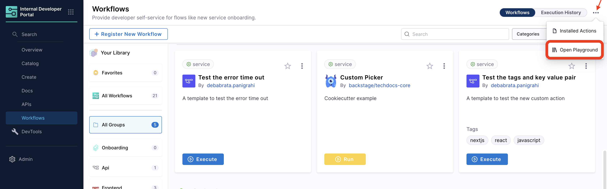
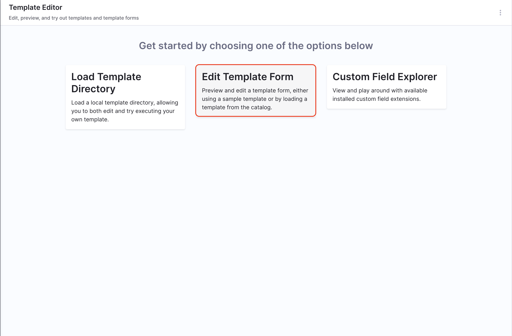

## Introduction

Workflows in Harness IDP is powered by the [Backstage Software Template](https://backstage.io/docs/features/software-templates/writing-templates). You can create your own Workflows with a small YAML definition which describes the self service workflows and its metadata, along with inputs variables that your Workflows will need, and then a list of actions which are then executed by the scaffolding service. It is suggested to use the [react-jsonschema-form playground](https://rjsf-team.github.io/react-jsonschema-form/) to build the frontend(UI for Inputs). [Nunjucks](https://mozilla.github.io/nunjucks/) is templating engine for the Self Service Workflows.

**Workflows** are stored in the **Catalog** under a **`kind` Template**. The minimum that is needed to define the frontend of the Workflows is a `workflows.yaml` file with metadata like `parameters`.

## Syntax for Workflows YAML

You might have noticed variables wrapped in `${{ }}` in the examples. These are strings for linking and gluing the different parts of the Workflows together. All the form inputs from the `parameters` section will be available by using this syntax (for example, `${{ parameters.firstName }}` inserts the value of `firstName` from the parameters). This is great for passing the values from the form into different steps and reusing these input variables.

These strings preserve the type of the parameter.

The `${{ parameters.firstName }}` pattern will work only in the Workflows file. If you want to start using values provided from the UI in your code, you will have to use the `${{ values.firstName }}` pattern. Additionally, you have to pass the parameters from the UI to the input of the `fetch:template` step.

<details>
<summary>Example YAML</summary>

```yaml
apiVersion: scaffolder.backstage.io/v1beta3
kind: Template
metadata:
  name: v1beta3-demo
  title: Test Action
  description: scaffolder v1beta3 template demo
spec:
  owner: backstage/techdocs-core
  type: service
  parameters:
    - title: Fill in some steps
      required:
        - name
      properties:
        name:
          title: Name
          type: string
          description: Unique name of your project
        urlParameter:
          title: URL endpoint
          type: string
          description: URL endpoint at which the component can be reached
          default: 'https://www.example.com'
        enabledDB:
          title: Enable Database
          type: boolean
          default: false
  ...
  steps:
    - id: fetch-base
      name: Fetch Base
      action: fetch:template
      input:
        url: ./template
        values:
          name: ${{ parameters.name }}
          url: ${{ parameters.urlParameter }}
          enabledDB: ${{ parameters.enabledDB }}
```
</details>

Afterwards, if you are using the builtin actions, you can start using the variables in your code. You can use also any other functions from [Nunjucks](https://mozilla.github.io/nunjucks/templating.html#tags) as well.

```bash
#!/bin/bash
echo "Hi my name is ${{ values.name }}, and you can fine me at ${{ values.url }}!"

echo "You have enabled your database!"

```

As you can see above in the `Outputs` section, `actions` and `steps` can also output things. You can grab that output using `steps.$stepId.output.$property`.

You can read more about all the `inputs` and `outputs` defined in the actions in code part of the `JSONSchema`

It is important to remember that all examples are based on [react-jsonschema-form](https://rjsf-team.github.io/react-jsonschema-form/).


## Using the Workflows Editor

Harness IDP provides an in-built editor to help you build the Workflows, it provides a real-time preview of the corresponding UI based on the YAML definition of the Workflows. Here you can work on building a new workflows along with trying out changes with the existing workflows. **You can't save the changes made here, rather you have to copy the changes made to the YAML and add it to the Workflow definition YAML stored in your git provider**. On the Workflows page go to **Open Playground** -> **Edit Template Form** to open the Workflows Editor. 





## Input Examples

## Simple text input

### Simple input with basic validations

Example [`workflows.yaml`](https://github.com/harness-community/idp-samples/blob/main/workflow-examples/text-input-pattern.yaml)

<details>
<summary>Example YAML</summary>

```yaml
parameters:
  - title: Fill in some steps
    properties:
      name:
        title: Simple text input
        type: string
        description: Description about input
        maxLength: 8
        pattern: '^([a-zA-Z][a-zA-Z0-9]*)(-[a-zA-Z0-9]+)*$'
        ui:autofocus: true
        ui:help: 'Hint: additional description...'
```
</details>


### Multi line text input

Example [`workflows.yaml`](https://github.com/harness-community/idp-samples/blob/main/workflow-examples/multi-line-input.yaml)

<details>
<summary>Example YAML</summary>

```YAMl
parameters:
  - title: Fill in some steps
    properties:
      multiline:
        title: Text area input
        type: string
        description: Insert your multi line string
        ui:widget: textarea
        ui:options:
          rows: 10
        ui:help: 'Hint: Make it strong!'
        ui:placeholder: |
          a=50
          b=60
          sh << word
          > echo "Equation: a + b = 110"
          > echo $(($a + $b))
          > echo ""
          > echo "Inside Here Tag, Assignment c=110"
          > c=`expr $a + $b`
          > echo $c
          > word
```
</details>


## Arrays options

### Array with strings

Example [`workflows.yaml`](https://github.com/harness-community/idp-samples/blob/main/workflow-examples/arrays.yaml)

<details>
<summary>Example YAML</summary>

### Array with distinct values

Values mentioned under `enum` needs to be distinct, duplicate values aren't allowed under `enum`. 

```YAML
parameters:
  - title: Fill in some steps
    required:
      - name
    properties:
      name:
        title: Name
        type: string
        description: Unique name of the component
      volume:
        title: Volume Type
        type: string
        description: The volume type to be used
        default: 'Cold HDD'
        enum:
          - 'Provisioned IOPS'
          - 'Cold HDD'
          - 'Throughput Optimized HDD'
          - 'Magnetic'
```

### Array with duplicate values

```YAML
parameters:
  - title: Fill in some steps
    properties:
      volume_type:
        title: Volume Type
        type: string
        description: The volume type to be used
        default: gp2
        enum:
          - gp2
          - gp3
          - io1
          - io2
          - sc1
          - st1
          - standard
        enumNames:
          - 'General Purpose SSD (gp2)'
          - 'General Purpose SSD (gp3)'
          - 'Provisioned IOPS (io1)'
          - 'Provisioned IOPS (io2)'
          - 'Cold HDD (sc1)'
          - 'Throughput Optimized HDD (st1)'
          - 'Magnetic (standard)'
```
</details>


### A multiple choices list

Example [`workflows.yaml`](https://github.com/harness-community/idp-samples/blob/5140ef7993a3c932c49af9162562a99e16428080/workflow-examples/multi-choice-list.yaml#L24-L34)

<details>
<summary>Example YAML</summary>

```yaml
parameters:
  - title: Fill in some steps
    properties:
      name:
        title: Select environments
        type: array
        items:
          type: string
          enum:
            - production
            - staging
            - development
        uniqueItems: true
        ui:widget: checkboxes
```
</details>


### Array with Custom Objects

Example [`workflows.yaml`](https://github.com/harness-community/idp-samples/blob/5140ef7993a3c932c49af9162562a99e16428080/workflow-examples/multi-choice-list.yaml#L24-L34)

<details>
<summary>Example YAML</summary>

```yaml
parameters:
  - title: Fill in some steps
    properties:
      arrayObjects:
        title: Array with custom objects
        type: array
        minItems: 0
        ui:options:
          addable: true
          orderable: true
          removable: true
        items:
          type: object
          properties:
            array:
              title: Array string with default value
              type: string
              default: value3
              enum:
                - value1
                - value2
                - value3
            flag:
              title: Boolean flag
              type: boolean
              ui:widget: radio
            someInput:
              title: Simple text input
              type: string
```
</details>


## Boolean options

### Boolean

```yaml
parameters:
  - title: Fill in some steps
    properties:
      name:
        title: Checkbox boolean
        type: boolean
```


### Boolean Yes or No options (Radio Button)

```yaml
parameters:
  - title: Fill in some steps
    properties:
      name:
        title: Yes or No options
        type: boolean
        ui:widget: radio
```


### Boolean multiple options

<details>
<summary>Example YAML</summary>

```yaml
parameters:
  - title: Fill in some steps
    properties:
      name:
        title: Select features
        type: array
        items:
          type: boolean
          enum:
            - 'Enable scraping'
            - 'Enable HPA'
            - 'Enable cache'
        uniqueItems: true
        ui:widget: checkboxes
```

</details>


## Conditional Inputs in Templates

### Use parameters as condition in steps

<details>
<summary>Example YAML</summary>

```yaml
- name: Only development environments
  if: ${{ parameters.environment === "staging" and parameters.environment === "development" }}
  action: debug:log
  input:
    message: 'development step'

- name: Only production environments
  if: ${{ parameters.environment === "prod" or parameters.environment === "production" }}
  action: debug:log
  input:
    message: 'production step'
```
</details>

### Conditionally set parameters

<details>
<summary>Example YAML</summary>

```yaml
spec:
  parameters:
    - title: Fill in some steps
      properties:
        path:
          title: path
          type: string

  steps:
    - id: fetch
      name: Fetch template
      action: fetch:template
      input:
        url: ${{ parameters.path if parameters.path else '/root' }}
```
</details>

### Use parameters as conditional for fields

<details>
<summary>Example YAML</summary>

```yaml
parameters:
  - title: Fill in some steps
    properties:
      includeName:
        title: Include Name?
        type: boolean
        default: true

    dependencies:
      includeName:
        allOf:
          - if:
              properties:
                includeName:
                  const: true
            then:
              properties:
                lastName:
                  title: Last Name
                  type: string
```

</details>


1. **`One Of`**: Helps you create a dropdown in the template, where only one of all the options available could be selected. 

Example [`workflows.yaml`](https://github.com/harness-community/idp-samples/blob/05d533cb9789d5abffbdc103d55530efea489161/workflow-examples/conditional-one-of.yaml#L11-L25)

<details>
<summary>Example YAML</summary>

```YAML
dependencies:
  technology:
    oneOf:
      - properties:
          technology:
            enum:
              - java
          java version:
            type: "string"
            enum:
              - java8
              - java11
```
</details>


2. **`All Of`**: Helps you create a dropdown in the template, where only all the options available could be selected.

Example [`workflows.yaml`](https://github.com/harness-community/idp-samples/blob/70f70f32dfca3ad394677b19608d72706cc8d38c/workflow-examples/conditional-all-of.yaml#L54-L77)

<details>
<summary>Example YAML</summary>

```YAML
type: object
allOf:
- properties:
    lorem:
      type:
      - string
      - boolean
      default: true
- properties:
    lorem:
      type: boolean
    ipsum:
      type: string
```
</details>


3. **`Any Of`**: Helps you to select from multiple properties where both can't be selected together at once. 

Example [`workflows.yaml`](https://github.com/harness-community/idp-samples/blob/4215c82f933af1d3c1675b89baa2f042e83a60a2/workflow-examples/conditional-any-of.yaml#L31-L46)

**The Example Workflow Explained**

1. **Parameters Structure**
The parameters section includes `age` as an integer and `items` as an array. Each item in the array can contain either a `foo` or `bar` property, utilizing `anyOf`.

2. **Identification Methods**
The template allows for two methods of identification using `anyOf`. Users can provide either:

- A first name and last name (defaulting `firstName` to "Chuck"), or
- An ID code.

3. **Required Fields**
The `age` field is required, while the fields under the two identification methods are optional but must comply with the `anyOf` logic.

4. **Display Step**
The steps section includes a `debug:log` action to display the collected information based on the provided input.


<details>
<summary>Example YAML</summary>

```YAML
type: object
properties:
  age:
    type: integer
    title: Age
  items:
    type: array
    items:
      type: object
      anyOf:
      - properties:
          foo:
            type: string
      - properties:
          bar:
            type: string
anyOf:
- title: First method of identification
  properties:
    firstName:
      type: string
      title: First name
      default: Chuck
    lastName:
      type: string
      title: Last name
- title: Second method of identification
  properties:
    idCode:
      type: string
      title: ID code
```

</details>


For more such references and validate your conditional steps take a look at the [react-json schema project](https://rjsf-team.github.io/react-jsonschema-form/).


## Upload a file using Workflows

There are 3 types of file upload. 

1. Single File
2. Multiple Files
3. Single File with Accept Attribute 

<details>
<summary>Example YAML</summary>

```YAML
#Example
title: Files
type: object
properties:
  file:
    type: string
    format: data-url
    title: Single file
  files:
    type: array
    title: Multiple files
    items:
      type: string
      format: data-url
  filesAccept:
    type: string
    format: data-url
    title: Single File with Accept attribute
```
</details>


## Using Secrets

You may want to mark things as secret and make sure that these values are protected and not available through REST endpoints. You can do this by using the built in `ui:field: Secret` and `ui:widget: password`.

:::info
`ui:widget: password` needs to be mentioned under the first `page` in-case you have multiple pages.

```YAML {14}
# example workflow.yaml
...
parameters:
  - title: <PAGE-1 TITLE>
    properties:
      property-1:
        title: title-1
        type: string
      property-2:
        title: title-2
    token:
      title: Harness Token
      type: string
      ui:widget: password
      ui:field: HarnessAuthToken
  - title: <PAGE-2 TITLE>
    properties:
      property-1:
        title: title-1
        type: string
      property-2:
        title: title-2
  - title: <PAGE-n TITLE>  
...
```
:::

You can define this property as any normal parameter, however the consumption of this parameter will not be available through `${{ parameters.myKey }}` you will instead need to use `${{ secrets.myKey }}` in your `template.yaml`.

Parameters will be automatically masked in the review step.

<details>
<summary>Example YAML</summary>

```yaml
apiVersion: scaffolder.backstage.io/v1beta3
kind: Template
metadata:
  name: v1beta3-demo
  title: Test Action template
  description: scaffolder v1beta3 template demo
spec:
  owner: backstage/techdocs-core
  type: service

  parameters:
    - title: Authenticaion
      description: Provide authentication for the resource
      required:
        - username
        - password
      properties:
        username:
          type: string
          # use the built in Secret field extension
          ui:field: Secret
        password:
          type: string
          ui:field: Secret

  steps:
    - id: setupAuthentication
      action: auth:create
      input:
        # make sure to use ${{ secrets.parameterName }} to reference these values
        username: ${{ secrets.username }}
        password: ${{ secrets.password }}
```

</details>