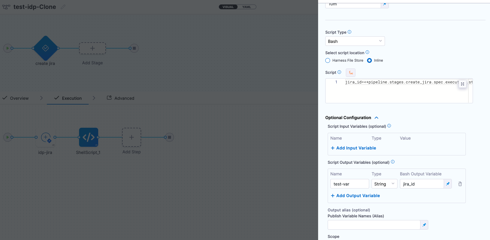
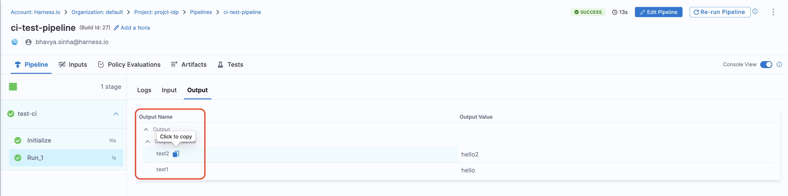
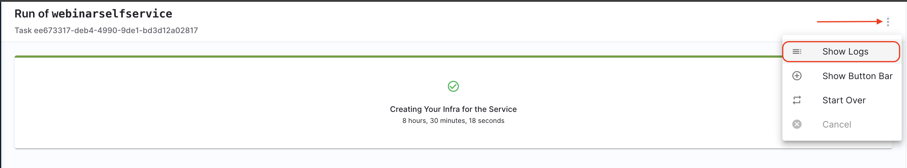

## Introduction

In Harness IDP the Workflows backend could be attributed to the Orchestrator used, where you set-up all the integrations, add all the secrets required for successful execution of the Workflows. These integrations are further managed through [Workflows Actions](/docs/internal-developer-portal/flows/custom-actions). These Actions are configured under the `step` in Workflows. [Steps](/docs/internal-developer-portal/flows/service-onboarding-pipelines#building-the-workflow-backend) are the core execution units within Workflows. Each step runs an action that might involve triggering a CI/CD pipeline, creating a service in a catalog, or provisioning infrastructure resources. The inputs gathered from the user are passed into these steps, and the outputs are generated based on the results of each step.

## Harness Pipeline as Orchestrator

Harness Pipelines serve as powerful orchestrators for Workflows. In this setup you can trigger Harness pipelines directly through a [Workflow Action](/docs/internal-developer-portal/flows/custom-actions#1-triggerharness-custom-pipeline). This action accepts the Harness pipeline URL as input, alongside an automatically inserted authentication token under the parameters section just like other inputs required for the pipeline execution. This seamless integration is enabled by Harness IDP being part of the broader Harness SaaS ecosystem, allowing users to even manage Workflows through pipelines RBAC. 

We have also built a native [IDP Stage](/docs/internal-developer-portal/flows/idp-stage) to help with Git cloning, cookiecutter templating, repository creation, catalog creation,catalog registration, Slack notifications, and resource creation using Harness IaCM powered by OpenTofu. 

This [Harness Specific Workflows Actions](/docs/internal-developer-portal/flows/custom-actions#harness-specific-custom-actions) currently supports only [IDP Stage](https://developer.harness.io/docs/internal-developer-portal/flows/idp-stage) along with the [Custom Stage](https://developer.harness.io/docs/platform/pipelines/add-a-stage/#add-a-custom-stage)**(Only Available with Harness CD License or Free Tier usage)** and [codebase disabled](http://localhost:3001/docs/continuous-integration/use-ci/codebase-configuration/create-and-configure-a-codebase#disable-clone-codebase-for-specific-stages) **CI stage (Only Available with Harness CI License)** with [Run step](https://developer.harness.io/docs/continuous-integration/use-ci/run-step-settings). **All input, except for [pipeline expressions](https://developer.harness.io/docs/platform/variables-and-expressions/harness-variables/#pipeline-expressions), must be [fixed values](https://developer.harness.io/docs/platform/variables-and-expressions/runtime-inputs/#fixed-values).**

<details>
<summary>Example YAML</summary>

```YAML {42-58}
apiVersion: scaffolder.backstage.io/v1beta3
kind: Template
metadata:
  name: onboard-services
  title: Create and Onboard a new react app
  description: A template to create and onboard a new react app
  tags:
    - nextjs
    - react
    - javascript
spec:
  owner: debabrata.panigrahi@harness.io
  type: service
  parameters:
    - title: Next.js app details
      required:
        - project_name
        - github_repo
        - github_org
      properties:
        project_name:
          title: Name of your new app
          type: string
          description: Unique name of the app          
        github_repo:
          title: Name of the GitHub repository
          type: string
          description: This will be the name of Repository on Github
        github_org:
          title: Name of the GitHub Organisation
          type: string
          description: This will be the name of Organisation on Github
        github_token:
          title: GitHub PAT
          type: string
          ui:widget: password
        token:
          title: Harness Token
          type: string
          ui:widget: password
          ui:field: HarnessAuthToken
  steps:
    - id: trigger
      name: Creating your react app
      action: trigger:harness-custom-pipeline
      input:
        url: "YOUR PIPELINE URL"
        inputset:
          project_name: ${{ parameters.project_name }}
          github_repo: ${{ parameters.github_repo }}
          github_org: ${{ parameters.github_org }}
          github_token: ${{ parameters.github_token }}
        apikey: ${{ parameters.token }}
    # The final step is to register our new component in the catalog.
  output:
    links:
      - title: Pipeline Details
        url: ${{ steps.trigger.output.PipelineUrl }}
```
</details>

In the above example there are two parts:

1. Input from the user
2. Execution of pipeline

Let's take a look at the inputs that the template expects from a developer. The inputs are written in the `spec.parameters` field. It has two parts, but you can combine them. The keys in properties are the unique IDs of fields (for example, `github_repo` and `project_name`). These are the pipeline variables that you need to set as runtime inputs while configuring the pipeline. This is what we want the developer to enter when creating their new application.

The `spec.steps` field contains only one action, and that is to trigger a Harness pipeline. It takes the pipeline `url`,`inputset` containing all the runtime input variables that the pipeline needs and the `apikey` as input .

### Manage variables in the pipeline

The above example uses various pipeline variables. The variables are as follows:

- `<+pipeline.variables.project_name>`
- `<+pipeline.variables.github_username>`
- `<+pipeline.variables.github_token>`
- `<+pipeline.variables.github_org>`
- `<+pipeline.variables.github_repo>`

Except for the secrets all the variables should have a [runtime input type](https://developer.harness.io/docs/platform/variables-and-expressions/runtime-inputs/#runtime-inputs) and the variable name should match with the parameter name used in the template as the values would be pre-populated from the values entered as input in the below IDP template.

For eg: `<+pipeline.variables.project_name>` variable is pre-populated by `project_name: ${{ parameters.project_name }}` under `input set:` in the above mentioned example.

You can use the **Variables** button on the floating sidebar on the right-hand side to open the Variables page for the pipeline.


You can create any number of pipeline variables and decide their value type. Some variables, such as a GitHub token, a user name, and organization, can have a fixed value. The token used in the code above is a Harness secret whose value is decoded during pipeline execution.

Variables such as project name and GitHub repository are runtime inputs. They are needed at the time of pipeline execution. When creating a new variable, you can specify its type in the UI. For more information about reference variables, go to the [reference documentation](/docs/platform/variables-and-expressions/harness-variables/) on pipeline variables.

### Authenticate the request

Once you have written all the inputs that the template requires, you must add the following YAML snippet under `spec.parameters.properties`.

```yaml
token:
  title: Harness Token
  type: string
  ui:widget: password
  ui:field: HarnessAuthToken
```

:::info

The `token` property we use to fetch **Harness Auth Token** is hidden on the Review Step using `ui:widget: password`, but for this to work the token property needs to be mentioned under the first `page`  in-case you have multiple pages.

```
# example workflow.yaml
...
parameters:
  - title: <PAGE-1 TITLE>
    properties:
      property-1:
        title: title-1
        type: string
      property-2:
        title: title-2
    token:
      title: Harness Token
      type: string
      ui:widget: password
      ui:field: HarnessAuthToken
  - title: <PAGE-2 TITLE>
    properties:
      property-1:
        title: title-1
        type: string
      property-2:
        title: title-2
  - title: <PAGE-n TITLE>  
...
```
:::

Also the token input is used as a parameter under `steps` as `apikey`

```YAML
  steps:
    - id: trigger
      name: ...
      action: trigger:harness-custom-pipeline
      input:
        url: ...
        inputset:
          key: value
          ...
        apikey: ${{ parameters.token }}
```

### Support for Harness Account Variables

In the context of Harness IDP you can use all the **[custom account variables](https://developer.harness.io/docs/platform/variables-and-expressions/add-a-variable#define-variables)** and **[account scoped built-in variables](https://developer.harness.io/docs/platform/variables-and-expressions/harness-expressions-reference)** in template YAML.

```YAML
...
  steps:
    - id: trigger
      name: <+variable.account.projectIdentifier>
      action: trigger:harness-custom-pipeline
      input:
        url: https://app.harness.io/ng/account/<+account.identifier>/module/idp/orgs/<+variable.account.orgIdentifier>/projects/<+variable.account.projectIdentifier>/pipelines/pipeline_id/pipeline-studio/?storeType=INLINE
...
```
### Fetch Output from Harness Pipeline onto IDP

When using the custom action `[trigger:harness-custom-pipeline](https://developer.harness.io/docs/internal-developer-portal/flows/custom-actions#1-triggerharness-custom-pipeline)` can as well configure the output to display the pipeline [output variables](https://developer.harness.io/docs/platform/variables-and-expressions/harness-variables/#input-and-output-variables), by setting the `showOutputVariables: true` under `inputs`and adding `output` as shown in the example below:

<details>
<summary>Example YAML</summary>

```YAML
...
## Example
steps:
  - id: trigger
      name: Creating your react app
      action: trigger:harness-custom-pipeline
      input:
      url: "https://app.harness.io/ng/account/vpCkHKsDSxK9_KYfjCTMKA/home/orgs/default/projects/communityeng/pipelines/IDP_New_NextJS_app/pipeline-studio/?storeType=INLINE"
      inputset:
          project_name: ${{ parameters.project_name }}
          github_repo: ${{ parameters.github_repo }}
          cloud_provider: ${{ parameters.provider }}
          db: ${{ parameters.db }}
          cache: ${{ parameters.cache }}
      apikey: ${{ parameters.token }}
      showOutputVariables: true
output:
  text:
    - title: Output Variable
      content: |
        Output Variable **test2** is `${{ steps.trigger.output.test2 }}` 
    - title: Another Output Variable
      content: |
        Output Variable **test1** with fqnPath is `${{ steps.trigger.output['pipeline.stages.testci.spec.execution.steps.Run_1.output.outputVariables.test1'] }}`      
...
```
</details>

:::info

Only **user defined output variables** are allowed, but you can as well use the system generated variables by assigning them as a new variable under shell script step as displayed below. For eg. we have mentioned the system generated output as `jira_id` and under **Optional Configuration** added a **test-var** which becomes a user defined output variable and could be displayed as output in the IDP workflows.



:::

There are two ways in which you can add the output variable to the template syntax. 

1. You can directly mention the output variable name `${{ steps.trigger.output.test2 }}`, here `test2` is the output variable name we created in the pipeline. 

2. You can copy the JEXL expression of the output variable and remove the JEXL constructs, `${{ steps.trigger.output['pipeline.stages.testci.spec.execution.steps.Run_1.output.outputVariables.test1'] }}`, here the part `pipeline.stages.testci.spec.execution.steps.Run_1.output.outputVariables.test1` comes from `<+pipeline.stages.testci.spec.execution.steps.Run_1.output.outputVariables.test2>` copied from execution logs. 



### Hide Logs 

You can now optionally remove the pipeline url from the workflow execution logs, for this you need to use the boolean property `hidePipelineURLLog` and set the value as `true`.

```YAML {8}
## Example
steps:
- id: trigger
    name: Creating your react app
    action: trigger:harness-custom-pipeline
    input:
    url: "Pipeline URL"
    hidePipelineURLLog: true
    inputset:
        project_name: ${{ parameters.project_name }}
    apikey: ${{ parameters.token }}
```

## Hide or mask sensitive data on Review step

Sometimes, specially in custom fields, you collect some data on Create form that
must not be shown to the user on Review step. To hide or mask this data, you can
use `ui:widget: password` or set some properties of `ui:backstage`:

```YAML
- title: Hide or mask values
  properties:
    password:
      title: Password
      type: string
      ui:widget: password # will print '******' as value for property 'password' on Review Step
    masked:
      title: Masked
      type: string
      ui:backstage:
        review:
          mask: '<some-value-to-show>' # will print '<some-value-to-show>' as value for property 'Masked' on Review Step
    hidden:
      title: Hidden
      type: string
      ui:backstage:
        review:
          show: false # wont print any info about 'hidden' property on Review Step
```

## Show Logs After a Successful Workflow Execution

In case of a successful workflow execution in order to view logs, you need to select the three dots on the right corner of the page, and select Show Logs from the dropdown.




