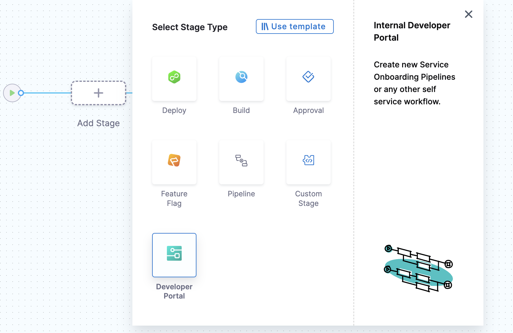

Self-service workflows in Harness IDP are powered by **Harness Pipelines**. Each workflow’s backend is configured using Actions and Harness Pipelines. Below is a detailed guide to setting this up in Harness IDP.

## Harness Pipelines: Backend Orchestration
Harness Pipeline acts as a robust orchestration engine for self-service workflows in Harness IDP. It is directly connected to executing specific tasks in your workflow via defined actions and pipelines.

### Connecting Inputs, Actions and Harness Pipelines
When a workflow is executed, users provide input details required for pipeline execution. These inputs are passed into the pipeline through a workflow action, which triggers specific steps in the pipeline. These steps can perform tasks such as launching a CI/CD process, registering a service in the catalog, setting up infrastructure, etc. 

The action accepts the **Harness Pipeline URL** as input, along with an authentication token that is automatically inserted into the parameters section. This seamless integration is enabled by Harness IDP being part of the broader Harness SaaS ecosystem. Users can also manage workflows via pipelines’ RBAC.

### IDP Stage
Harness IDP includes a native IDP Stage where all IDP-specific tasks required for pipeline execution are pre-configured as pipeline steps within the stage. This enables quick and efficient creation of self-service workflows. 

The IDP Stage provides built-in support for:
- Git cloning
- Cookiecutter templating
- Repository creation
- Catalog creation and registration
- Slack notifications
- Resource creation using Harness IaCM powered by OpenTofu

Currently, Harness-specific workflow actions support:
- IDP Stage
- Custom Stage (Available with Harness CD License or Free Tier)
- Codebase-disabled CI Stage with Run Step (Available with Harness CI License)

## Create a Harness Pipeline from Harness IDP
To create a Harness Pipeline using the IDP Stage, follow these steps:
1. In your Harness IDP, go to **Admin -> Select Project**.
2. Now start with **Create a Pipeline**.


3. Add a **Name**, select the type as **Inline** and **Continue**.


4. Now **Select Stage Type** as **Developer Portal** and add a [name for your stage](https://developer.harness.io/docs/platform/pipelines/add-a-stage/#stage-names) to **Set Up Stage**.




### Infrastructure

Under **Infrastructure** tab, Harness recommends [Harness Cloud](https://developer.harness.io/docs/continuous-integration/use-ci/set-up-build-infrastructure/use-harness-cloud-build-infrastructure#use-harness-cloud), but you can also use a [Kubernetes cluster](/docs/continuous-integration/use-ci/set-up-build-infrastructure/k8s-build-infrastructure/set-up-a-kubernetes-cluster-build-infrastructure), [local runner](/docs/continuous-integration/use-ci/set-up-build-infrastructure/define-a-docker-build-infrastructure) or [self-managed AWS/GCP/Azure VM](/docs/category/set-up-vm-build-infrastructures) build infrastructure.


### Pipeline Variables 
Before adding the execution steps, we need to create some pipeline variables with runtime inputs, which will be used as expression inputs in various steps during execution.

To add pipeline variables:

1. Navigate to the right-hand side of your page and click on the **Variables** icon.  
2. Under **Custom Variables**, select **+Add Variable**.  
3. Assign a name to the variable and set the input type to **Runtime**.

### Passing Inputs to Harness Pipeline using ```workflow.yaml```
The ```spec.parameters``` field in ```workflow.yaml``` contains the inputs required for the configuration. The keys under ```properties``` represent unique IDs for various input fields. These keys correspond to the pipeline variables that must be set as runtime inputs when configuring the pipeline. These inputs are designed to prompt the developer to provide necessary details when creating a new application.

The ```spec.steps``` field specifies a single action: triggering a Harness pipeline. This action requires mainly three inputs:

- **Pipeline URL**: The endpoint for the pipeline to be triggered.
- **Input Set**: A collection of runtime input variables that the pipeline requires.
- **API Key**: Used to authenticate and authorize the pipeline trigger.

All pipeline variables must be declared in the `inputset` within `workflow.yaml`, with their values aligned to the input parameters specified in the `spec.parameters` properties section.

#### Example ```workflow.yaml```
:::info
The syntax `{{ parameters.x }}` is only supported within the `steps` section when configuring the Workflows Backend. It cannot be used in the `properties` section to reference another parameter.
:::

```YAML
...
spec:
  parameters:
    - title: Service Details
      properties:
        projectId:
            title: Project Identifier
            description: Harness Project Identifier
            type: string
            ui:field: HarnessProjectPicker
        template_type:
          title: Type of the Template
          type: string
          description: Type of the Template
          ui:readonly: $${{ parameters.another_field}}  ## NOT SUPPORTED
  steps:
    - id: trigger
      name: Creating your react app
      action: trigger:harness-custom-pipeline
      input:
        url: "https://app.harness.io/ng/account/account_id/module/idp/orgs/org_id/projects/project_id/pipelines/pipeline_id/pipeline-studio/?storeType=INLINE"
        inputset:
          project_id: ${{ parameters.projectId }}  ## SUPPORTED
          template_type: ${{ parameters.template_type }} ## SUPPORTED
...
```

### Execution Steps (IDP Stage)
#### 1. Git Clone 
*(Ignore this step if your repository containing the cookiecutter template is public)*

Add a Git Clone step to clone a repository into the Developer Portal stage's workspace. By cloning the repository, you gain access to the necessary code, scripts, or configurations, enabling various actions.

The Git Clone step uses a containerized step group. For more information, refer to [Containerize Step Groups](https://developer.harness.io/docs/continuous-delivery/x-platform-cd-features/cd-steps/containerized-steps/containerized-step-groups/).

<Tabs>
<TabItem value="Pipeline Studio" label="Pipeline Studio" default>

1. In your Developer Portal stage, under Execution, select Add Step.
2. Select Git Clone.
3. Configure the step using the settings described below. 

**Configuration Settings**

1. **Select Git Provider**: You can choose **Third-party Git Provider** if your code is not hosted in the Harness Code Repository.

2. **Connector**: You can select a connector for the source control provider hosting the code repository that you want to clone.

:::info
- The connection type ``ssh`` is currently not supported for Connectors.
- For credentials, only Username and Password types are supported.
:::

You can refer to the following resources for more information on creating code repo connectors:
- Azure Repos: [Connect to Azure Repos](https://developer.harness.io/docs/platform/connectors/code-repositories/connect-to-a-azure-repo)
- Bitbucket: [Bitbucket Connector Settings Reference](https://developer.harness.io/docs/platform/connectors/code-repositories/ref-source-repo-provider/bitbucket-connector-settings-reference)
- GitHub: [GitHub Connector Settings Reference](https://developer.harness.io/docs/platform/connectors/code-repositories/ref-source-repo-provider/git-hub-connector-settings-reference)
- GitLab: [GitLab Connector Settings Reference](https://developer.harness.io/docs/platform/connectors/code-repositories/ref-source-repo-provider/git-lab-connector-settings-reference)
- Other Git Providers: 
    - [Git Connector Settings Reference](https://developer.harness.io/docs/platform/connectors/code-repositories/ref-source-repo-provider/git-connector-settings-reference)
    - [Connect to an AWS CodeCommit Repo](https://developer.harness.io/docs/platform/connectors/code-repositories/connect-to-code-repo)

3. **Repository Name**:
- If the connector's URL Type is set to **Repository**, the Repository Name is automatically populated based on the connector's configuration.
- If the connector's URL Type is set to **Account**, you must manually specify the repository name to clone into the stage workspace.

4. **Build Type, Branch Name, and Tag Name**:
For Build Type, choose:
- Git Branch to clone code from a specific branch.
- Git Tag to clone code from a specific commit tag.
Based on your selection, specify the Branch Name or Tag Name.

:::info
You can use fixed values, runtime inputs, or variable expressions for branch and tag names. For instance, you can enter <+input> for the branch or tag name to specify them at runtime.
:::

5. **Clone Directory** (Optional): You can specify the target path in the stage workspace where the repository should be cloned.

6. **Depth**: You should specify the number of commits to fetch when cloning the repository. 
The default depth is 0, which fetches all commits from the specified branch.
For more details, refer to the [Git Clone Documentation](https://git-scm.com/docs/git-clone).

</TabItem>
<TabItem value="YAML" label="YAML">

```YAML
- step:
   type: GitClone
   name: GitClone_1
   identifier: GitClone_1
   spec:
     connectorRef: account.GitConnectorBzGN8G1COj
     repoName: myrepo
     build:
       type: branch
       spec:
         branch: main
```

</TabItem>
</Tabs>

#### 2. Cookiecutter
abcdef 

## Example Pipeline
<Tabs>
<TabItem value="YAML" label="YAML" default>


```YAML
pipeline:
  name: Self-Service-flow-repo-setup
  identifier: SelfServiceflowreposetup
  projectIdentifier: projctidp
  orgIdentifier: default
  tags: {}
  stages:
    - stage:
        name: service-onboarding
        identifier: serviceonboarding
        description: ""
        type: IDP
        spec:
          infrastructure:
            type: KubernetesDirect
            spec:
              connectorRef: idptest
              namespace: harness-delegate
              automountServiceAccountToken: true
              nodeSelector: {}
              os: Linux
          execution:
            steps:
              - step:
                  type: CookieCutter
                  name: CookieCutter
                  identifier: idpcookiecutter
                  spec:
                    templateType: <+pipeline.variables.template_type>
                    publicTemplateUrl: <+pipeline.variables.public_template_url>
                    cookieCutterVariables:
                      app_name: <+pipeline.variables.project_name>
              - step:
                  type: CreateRepo
                  name: CreateRepo
                  identifier: createrepo
                  spec:
                    connectorRef: account.testdev
                    organization: <+pipeline.variables.organization>
                    repository: <+pipeline.variables.project_name>
                    repoType: <+pipeline.variables.repository_type>
                    description: <+pipeline.variables.repository_description>
                    defaultBranch: <+pipeline.variables.repository_default_branch>
              - step:
                  type: CreateCatalog
                  name: createcatalog
                  identifier: createcatalog
                  spec:
                    fileName: <+pipeline.variables.catalog_file_name>
                    filePath: <+pipeline.variables.project_name>
                    fileContent: |-
                      apiVersion: backstage.io/v1alpha1
                      kind: Component
                      metadata:
                        name: <+pipeline.variables.project_name>
                        description: <+pipeline.variables.project_name> created using self service flow
                        annotations:
                          backstage.io/techdocs-ref: dir:.
                      spec:
                        type: service
                        owner: test
                        lifecycle: experimental
              - step:
                  type: DirectPush
                  name: DirectPush
                  identifier: directpush
                  spec:
                    connectorRef: account.testdev
                    repository: <+pipeline.variables.project_name>
                    organization: <+pipeline.variables.organization>
                    codeDirectory: <+pipeline.variables.project_name>
                    branch: <+pipeline.variables.direct_push_branch>
              - step:
                  type: RegisterCatalog
                  name: registercatalog
                  identifier: registercatalog
                  spec:
                    connectorRef: account.testdev
                    repository: <+pipeline.variables.project_name>
                    organization: <+pipeline.variables.organization>
                    filePath: <+pipeline.variables.catalog_file_name>
                    branch: <+pipeline.variables.direct_push_branch>
              - step:
                  type: SlackNotify
                  name: slacknotify
                  identifier: slacknotify
                  spec:
                    email: <+pipeline.variables.email_id>
                    messageContent: " Hello <@<+pipeline.variables.email_id>>, <+pipeline.variables.project_name> project is created using flows in Harness IDP,\\n*Created Catalog Yaml -* <<+pipeline.stages.serviceonboarding.spec.execution.steps.registercatalog.output.outputVariables.catalogInfoUrl>|Link>\\n*Created Repository -* <<+pipeline.stages.serviceonboarding.spec.execution.steps.createrepo.output.outputVariables.repositoryUrl>|Link>\\n*Registered Catlog -* <<+pipeline.stages.serviceonboarding.spec.execution.steps.createcatalog.output.outputVariables.registeredCatalogUrl>|Link>"
                    token: slacksecrettestws
          cloneCodebase: false
          caching:
            enabled: false
            paths: []
  variables:
    - name: test_content
      type: String
      description: ""
      required: false
      value: devesh
    - name: project_name
      type: String
      description: ""
      required: false
      value: <+input>
    - name: organization
      type: String
      description: ""
      required: false
      value: test-org-devesh
    - name: template_type
      type: String
      description: ""
      required: false
      value: <+input>.default(public).allowedValues(public,private)
    - name: public_template_url
      type: String
      description: ""
      required: false
      value: <+input>
    - name: repository_type
      type: String
      description: ""
      required: false
      value: <+input>.default(private).allowedValues(private,public)
    - name: repositoty_description
      type: String
      description: ""
      required: false
      value: <+input>
    - name: repository_default_branch
      type: String
      description: ""
      required: false
      value: <+input>
    - name: direct_push_branch
      type: String
      description: ""
      required: false
      value: <+input>
    - name: catalog_file_name
      type: String
      description: ""
      required: false
      value: catalog-info.yaml
    - name: email_id
      type: String
      description: ""
      required: false
      value: <+input>

```
</TabItem>
<TabItem value="Pipeline Studio" label="Pipeline Studio">


</TabItem>
</Tabs>


