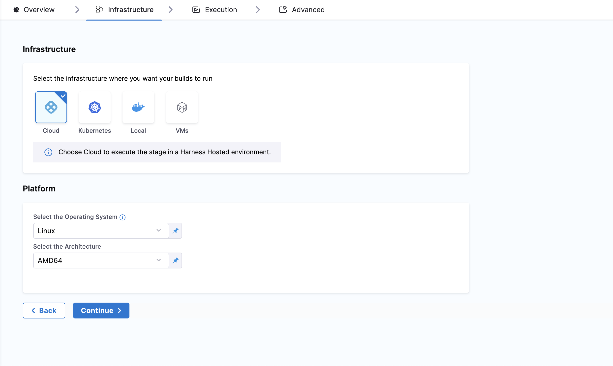
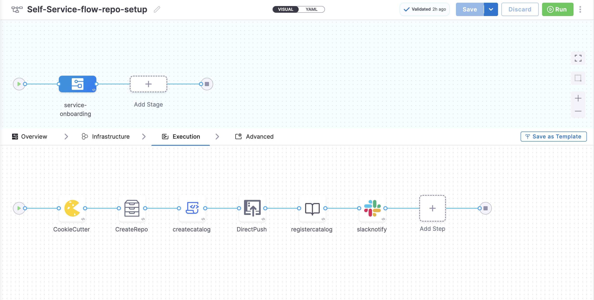

import Tabs from '@theme/Tabs';
import TabItem from '@theme/TabItem';

Self-service workflows in Harness IDP are powered by **Harness Pipelines**. Each workflow’s backend is configured using Actions and Harness Pipelines. Below is a detailed guide to setting this up in Harness IDP.

## Harness Pipelines: Backend Orchestration
Harness Pipeline acts as a robust orchestration engine for self-service workflows in Harness IDP. It is directly connected to executing specific tasks in your workflow via defined actions and pipelines.

### Connecting Inputs, Actions and Harness Pipelines
When a workflow is executed, users provide input details required for pipeline execution. These inputs are passed into the pipeline through a workflow action, which triggers specific steps in the pipeline. These steps can perform tasks such as launching a CI/CD process, registering a service in the catalog, setting up infrastructure, etc. 

The action accepts the **Harness Pipeline URL** as input, along with an authentication token that is automatically inserted into the parameters section. This seamless integration is enabled by Harness IDP being part of the broader Harness SaaS ecosystem. Users can also manage workflows via pipelines’ RBAC.

### [IDP Stage](/docs/internal-developer-portal/flows/idp-stage.md)
Harness IDP includes a native IDP Stage where all IDP-specific tasks required for pipeline execution are pre-configured as pipeline steps within the stage. This enables quick and efficient creation of self-service workflows. 

The IDP Stage provides built-in support for:
- Git cloning
- Cookiecutter templating
- Repository creation
- Catalog creation and registration
- Slack notifications
- Resource creation using Harness IaCM powered by OpenTofu

Currently, Harness-specific workflow actions support:
- IDP Stage
- Custom Stage (Available with Harness CD License or Free Tier)
- Codebase-disabled CI Stage with Run Step (Available with Harness CI License)

## Creating a Harness Pipeline from Harness IDP
To create a Harness Pipeline using the IDP Stage, follow these steps:
1. In your Harness IDP, go to **Admin -> Select Project**.
2. Now start with **Create a Pipeline**.


3. Add a **Name**, select the type as **Inline** and **Continue**.


4. Now **Select Stage Type** as **Developer Portal** and add a [name for your stage](https://developer.harness.io/docs/platform/pipelines/add-a-stage/#stage-names) to **Set Up Stage**.


### Infrastructure

Under **Infrastructure** tab, Harness recommends [Harness Cloud](https://developer.harness.io/docs/continuous-integration/use-ci/set-up-build-infrastructure/use-harness-cloud-build-infrastructure#use-harness-cloud), but you can also use a [Kubernetes cluster](/docs/continuous-integration/use-ci/set-up-build-infrastructure/k8s-build-infrastructure/set-up-a-kubernetes-cluster-build-infrastructure), [local runner](/docs/continuous-integration/use-ci/set-up-build-infrastructure/define-a-docker-build-infrastructure) or [self-managed AWS/GCP/Azure VM](/docs/category/set-up-vm-build-infrastructures) build infrastructure.



### Pipeline Variables 
Before adding the execution steps, we need to create some pipeline variables with runtime inputs, which will be used as expression inputs in various steps during execution.

To add pipeline variables:

1. Navigate to the right-hand side of your page and click on the **Variables** icon.  
2. Under **Custom Variables**, select **+Add Variable**.  

3. Assign a name to the variable and set the input type to **Runtime**.


### Passing Inputs
The ```spec.parameters``` field in ```workflow.yaml``` contains the inputs required for the configuration. The keys under ```properties``` represent unique IDs for various input fields. These keys correspond to the pipeline variables that must be set as runtime inputs when configuring the pipeline. These inputs are designed to prompt the developer to provide necessary details when creating a new application.

The ```spec.steps``` field specifies a single action: triggering a Harness pipeline. This action requires mainly three inputs:

- **Pipeline URL**: The endpoint for the pipeline to be triggered.
- **Input Set**: A collection of runtime input variables that the pipeline requires.
- **API Key**: Used to authenticate and authorize the pipeline trigger.

All pipeline variables must be declared in the `inputset` within `workflow.yaml`, with their values aligned to the input parameters specified in the `spec.parameters` properties section.

#### Example ```workflow.yaml```
:::info
The syntax `{{ parameters.x }}` is only supported within the `steps` section when configuring the Workflows Backend. It cannot be used in the `properties` section to reference another parameter.
:::

```YAML
...
spec:
  parameters:
    - title: Service Details
      properties:
        projectId:
            title: Project Identifier
            description: Harness Project Identifier
            type: string
            ui:field: HarnessProjectPicker
        template_type:
          title: Type of the Template
          type: string
          description: Type of the Template
          ui:readonly: $${{ parameters.another_field}}  ## NOT SUPPORTED
  steps:
    - id: trigger
      name: Creating your react app
      action: trigger:harness-custom-pipeline
      input:
        url: "https://app.harness.io/ng/account/account_id/module/idp/orgs/org_id/projects/project_id/pipelines/pipeline_id/pipeline-studio/?storeType=INLINE"
        inputset:
          project_id: ${{ parameters.projectId }}  ## SUPPORTED
          template_type: ${{ parameters.template_type }} ## SUPPORTED
...
```
### Fetching Outputs
You can configure your workflows to fetch output from the **Harness Pipeline** and display pipeline output variables using `workflow.yaml`. Here’s how you can do it:  

1. In your `workflow.yaml`, under the `steps` property field, set `showOutputVariables` to `true`.  
2. Define pipeline output variables under the `output` field in your YAML configuration.  

There are two ways to add output variables in the workflow syntax:  

1. **Directly referencing the output variable name:**  
   ```yaml
   ${{ steps.trigger.output.test2 }}
   ```  
   Here, `test2` is the output variable created in the pipeline.  

2. **Using the JEXL expression from execution logs:**  
   - Copy the JEXL expression of the output variable and remove the JEXL constructs.  
   - Example:  
     ```yaml
     ${{ steps.trigger.output['pipeline.stages.testci.spec.execution.steps.Run_1.output.outputVariables.test1'] }}
     ```  
   - In this case, `pipeline.stages.testci.spec.execution.steps.Run_1.output.outputVariables.test1` is derived from: 
     ```yaml
     <+pipeline.stages.testci.spec.execution.steps.Run_1.output.outputVariables.test2>
     ```  
     
  
  This approach ensures that pipeline outputs are correctly fetched and displayed. 


#### Example ```workflow.yaml```
```YAML
steps:
  - id: trigger
      name: Creating your react app
      action: trigger:harness-custom-pipeline
      input:
      url: "https://app.harness.io/ng/account/vpCkHKsDSxK9_KYfjCTMKA/home/orgs/default/projects/communityeng/pipelines/IDP_New_NextJS_app/pipeline-studio/?storeType=INLINE"
      inputset:
          project_name: ${{ parameters.project_name }}
          github_repo: ${{ parameters.github_repo }}
          cloud_provider: ${{ parameters.provider }}
          db: ${{ parameters.db }}
          cache: ${{ parameters.cache }}
      apikey: ${{ parameters.token }}
      showOutputVariables: true
output:
  text:
    - title: Output Variable
      content: |
        Output Variable **test2** is `${{ steps.trigger.output.test2 }}`
    - title: Another Output Variable
      content: |
        Output Variable **test1** with fqnPath is `${{ steps.trigger.output['pipeline.stages.testci.spec.execution.steps.Run_1.output.outputVariables.test1'] }}`
```

:::info
Please note that while **user-defined output variables** are allowed for the above use-case, you can also use **system-generated variables** by assigning them as a new variable under the **Shell Script** step, as shown below.  

For example, if a system-generated output variable is **`jira_id`**, you can define it as a **user-defined output variable** under **Optional Configuration** by assigning it to a new variable, such as `test-var`. This newly defined variable (`test-var`) can then be displayed as output in the **IDP workflows**.


:::


### Execution Steps
You can add various **execution steps** (pre-included with the **IDP stage**) under the **Execution** tab. Refer to this detailed guide for step-by-step instructions on adding and implementing **IDP stage execution steps**. 


## Example Pipeline
<Tabs>
<TabItem value="YAML" label="YAML" default>


```YAML
pipeline:
  name: Self-Service-flow-repo-setup
  identifier: SelfServiceflowreposetup
  projectIdentifier: projctidp
  orgIdentifier: default
  tags: {}
  stages:
    - stage:
        name: service-onboarding
        identifier: serviceonboarding
        description: ""
        type: IDP
        spec:
          infrastructure:
            type: KubernetesDirect
            spec:
              connectorRef: idptest
              namespace: harness-delegate
              automountServiceAccountToken: true
              nodeSelector: {}
              os: Linux
          execution:
            steps:
              - step:
                  type: CookieCutter
                  name: CookieCutter
                  identifier: idpcookiecutter
                  spec:
                    templateType: <+pipeline.variables.template_type>
                    publicTemplateUrl: <+pipeline.variables.public_template_url>
                    cookieCutterVariables:
                      app_name: <+pipeline.variables.project_name>
              - step:
                  type: CreateRepo
                  name: CreateRepo
                  identifier: createrepo
                  spec:
                    connectorRef: account.testdev
                    organization: <+pipeline.variables.organization>
                    repository: <+pipeline.variables.project_name>
                    repoType: <+pipeline.variables.repository_type>
                    description: <+pipeline.variables.repository_description>
                    defaultBranch: <+pipeline.variables.repository_default_branch>
              - step:
                  type: CreateCatalog
                  name: createcatalog
                  identifier: createcatalog
                  spec:
                    fileName: <+pipeline.variables.catalog_file_name>
                    filePath: <+pipeline.variables.project_name>
                    fileContent: |-
                      apiVersion: backstage.io/v1alpha1
                      kind: Component
                      metadata:
                        name: <+pipeline.variables.project_name>
                        description: <+pipeline.variables.project_name> created using self service flow
                        annotations:
                          backstage.io/techdocs-ref: dir:.
                      spec:
                        type: service
                        owner: test
                        lifecycle: experimental
              - step:
                  type: DirectPush
                  name: DirectPush
                  identifier: directpush
                  spec:
                    connectorRef: account.testdev
                    repository: <+pipeline.variables.project_name>
                    organization: <+pipeline.variables.organization>
                    codeDirectory: <+pipeline.variables.project_name>
                    branch: <+pipeline.variables.direct_push_branch>
              - step:
                  type: RegisterCatalog
                  name: registercatalog
                  identifier: registercatalog
                  spec:
                    connectorRef: account.testdev
                    repository: <+pipeline.variables.project_name>
                    organization: <+pipeline.variables.organization>
                    filePath: <+pipeline.variables.catalog_file_name>
                    branch: <+pipeline.variables.direct_push_branch>
              - step:
                  type: SlackNotify
                  name: slacknotify
                  identifier: slacknotify
                  spec:
                    email: <+pipeline.variables.email_id>
                    messageContent: " Hello <@<+pipeline.variables.email_id>>, <+pipeline.variables.project_name> project is created using flows in Harness IDP,\\n*Created Catalog Yaml -* <<+pipeline.stages.serviceonboarding.spec.execution.steps.registercatalog.output.outputVariables.catalogInfoUrl>|Link>\\n*Created Repository -* <<+pipeline.stages.serviceonboarding.spec.execution.steps.createrepo.output.outputVariables.repositoryUrl>|Link>\\n*Registered Catlog -* <<+pipeline.stages.serviceonboarding.spec.execution.steps.createcatalog.output.outputVariables.registeredCatalogUrl>|Link>"
                    token: slacksecrettestws
          cloneCodebase: false
          caching:
            enabled: false
            paths: []
  variables:
    - name: test_content
      type: String
      description: ""
      required: false
      value: devesh
    - name: project_name
      type: String
      description: ""
      required: false
      value: <+input>
    - name: organization
      type: String
      description: ""
      required: false
      value: test-org-devesh
    - name: template_type
      type: String
      description: ""
      required: false
      value: <+input>.default(public).allowedValues(public,private)
    - name: public_template_url
      type: String
      description: ""
      required: false
      value: <+input>
    - name: repository_type
      type: String
      description: ""
      required: false
      value: <+input>.default(private).allowedValues(private,public)
    - name: repositoty_description
      type: String
      description: ""
      required: false
      value: <+input>
    - name: repository_default_branch
      type: String
      description: ""
      required: false
      value: <+input>
    - name: direct_push_branch
      type: String
      description: ""
      required: false
      value: <+input>
    - name: catalog_file_name
      type: String
      description: ""
      required: false
      value: catalog-info.yaml
    - name: email_id
      type: String
      description: ""
      required: false
      value: <+input>

```
</TabItem>
<TabItem value="Pipeline Studio" label="Pipeline Studio">




</TabItem>
</Tabs>


## Specify the Harness IDP images used in your pipelines

You can use the Harness IDP `execution-config` API to specify or update the Harness IDP images used in your infrastructure by specifying image tags.

:::info

Certain steps are common across different stages in Harness Pipeline, but the images used in each of them is specific to the stage they are part of, like `Run Step`.

:::

API key authentication is required. For more information about API keys, go to [Manage API keys](/docs/platform/automation/api/add-and-manage-api-keys). For more information about authentication, go to the [Harness API documentation](https://apidocs.harness.io/#section/Introduction/Authentication).

1. Send a `get-default-config` request to get a list of the latest Harness IDP Workflows executed. You can use the `infra` parameter to get `k8` images or `VM` images.

   ```json
   curl --location --request GET "https://app.harness.io/gateway/idp/execution-config/get-default-config?accountIdentifier=$YOUR_HARNESS_ACCOUNT_ID&infra=K8" \
   --header 'X-API-KEY: $API_KEY'
   ```

   The response payload shows the latest supported images and their tags, for example:

   ```json
   {
    "status": "SUCCESS",
     "data": {
        "cookieCutter": "harness/cookiecutter:1.9.1",
        "createRepo": "harness/createrepo:1.9.0",
        "directPush": "harness/directpush:1.9.0",
        "registerCatalog": "harness/registercatalog:1.9.0",
        "createCatalog": "harness/createcatalog:1.9.0",
        "slackNotify": "harness/slacknotify:1.9.0",
        "createOrganisation": "harness/createorganisation:1.9.0",
        "createProject": "harness/createproject:1.9.0"
     },
     "metaData": null,
     "correlationId": "08919155-a6d6-4bd3-8401-6b86318c85ca"
   }
   ```

2. Send a `get-customer-config` request to get the build images that your IDP pipelines currently use. When `overridesOnly` is `true`, which is the default value, this endpoint returns the non-default images that your pipeline uses.

   ```json
   curl --location --request GET "https://app.harness.io/gateway/idp/execution-config/get-customer-config?accountIdentifier=$YOUR_HARNESS_ACCOUNT_ID&infra=K8&overridesOnly=true" \
   --header 'X-API-KEY: $API_KEY'
   ```

   If the response contains `null`, your pipeline is using all default images, for example:

   ```json
   {
       "status": "SUCCESS",
       "data": {},
       "metaData": null,
       "correlationId": "11ce1bc8-b337-4687-9ab9-e13d553ae82f"
   }
   ```

3. Send a `update-config` (POST) request with a list of the images you want to update and the new tags to apply.

   ```json
   curl --location --request POST "https://app.harness.io/gateway/idp/execution-config/update-config?accountIdentifier=$YOUR_HARNESS_ACCOUNT_ID&infra=K8" \
   --header 'X-API-KEY: $API_KEY' \
   --header 'Content-Type: application/json' \
   --data-raw '[
       {
           "field": "registerCatalog",
           "value": "harness/registercatalog:1.9.0"
       },
       {
           "field": "slackNotify",
           "value": "harness/slacknotify:1.9.0"
       }
   ]'
   ```

4. To reset one or more images to their defaults, send a `reset-config` (POST) request with a list of the images to reset.

   ```json
   curl --location --request POST "https://app.harness.io/gateway/idp/execution-config/reset-config?accountIdentifier=$YOUR_HARNESS_ACCOUNT_ID&infra=K8" \
   --header 'X-API-KEY: $API_KEY' \
   --header 'Content-Type: application/json' \
   --data-raw '[
       {
           "field": "registerCatalog"
       },
       {
           "field": "createRepo"
       }
   ]'
   ```

