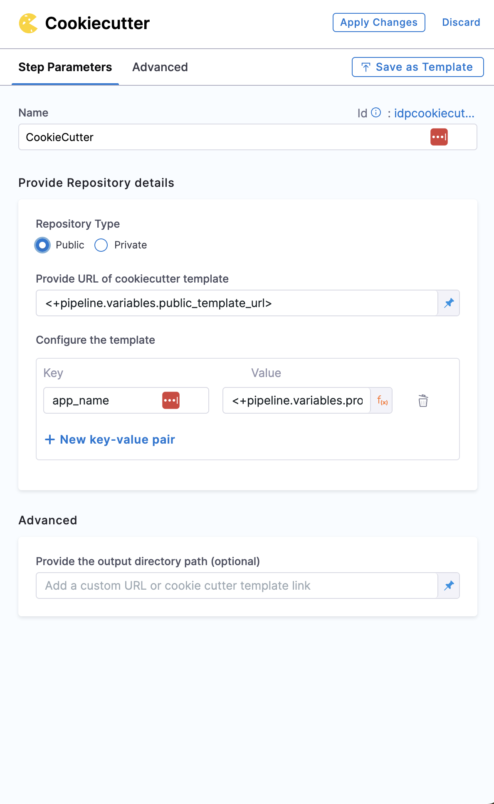

```mdx-code-block
import Tabs from '@theme/Tabs';
import TabItem from '@theme/TabItem';
```

## Introduction

:::info

Presently this Feature is behind the Feature Flag `IDP_ENABLE_STAGE`, please contach with [Harness Support](mailto:support@harness.io) to enable it in your Account. 

:::

The self-service flow in IDP is powered by the Harness Pipelines. A stage is a part of a pipeline that contains the logic to perform a major segment of a larger workflow defined in a pipeline. Stages are often based on the different workflow milestones, such as building, approving, and delivering.

The process of adding a stage to a pipeline is the same for all Harness modules. When you add a stage to a pipeline, you select the stage type, such as **Developer Portal** for IDP or **Build** for CI or **Deploy** for CD. The available stage settings are determined by the stage type, and, if applicable, the module associated with the selected stage type.

This functionality is limited to the modules and settings that you have access to.

## How to Add the Developer Portal Stage

```mdx-code-block
<Tabs>
<TabItem value="Present Nav" label="Present Nav" default>
```
1. Go to **Projects** and Select your project and create a new pipeline. 


```mdx-code-block
  </TabItem>
  <TabItem value="New Nav" label="New Nav">
```
1. Go to **Pipelines** under **Admin** from side nav and **Create a Pipeline**. 


```mdx-code-block
</TabItem>
</Tabs>
```

2. Add a Name for your Pipeline and select **Inline** as pipeline storage options.


3. Now **Select Stage Type** as **Developer Portal** and add a [name for your stage](https://developer.harness.io/docs/platform/pipelines/add-a-stage/#stage-names) to **Set Up Stage**.


## Infrastructure

4. Under **Infrastructure** tab we suggest you to select **[Harness Cloud](https://developer.harness.io/docs/continuous-integration/use-ci/set-up-build-infrastructure/use-harness-cloud-build-infrastructure#use-harness-cloud)** but you're free to choose from [Kubernetes](https://developer.harness.io/tutorials/ci-pipelines/kubernetes-build-farm#define-the-build-infrastructure) or [Local](https://developer.harness.io/docs/continuous-integration/use-ci/set-up-build-infrastructure/define-a-docker-build-infrastructure#set-the-pipelines-build-infrastructure) or [VM](https://developer.harness.io/docs/category/set-up-vm-build-infrastructures)


## Execution Steps

5. Now add the steps under the **Execution Tab**. The following is the list of suggested steps to be used in the execution.


### 1. Add the Git Clone step (Ignore this step if your repository containing cookiecutter template is public)

Add a Git Clone step to clone a repository into the Developer Portal stage's workspace.

By cloning the repository, you gain access to the necessary code, scripts, or configurations, enabling you to perform various actions.

The Git Clone step uses a containerized step group. For more information, go to [Containerize step groups](/docs/continuous-delivery/x-platform-cd-features/cd-steps/containerized-steps/containerized-step-groups.md).


```mdx-code-block
<Tabs>
<TabItem value="YAML" label="YAML" default>
```

```
- step:
   type: GitClone
   name: GitClone_1
   identifier: GitClone_1
   spec:
     connectorRef: account.GitConnectorBzGN8G1COj
     repoName: myrepo
     build:
       type: branch
       spec:
         branch: main
```

```mdx-code-block
  </TabItem>
  <TabItem value="Pipeline Studio" label="Pipeline Studio">
```
1. In your Developer Portal stage, in **Execution**, select **Add Step**.
2. Select **Git Clone**.
3. Configure the steps using the settings described below.

```mdx-code-block
</TabItem>
</Tabs>
```

#### Connector

Select a connector for the source control provider hosting the code repository that you want the step to clone.

The following topics provide more information about creating code repo connectors:

* Azure Repos: [Connect to Azure Repos](/docs/platform/connectors/code-repositories/connect-to-a-azure-repo)
* Bitbucket: [Bitbucket connector settings reference](/docs/platform/connectors/code-repositories/ref-source-repo-provider/bitbucket-connector-settings-reference)
* GitHub: [GitHub connector settings reference](/docs/platform/connectors/code-repositories/ref-source-repo-provider/git-hub-connector-settings-reference)
* GitLab: [GitLab Connector Settings reference](/docs/platform/connectors/code-repositories/ref-source-repo-provider/git-lab-connector-settings-reference)
* Other Git providers:
  * [Git connector settings reference](/docs/platform/connectors/code-repositories/ref-source-repo-provider/git-connector-settings-reference)
  * [Connect to an AWS CodeCommit Repo](/docs/platform/connectors/code-repositories/connect-to-code-repo)

#### Repository Name

If the connector's [URL Type](/docs/platform/connectors/code-repositories/ref-source-repo-provider/git-connector-settings-reference#url-type) is **Repository**, then **Repository Name** is automatically populated based on the repository defined in the connector's configuration.

If the connector's URL Type is **Account**, then you must specify the name of the code repository that you want to clone into the stage workspace.

#### Build Type, Branch Name, and Tag Name

For **Build Type**, select **Git Branch** if you want the step to clone code from a specific branch within the repository, or select **Git Tag** if you want the step to clone code from a specific commit tag. Based on your selection, specify a **Branch Name** or **Tag Name**.

:::tip

You can use [fixed values, runtime input, or variable expressions](/docs/platform/variables-and-expressions/runtime-inputs/) for the branch and tag names. For example, you can enter `<+input>` for the branch or tag name to supply a branch or tag name at runtime.

:::

#### Clone directory

An optional target path in the stage workspace where you want to clone the repo.

#### Depth

The number of commits to fetch when the step clones the repo.

The default depth is `0`, which fetches all commits from the relevant branch.

For more information, go to the [git clone documentation](https://git-scm.com/docs/git-clone).

### 2. Cookiecutter

Cookiecutter step is used to take inputs for the cookiecutter template. 



```mdx-code-block
<Tabs>
<TabItem value="YAML" label="YAML" default>
```

```YAML
- step:
    type: CookieCutter
    name: CookieCutter
    identifier: idpcookiecutter
    spec:
    templateType: <+pipeline.variables.template_type>
    publicTemplateUrl: <+pipeline.variables.public_template_url>
    cookieCutterVariables:
        app_name: <+pipeline.variables.project_name>
```

```mdx-code-block
  </TabItem>
  <TabItem value="Pipeline Studio" label="Pipeline Studio">
```

#### Repository Type

Select the repository type in which your template is stored, which could be public or private.

#### Path for Template

First select the type of the input it could be a [Fixed Value](https://developer.harness.io/docs/platform/variables-and-expressions/runtime-inputs/#fixed-values), [Runtime input](https://developer.harness.io/docs/platform/variables-and-expressions/runtime-inputs/#runtime-inputs) or [Expression](https://developer.harness.io/docs/platform/variables-and-expressions/runtime-inputs/#expressions)

In case of **Fixed Value** provide the absolute value of template URL, for eg. `https://github.com/devesh-harness/test-cookicutter`

In case of **Runtme Input** provide the absolute value of the template URL after you run the pipeline. 

In case of **Expression** provide the pipeline variable in JEXL format which takes the template URL as an input, this is widely used while implementing the [self service flow](https://developer.harness.io/tutorials/internal-developer-portal/service-onboarding-pipeline#manage-variables-in-the-pipeline).  

#### Configure Template

Provide the input required the temlate in terms of key value pairs in this step. 


// TODO: Advanced Config

```mdx-code-block
</TabItem>
</Tabs>
```

### 3. Create Repo

This step is to create the repository in your git provider which will be later used to add the service/app created using cookiecutter step along with the catalog which will be created in the **Create Catalog** step. 


```mdx-code-block
<Tabs>
<TabItem value="YAML" label="YAML" default>
```
```YAML
- step:
    type: CreateRepo
    name: CreateRepo
    identifier: createrepo
    spec:
    connectorRef: account.testdev
    organization: <+pipeline.variables.organization>
    repository: <+pipeline.variables.project_name>
    repoType: <+pipeline.variables.repository_type>
    description: <+pipeline.variables.repositoty_description>
    defaultBranch: <+pipeline.variables.repository_default_branch>
```
```mdx-code-block
</TabItem>
<TabItem value="Pipeline Studio" label="Pipeline Studio">
```
#### Repository Type

Select the repository type you want to create, which could be public or private.

#### Connector
Select a connector for the git provider that will host the code repository.

The following topics provide more information about creating code repo connectors:

* Azure Repos: [Connect to Azure Repos](/docs/platform/connectors/code-repositories/connect-to-a-azure-repo)
* Bitbucket: [Bitbucket connector settings reference](/docs/platform/connectors/code-repositories/ref-source-repo-provider/bitbucket-connector-settings-reference)
* GitHub: [GitHub connector settings reference](/docs/platform/connectors/code-repositories/ref-source-repo-provider/git-hub-connector-settings-reference)
* GitLab: [GitLab Connector Settings reference](/docs/platform/connectors/code-repositories/ref-source-repo-provider/git-lab-connector-settings-reference)
* Other Git providers:
  * [Git connector settings reference](/docs/platform/connectors/code-repositories/ref-source-repo-provider/git-connector-settings-reference)
  * [Connect to an AWS CodeCommit Repo](/docs/platform/connectors/code-repositories/connect-to-code-repo)

#### Org, Repo, Description, Default Branch

Add the org, repo name, Repo Description and Default branch for the repo you want to create. 

```mdx-code-block
</TabItem>
</Tabs>
```

### 4. Create Catalog

This step is used to create the `catalog-info.yaml/idp.yaml` to be ued to register the software componenet we have created in previous step in our IDP catalog. 


```mdx-code-block
<Tabs>
<TabItem value="YAML" label="YAML" default>
```
```YAML
- step:
    type: CreateCatalog
    name: createcatalog
    identifier: createcatalog
    spec:
    fileName: <+pipeline.variables.catalog_file_name>
    filePath: <+pipeline.variables.project_name>
    fileContent: |-
        apiVersion: backstage.io/v1alpha1
        kind: Component
        metadata:
        name: <+pipeline.variables.project_name>
        description: <+pipeline.variables.project_name> created using self service flow
        annotations:
            backstage.io/techdocs-ref: dir:.
        spec:
        type: service
        owner: test
        lifecycle: experimental
```
```mdx-code-block
</TabItem>
<TabItem value="Pipeline Studio" label="Pipeline Studio">
```
#### File Name, Path
Name the `catalog-info.yaml` followed by providing a path if you don't want to regster in the root of the repo created in the `Create Repo` step. 

#### File Content

Add the YAML content to be added in your `catalog-info.yaml` file, For eg.,

```YAML
apiVersion: backstage.io/v1alpha1
kind: Component
metadata:
  name: <+pipeline.variables.project_name>
  description: <+pipeline.variables.project_name> created using self service flow
  annotations:
    backstage.io/techdocs-ref: dir:.
spec:
  type: service
  owner: test
  lifecycle: experimental
```

```mdx-code-block
</TabItem>
</Tabs>
```

### 5. Direct Push

This step is used to push the `service/application` created using Cookiecutter step along with the `catalog-info.yaml` in the repo you created in previous step. 


```mdx-code-block
<Tabs>
<TabItem value="YAML" label="YAML" default>
```
```YAML
- step:
    type: DirectPush
    name: DirectPush
    identifier: directpush
    spec:
    connectorRef: account.testdev
    repository: <+pipeline.variables.project_name>
    organization: <+pipeline.variables.organization>
    codeDirectory: <+pipeline.variables.project_name>
    branch: <+pipeline.variables.direct_push_branch>
```
```mdx-code-block
</TabItem>
<TabItem value="Pipeline Studio" label="Pipeline Studio">
```
#### Connector
Select a connector for the git provider where you want to push the code. 

The following topics provide more information about creating code repo connectors:

* Azure Repos: [Connect to Azure Repos](/docs/platform/connectors/code-repositories/connect-to-a-azure-repo)
* Bitbucket: [Bitbucket connector settings reference](/docs/platform/connectors/code-repositories/ref-source-repo-provider/bitbucket-connector-settings-reference)
* GitHub: [GitHub connector settings reference](/docs/platform/connectors/code-repositories/ref-source-repo-provider/git-hub-connector-settings-reference)
* GitLab: [GitLab Connector Settings reference](/docs/platform/connectors/code-repositories/ref-source-repo-provider/git-lab-connector-settings-reference)
* Other Git providers:
  * [Git connector settings reference](/docs/platform/connectors/code-repositories/ref-source-repo-provider/git-connector-settings-reference)
  * [Connect to an AWS CodeCommit Repo](/docs/platform/connectors/code-repositories/connect-to-code-repo)

#### Org, Repo, Code Directory, Branch

Add the Org, Repo Name, Repo Description and Branch Name where you want to push the code. 

```mdx-code-block
</TabItem>
</Tabs>
```
### 6. Register Catalog

This step is used to register the software component created in the Catalog of Harness IDP using `catalog-info.yaml`. 


```mdx-code-block
<Tabs>
<TabItem value="YAML" label="YAML" default>
```

```YAML
- step:
    type: RegisterCatalog
    name: registercatalog
    identifier: registercatalog
    spec:
    connectorRef: account.testdev
    repository: <+pipeline.variables.project_name>
    organization: <+pipeline.variables.organization>
    filePath: <+pipeline.variables.catalog_file_name>
    branch: <+pipeline.variables.direct_push_branch>
```

```mdx-code-block
</TabItem>
<TabItem value="Pipeline Studio" label="Pipeline Studio">
```
#### Connector
Select a connector for the git provider where your `catalog-info.yaml` is stored. 

The following topics provide more information about creating code repo connectors:

* Azure Repos: [Connect to Azure Repos](/docs/platform/connectors/code-repositories/connect-to-a-azure-repo)
* Bitbucket: [Bitbucket connector settings reference](/docs/platform/connectors/code-repositories/ref-source-repo-provider/bitbucket-connector-settings-reference)
* GitHub: [GitHub connector settings reference](/docs/platform/connectors/code-repositories/ref-source-repo-provider/git-hub-connector-settings-reference)
* GitLab: [GitLab Connector Settings reference](/docs/platform/connectors/code-repositories/ref-source-repo-provider/git-lab-connector-settings-reference)
* Other Git providers:
  * [Git connector settings reference](/docs/platform/connectors/code-repositories/ref-source-repo-provider/git-connector-settings-reference)
  * [Connect to an AWS CodeCommit Repo](/docs/platform/connectors/code-repositories/connect-to-code-repo)

#### Org, Repo, Branch, File Path

Add the Org, Repo Name, Branch and the File path relative to the root of the repository, where your `catalog-info.yaml` is present. 

```mdx-code-block
</TabItem>
</Tabs>
```

### 7. Slack Notify

This step is used to notify in your team's clack channel or individual developers once the pipeline is executed successfully and your Software component is registered succesfully in your Software Catalog. 

```mdx-code-block
<Tabs>
<TabItem value="YAML" label="YAML" default>
```
 
```YAML
- step:
    type: SlackNotify
    name: slacknotify
    identifier: slacknotify
    spec:
    slackId: <+pipeline.variables.slack_id>
    messageContent: " Hello <@<+pipeline.variables.slack_id>>, <+pipeline.variables.project_name> project is created using flows in Harness IDP,\\n*Created Catalog Yaml -* <<+pipeline.stages.serviceonboarding.spec.execution.steps.registercatalog.output.outputVariables.catalogInfoUrl>|Link>\\n*Created Repository -* <<+pipeline.stages.serviceonboarding.spec.execution.steps.createrepo.output.outputVariables.repositoryUrl>|Link>\\n*Registered Catlog -* <<+pipeline.stages.serviceonboarding.spec.execution.steps.createcatalog.output.outputVariables.registeredCatalogUrl>|Link>"
    token: slacksecrettestws
```

```mdx-code-block
</TabItem>
<TabItem value="Pipeline Studio" label="Pipeline Studio">
```


```mdx-code-block
</TabItem>
</Tabs>
```
#### Slack Channel ID
```mdx-code-block
<Tabs>
<TabItem value="Slack Web App" label="Slack Web App" default>
```
1. Open any web browser and log in to your Slack account.
2. Now, go to your workspace main page and view the URL in the search bar at the top.
3. The URL looks ends with a C and letters.  This part of the path represents your Slack Channel ID.


```mdx-code-block
</TabItem>
<TabItem value="MacOS/Windows App" label="MacOS/Windows App">
```
1. Go to your team channel or individual slack space, click n the profile picture and got to details and copy the member ID


```mdx-code-block
</TabItem>
</Tabs>
```

## Final Pipeline using Developer Portal Stage

:::info

We have been using **Expression** for most of the input values like `<+pipeline.variables.slack_id>` to be able to provide these values from the templates in the form of `slack_id: ${{ parameters.slackid }}` 

Example

```YAML
spec:
...
  parameters:
    - title: Service Details
      required:
        - slackid
        - triggerName
      properties:
        slackid:
          title: Insert your Slack ID
          type: string
          description: Your Slack Channel ID
...
...
  steps:
    - id: trigger
      name: Creating your react app
      action: trigger:create-and-trigger-pipeline-with-inputset
      input:
        url: ""
        slack_id: ${{ parameters.slackid }}
...

```

:::

```mdx-code-block
<Tabs>
<TabItem value="YAML" label="YAML" default>
```

```YAML

pipeline:
  name: Self-Service-flow-repo-setup
  identifier: SelfServiceflowreposetup
  projectIdentifier: projctidp
  orgIdentifier: default
  tags: {}
  stages:
    - stage:
        name: service-onboarding
        identifier: serviceonboarding
        description: ""
        type: IDP
        spec:
          infrastructure:
            type: KubernetesDirect
            spec:
              connectorRef: idptest
              namespace: harness-delegate
              automountServiceAccountToken: true
              nodeSelector: {}
              os: Linux
          execution:
            steps:
              - step:
                  type: CookieCutter
                  name: CookieCutter
                  identifier: idpcookiecutter
                  spec:
                    templateType: <+pipeline.variables.template_type>
                    publicTemplateUrl: <+pipeline.variables.public_template_url>
                    cookieCutterVariables:
                      app_name: <+pipeline.variables.project_name>
              - step:
                  type: CreateRepo
                  name: CreateRepo
                  identifier: createrepo
                  spec:
                    connectorRef: account.testdev
                    organization: <+pipeline.variables.organization>
                    repository: <+pipeline.variables.project_name>
                    repoType: <+pipeline.variables.repository_type>
                    description: <+pipeline.variables.repositoty_description>
                    defaultBranch: <+pipeline.variables.repository_default_branch>
              - step:
                  type: CreateCatalog
                  name: createcatalog
                  identifier: createcatalog
                  spec:
                    fileName: <+pipeline.variables.catalog_file_name>
                    filePath: <+pipeline.variables.project_name>
                    fileContent: |-
                      apiVersion: backstage.io/v1alpha1
                      kind: Component
                      metadata:
                        name: <+pipeline.variables.project_name>
                        description: <+pipeline.variables.project_name> created using self service flow
                        annotations:
                          backstage.io/techdocs-ref: dir:.
                      spec:
                        type: service
                        owner: test
                        lifecycle: experimental
              - step:
                  type: DirectPush
                  name: DirectPush
                  identifier: directpush
                  spec:
                    connectorRef: account.testdev
                    repository: <+pipeline.variables.project_name>
                    organization: <+pipeline.variables.organization>
                    codeDirectory: <+pipeline.variables.project_name>
                    branch: <+pipeline.variables.direct_push_branch>
              - step:
                  type: RegisterCatalog
                  name: registercatalog
                  identifier: registercatalog
                  spec:
                    connectorRef: account.testdev
                    repository: <+pipeline.variables.project_name>
                    organization: <+pipeline.variables.organization>
                    filePath: <+pipeline.variables.catalog_file_name>
                    branch: <+pipeline.variables.direct_push_branch>
              - step:
                  type: SlackNotify
                  name: slacknotify
                  identifier: slacknotify
                  spec:
                    slackId: <+pipeline.variables.slack_id>
                    messageContent: " Hello <@<+pipeline.variables.slack_id>>, <+pipeline.variables.project_name> project is created using flows in Harness IDP,\\n*Created Catalog Yaml -* <<+pipeline.stages.serviceonboarding.spec.execution.steps.registercatalog.output.outputVariables.catalogInfoUrl>|Link>\\n*Created Repository -* <<+pipeline.stages.serviceonboarding.spec.execution.steps.createrepo.output.outputVariables.repositoryUrl>|Link>\\n*Registered Catlog -* <<+pipeline.stages.serviceonboarding.spec.execution.steps.createcatalog.output.outputVariables.registeredCatalogUrl>|Link>"
                    token: slacksecrettestws
          cloneCodebase: false
          caching:
            enabled: false
            paths: []
  variables:
    - name: test_content
      type: String
      description: ""
      required: false
      value: devesh
    - name: project_name
      type: String
      description: ""
      required: false
      value: <+input>
    - name: organization
      type: String
      description: ""
      required: false
      value: test-org-devesh
    - name: template_type
      type: String
      description: ""
      required: false
      value: <+input>.default(public).allowedValues(public,private)
    - name: public_template_url
      type: String
      description: ""
      required: false
      value: <+input>
    - name: repository_type
      type: String
      description: ""
      required: false
      value: <+input>.default(private).allowedValues(private,public)
    - name: repositoty_description
      type: String
      description: ""
      required: false
      value: <+input>
    - name: repository_default_branch
      type: String
      description: ""
      required: false
      value: <+input>
    - name: direct_push_branch
      type: String
      description: ""
      required: false
      value: <+input>
    - name: catalog_file_name
      type: String
      description: ""
      required: false
      value: catalog-info.yaml
    - name: slack_id
      type: String
      description: ""
      required: false
      value: <+input>

```

```mdx-code-block
</TabItem>
<TabItem value="Pipeline Studio" label="Pipeline Studio">
```


```mdx-code-block
</TabItem>
</Tabs>
```