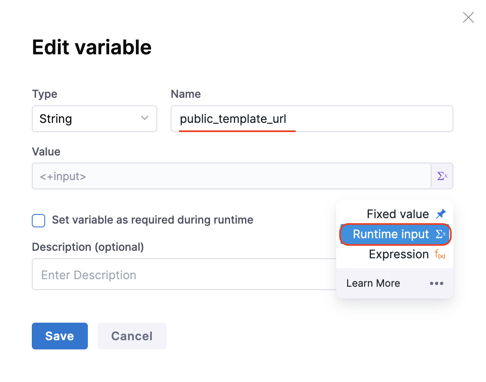

import Tabs from '@theme/Tabs';
import TabItem from '@theme/TabItem';


## Introduction


The self-service flow in IDP is powered by the Harness Pipelines. A stage is a part of a pipeline that contains the logic to perform a major segment of a larger workflow defined in a pipeline. Stages are often based on the different workflow milestones, such as building, approving, and delivering.

The process of adding a stage to a pipeline is the same for all Harness modules. When you add a stage to a pipeline, you select the stage type, such as **Developer Portal** for IDP or **Build** for CI or **Deploy** for CD. The available stage settings are determined by the stage type, and, if applicable, the module associated with the selected stage type.

This functionality is limited to the modules and settings that you have access to.

## How to Add the Developer Portal Stage


<Tabs>
<TabItem value="Present Nav" label="Present Nav" default>

1. Go to **Projects** and Select your project and create a new pipeline. 


</TabItem>
  <TabItem value="New Nav" label="New Nav">

1. Go to **Pipelines** under **Admin** from side nav and **Create a Pipeline**. 


</TabItem>
</Tabs>


2. Add a Name for your Pipeline and select **Inline** as pipeline storage options.


3. Now **Select Stage Type** as **Developer Portal** and add a [name for your stage](https://developer.harness.io/docs/platform/pipelines/add-a-stage/#stage-names) to **Set Up Stage**.


## Infrastructure

4. Under **Infrastructure** tab, Harness recommends [Harness Cloud](https://developer.harness.io/docs/continuous-integration/use-ci/set-up-build-infrastructure/use-harness-cloud-build-infrastructure#use-harness-cloud), but you can also use a [Kubernetes cluster](/docs/continuous-integration/use-ci/set-up-build-infrastructure/k8s-build-infrastructure/set-up-a-kubernetes-cluster-build-infrastructure), [local runner](/docs/continuous-integration/use-ci/set-up-build-infrastructure/define-a-docker-build-infrastructure) or [self-managed AWS/GCP/Azure VM](/docs/category/set-up-vm-build-infrastructures) build infrastructure.


## Pipeline Variables

5. Before adding the execution steps we need to create some **[pipeline variables](https://developer.harness.io/docs/platform/variables-and-expressions/add-a-variable/)** with [runtime inputs](https://developer.harness.io/docs/platform/variables-and-expressions/runtime-inputs/#runtime-inputs) which we will be using as **[expression inputs](https://developer.harness.io/docs/platform/variables-and-expressions/runtime-inputs/#expressions)** in various steps under execution. 

6. To add pipeline variables go to the right nav of your page and select **Variables** icon.

7. Under **Custom Variables** select **+Add Variable**.

8. Add a name to the variable and select the input type as **Runtime**.




To use the pipeline variable select the input type as **Expressions** and follow the [JEXL format](https://developer.harness.io/docs/platform/variables-and-expressions/add-a-variable/#reference-variables-in-a-pipeline) to add the variable. 


## Execution Steps

9. Now add the steps under the **Execution Tab**. The following is the list of suggested steps to be used in the execution.


### 1. Add the Git Clone step (Ignore this step if your repository containing cookiecutter template is public)

Add a Git Clone step to clone a repository into the Developer Portal stage's workspace.

By cloning the repository, you gain access to the necessary code, scripts, or configurations, enabling you to perform various actions.

The Git Clone step uses a containerized step group. For more information, go to [Containerize step groups](/docs/continuous-delivery/x-platform-cd-features/cd-steps/containerized-steps/containerized-step-groups.md).

<Tabs>
<TabItem value="Pipeline Studio" label="Pipeline Studio" default>


1. In your Developer Portal stage, in **Execution**, select **Add Step**.
2. Select **Git Clone**.
3. Configure the steps using the settings described below.

</TabItem>
<TabItem value="YAML" label="YAML">

```YAML
- step:
   type: GitClone
   name: GitClone_1
   identifier: GitClone_1
   spec:
     connectorRef: account.GitConnectorBzGN8G1COj
     repoName: myrepo
     build:
       type: branch
       spec:
         branch: main
```

</TabItem>
</Tabs>

#### Select Git Provider

Select the Git Provider as **Third-party Git Provider** in case you don't have your code in [**Harness Code Repository**](https://developer.harness.io/docs/code-repository/) 


#### Connector

:::info

Presently for Connectors the `connection type` **ssh** is not supported and for `credentials` only **Username and Password** type is supported. 


::: 

Select a connector for the source control provider hosting the code repository that you want the step to clone.

The following topics provide more information about creating code repo connectors:

* Azure Repos: [Connect to Azure Repos](/docs/platform/connectors/code-repositories/connect-to-a-azure-repo)
* Bitbucket: [Bitbucket connector settings reference](/docs/platform/connectors/code-repositories/ref-source-repo-provider/bitbucket-connector-settings-reference)
* GitHub: [GitHub connector settings reference](/docs/platform/connectors/code-repositories/ref-source-repo-provider/git-hub-connector-settings-reference)
* GitLab: [GitLab Connector Settings reference](/docs/platform/connectors/code-repositories/ref-source-repo-provider/git-lab-connector-settings-reference)
* Other Git providers:
  * [Git connector settings reference](/docs/platform/connectors/code-repositories/ref-source-repo-provider/git-connector-settings-reference)
  * [Connect to an AWS CodeCommit Repo](/docs/platform/connectors/code-repositories/connect-to-code-repo)

#### Repository Name

If the connector's [URL Type](/docs/platform/connectors/code-repositories/ref-source-repo-provider/git-connector-settings-reference#url-type) is **Repository**, then **Repository Name** is automatically populated based on the repository defined in the connector's configuration.

If the connector's URL Type is **Account**, then you must specify the name of the code repository that you want to clone into the stage workspace.

#### Build Type, Branch Name, and Tag Name

For **Build Type**, select **Git Branch** if you want the step to clone code from a specific branch within the repository, or select **Git Tag** if you want the step to clone code from a specific commit tag. Based on your selection, specify a **Branch Name** or **Tag Name**.

:::tip

You can use [fixed values, runtime input, or variable expressions](/docs/platform/variables-and-expressions/runtime-inputs/) for the branch and tag names. For example, you can enter `<+input>` for the branch or tag name to supply a branch or tag name at runtime.

:::

#### Clone directory

An optional target path in the stage workspace where you want to clone the repo.

#### Depth

The number of commits to fetch when the step clones the repo.

The default depth is `0`, which fetches all commits from the relevant branch.

For more information, go to the [git clone documentation](https://git-scm.com/docs/git-clone).

### 2. Cookiecutter

Cookiecutter step is used to take inputs for the cookiecutter template. 

:::warning

In the example provided for this step we have used pipeline variables as input for many fields, make sure you have the corresponding pipeline variable created with proper value [as described under pipeline variables](https://developer.harness.io/docs/internal-developer-portal/flows/idp-stage#pipeline-variables). 

:::


<Tabs>
<TabItem value="Pipeline Studio" label="Pipeline Studio" default>


#### Repository Type

Select the repository type in which your template is stored, which could be public or private git repository. 

:::info

In case it's **Private** make sure you have added the **gitclone step** and the **path for template** should be the **Clone Directory** added in **gitclone step**

In case of public templates you just need to add the public URL of the template path stored in your git provider. eg `https://github.com/devesh-harness/test-cookicutter`

:::

In case you have your own cookiecutter template, make sure the directory structure in the repository should be as follows

```sh
cookiecutter-something/
├── {{ cookiecutter.project_name }}/  <--------- Project template
│   └── ...
├── blah.txt                      <--------- Non-templated files/dirs
│                                            go outside
│
└── cookiecutter.json             <--------- Prompts & default values
```

You must have:

- A `cookiecutter.json` file.

- A `{{ cookiecutter.project_name }}/` directory, where `project_name` is defined in your `cookiecutter.json`.

Beyond that, you can have whatever files/directories you want.

:::info
 
Cookiecutter runs only on the **Project Template** and use values mentioned in `cookiecutter.json`, hence when you add it on git it's suggested to have **one cookiecutter template per repository** with the `cookiecutter.json` on the root. Also in case you don't want to render a file on the execution of cookiecuuter template, but that file is inside your Project Template, add it under `_copy_without_render` key in your `cookiecutter.json` 

```json
{
    "project_slug": "sample",
    "_copy_without_render": [
        "*.html",
        "*not_rendered_dir",
        "rendered_dir/not_rendered_file.ini"
    ]
}
```

:::

#### Path for Template 

First select the type of the input it could be a [Fixed Value](https://developer.harness.io/docs/platform/variables-and-expressions/runtime-inputs/#fixed-values), [Runtime input](https://developer.harness.io/docs/platform/variables-and-expressions/runtime-inputs/#runtime-inputs) or [Expression](https://developer.harness.io/docs/platform/variables-and-expressions/runtime-inputs/#expressions)

In case of **Fixed Value** provide the absolute value of template URL, for e.g. `https://github.com/devesh-harness/test-cookicutter`

In case of **Runtime Input** provide the absolute value of the template URL after you run the pipeline. 

In case of **Expression** provide the pipeline variable in JEXL format which takes the template URL as an input, this is widely used while implementing the [self-service flow](/docs/internal-developer-portal/tutorials/service-onboarding-pipeline.md#manage-variables-in-the-pipeline).

#### Configure Template

Provide the input required the template in terms of key value pairs in this step. 


</TabItem>
<TabItem value="YAML" label="YAML">

```YAML
- step:
    type: CookieCutter
    name: CookieCutter
    identifier: idpcookiecutter
    spec:
    templateType: public
    publicTemplateUrl: <+pipeline.variables.public_template_url>
    cookieCutterVariables:
        app_name: <+pipeline.variables.project_name>
```


</TabItem>
</Tabs>


### 3. Create Repo

This step is to create the repository in your git provider which will be later used to add the service/app created using cookiecutter step along with the catalog which will be created in the **Create Catalog** step. 

:::warning

In the example provided for this step we have used pipeline variables as input for many fields, make sure you have the corresponding pipeline variable created with proper value [as described under pipeline variables](https://developer.harness.io/docs/internal-developer-portal/flows/idp-stage#pipeline-variables). 

:::

:::info

The git connector used under **[Connectors Page](https://developer.harness.io/docs/internal-developer-portal/get-started/onboarding-guide#connector-setup)** in IDP Admin should have fetch access to the repository getting created in this step. 

:::

<Tabs>
<TabItem value="Pipeline Studio" label="Pipeline Studio" default>


#### Repository Type

Select the repository type you want to create, which could be public or private.

#### Connector

:::info

Presently for Connectors the `connection type` **ssh** is not supported and for `credentials` only **Username and Password** type is supported. 


::: 

Select a connector for the git provider that will host the code repository.

The following topics provide more information about creating code repo connectors:

* Azure Repos: [Connect to Azure Repos](/docs/platform/connectors/code-repositories/connect-to-a-azure-repo)
* Bitbucket: [Bitbucket connector settings reference](/docs/platform/connectors/code-repositories/ref-source-repo-provider/bitbucket-connector-settings-reference)
* GitHub: [GitHub connector settings reference](/docs/platform/connectors/code-repositories/ref-source-repo-provider/git-hub-connector-settings-reference)
* GitLab: [GitLab Connector Settings reference](/docs/platform/connectors/code-repositories/ref-source-repo-provider/git-lab-connector-settings-reference)

#### Org, Repo, Description, Default Branch

:::info

For GitLab integration, you need to add the [group](https://docs.gitlab.com/ee/user/group/) path as well, in-case it's not a personal account


:::

Add the org, repo name, Repo Description and Default branch for the repo you want to create.

</TabItem>
<TabItem value="YAML" label="YAML">

```YAML
- step:
    type: CreateRepo
    name: CreateRepo
    identifier: createrepo
    spec:
    connectorRef: account.testdev
    organization: <+pipeline.variables.organization>
    repository: <+pipeline.variables.project_name>
    repoType: <+pipeline.variables.repository_type>
    description: <+pipeline.variables.repository_description>
    defaultBranch: <+pipeline.variables.repository_default_branch>
```

</TabItem>
</Tabs>

#### Output

Following is the output variable of this step.

1. **repositoryUrl** : The URL of the repository created eg; `https://github.com/org-name/repo-name` and this variable could be used in other steps in the pipeline by using this **JEXL** expression as a stage variable `<+pipeline.stages.idp.spec.execution.steps.createrepo.output.outputVariables.repositoryUrl>`

These output variable could be viewed under the output tab in 


### 4. Create Catalog

This step is used to create the `catalog-info.yaml/idp.yaml` to be ued to register the software component we have created in previous step in our IDP catalog. 

:::warning

In the example provided for this step we have used pipeline variables as input for many fields, make sure you have the corresponding pipeline variable created with proper value [as described under pipeline variables](https://developer.harness.io/docs/internal-developer-portal/flows/idp-stage#pipeline-variables). 

:::

:::info

The git connector used under **[Connectors Page](https://developer.harness.io/docs/internal-developer-portal/get-started/onboarding-guide#connector-setup)** in IDP Admin should have fetch access to the repository the `catalog-info.yaml` is getting published to, for it to be registered in the catalog. 

:::

<Tabs>
<TabItem value="Pipeline Studio" label="Pipeline Studio" default>


#### File Name, Path
Name the `catalog-info.yaml` followed by providing a path if you don't want to register in the root of the repo created in the `Create Repo` step. 

#### File Content

Add the YAML content to be added in your `catalog-info.yaml` file, For eg.,

```YAML
apiVersion: backstage.io/v1alpha1
kind: Component
metadata:
  name: <+pipeline.variables.project_name>
  description: <+pipeline.variables.project_name> created using self service flow
  annotations:
    backstage.io/techdocs-ref: dir:.
spec:
  type: service
  owner: test
  lifecycle: experimental
```

</TabItem>
<TabItem value="YAML" label="YAML">

```YAML
- step:
    type: CreateCatalog
    name: createcatalog
    identifier: createcatalog
    spec:
    fileName: <+pipeline.variables.catalog_file_name>
    filePath: <+pipeline.variables.project_name>
    fileContent: |-
        apiVersion: backstage.io/v1alpha1
        kind: Component
        metadata:
        name: <+pipeline.variables.project_name>
        description: <+pipeline.variables.project_name> created using self service flow
        annotations:
            backstage.io/techdocs-ref: dir:.
        spec:
        type: service
        owner: test
        lifecycle: experimental
```

</TabItem>
</Tabs>

#### Output

Following is the output variable of this step.

1. **registeredCatalogUrl** : The URL of the software component registered in the catalog of IDP eg; `https://app.harness.io/ng/account/**************/module/idp/catalog/default/component/component-name` and this variable could be used in other steps in the pipeline by using this **JEXL** expression as a stage variable `<<+pipeline.stages.idp.spec.execution.steps.createcatalog.output.outputVariables.registeredCatalogUrl>>`

These output variable could be viewed under the output tab in 


### 5. Direct Push

This step is used to push the `service/application` created using Cookiecutter step along with the `catalog-info.yaml` in the repo you created in previous step. 

:::warning

In the example provided for this step we have used pipeline variables as input for many fields, make sure you have the corresponding pipeline variable created with proper value [as described under pipeline variables](https://developer.harness.io/docs/internal-developer-portal/flows/idp-stage#pipeline-variables). 

:::

<Tabs>
<TabItem value="Pipeline Studio" label="Pipeline Studio" default>


#### Connector

:::info

Presently for Connectors the `connection type` **ssh** is not supported and for `credentials` only **Username and Password** type is supported. 


::: 

Select a connector for the git provider where you want to push the code. 

The following topics provide more information about creating code repo connectors:

* Azure Repos: [Connect to Azure Repos](/docs/platform/connectors/code-repositories/connect-to-a-azure-repo)
* Bitbucket: [Bitbucket connector settings reference](/docs/platform/connectors/code-repositories/ref-source-repo-provider/bitbucket-connector-settings-reference)
* GitHub: [GitHub connector settings reference](/docs/platform/connectors/code-repositories/ref-source-repo-provider/git-hub-connector-settings-reference)
* GitLab: [GitLab Connector Settings reference](/docs/platform/connectors/code-repositories/ref-source-repo-provider/git-lab-connector-settings-reference)


#### Org, Repo, Code Directory, Branch

:::info

For GitLab integration, you need to add the [group](https://docs.gitlab.com/ee/user/group/) path as well. In case of using the personal account, make sure you add the `account-id` in the path

:::

Add the Org, Repo Name, Repo Description and Branch Name where you want to push the code.

#### Allow Force Push

This when enabled or set to `true`, will be able to overwrite the changes to **Default branch** set in the **Create Repo** step. 

</TabItem>
<TabItem value="YAML" label="YAML">

```YAML
- step:
    type: DirectPush
    name: DirectPush
    identifier: directpush
    spec:
      connectorType: Github
      forcePush: true
      connectorRef: account.testdev
      organization: <+pipeline.variables.organization>
      repository: <+pipeline.variables.project_name>
      codeDirectory: <+pipeline.variables.project_name>
      branch: <+pipeline.variables.direct_push_branch>
```

</TabItem>
</Tabs>

### 6. Register Catalog

This step is used to register the software component created in the Catalog of Harness IDP using `catalog-info.yaml`. 

:::warning

In the example provided for this step we have used pipeline variables as input for many fields, make sure you have the corresponding pipeline variable created with proper value [as described under pipeline variables](https://developer.harness.io/docs/internal-developer-portal/flows/idp-stage#pipeline-variables). 

:::

<Tabs>
<TabItem value="Pipeline Studio" label="Pipeline Studio" default>


#### Connector

:::info

Presently for Connectors the `connection type` **ssh** is not supported and for `credentials` only **Username and Password** type is supported. 


::: 

Select a connector for the git provider where your `catalog-info.yaml` is stored. 

The following topics provide more information about creating code repo connectors:

* Azure Repos: [Connect to Azure Repos](/docs/platform/connectors/code-repositories/connect-to-a-azure-repo)
* Bitbucket: [Bitbucket connector settings reference](/docs/platform/connectors/code-repositories/ref-source-repo-provider/bitbucket-connector-settings-reference)
* GitHub: [GitHub connector settings reference](/docs/platform/connectors/code-repositories/ref-source-repo-provider/git-hub-connector-settings-reference)
* GitLab: [GitLab Connector Settings reference](/docs/platform/connectors/code-repositories/ref-source-repo-provider/git-lab-connector-settings-reference)

#### Org, Repo, Branch, File Path

:::info

For GitLab integration, you need to add the [group](https://docs.gitlab.com/ee/user/group/) path as well. In case of using the personal account, make sure you add the `account-id` in the path

:::

Add the Org, Repo Name, Branch and the File path relative to the root of the repository, where your `catalog-info.yaml` is present.

</TabItem>
<TabItem value="YAML" label="YAML">


```YAML
- step:
    type: RegisterCatalog
    name: registercatalog
    identifier: registercatalog
    spec:
    connectorRef: account.testdev
    repository: <+pipeline.variables.project_name>
    organization: <+pipeline.variables.organization>
    filePath: <+pipeline.variables.catalog_file_name>
    branch: <+pipeline.variables.direct_push_branch>
```

</TabItem>
</Tabs>

Following is the output variable of this step.

1. **catalogInfoUrl** : The URL of the `catalog-info.yaml` stored in your git provider where you created the repo in the **CreateRepo step** eg; `https://github.com/org-name/repo-name/blob/code/catalog-info.yaml` and this variable could be used in other steps in the pipeline by using this **JEXL** expression as a stage variable `<<+pipeline.stages.idp.spec.execution.steps.registercatalog.output.outputVariables.catalogInfoUrl>>`

These output variable could be viewed under the output tab in 


### 7. Slack Notify

This step is used to notify individual developers once the pipeline is executed successfully and your Software component is registered successfully in your Software Catalog. 

:::warning

In the example provided for this step we have used pipeline variables as input for many fields, make sure you have the corresponding pipeline variable created with proper value [as described under pipeline variables](https://developer.harness.io/docs/internal-developer-portal/flows/idp-stage#pipeline-variables). 

:::

<Tabs>
<TabItem value="YAML" label="YAML">

 
```YAML
- step:
    type: SlackNotify
    name: slacknotify
    identifier: slacknotify
    spec:
    emailId: <+pipeline.variables.email_id>
    messageContent: " Hello <+pipeline.variables.project_name> project is created using flows in Harness IDP,\\n*Created Catalog Yaml -* <<+pipeline.stages.serviceonboarding.spec.execution.steps.registercatalog.output.outputVariables.catalogInfoUrl>|Link>\\n*Created Repository -* <<+pipeline.stages.serviceonboarding.spec.execution.steps.createrepo.output.outputVariables.repositoryUrl>|Link>\\n*Registered Catalog -* <<+pipeline.stages.serviceonboarding.spec.execution.steps.createcatalog.output.outputVariables.registeredCatalogUrl>|Link>"
    token: slacksecrettestws
```

The output of the steps like **Create Repo**, **Register Catalog** in the `JEXL` format has been used to construct the `messageContent` for slack notification. 

The `token` is the [Bot-tokens](https://api.slack.com/authentication/token-types#bot) 

</TabItem>
<TabItem value="Pipeline Studio" label="Pipeline Studio" default>

1. Add the **Name** of the Step


The output of the steps like **Create Repo**, **Register Catalog** in the `JEXL` format has been used to construct the `Message` for Slack notification. 

</TabItem>
</Tabs>

#### Slack Email ID

Use the email ID you have used to register in Slack. 

#### Slack secret key

The Slack Secret Key are the [Bot-tokens](https://api.slack.com/authentication/token-types#bot) created with the following permissions. 

1. chat:write
2. chat:write.public
3. users:read.email
4. users:read


Read more on [how to create bot-tokens](https://api.slack.com/start/quickstart#scopes). 

1. Now create a new secret and add this as a **Secret** under the **Slack Secret Key**.

### 8. Create Resource

This step in developer portal stage allows you to **execute only OpenTofu (Open Source Terraform) module related to [Harness Terraform Provider](https://registry.terraform.io/providers/harness/harness/latest/docs)** to create or update resources. You can use this step to create Harness entities like projects, users, connectors, pipelines, secrets, etc.

<Tabs>
<TabItem value="YAML" label="YAML">

```YAML
- step:
    type: CreateResource
    name: CreateResource_1
    identifier: CreateResource_1
    spec:
      resourceDefinition: |-
        resource "harness_platform_pipeline" "pipeline" {
          identifier = "identifier"
          org_id     = "orgIdentifier"
          project_id = "projectIdentifier"
          name       = "name"
          yaml = <<-EOT
            pipeline:
              name: name
              identifier: identifier
              projectIdentifier: projectIdentifier
              orgIdentifier: orgIdentifier
              stages:
                - stage:
                    name: idp
                    identifier: idp
                    description: ""
                    type: IDP
                    spec:
                      platform:
                        os: Linux
                        arch: Amd64
                      runtime:
                        type: Cloud
                        spec: {}
                      execution:
                        steps:
                          - step:
                              type: Run
                              name: Run_1
                              identifier: Run_1
                              description: <+input>
                              spec:
                                shell: Sh
                                command: echo "Hello"
                    tags: {}
          EOT
        }
      xApiKey: Harness PAT for the account you want to create the pipeline
```
This step comes with a sample **Resource Definition** to create a Harness Pipeline with a Run Step. This contains dummy values, hence won't work consider replacing it with the resource definition of yours. Also refer to [Harness Terraform Provider](https://registry.terraform.io/providers/harness/harness/latest/docs) to help you with Harness Resource definitions.

The `xApiKey` is the [Harness PAT](https://developer.harness.io/docs/platform/automation/api/add-and-manage-api-keys/) for the account where you want to create the pipeline.

</TabItem>
<TabItem value="Pipeline Studio" label="Pipeline Studio" default>

- You can select the step **Create Resource** from the **Step Library**. 


- You can add a **Name** to the step followed by adding the **Resource Definition** and create a Harness Entity using Resources supported by our [Harness Terraform Provider](https://registry.terraform.io/providers/harness/harness/latest/docs). Likewise, you'll find an already existing sample **Resource Definition** by default, that can create a Harness Pipeline with a **Run Step**.  


</TabItem>
</Tabs>

### 9. Update Catalog Property

This step is used to update the catalog metadata for your entities. For example, you want to add the latest build version for your service in your catalog using this step in your CI pipeline and update the data in your catalog. 

- You can select the step **Update Catalog Property** from the **Step Library**. 


- Now under the **Select the Catalog entity and the properties to be updated** you have two options
  - Update single Catalog Entity
  - Update multiple catalog Entities

<Tabs>
<TabItem value="Update a single Catalog Entity" label="Update a single Catalog Entity">

- To **update a single Catalog Entity**, select the Catalog Entity from the dropdown. You need to type at least the first three characters in the field for the entity options to appear.


- Now add the **property**, you want to update/add and the **value** against it. e.g., `<+metadata.testCoverage>`, `<+metadata.additionalInfo.onShorelead>`. 

- The **API Key** field is optional. If left empty, the credentials of the user executing the pipeline will be used to update the catalog entity.

</TabItem>
<TabItem value="Update Multiple Catalog Entities" label="Update Multiple Catalog Entities" default>

- To **update multiple Catalog entities**, you need to add the **property** to be updated across the entities followed by `entity-ref` and corresponding values. 

- In case you want to add a default value across all the entities then update the field under Default Value. 

- The **API Key** field is optional. If left empty, the credentials of the user executing the pipeline will be used to update the catalog entity.

- Under Advanced you can select the mode 

  - Available Modes:
    - replace (default): Completely replaces the existing value with the new one provided in the value field.
    - append: Adds new values to the existing array (or other types to be appended like maps or key-value pairs).
  
> Note: `append` only works with data types that can hold multiple values, such as arrays or maps. It does not apply to simple data types like strings.

</TabItem>
</Tabs>

## Final Pipeline using Developer Portal Stage

:::info

We have been using **Expression** for most of the input values like `<+pipeline.variables.email_id>` to be able to provide these values from the templates in the form of `email_id: ${{ parameters.emailid }}` 

Example

```YAML
spec:
...
  parameters:
    - title: Service Details
      required:
        - emailid
        - triggerName
      properties:
        emailid:
          title: Enter your Email ID
          type: string
          description: The email ID in slack
...
...
  steps:
    - id: trigger
      name: Creating your react app
      action: trigger:harness-custom-pipeline
      input:
        url: ""
        email_id: ${{ parameters.emailid }}
...

```

:::


<Tabs>
<TabItem value="YAML" label="YAML" default>


```YAML

pipeline:
  name: Self-Service-flow-repo-setup
  identifier: SelfServiceflowreposetup
  projectIdentifier: projctidp
  orgIdentifier: default
  tags: {}
  stages:
    - stage:
        name: service-onboarding
        identifier: serviceonboarding
        description: ""
        type: IDP
        spec:
          infrastructure:
            type: KubernetesDirect
            spec:
              connectorRef: idptest
              namespace: harness-delegate
              automountServiceAccountToken: true
              nodeSelector: {}
              os: Linux
          execution:
            steps:
              - step:
                  type: CookieCutter
                  name: CookieCutter
                  identifier: idpcookiecutter
                  spec:
                    templateType: <+pipeline.variables.template_type>
                    publicTemplateUrl: <+pipeline.variables.public_template_url>
                    cookieCutterVariables:
                      app_name: <+pipeline.variables.project_name>
              - step:
                  type: CreateRepo
                  name: CreateRepo
                  identifier: createrepo
                  spec:
                    connectorRef: account.testdev
                    organization: <+pipeline.variables.organization>
                    repository: <+pipeline.variables.project_name>
                    repoType: <+pipeline.variables.repository_type>
                    description: <+pipeline.variables.repository_description>
                    defaultBranch: <+pipeline.variables.repository_default_branch>
              - step:
                  type: CreateCatalog
                  name: createcatalog
                  identifier: createcatalog
                  spec:
                    fileName: <+pipeline.variables.catalog_file_name>
                    filePath: <+pipeline.variables.project_name>
                    fileContent: |-
                      apiVersion: backstage.io/v1alpha1
                      kind: Component
                      metadata:
                        name: <+pipeline.variables.project_name>
                        description: <+pipeline.variables.project_name> created using self service flow
                        annotations:
                          backstage.io/techdocs-ref: dir:.
                      spec:
                        type: service
                        owner: test
                        lifecycle: experimental
              - step:
                  type: DirectPush
                  name: DirectPush
                  identifier: directpush
                  spec:
                    connectorRef: account.testdev
                    repository: <+pipeline.variables.project_name>
                    organization: <+pipeline.variables.organization>
                    codeDirectory: <+pipeline.variables.project_name>
                    branch: <+pipeline.variables.direct_push_branch>
              - step:
                  type: RegisterCatalog
                  name: registercatalog
                  identifier: registercatalog
                  spec:
                    connectorRef: account.testdev
                    repository: <+pipeline.variables.project_name>
                    organization: <+pipeline.variables.organization>
                    filePath: <+pipeline.variables.catalog_file_name>
                    branch: <+pipeline.variables.direct_push_branch>
              - step:
                  type: SlackNotify
                  name: slacknotify
                  identifier: slacknotify
                  spec:
                    email: <+pipeline.variables.email_id>
                    messageContent: " Hello <@<+pipeline.variables.email_id>>, <+pipeline.variables.project_name> project is created using flows in Harness IDP,\\n*Created Catalog Yaml -* <<+pipeline.stages.serviceonboarding.spec.execution.steps.registercatalog.output.outputVariables.catalogInfoUrl>|Link>\\n*Created Repository -* <<+pipeline.stages.serviceonboarding.spec.execution.steps.createrepo.output.outputVariables.repositoryUrl>|Link>\\n*Registered Catlog -* <<+pipeline.stages.serviceonboarding.spec.execution.steps.createcatalog.output.outputVariables.registeredCatalogUrl>|Link>"
                    token: slacksecrettestws
          cloneCodebase: false
          caching:
            enabled: false
            paths: []
  variables:
    - name: test_content
      type: String
      description: ""
      required: false
      value: devesh
    - name: project_name
      type: String
      description: ""
      required: false
      value: <+input>
    - name: organization
      type: String
      description: ""
      required: false
      value: test-org-devesh
    - name: template_type
      type: String
      description: ""
      required: false
      value: <+input>.default(public).allowedValues(public,private)
    - name: public_template_url
      type: String
      description: ""
      required: false
      value: <+input>
    - name: repository_type
      type: String
      description: ""
      required: false
      value: <+input>.default(private).allowedValues(private,public)
    - name: repositoty_description
      type: String
      description: ""
      required: false
      value: <+input>
    - name: repository_default_branch
      type: String
      description: ""
      required: false
      value: <+input>
    - name: direct_push_branch
      type: String
      description: ""
      required: false
      value: <+input>
    - name: catalog_file_name
      type: String
      description: ""
      required: false
      value: catalog-info.yaml
    - name: email_id
      type: String
      description: ""
      required: false
      value: <+input>

```


</TabItem>
<TabItem value="Pipeline Studio" label="Pipeline Studio">


</TabItem>
</Tabs>

## Specify the Harness IDP images used in your pipelines

You can use the Harness IDP `execution-config` API to specify or update the Harness IDP images used in your infrastructure by specifying image tags.

:::info

Certain steps are common across different stages in Harness Pipeline, but the images used in each of them is specific to the stage they are part of, like `Run Step`.

:::

API key authentication is required. For more information about API keys, go to [Manage API keys](/docs/platform/automation/api/add-and-manage-api-keys). For more information about authentication, go to the [Harness API documentation](https://apidocs.harness.io/#section/Introduction/Authentication).

1. Send a `get-default-config` request to get a list of the latest Harness IDP Workflows executed. You can use the `infra` parameter to get `k8` images or `VM` images.

   ```json
   curl --location --request GET "https://app.harness.io/gateway/idp/execution-config/get-default-config?accountIdentifier=$YOUR_HARNESS_ACCOUNT_ID&infra=K8" \
   --header 'X-API-KEY: $API_KEY'
   ```

   The response payload shows the latest supported images and their tags, for example:

   ```json
   {
    "status": "SUCCESS",
     "data": {
        "cookieCutter": "harness/cookiecutter:1.9.1",
        "createRepo": "harness/createrepo:1.9.0",
        "directPush": "harness/directpush:1.9.0",
        "registerCatalog": "harness/registercatalog:1.9.0",
        "createCatalog": "harness/createcatalog:1.9.0",
        "slackNotify": "harness/slacknotify:1.9.0",
        "createOrganisation": "harness/createorganisation:1.9.0",
        "createProject": "harness/createproject:1.9.0"
     },
     "metaData": null,
     "correlationId": "08919155-a6d6-4bd3-8401-6b86318c85ca"
   }
   ```

2. Send a `get-customer-config` request to get the build images that your IDP pipelines currently use. When `overridesOnly` is `true`, which is the default value, this endpoint returns the non-default images that your pipeline uses.

   ```json
   curl --location --request GET "https://app.harness.io/gateway/idp/execution-config/get-customer-config?accountIdentifier=$YOUR_HARNESS_ACCOUNT_ID&infra=K8&overridesOnly=true" \
   --header 'X-API-KEY: $API_KEY'
   ```

   If the response contains `null`, your pipeline is using all default images, for example:

   ```json
   {
       "status": "SUCCESS",
       "data": {},
       "metaData": null,
       "correlationId": "11ce1bc8-b337-4687-9ab9-e13d553ae82f"
   }
   ```

3. Send a `update-config` (POST) request with a list of the images you want to update and the new tags to apply.

   ```json
   curl --location --request POST "https://app.harness.io/gateway/idp/execution-config/update-config?accountIdentifier=$YOUR_HARNESS_ACCOUNT_ID&infra=K8" \
   --header 'X-API-KEY: $API_KEY' \
   --header 'Content-Type: application/json' \
   --data-raw '[
       {
           "field": "registerCatalog",
           "value": "harness/registercatalog:1.9.0"
       },
       {
           "field": "slackNotify",
           "value": "harness/slacknotify:1.9.0"
       }
   ]'
   ```

4. To reset one or more images to their defaults, send a `reset-config` (POST) request with a list of the images to reset.

   ```json
   curl --location --request POST "https://app.harness.io/gateway/idp/execution-config/reset-config?accountIdentifier=$YOUR_HARNESS_ACCOUNT_ID&infra=K8" \
   --header 'X-API-KEY: $API_KEY' \
   --header 'Content-Type: application/json' \
   --data-raw '[
       {
           "field": "registerCatalog"
       },
       {
           "field": "createRepo"
       }
   ]'
   ```