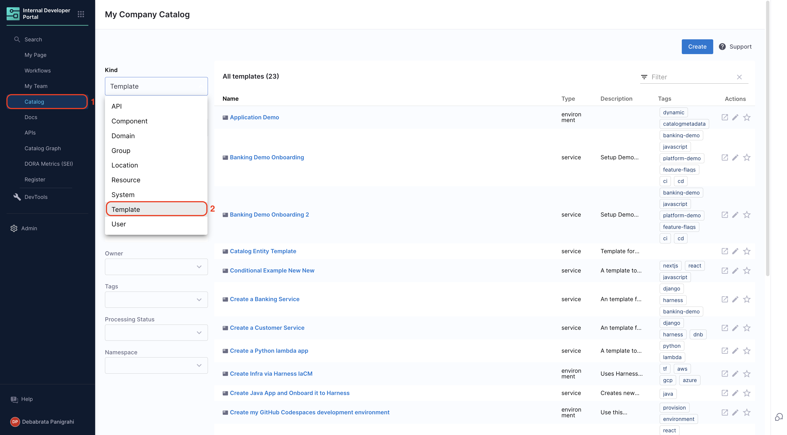
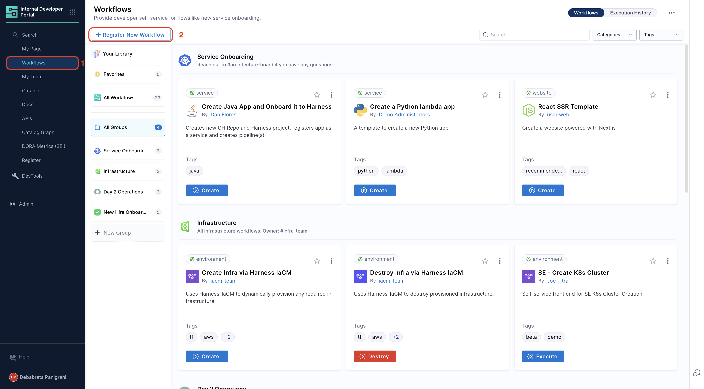
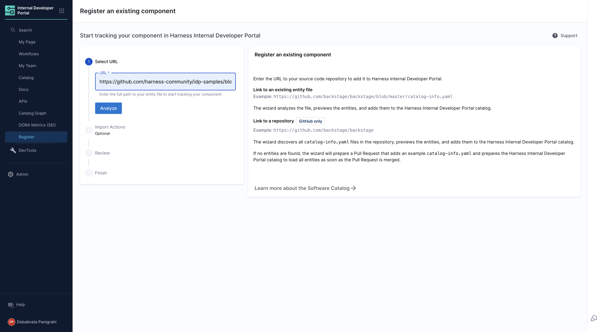
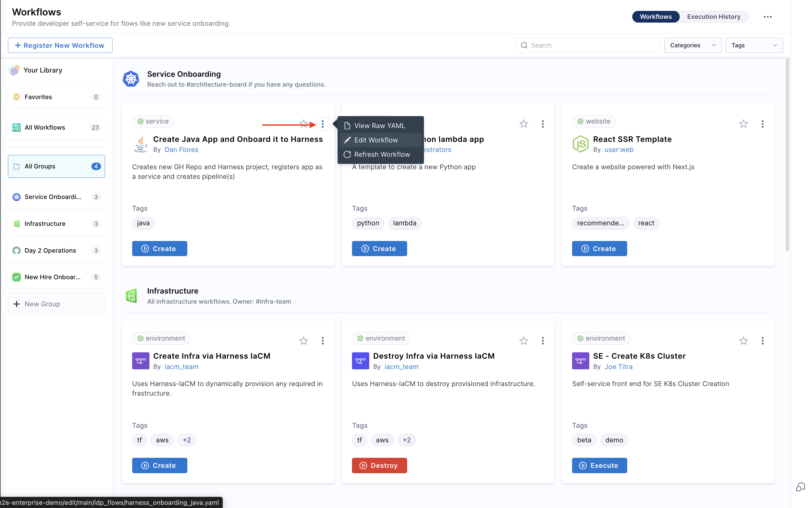
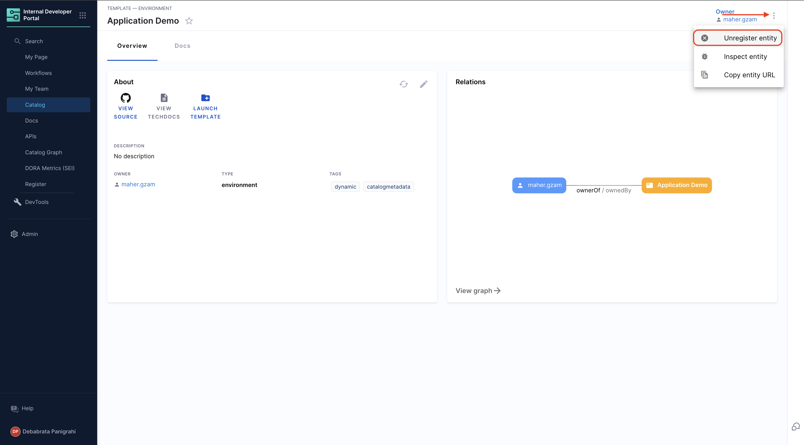
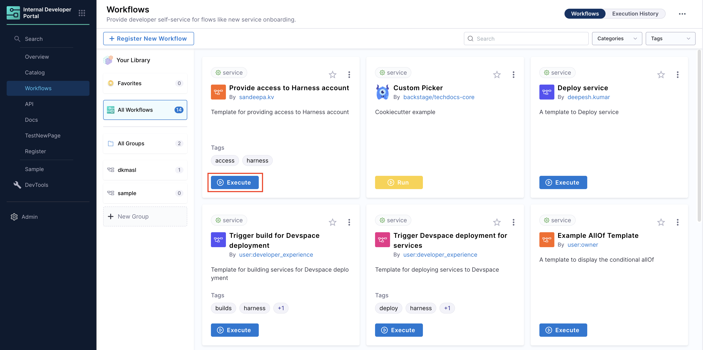

This guide will walk you through the process of registering and managing your Workflows directly from Harness IDP. Let's dive in!
## Workflows in Software Catalog
Once a workflow is registered, it is stored in the Software Catalog under the kind **“Template”**.

### Accessing Workflows
1. Navigate to the **“Catalog”** page in Harness IDP.
2. Select **“Template”** from the catalog component filter to view all workflows.



You can also inspect the **catalog metadata** for a workflow by clicking on the **three dots in the top-right corner** and selecting **“Inspect Entity”**.

## Managing Workflows 
You can manage your workflows from Harness IDP directly. Let's dive deeper into specific functions.

### Registering Workflows 
You can register a new workflow just like you register a new entity in your software catalog, refer to this guide for more details. 
1. Create a **```workflow.yaml```** file in your source code repository.
2. Go to the **“Workflows”** page in Harness IDP and click **“Register a new workflow”**.

3. Provide the URL of the ```workflow.yaml``` file. Learn more about registering workflows.


### Updating Workflows
You can update/edit your workflows from your Harness IDP by updating your workflow.yaml file: 
1. In the workflows page, click the **three dots** on the desired workflow.
2. Select **“Edit Workflow”** to modify the YAML file.

3. Save changes by committing the updated YAML file.
4. **Refresh the workflow** in Harness IDP to apply changes.


### Unregistering Workflows
You can delete your workflow as well: 
1. Select the **workflow from the software catalog** view.
2. Click the **three dots** in the top-right corner and choose **“Unregister Entity”**.


### Executing Workflows
You can launch workflows directly from the **“Workflows”** page in Harness IDP. Users will be prompted to provide input details via the configured frontend, and the workflow will execute accordingly.


### Setting the Owner

It's a good practice to assign an **Owner** to a Workflow so developers can easily reach out to them if they have any questions or encounter issues. The [``spec.owner``](https://developer.harness.io/docs/internal-developer-portal/catalog/how-to-create-idp-yaml#spec-owner) field in Harness allows you to specify the owner in several ways:

- Assign a [**User Group**](https://developer.harness.io/docs/platform/role-based-access-control/add-user-groups/#built-in-user-groups) for better collaboration and role-based access.
- Specify an email, such as team@mycompany.net, to direct queries to a team or individual.
- Use a plain text identifier like Infra Team for simplicity.

Here’s an example of a basic workflow.yaml definition:

```YAML {4}
...
# these are the steps which are rendered in the frontend with the form input
spec:
  owner: debabrata.panigrahi@harness.io
  type: service
  parameters:
    - title: Service Details
      properties:
        owner:
          title: Choose an Owner for the Service
          type: string
          ui:field: OwnerPicker
          ui:options:
            allowedKinds:
              - Group
        # This field is hidden but needed to authenticate the request to trigger the pipeline
        token:
          title: Harness Token
          type: string
          ui:widget: password
          ui:field: HarnessAuthToken


