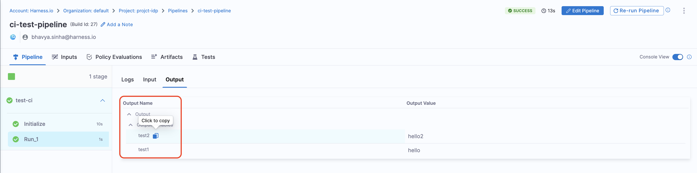

You can configure specific outputs for your workflows. Each step defined in your backend within ```workflow.yaml``` can generate output variables that are used in the frontend after task execution. These outputs can include direct links to newly created resources, such as Git repositories, documentation pages, or CI/CD pipelines, providing developers with immediate access to manage or monitor their onboarded resources.

### Fetch Outputs from Harness Pipeline
To fetch and display output variables from a Harness pipeline in your workflow, you must configure the workflow YAML appropriately.

#### Step 1: Enable Output Display

In your workflow YAML, within the relevant steps block, set the following flag:
```YAML
showOutputVariables: true
```
This flag allows the workflow to display the output variables generated by the pipeline.

#### Step 2: Define Output Variables

Once `showOutputVariables` is set, output variables from the pipeline can be referenced in two ways:

1. **Directly referencing the output variable name:**  
   ```yaml
   ${{ steps.trigger.output.test2 }}
   ```  
   Here, `test2` is the output variable created in the pipeline.  

2. **Using the JEXL expression from execution logs:**  
   - Copy the JEXL expression of the output variable and remove the JEXL constructs.  
    Example:  
     ```yaml
     ${{ steps.trigger.output['pipeline.stages.testci.spec.execution.steps.Run_1.output.outputVariables.test1'] }}
     ```  
   - In this case, `pipeline.stages.testci.spec.execution.steps.Run_1.output.outputVariables.test1` is derived from: 
     ```yaml
     <+pipeline.stages.testci.spec.execution.steps.Run_1.output.outputVariables.test2>
     ```  
     
  
  This approach ensures that pipeline outputs are correctly fetched and displayed. 


#### Example ```workflow.yaml```
```YAML
steps:
  - id: trigger
      name: Creating your react app
      action: trigger:harness-custom-pipeline
      input:
      url: "https://app.harness.io/ng/account/vpCkHKsDSxK9_KYfjCTMKA/home/orgs/default/projects/communityeng/pipelines/IDP_New_NextJS_app/pipeline-studio/?storeType=INLINE"
      inputset:
          project_name: ${{ parameters.project_name }}
          github_repo: ${{ parameters.github_repo }}
          cloud_provider: ${{ parameters.provider }}
          db: ${{ parameters.db }}
          cache: ${{ parameters.cache }}
      apikey: ${{ parameters.token }}
      showOutputVariables: true
output:
  text:
    - title: Output Variable
      content: |
        Output Variable **test2** is `${{ steps.trigger.output.test2 }}`
    - title: Another Output Variable
      content: |
        Output Variable **test1** with fqnPath is `${{ steps.trigger.output['pipeline.stages.testci.spec.execution.steps.Run_1.output.outputVariables.test1'] }}`
```

:::info
Please note that while **user-defined output variables** are allowed for the above use-case, you can also use **system-generated variables** by assigning them as a new variable under the **Shell Script** step, as shown below.  

For example, if a system-generated output variable is **`jira_id`**, you can define it as a **user-defined output variable** under **Optional Configuration** by assigning it to a new variable, such as `test-var`. This newly defined variable (`test-var`) can then be displayed as output in the **IDP workflows**.


:::

### Links to Generated Resources
The output can generate direct links to newly created resources, such as Git repositories, documentation pages, or CI/CD pipelines. This provides developers with immediate access to manage and monitor their newly onboarded resources efficiently.

``` YAML
output:
  links:
    - title: "Repository Link"
      url: "${{ steps['repo-create'].output.repoUrl }}"
    - title: "Pipeline Dashboard"
      url: "${{ steps['deploy-pipeline'].output.pipelineUrl }}"

```

### Service Metadata and Status
The output can include status messages or metadata from the onboarding process. For example, it can provide details about service registration or track the progress of resource provisioning, including success or failure messages.

```YAML
output:
  text:
    - title: "Service Registration Status"
      content: "Service registration completed with status: `${{ steps['register-service'].output.status }}`
```

### Generate Files and Artifacts
Developers can configure workflows to generate essential files (e.g., README.md, YAML configuration files) or artifacts (e.g., Dockerfiles, Kubernetes manifests) as part of the onboarding process.

```YAML
output:
  links:
    - title: "Generated README"
      url: "${{ steps['create-readme'].output.fileUrl }}"
    - title: "Kubernetes Manifest"
      url: "${{ steps['generate-manifest'].output.fileUrl }}"
```

### Dynamic Outputs Based on Inputs
Outputs can be dynamically generated based on user inputs. For example, if a user selects the "production" environment during onboarding, the output may include production-specific links, such as monitoring dashboards or production CI/CD pipelines.

```YAML
output:
  text:
    - title: Output Variable
      content: |
        Output Variable **test2** is `${{ steps.trigger.output.test2 }}` 
    - title: Another Output Variable
      content: |
        Output Variable **test1** with fqnPath is `${{ steps.trigger.output['pipeline.stages.testci.spec.execution.steps.Run_1.output.outputVariables.test1'] }}`
        ```
