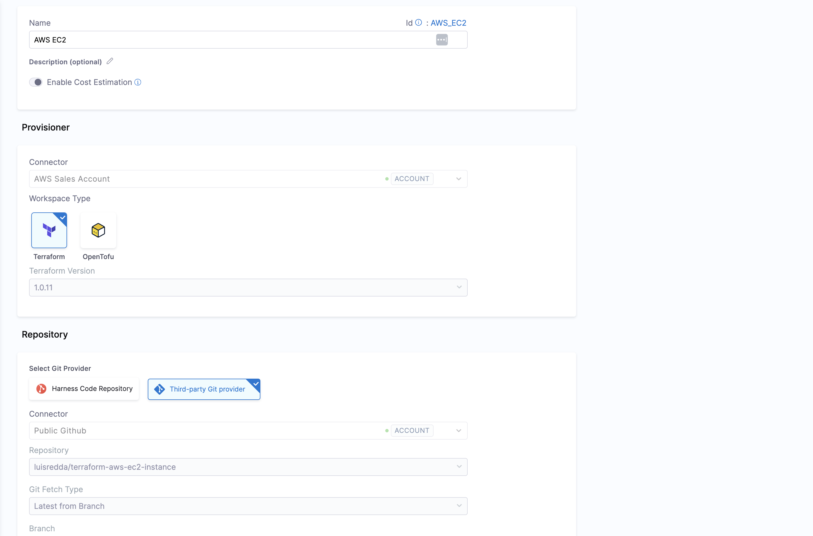
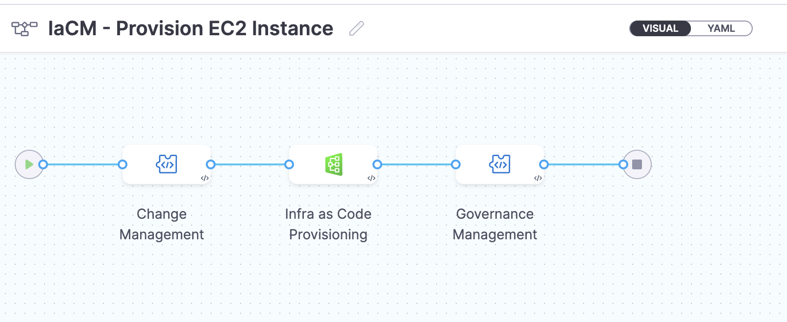

<DocsTag  backgroundColor= "#cbe2f9" text="Tutorial"  textColor="#0b5cad"  />

This tutorial is designed to help a platform engineer to get started with Harness IDP. We will create a basic infrastructure provisioning pipeline using IaCM that takes input from software template and provisions a ec2 instance for a developer. After you create the software template, developers can choose the template on the **Workflow** page and enter details such as a the owner user-group and the Git repository. The IaCM pipeline handles change management by creating a JIRA ticket followed by the IaCM stage containing the terraform scripts. Once the infra is provisioned we do the Governance Management using the OPA. 

Users (developers) must perform a sequence of tasks to provision the infrastructure. First, they interact with a software template. A software template is a form that collects a user's requirements. After a user submits the form, IDP executes a Harness IaCM pipeline that provisions the new ec2 instance.

## Prerequisites

Before you begin this tutorial, make sure that you have completed the following requirements:

- Enable Harness IDP and Harness IaCM for your account.
- Make sure you are assigned the **[IDP Admin Role](https://developer.harness.io/docs/internal-developer-portal/rbac/resources-roles#1-idp-admin)** or another role that has full access to all IDP resources along with the **IACM Workspace**. 
- Create a [Service Now](https://developer.harness.io/docs/platform/connectors/ticketing-systems/connect-to-service-now/) and [JIRA connector](https://developer.harness.io/docs/platform/connectors/ticketing-systems/connect-to-jira) with access to the projects where you want to create the tickets for provisioning the pipeline. 
- Create a [Connector for AWS](https://developer.harness.io/docs/infra-as-code-management/get-started/onboarding-guide#add-connectors).
- Create a [connector for git provider](https://developer.harness.io/docs/infra-as-code-management/get-started/onboarding-guide#add-connectors)
- Create a [Workspace](https://developer.harness.io/docs/infra-as-code-management/get-started/onboarding-guide#add-a-new-workspace) using the AWS Connector created above. Also use the following [repository](https://github.com/luisredda/terraform-aws-ec2-instance) for the workspace and add the **branch** as `master` and **file path** as `.`



## Create a Pipeline



Begin by creating a pipeline for provisioning infrastructure

To create a **Developer Portal** stage, perform the following steps:

1. Go to **Admin** section under IDP, select **Projects**, and then select a project.

You can also create a new project for the service onboarding pipelines. Eventually, all the users in your account should have permissions to execute the pipelines in this project. For information about creating a project, go to [Create organizations and projects](/docs/platform/organizations-and-projects/create-an-organization/).


2.  Then select **Create a Pipeline**, add a name for the pipeline and select the type as **Inline**


3. The YAML below defines an IaCM stage with a number of steps [as described here](https://developer.harness.io/docs/infra-as-code-management/get-started/onboarding-guide#add-a-pipeline) that will perform the actions provision the infrastructure. Copy the YAML below, then in the Harness Pipeline Studio go to the YAML view and paste below the existing YAML.

:::info

You need to have completed all the steps under **[PreRequisites](#prerequisites)** for the below given YAML to work properly 

Please update the `connectorRef: <the_connector_name_you_created_under_prerequisites>` for all the steps it's used.

:::

```YAML
pipeline:
  name: IaCM - Provision EC2 Instance
  identifier: IaCM_Provision_EC2_Instance
  projectIdentifier: IDP_TEST
  orgIdentifier: default
  tags: {}
  stages:
    - stage:
        name: Change Management
        identifier: Change_Management
        description: ""
        type: Custom
        spec:
          execution:
            steps:
              - step:
                  type: JiraCreate
                  name: Create JIRA Ticket
                  identifier: Create_JIRA_Ticket
                  spec:
                    connectorRef: <the_connector_name_you_created_under_prerequisites>
                    projectKey: <the_project_id_where_you want_to>
                    issueType: Task
                    fields:
                      - name: Summary
                        value: Provisioning EC2 Machine
                  timeout: 10m
              - step:
                  type: ServiceNowCreate
                  name: Create ServiceNow Change Task
                  identifier: Create_ServiceNow_Change_Task
                  spec:
                    connectorRef: <the_connector_name_you_created_under_prerequisites>
                    ticketType: change_task
                    fields:
                      - name: description
                        value: Provisioning EC2 Instance
                      - name: short_description
                        value: <+pipeline.stages.Infra_as_Code_Provisioning.name>
                    createType: Normal
                  timeout: 10m
                  when:
                    stageStatus: Success
                    condition: "false"
          platform:
            os: Linux
            arch: Amd64
          runtime:
            type: Cloud
            spec: {}
        tags: {}
    - stage:
        name: Infra as Code Provisioning
        identifier: Infra_as_Code_Provisioning
        description: ""
        type: IACM
        spec:
          platform:
            os: Linux
            arch: Amd64
          runtime:
            type: Cloud
            spec: {}
          workspace: <NAME_OF_THE_WORKSPACE_YOU_CREATED>
          execution:
            steps:
              - step:
                  type: IACMTerraformPlugin
                  name: init
                  identifier: init
                  timeout: 10m
                  spec:
                    command: init
              - parallel:
                  - step:
                      type: Plugin
                      name: tflint
                      identifier: tflint
                      spec:
                        uses: https://github.com/urischeiner/tflint-iacm.git
                  - step:
                      type: Plugin
                      name: tfsec
                      identifier: tfsec
                      spec:
                        uses: https://github.com/urischeiner/tfsec-iacm.git
                  - step:
                      type: IACMTerraformPlugin
                      name: detect-drift
                      identifier: detectdrift
                      spec:
                        command: detect-drift
                      timeout: 10m
                      failureStrategies:
                        - onFailure:
                            errors:
                              - Unknown
                            action:
                              type: MarkAsSuccess
              - step:
                  type: IACMTerraformPlugin
                  name: plan
                  identifier: plan
                  timeout: 10m
                  spec:
                    command: plan
              - step:
                  type: Run
                  name: Export Plan
                  identifier: Export_Plan
                  spec:
                    shell: Bash
                    command: |+
                      tfplan=$(cat <+pipeline.stages.Infra_as_Code_Provisioning.spec.execution.steps.plan.output.outputVariables.parsedPlan> | sed -E 's/"(secret_key|access_key)":\{"value":"[^"]*"\}/"\1":{"value":""}/g')


                    outputVariables:
                      - name: tfplan
              - step:
                  type: IACMApproval
                  name: Approval
                  identifier: Approval
                  spec:
                    autoApprove: false
                  timeout: 1h
                  failureStrategies:
                    - onFailure:
                        errors:
                          - Timeout
                        action:
                          type: MarkAsSuccess
                  when:
                    stageStatus: Success
              - step:
                  type: IACMTerraformPlugin
                  name: apply
                  identifier: apply
                  timeout: 10m
                  spec:
                    command: apply
        tags: {}
    - stage:
        name: Governance Management
        identifier: Update_Change_Management
        description: ""
        type: Custom
        spec:
          execution:
            steps:
              - step:
                  type: Policy
                  name: Terraform OPA Compliance Check
                  identifier: Terraform_OPA_Compliance_Check
                  spec:
                    policySets:
                      - account.Terraform_EC2_Compliance
                    type: Custom
                    policySpec:
                      payload: <+pipeline.stages.Infra_as_Code_Provisioning.spec.execution.steps.Export_Plan.output.outputVariables.tfplan>
                  timeout: 10m
              - step:
                  type: JiraUpdate
                  name: Update JIRA Ticket
                  identifier: Update_JIRA_Ticket
                  spec:
                    connectorRef: account.Harness_JIRA
                    issueKey: <+pipeline.stages.Change_Management.spec.execution.steps.Create_JIRA_Ticket.issue.key>
                    transitionTo:
                      transitionName: ""
                      status: Approved
                    fields:
                      - name: Comment
                        value: "New EC2 Instance Provisioned by Harness. \\\\ Please find below the instance details: \\\\ Id: <+pipeline.stages.Infra_as_Code_Provisioning.spec.execution.steps.apply.output.outputVariables.id> \\\\ Instance Count: <+pipeline.stages.Infra_as_Code_Provisioning.spec.execution.steps.apply.output.outputVariables.instance_count> \\\\ State: <+pipeline.stages.Infra_as_Code_Provisioning.spec.execution.steps.apply.output.outputVariables.instance_state> \\\\ Private Ip: <+pipeline.stages.Infra_as_Code_Provisioning.spec.execution.steps.apply.output.outputVariables.private_ip> \\\\ Public Ip: <+pipeline.stages.Infra_as_Code_Provisioning.spec.execution.steps.apply.output.outputVariables.public_ip> \\\\ Tags: <+pipeline.stages.Infra_as_Code_Provisioning.spec.execution.steps.apply.output.outputVariables.tags> \\\\ \\\\ OPA Policy Status: <+pipeline.stages.Update_Change_Management.spec.execution.steps.Terraform_OPA_Compliance_Check.output.policySetDetails.get(\"account.Terraform_EC2_Compliance\").policyDetails.get(\"account.AWS_Required_Tags\").status> \\\\ Messages: <+pipeline.stages.Update_Change_Management.spec.execution.steps.Terraform_OPA_Compliance_Check.output.policySetDetails.get(\"account.Terraform_EC2_Compliance\").policyDetails.get(\"account.AWS_Required_Tags\").denyMessages> \\\\"
                  timeout: 10m
          platform:
            os: Linux
            arch: Amd64
          runtime:
            type: Cloud
            spec: {}
        tags: {}
  variables:
    - name: owner
      type: String
      description: ""
      required: false
      value: <+input>.default(Field_Engineering)
```

4. Now Save the pipeline. 

:::info

All inputs, except for [pipeline input as variables](https://developer.harness.io/docs/platform/variables-and-expressions/harness-variables/#pipeline-expressions), must be of [fixed value](https://developer.harness.io/docs/platform/variables-and-expressions/runtime-inputs/#fixed-values).


:::

## Create a Software Template

Now that our pipeline is ready to execute when a project name and a GitHub repository name are provided, let's create the UI counterpart of it in IDP. This is powered by the [Backstage Software Template](https://backstage.io/docs/features/software-templates/writing-templates). Create a `template.yaml` file anywhere in your Git repository. 

In the following `template.yaml` we have added few enums to choose from the available list of options like for the `instance_type`, `ami`, `subnet` and `vpc`. Team responsible for infrastructure provisioning is expected to fill this enums with available possibilities for the ease of developers to just select form the available options. 

```YAML
apiVersion: scaffolder.backstage.io/v1beta3
kind: Template
metadata:
  name: harness_iac
  title: Create Infra via Harness IaCM
  description: Uses Harness-IaCM to dynamically provision any required infrastructure.
  tags:
    - tf
    - aws
    - gcp
    - azure
spec:
  owner: iacm_team
  type: environment
  parameters:
    - title: Project and Repo Details
      required:
        - owner
        - github_repo
      properties:
        owner:
          title: Choose the Owner
          type: string
          ui:field: OwnerPicker
          ui:options: null
        github_repo:
          title: What App/Repo will this infra be associated with?
          type: string
          description: someRepoName
        token:
          title: Harness Token
          type: string
          ui:widget: password
          ui:field: HarnessAuthToken
    - title: Infrastructure Details
      properties:
        cloud_provider:
          title: Choose a cloud provider
          type: string
          enum:
            - GCP
            - AWS
            - Azure
            - OCI
          default: AWS
        tech_stack:
          title: Choose the Underlying Infra
          type: string
          enum:
            - K8s
            - VM
            - ECS
            - Lambda
          default: VM
        instance_type:
          title: Chose the Instance Type
          type: string
          enum:
            - t2.micro
            - t2.large
            - t3.2xlarge
            - other
          default: t2.micro
        ami:
          title: Choose desired AMI
          type: string
          enum:
            - ami-***************
            - ami-***************
          default: ami-***************
        subnet:
          title: Choose desired subnet
          type: string
          enum:
            - Create New
            - subnet-***************
            - subnet-***************
          default: subnet-***************
        vpc:
          title: Choose VPC security group
          type: string
          enum:
            - Create New
            - sg-***************
            - sg-***************
          default: sg-***************
        count:
          title: Choose desired instance count (i.e. How many VMs?)
          type: string
          default: "1"
  steps:
    - id: trigger
      name: Provisioning your Infrastructure
      action: trigger:harness-custom-pipeline
      input:
        url: YOUR PIPELINE URL HERE
        inputset:
          owner: ${{ parameters.owner }}
        apikey: ${{ parameters.token }}
  output:
    links:
      - title: Pipeline Details
        url: ${{ steps.trigger.output.PipelineUrl }}
```

Replace the `YOUR PIPELINE URL HERE` with the pipeline URL that you created.


This YAML code is governed by Backstage. You can change the name and description of the software template. 

### Authenticating the Request to the Pipeline

The Software Template contains a single action which is designed to trigger the pipeline you created via an API call. Since the API call requires authentication, Harness has created a custom component to authenticate based of the logged-in user's credentials.

The following YAML snippet under `spec.parameters.properties` automatically creates a token field without exposing it to the end user.

```yaml
token:
  title: Harness Token
  type: string
  ui:widget: password
  ui:field: HarnessAuthToken
```

That token is then used as part of `steps` as `apikey`

```yaml
  steps:
    - id: trigger
      name: ...
      action: trigger:harness-custom-pipeline
      input:
        url: ...
        inputset:
          key: value
          ...
        apikey: ${{ parameters.token }}
```

### Register the Template in IDP

Use the URL to the `template.yaml` created above and register it by using the same process for [registering a new software component](/docs/internal-developer-portal/get-started/register-a-new-software-component).

## Use the Software Template via Self Service Workflows

Now navigate to the **Workflows** page in IDP. You will see the newly created template appear. Click on **Choose**, fill in the form, click **Next Step**, then **Create** to trigger the automated pipeline. Once complete, you should be able to see the new repo created and bootstrapped in your target GitHub organization!

