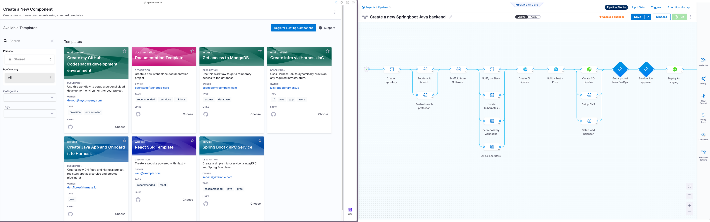
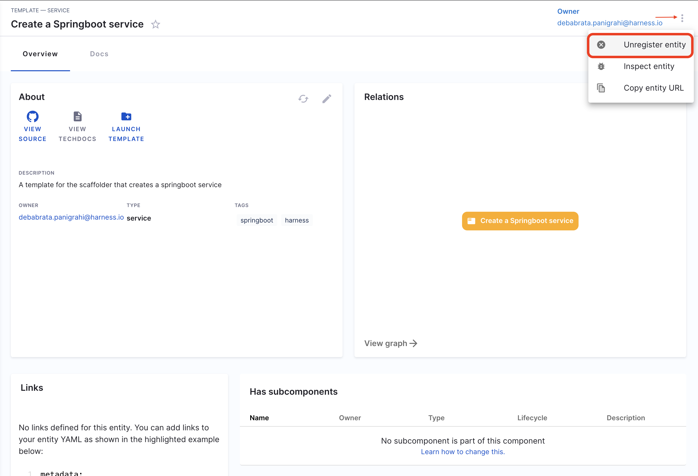
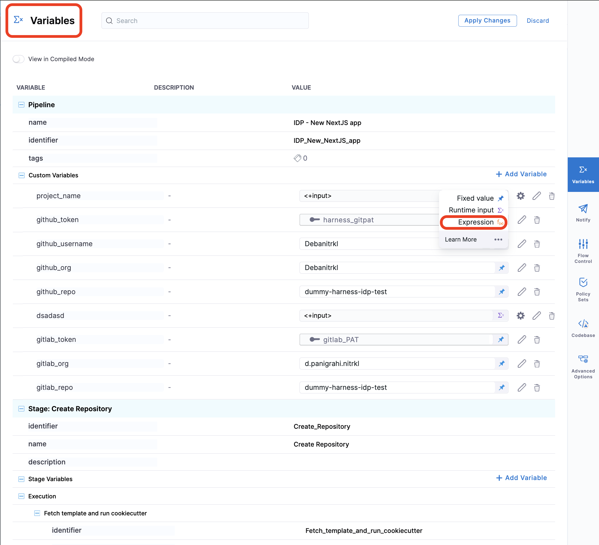

<DocsTag  backgroundColor= "#cbe2f9" text="Tutorial"  textColor="#0b5cad"  />

:::info

The [new Workflows homepage](/docs/internal-developer-portal/layout-and-appearance/workflows-page-customization) is behind a Feature Flag `IDP_ENABLE_WORKFLOWSV2`. To enable the feature flag, please contact [Harness Support](mailto:support@harness.io)

:::


Service Onboarding in Harness IDP use Harness pipeline orchestrator and those could be triggered through Software Templates. 



In Harness IDP, a service onboarding pipeline (also known as a software template) enables platform engineers to automate the process of service creation. As a platform engineer, you can create a template that prompts developers for details and creates a repository with a basic setup that includes a CI/CD process. The template is defined in a YAML file named `template.yaml`. The [syntax](https://backstage.io/docs/features/software-templates/input-examples) of the template definition is owned by [backstage.io](https://backstage.io/docs/features/software-templates/writing-templates) while the workflow runs on a Harness pipeline of your choice.

<!-- See it in action: Demo video -->

**To get started, check out the tutorial to [create your first service onboarding pipeline](/docs/internal-developer-portal/tutorials/service-onboarding-pipeline).**

## How to write IDP Templates

Templates in Harness IDP is powered by the [Backstage Software Template](https://backstage.io/docs/features/software-templates/writing-templates). You can create your own templates with a small yaml definition which describes the template and its metadata, along with some input variables that your template will need, and then a list of actions which are then executed by the scaffolding service. It is suggested to use the [react-jsonschema-form playground](https://rjsf-team.github.io/react-jsonschema-form/) to build the template. [Nunjucks](https://mozilla.github.io/nunjucks/) is templating engine for the IDP templates.

**Templates** are stored in the **Catalog** under a **kind Template**. The minimum that is needed to define a template is a `template.yaml` file, but it would be good to also have some files in there that can be templated in.

### Support for Harness Account Variables

In the context of Harness IDP you can use all the **[custom account variables](https://developer.harness.io/docs/platform/variables-and-expressions/add-a-variable#define-variables)** and **[account scoped built-in variables](https://developer.harness.io/docs/platform/variables-and-expressions/harness-expressions-reference)** in template YAML.

```YAML
...
  steps:
    - id: trigger
      name: <+variable.account.projectIdentifier>
      action: trigger:harness-custom-pipeline
      input:
        url: https://app.harness.io/ng/account/<+account.identifier>/module/idp/orgs/<+variable.account.orgIdentifier>/projects/<+variable.account.projectIdentifier>/pipelines/pipeline_id/pipeline-studio/?storeType=INLINE
...
```


### Adding the owner

By default the owner is of type **Group** which is same as the **[User Group](https://developer.harness.io/docs/platform/role-based-access-control/add-user-groups/#built-in-user-groups)** in Harness. In case the owner is a user you have to mention it as `user:default/debabrata.panigrahi` and it should only contain the user name not the complete email id. 

A simple `template.yaml` definition might look something like this:

```YAML
apiVersion: scaffolder.backstage.io/v1beta3
kind: Template
# some metadata about the template itself
metadata:
  name: react-app
  title: Create a new service
  description: A template to create a new service
  tags:
    - nextjs
    - react
    - javascript
# these are the steps which are rendered in the frontend with the form input
spec:
  owner: debabrata.panigrahi@harness.io
  type: service
  parameters:
    - title: Service Details
      required:
        - project_name
        - template_type
        - public_template_url
        - repository_type
        - repositoty_description
        - repository_default_branch
        - direct_push_branch
        - slack_id
      properties:
        projectId:
            title: Project Identifier
            description: Harness Project Identifier
            type: string
            ui:field: HarnessProjectPicker  
        template_type:
          title: Type of the Template
          type: string
          description: Type of the Template
        public_template_url:
          title: Give a Public template URL
          type: string
          description: Give a Public Cookiecutter Template  
        repository_type:
          type: string
          title: Repository Type
          enum:
            - public
            - private
          default: Public
        repositoty_description:
          type: string
          title: Add a description to your repo
          description: Auto-generated using Self-Service-Flow of Harness-IDP     
        owner:
          title: Choose an Owner for the Service
          type: string
          ui:field: OwnerPicker
          ui:options:
            allowedKinds:
              - Group
        # This field is hidden but needed to authenticate the request to trigger the pipeline
        token:
          title: Harness Token
          type: string
          ui:widget: password
          ui:field: HarnessAuthToken
  # here's the steps that are executed in series in the scaffolder backend
  steps:
    - id: trigger
      name: Creating your react app
      action: trigger:harness-custom-pipeline
      input:
        url: "https://app.harness.io/ng/account/account_id/module/idp/orgs/org_id/projects/project_id/pipelines/pipeline_id/pipeline-studio/?storeType=INLINE"
        inputset:
          project_name: ${{ parameters.project_name }}
          template_type: ${{ parameters.template_type }}
          public_template_url: ${{ parameters.public_template_url }}
        apikey: ${{ parameters.token }}
  # some outputs which are saved along with the job for use in the frontend
  output:
    links:
      - title: Pipeline Details
        url: ${{ steps.trigger.output.PipelineUrl }}

```

:::info

The `token` property we use to fetch **Harness Auth Token** is hidden on the Review Step using `ui:widget: password`, but for this to work the token property needs to be mentioned under the first `page`  in-case you have multiple pages.

```
# example workflow.yaml
...
parameters:
  - title: <PAGE-1 TITLE>
    properties:
      property-1:
        title: title-1
        type: string
      property-2:
        title: title-2
    token:
      title: Harness Token
      type: string
      ui:widget: password
      ui:field: HarnessAuthToken
  - title: <PAGE-2 TITLE>
    properties:
      property-1:
        title: title-1
        type: string
      property-2:
        title: title-2
  - title: <PAGE-n TITLE>  
...
```
:::

Let's dive in and pick apart what each of these sections do and what they are.

## `spec.parameters` - `FormStep | FormStep[]`

These `parameters` are template variables which can be modified in the frontend
as a sequence. It can either be one `Step` if you just want one big list of
different fields in the frontend, or it can be broken up into multiple different
steps which would be rendered as different steps in the scaffolder plugin
frontend.

Each `Step` is `JSONSchema` with some extra goodies for styling what it might
look like in the frontend. For these steps we rely very heavily on this
[library](https://github.com/rjsf-team/react-jsonschema-form). They have some
[great docs](https://rjsf-team.github.io/react-jsonschema-form/docs/) and a
[playground](https://rjsf-team.github.io/react-jsonschema-form) where you can
play around with some examples.

There's another option for that library called `uiSchema` which we've taken
advantage of, and we've merged it with the existing `JSONSchema` that you
provide to the library. These are the little `ui:*` properties that you can see
in the step definitions.

For example if we take the **simple** example from the playground it looks like
this:

```json
// jsonSchema:
{
  "title": "A registration form",
  "description": "A simple form example.",
  "type": "object",
  "required": [
    "firstName",
    "lastName"
  ],
  "properties": {
    "firstName": {
      "type": "string",
      "title": "First name",
      "default": "Chuck"
    },
    "lastName": {
      "type": "string",
      "title": "Last name"
    },
    "nicknames":{
      "type": "array",
      "items": {
        "type": "string"
      }
    },
    "telephone": {
      "type": "string",
      "title": "Telephone",
      "minLength": 10
    }
  }
}

// uiSchema:
{
  "firstName": {
    "ui:autofocus": true,
    "ui:emptyValue": "",
    "ui:autocomplete": "given-name"
  },
  "lastName": {
    "ui:emptyValue": "",
    "ui:autocomplete": "family-name"
  },
  "nicknames": {
    "ui:options":{
      "orderable": false
    }
  },
  "telephone": {
    "ui:options": {
      "inputType": "tel"
    }
  }
}
```

It would look something like the following in a template:

```yaml
apiVersion: scaffolder.backstage.io/v1beta3
kind: Template
metadata:
  name: v1beta3-demo
  title: Test Action template
  description: scaffolder v1beta3 template demo
spec:
  owner: backstage/techdocs-core
  type: service

  parameters:
    - title: A registration form
      description: A simple form example.
      type: object
      required:
        - firstName
        - lastName
      properties:
        firstName:
          type: string
          title: First name
          default: Chuck
          ui:autofocus: true
          ui:emptyValue: ''
          ui:autocomplete: given-name
        lastName:
          type: string
          title: Last name
          ui:emptyValue: ''
          ui:autocomplete: family-name
        nicknames:
          type: array
          items:
            type: string
          ui:options:
            orderable: false
        telephone:
          type: string
          title: Telephone
          minLength: 10
          ui:options:
            inputType: tel
```

### Using Secrets

You may want to mark things as secret and make sure that these values are protected and not available through REST endpoints. You can do this by using the built in `ui:field: Secret`.

You can define this property as any normal parameter, however the consumption of this parameter will not be available through `${{ parameters.myKey }}` you will instead need to use `${{ secrets.myKey }}` in your `template.yaml`.

Parameters will be automatically masked in the review step.

```yaml
apiVersion: scaffolder.backstage.io/v1beta3
kind: Template
metadata:
  name: v1beta3-demo
  title: Test Action template
  description: scaffolder v1beta3 template demo
spec:
  owner: backstage/techdocs-core
  type: service

  parameters:
    - title: Authenticaion
      description: Provide authentication for the resource
      required:
        - username
        - password
      properties:
        username:
          type: string
          # use the built in Secret field extension
          ui:field: Secret
        password:
          type: string
          ui:field: Secret

  steps:
    - id: setupAuthentication
      action: auth:create
      input:
        # make sure to use ${{ secrets.parameterName }} to reference these values
        username: ${{ secrets.username }}
        password: ${{ secrets.password }}
```


### The Repository Picker

In order to make working with repository providers easier, we've built a custom
picker that can be used by overriding the `ui:field` option in the `uiSchema`
for a `string` field. Instead of displaying a text input block it will render
our custom component that we've built which makes it easy to select a repository
provider, and insert a project or owner, and repository name.

You can see it in the above full example which is a separate step and it looks a
little like this:

```yaml
- title: Choose a location
  required:
    - repoUrl
  properties:
    repoUrl:
      title: Repository Location
      type: string
      ui:field: RepoUrlPicker
      ui:options:
        allowedHosts:
          - github.com
```

The `allowedHosts` part should be set to where you wish to enable this template
to publish to. And it can be any host that is listed in your `integrations`
config in `app-config.yaml`.

Besides specifying `allowedHosts` you can also restrict the template to publish to
repositories owned by specific users/groups/namespaces by setting the `allowedOwners`
option. With the `allowedRepos` option you are able to narrow it down further to a
specific set of repository names. A full example could look like this:

```yaml
- title: Choose a location
  required:
    - repoUrl
  properties:
    repoUrl:
      title: Repository Location
      type: string
      ui:field: RepoUrlPicker
      ui:options:
        allowedHosts:
          - github.com
        allowedOwners:
          - backstage
          - someGithubUser
        allowedRepos:
          - backstage
```

For a list of all possible `ui:options` input props for `RepoUrlPicker`, please visit [here](https://backstage.io/docs/features/software-templates/ui-options-examples/).


#### Using the Users `oauth` token

There's a little bit of extra magic that you get out of the box when using the
`RepoUrlPicker` as a field input. You can provide some additional options under
`ui:options` to allow the `RepoUrlPicker` to grab an `oauth` token for the user
for the required `repository`.

This is great for when you are wanting to create a new repository, or wanting to
perform operations on top of an existing repository.

A sample template that takes advantage of this is like so:

<details>
<summary>Example YAML</summary>

```yaml
apiVersion: scaffolder.backstage.io/v1beta3
kind: Template
metadata:
  name: v1beta3-demo
  title: Test Action template
  description: scaffolder v1beta3 template demo
spec:
  owner: backstage/techdocs-core
  type: service

  parameters:
    ...

    - title: Choose a location
      required:
        - repoUrl
      properties:
        repoUrl:
          title: Repository Location
          type: string
          ui:field: RepoUrlPicker
          ui:options:
            # Here's the option you can pass to the RepoUrlPicker
            requestUserCredentials:
              secretsKey: USER_OAUTH_TOKEN
              additionalScopes:
                github:
                  - workflow
            allowedHosts:
              - github.com
    ...

  steps:
    ...

    - id: publish
      name: Publish
      action: publish:github
      input:
        allowedHosts: ['github.com']
        description: This is ${{ parameters.name }}
        repoUrl: ${{ parameters.repoUrl }}
        # here's where the secret can be used
        token: ${{ secrets.USER_OAUTH_TOKEN }}

    ...
```
</details>

You will see from above that there is an additional `requestUserCredentials`
object that is passed to the `RepoUrlPicker`. This object defines what the
returned `secret` should be stored as when accessing using
`${{ secrets.secretName }}`, in this case it is `USER_OAUTH_TOKEN`. And then you
will see that there is an additional `input` field into the `publish:github`
action called `token`, in which you can use the `secret` like so:
`token: ${{ secrets.USER_OAUTH_TOKEN }}`.

There's also the ability to pass additional scopes when requesting the `oauth`
token from the user, which you can do on a per-provider basis, in case your
template can be published to multiple providers.

Note, that you will need to configure an **connector** for your source code management (SCM) service to make this feature work.


## `spec.steps` - `Action[]`

The `steps` is an array of the things that you want to happen part of this template. These follow the same standard format:

```yaml
- id: fetch-base # A unique id for the step
  name: Fetch Base # A title displayed in the frontend
  if: ${{ parameters.name }} # Optional condition, skip the step if not truthy
  each: ${{ parameters.iterable }} # Optional iterable, run the same step multiple times
  action: fetch:template # An action to call
  input: # Input that is passed as arguments to the action handler
    url: ./template
    values:
      name: ${{ parameters.name }}
```

By default we ship some [built in actions](https://backstage.io/docs/features/software-templates/builtin-actions) along with some [custom actions](/docs/internal-developer-portal/flows/custom-actions).

When `each` is provided, the current iteration value is available in the `${{ each }}` input.

Examples:

```yaml
each: ['apples', 'oranges']
input:
  values:
    fruit: ${{ each.value }}
```

```yaml
each: [{ name: 'apple', count: 3 }, { name: 'orange', count: 1 }]
input:
  values:
    fruit: ${{ each.value.name }}
    count: ${{ each.value.count }}
```

When `each` is used, the outputs of a repeated step are returned as an array of outputs from each iteration.

## Outputs

Each individual step can output some variables that can be used in the
scaffolder frontend for after the job is finished. This is useful for things
like linking to the entity that has been created with the backend, linking
to the created repository, or showing Markdown text blobs.

```yaml
output:
  links:
    - title: Repository
      url: ${{ steps['publish'].output.remoteUrl }} # link to the remote repository
    - title: Open in catalog
      icon: catalog
      entityRef: ${{ steps['register'].output.entityRef }} # link to the entity that has been ingested to the catalog
  text:
    - title: More information
      content: |
        **Entity URL:** `${{ steps['publish'].output.remoteUrl }}`
```
### Fetch Output from Harness Pipeline onto IDP

When using the custom action `[trigger:harness-custom-pipeline](https://developer.harness.io/docs/internal-developer-portal/flows/custom-actions#1-triggerharness-custom-pipeline)` can as well configure the output to display the pipeline [output variables](https://developer.harness.io/docs/platform/variables-and-expressions/harness-variables/#input-and-output-variables), by setting the `showOutputVariables: true` under `inputs`and adding `output` as shown in the example below:

<details>
<summary>Example YAML</summary>

```YAML
...
## Example
steps:
  - id: trigger
      name: Creating your react app
      action: trigger:harness-custom-pipeline
      input:
      url: "https://app.harness.io/ng/account/vpCkHKsDSxK9_KYfjCTMKA/home/orgs/default/projects/communityeng/pipelines/IDP_New_NextJS_app/pipeline-studio/?storeType=INLINE"
      inputset:
          project_name: ${{ parameters.project_name }}
          github_repo: ${{ parameters.github_repo }}
          cloud_provider: ${{ parameters.provider }}
          db: ${{ parameters.db }}
          cache: ${{ parameters.cache }}
      apikey: ${{ parameters.token }}
      showOutputVariables: true
output:
  text:
    - title: Output Variable
      content: |
        Output Variable **test2** is `${{ steps.trigger.output.test2 }}` 
    - title: Another Output Variable
      content: |
        Output Variable **test1** with fqnPath is `${{ steps.trigger.output['pipeline.stages.testci.spec.execution.steps.Run_1.output.outputVariables.test1'] }}`      
...
```
</details>

:::info

Only **user defined output variables** are allowed, but you can as well use the system generated variables by assigning them as a new variable under shell script step as displayed below. For eg. we have mentioned the system generated output as `jira_id` and under **Optional Configuration** added a **test-var** which becomes a user defined output variable and could be displayed as output in the IDP workflows.


:::

There are two ways in which you can add the output variable to the template syntax. 

1. You can directly mention the output variable name `${{ steps.trigger.output.test2 }}`, here `test2` is the output variable name we created in the pipeline. 

2. You can copy the JEXL expression of the output variable and remove the JEXL constructs, `${{ steps.trigger.output['pipeline.stages.testci.spec.execution.steps.Run_1.output.outputVariables.test1'] }}`, here the part `pipeline.stages.testci.spec.execution.steps.Run_1.output.outputVariables.test1` comes from `<+pipeline.stages.testci.spec.execution.steps.Run_1.output.outputVariables.test2>` copied from execution logs. 


## The templating syntax

You might have noticed variables wrapped in `${{ }}` in the examples. These are template strings for linking and gluing the different parts of the template together. All the form inputs from the `parameters` section will be available by using this template syntax (for example, `${{ parameters.firstName }}` inserts the value of `firstName` from the parameters). This is great for passing the values from the form into different steps and reusing these input variables.

These template strings preserve the type of the parameter.

The `${{ parameters.firstName }}` pattern will work only in the template file. If you want to start using values provided from the UI in your code, you will have to use the `${{ values.firstName }}` pattern. Additionally, you have to pass the parameters from the UI to the input of the `fetch:template` step.

<details>
<summary>Example YAML</summary>

```yaml
apiVersion: scaffolder.backstage.io/v1beta3
kind: Template
metadata:
  name: v1beta3-demo
  title: Test Action
  description: scaffolder v1beta3 template demo
spec:
  owner: backstage/techdocs-core
  type: service
  parameters:
    - title: Fill in some steps
      required:
        - name
      properties:
        name:
          title: Name
          type: string
          description: Unique name of your project
        urlParameter:
          title: URL endpoint
          type: string
          description: URL endpoint at which the component can be reached
          default: 'https://www.example.com'
        enabledDB:
          title: Enable Database
          type: boolean
          default: false
  ...
  steps:
    - id: fetch-base
      name: Fetch Base
      action: fetch:template
      input:
        url: ./template
        values:
          name: ${{ parameters.name }}
          url: ${{ parameters.urlParameter }}
          enabledDB: ${{ parameters.enabledDB }}
```
</details>

Afterwards, if you are using the builtin templating action, you can start using the variables in your code. You can use also any other templating functions from [Nunjucks](https://mozilla.github.io/nunjucks/templating.html#tags) as well.

```bash
#!/bin/bash
echo "Hi my name is ${{ values.name }}, and you can fine me at ${{ values.url }}!"

echo "You have enabled your database!"

```

As you can see above in the `Outputs` section, `actions` and `steps` can also output things. You can grab that output using `steps.$stepId.output.$property`.

You can read more about all the `inputs` and `outputs` defined in the actions in code part of the `JSONSchema`

It is important to remember that all examples are based on [react-jsonschema-form](https://rjsf-team.github.io/react-jsonschema-form/).


## Input Examples

## Simple text input

### Simple input with basic validations

<details>
<summary>Example YAML</summary>

```yaml
parameters:
  - title: Fill in some steps
    properties:
      name:
        title: Simple text input
        type: string
        description: Description about input
        maxLength: 8
        pattern: '^([a-zA-Z][a-zA-Z0-9]*)(-[a-zA-Z0-9]+)*$'
        ui:autofocus: true
        ui:help: 'Hint: additional description...'
```
</details>

### Multi line text input

<details>
<summary>Example YAML</summary>

```yaml
parameters:
  - title: Fill in some steps
    properties:
      multiline:
        title: Text area input
        type: string
        description: Insert your multi line string
        ui:widget: textarea
        ui:options:
          rows: 10
        ui:help: 'Hint: Make it strong!'
        ui:placeholder: |
          apiVersion: backstage.io/v1alpha1
            kind: Component
            metadata:
              name: backstage
            spec:
              type: library
              owner: CNCF
              lifecycle: experimental
```
</details>

## Arrays options

### Array with custom titles

<details>
<summary>Example YAML</summary>

```yaml
parameters:
  - title: Fill in some steps
    properties:
      volume_type:
        title: Volume Type
        type: string
        description: The volume type to be used
        default: gp2
        enum:
          - gp2
          - gp3
          - io1
          - io2
          - sc1
          - st1
          - standard
        enumNames:
          - 'General Purpose SSD (gp2)'
          - 'General Purpose SSD (gp3)'
          - 'Provisioned IOPS (io1)'
          - 'Provisioned IOPS (io2)'
          - 'Cold HDD (sc1)'
          - 'Throughput Optimized HDD (st1)'
          - 'Magnetic (standard)'
```
</details>

### A multiple choices list

<details>
<summary>Example YAML</summary>

```yaml
parameters:
  - title: Fill in some steps
    properties:
      name:
        title: Select environments
        type: array
        items:
          type: string
          enum:
            - production
            - staging
            - development
        uniqueItems: true
        ui:widget: checkboxes
```
</details>

### Array with another types

<details>
<summary>Example YAML</summary>

```yaml
parameters:
  - title: Fill in some steps
    properties:
      arrayObjects:
        title: Array with custom objects
        type: array
        minItems: 0
        ui:options:
          addable: true
          orderable: true
          removable: true
        items:
          type: object
          properties:
            array:
              title: Array string with default value
              type: string
              default: value3
              enum:
                - value1
                - value2
                - value3
            flag:
              title: Boolean flag
              type: boolean
              ui:widget: radio
            someInput:
              title: Simple text input
              type: string
```
</details>

## Boolean options

### Boolean

```yaml
parameters:
  - title: Fill in some steps
    properties:
      name:
        title: Checkbox boolean
        type: boolean
```

### Boolean Yes or No options

```yaml
parameters:
  - title: Fill in some steps
    properties:
      name:
        title: Yes or No options
        type: boolean
        ui:widget: radio
```

### Boolean multiple options

<details>
<summary>Example YAML</summary>

```yaml
parameters:
  - title: Fill in some steps
    properties:
      name:
        title: Select features
        type: array
        items:
          type: boolean
          enum:
            - 'Enable scraping'
            - 'Enable HPA'
            - 'Enable cache'
        uniqueItems: true
        ui:widget: checkboxes
```

</details>

## Conditional Inputs in Templates

### Use parameters as condition in steps

<details>
<summary>Example YAML</summary>

```yaml
- name: Only development environments
  if: ${{ parameters.environment === "staging" and parameters.environment === "development" }}
  action: debug:log
  input:
    message: 'development step'

- name: Only production environments
  if: ${{ parameters.environment === "prod" or parameters.environment === "production" }}
  action: debug:log
  input:
    message: 'production step'
```
</details>

### Conditionally set parameters

<details>
<summary>Example YAML</summary>

```yaml
spec:
  parameters:
    - title: Fill in some steps
      properties:
        path:
          title: path
          type: string

  steps:
    - id: fetch
      name: Fetch template
      action: fetch:template
      input:
        url: ${{ parameters.path if parameters.path else '/root' }}
```
</details>

### Use parameters as conditional for fields

<details>
<summary>Example YAML</summary>

```yaml
parameters:
  - title: Fill in some steps
    properties:
      includeName:
        title: Include Name?
        type: boolean
        default: true

    dependencies:
      includeName:
        allOf:
          - if:
              properties:
                includeName:
                  const: true
            then:
              properties:
                lastName:
                  title: Last Name
                  type: string
```

</details>

1. **`One Of`**: Helps you create a dropdown in the template, where only one of all the options available could be selected. 

<details>
<summary>Example YAML</summary>

```YAML
dependencies:
  technology:
    oneOf:
      - properties:
          technology:
            enum:
              - java
          java version:
            type: "string"
            enum:
              - java8
              - java11
```
</details>

2. **`All Of`**: Helps you create a dropdown in the template, where only all the options available could be selected.

<details>
<summary>Example YAML</summary>

```YAML
type: object
allOf:
- properties:
    lorem:
      type:
      - string
      - boolean
      default: true
- properties:
    lorem:
      type: boolean
    ipsum:
      type: string
```
</details>

3. **`Any Of`**: Helps you to select from multiple properties where both can't be selected together at once. 

<details>
<summary>Example YAML</summary>

```YAML
type: object
properties:
  age:
    type: integer
    title: Age
  items:
    type: array
    items:
      type: object
      anyOf:
      - properties:
          foo:
            type: string
      - properties:
          bar:
            type: string
anyOf:
- title: First method of identification
  properties:
    firstName:
      type: string
      title: First name
      default: Chuck
    lastName:
      type: string
      title: Last name
- title: Second method of identification
  properties:
    idCode:
      type: string
      title: ID code
```

</details>

For more such references and validate your conditional steps take a look at the [react-json schema project](https://rjsf-team.github.io/react-jsonschema-form/). 

## Built in Filters

Template filters are functions that help you transform data, extract specific information,
and perform various operations in Scaffolder Templates.

This section introduces the built-in filters provided by Backstage and offers examples of
how to use them in the Scaffolder templates. It's important to mention that Backstage also leverages the
native filters from the Nunjucks library. For a complete list of these native filters and their usage,
refer to the [Nunjucks documentation](https://mozilla.github.io/nunjucks/templating.html#builtin-filters).

### parseRepoUrl

The `parseRepoUrl` filter parse a repository URL into
its components, such as `owner`, repository `name`, and more.

**Usage Example:**

```yaml
- id: log
  name: Parse Repo URL
  action: debug:log
  input:
    extra: ${{ parameters.repoUrl | parseRepoUrl }}
```

- **Input**: `github.com?repo=backstage&org=backstage`
- **Output**: [RepoSpec](https://github.com/backstage/backstage/blob/v1.17.2/plugins/scaffolder-backend/src/scaffolder/actions/builtin/publish/util.ts#L39)

### parseEntityRef

The `parseEntityRef` filter allows you to extract different parts of
an entity reference, such as the `kind`, `namespace`, and `name`.

**Usage example**

1. Without context

```yaml
- id: log
  name: Parse Entity Reference
  action: debug:log
  input:
    extra: ${{ parameters.owner | parseEntityRef }}
```

- **Input**: `group:techdocs`
- **Output**: [CompoundEntityRef](https://github.com/backstage/backstage/blob/v1.17.2/packages/catalog-model/src/types.ts#L23)

2. With context

```yaml
- id: log
  name: Parse Entity Reference
  action: debug:log
  input:
    extra: ${{ parameters.owner | parseEntityRef({ defaultKind:"group", defaultNamespace:"another-namespace" }) }}
```

- **Input**: `techdocs`
- **Output**: [CompoundEntityRef](https://github.com/backstage/backstage/blob/v1.17.2/packages/catalog-model/src/types.ts#L23)

### pick

This `pick` filter allows you to select specific properties from an object.

**Usage Example**

```yaml
- id: log
  name: Pick
  action: debug:log
  input:
    extra: ${{ parameters.owner | parseEntityRef | pick('name') }}
```

- **Input**: `{ kind: 'Group', namespace: 'default', name: 'techdocs' }`
- **Output**: `techdocs`

### projectSlug

The `projectSlug` filter generates a project slug from a repository URL

**Usage Example**

```yaml
- id: log
  name: Project Slug
  action: debug:log
  input:
    extra: ${{ parameters.repoUrl | projectSlug }}
```

- **Input**: `github.com?repo=backstage&org=backstage`
- **Output**: `backstage/backstage`

## Pre-fill workflows with URL Params

We can now automatically load IDP Workflow forms pre-filled using the `formData` URL query parameter. eg: `https://app.harness.io/ng/account/account_id/module/idp/create/templates/default/a-python-lambda?formData=%7B%22project_name%22%3A%22auto%20filled%22%7D`

The query parameters `?formData=%7B%22project_name%22%3A%22auto%20filled%22%7` in the end of the URL allow you to automatically fill in values of the form. Please see the below table for explanation of individual tokens in the query param.

| Item                | Example Value                           | Explanation                                                                                      |
|---------------------|-----------------------------------------|--------------------------------------------------------------------------------------------------|
| `formData`          | `formData`                              | Key of the query param.`formData` object is used to fill out IDP Workflow forms.           |
| `{"key"%3A"value"}` | `{"title"%3A"Title from query params"}` | Value of the query param. A JSON object with invalid URL characters encoded.`:` encodes to `%3A` |

### Additional information

Using automatically filled out values is handy when wanting to direct users to use IDP Workflows with known good values. This also allows automation to be constructed around the Workflows, where the automation can provide fully constructed IDP URLs to the user. You can also prevent user from modifying the form values inserted from query params by making the form fields `readonly`. See below example of a minimal form which would be filled using query params defined in the above explanation.

<details>
<summary>Example YAML</summary>

```YAML
## Example Workflow
apiVersion: scaffolder.backstage.io/v1beta3
kind: Template
metadata:
  name: test-template-pipeline
  title: Test pipeline using templates
spec:
  owner: name.owner
  type: service
  parameters:
    - title: Repository Name
      properties:
        project_name:
          title: Name your project
          ui:readonly: true
          type: string
        token:
          title: Harness Token
          type: string
          ui:widget: password
          ui:field: HarnessAuthToken
  steps:
    - id: trigger
      name: Creating your github repository
      action: trigger:harness-custom-pipeline
      input:
        url: PIPELINE_URL
        inputset: 
          github_org: ${{ parameters.project_name }}
        apikey: ${{ parameters.token }}
  output:
    links:
      - title: Pipeline Details
        url: ${{ steps.trigger.output.PipelineUrl }}

```

</details>

## Upload a file using template

There are 3 types of file upload. 

1. Single File
2. Multiple Files
3. Single File with Accept Attribute 

<details>
<summary>Example YAML</summary>

```YAML
#Example
title: Files
type: object
properties:
  file:
    type: string
    format: data-url
    title: Single file
  files:
    type: array
    title: Multiple files
    items:
      type: string
      format: data-url
  filesAccept:
    type: string
    format: data-url
    title: Single File with Accept attribute
```
</details>

## How to use arrays as Harness Pipeline inputs 

Harness Pipelines variables can only be 3 types, string, number and secrets, in case you want to add multiple strings and comma separated values you need to [join](https://mozilla.github.io/nunjucks/templating.html#join) them and send as single input parameters. 

In the following template I want to pick the enum and parse the `exampleVar` as a string and use it as comma separated value in the inputset for pipeline. 
As you could see in the example below under `inputset`, `exampleVar` takes input as `${{ parameters.exampleVar.join(',') }}`. 

<details>
<summary>Example YAML</summary>

```YAML
    - title: Pass Variables Here      
      properties:
        exampleVar:
          title: Select an option
          type: array
          items:
            type: string
            enum:
              - Option1
              - Option2
              - Option3
          default: 
            - Option1
      ui:
        exampleVar:
          title: Select Options
          multi: true
  steps:
    - id: trigger
      name: Call a harness pipeline, and pass the variables from above
      action: trigger:harness-custom-pipeline
      input:
        url: 'https://app.harness.io/ng/account/*********/home/orgs/default/projects/*************/pipelines/*************/pipeline-studio/?storeType=INLINE'
        inputset:
          exampleVar: ${{ parameters.exampleVar.join(',') }}
          owner: ${{ parameters.owner }}
        apikey: ${{ parameters.token }}
```
</details>

## Template registration

A template is a kind of entity that exists in the software catalog. You can create a `template.yaml` file and register the URL with the catalog. For information about registering a template, go to [Add a new software component to the catalog](/docs/internal-developer-portal/get-started/register-a-new-software-component.md).

## Delete/Unregister Template

1. Navigate to the **Catalog** page, and select **Template** under Kind.


2. Select the Template Name you want to Unregister.
3. Now on the Template overview page, click on the 3 dots on top right corner and select **Unregister Entity**.



4. Now on the Dialog box select **Unregister Location**.


5. This will delete the Template.

## Available template actions

:::info

Please refer to the [support matrix](/docs/internal-developer-portal/flows/custom-actions#custom-actions-usage-limitations) for custom actions before using them, also all input, except for [pipeline input as variables](https://developer.harness.io/docs/platform/variables-and-expressions/harness-variables/#pipeline-expressions), must be of [fixed value](https://developer.harness.io/docs/platform/variables-and-expressions/runtime-inputs/#fixed-values). 



:::

Harness IDP ships the following Harness related built-in actions along with [some others](/docs/internal-developer-portal/flows/custom-actions.md) to be used in the software template steps.

- `trigger:harness-custom-pipeline`
- `trigger:trigger-pipeline-with-webhook`
- `harness:create-secret`
- `harness:delete-secret`

Learn more about how to use them in the [service onboarding tutorial](/docs/internal-developer-portal/tutorials/using-secret-as-an-input).

## Available UI pickers

Harness IDP ships the following [custom UI pickers](/docs/internal-developer-portal/flows/custom-actions.md) that can be used in the template form for developers to select from.

- `HarnessOrgPicker`
- `HarnessProjectPicker`
- `HarnessAutoOrgPicker`

You can use these UI fields in the `ui:field` option of your `template.yaml` file. Read more about how to use these [custom field extensions](https://backstage.io/docs/features/software-templates/writing-custom-field-extensions#using-the-custom-field-extension) or take a look at [this example](https://github.com/bhavya-sinha/scaffolder-sample-templates/blob/5f52718ec49cb2c27a87e2fbeae075873701911c/fieldExtension.yaml#L78-L85).
