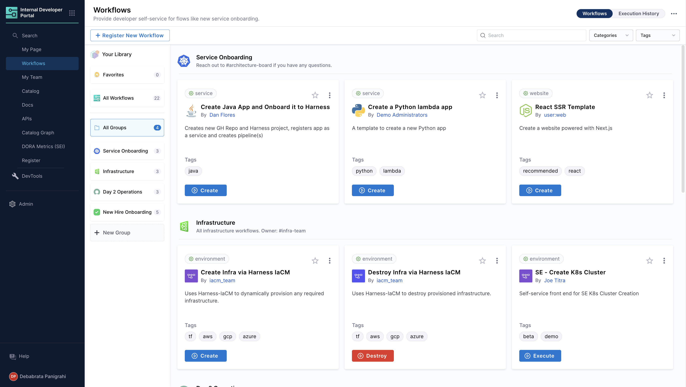

IDP Self Service Workflows enable Platform Engineers, Infrastructure teams and DevOps Engineers to automate New Service Onboarding, New Infrastructure Onboarding and Day 2 Operations for Developers within your organization. As a Platform Engineer, you can create a Workflow that prompts developers for necessary details and then executes a Harness Pipeline to orchestrate what is needed. This can be generating a new code repository with the initial code, CI/CD pipelines and necessary infrastructure.

The Workflow is defined using a YAML file usually called `workflow.yaml`. The [syntax](https://backstage.io/docs/features/software-templates/input-examples) of the Workflow definition is managed by Backstage.io. IDP Workflows are also known as Backstage Software Template since they are usually used to standardize how a new Software is created in an organization.

**Workflows** are also **Catalog** entities with **`kind: Template`**.


<!-- See it in action: Demo video -->

**To get started, check out the tutorial to [create your first IDP Workflow](/docs/internal-developer-portal/get-started/workflow-quickstart).**

## How to write IDP Workflows

You can create a new IDP Workflow by putting its definition in a YAML file which describes the Workflow and its metadata. The YAML has two main parts - Inputs and Actions. Inputs are different UI fields to gather necessary details from the users and validate them while Actions triggers one or more Harness Pipeline(s) to perform the orchestration. Here is an example IDP Workflow definition YAML:

```YAML
##Example YAML
apiVersion: scaffolder.backstage.io/v1beta3
kind: Template
# some metadata about the Workflow itself
metadata:
  name: react-app
  title: Create a new service
  description: A Workflow to create a new service
  tags:
    - nextjs
    - react
    - javascript
# these are the steps which are rendered in the frontend with the form input
spec:
  owner: debabrata.panigrahi@harness.io
  type: service
  parameters:
    - title: Service Details
      required:
        - project_name
        - template_type
        - public_template_url
        - repository_type
        - repositoty_description
        - repository_default_branch
        - direct_push_branch
        - slack_id
      properties:
        # This field is hidden but needed to authenticate the request to trigger the pipeline
        # DO NOT Remove this field.
        token:
          title: Harness Token
          type: string
          ui:widget: password
          ui:field: HarnessAuthToken
        projectId:
            title: Project Identifier
            description: Harness Project Identifier
            type: string
            ui:field: HarnessProjectPicker
        template_type:
          title: Type of the Template
          type: string
          description: Type of the Template
        public_template_url:
          title: Give a Public template URL
          type: string
          description: Give a Public Cookiecutter Template
        repository_type:
          type: string
          title: Repository Type
          enum:
            - public
            - private
          default: Public
        repositoty_description:
          type: string
          title: Add a description to your repo
          description: Auto-generated using Self-Service-Flow of Harness-IDP
        owner:
          title: Choose an Owner for the Service
          type: string
          ui:field: OwnerPicker
          ui:options:
            allowedKinds:
              - Group
  # here's the steps that are executed in series in the scaffolder backend
  steps:
    - id: trigger
      name: Creating your react app
      action: trigger:harness-custom-pipeline
      input:
        url: "https://app.harness.io/ng/account/account_id/module/idp/orgs/org_id/projects/project_id/pipelines/pipeline_id/pipeline-studio/?storeType=INLINE"
        inputset:
          project_name: ${{ parameters.project_name }}
          template_type: ${{ parameters.template_type }}
          public_template_url: ${{ parameters.public_template_url }}
        apikey: ${{ parameters.token }}
  # some outputs which are saved along with the job for use in the frontend
  output:
    links:
      - title: Pipeline Details
        url: ${{ steps.trigger.output.PipelineUrl }}
```

Read More on [Backstage Software Template](https://backstage.io/docs/features/software-templates/writing-templates).

## Syntax of Workflows YAML

Variables in the Workflow YAML are wrapped in `${{ }}`. These are used for linking different parts of the Workflows together. All the form inputs from the `parameters` section will be available by using this syntax. For example `${{ parameters.project_name }}` inserts the value of `project_name` from the parameters entered by the user in the UI. This is great for passing the values from the form into different steps and reusing these input variables. These strings preserve the type of the parameter.

The `${{ parameters.project_name }}` pattern is used in the Workflows YAML to pass the parameters from the UI to the input of the `trigger:harness-custom-pipeline` step.

As you can see above in the `Outputs` section, `actions` and `steps` can also generate outputs. You can grab that output using `steps.$stepId.output.$property`.

It is important to remember that all examples are based on the [react-jsonschema-form](https://rjsf-team.github.io/react-jsonschema-form/) project.

Now let's dive in and pick apart what each of these sections do and what they are.


## Creating the frontend of the Workflow

The UI of an IDP Workflow can be defined using a `workflows.yaml` file with metadata and `parameters` field. In a Workflow, the **input parameters** are the first interaction point for your users. It defines the structure and types of data needed to initiate the pipeline.

1. **Parameter Types**:
   Workflow definition can accept a wide range of input types, such as:

   - **String**: Simple text fields used for names, IDs, or environment types.
   - **Integer**: Used for numeric inputs, such as setting a quota or defining age limits.
   - **Array**: Useful for handling multiple inputs, like a list of dependencies or services.
   - **Object**: When using more complex structures, nested fields can be defined using object types.

2. **User Interaction and Validation**:

   - Inputs can include UI widgets that make user interaction easier. For example, a string input can have a `ui:field` of [`OwnerPicker`](/docs/internal-developer-portal/flows/flows-input#harness-specific-ui-pickers) to allow users to select User Groups from a dropdown list.

   - **Default values**: You can set default values for parameters to guide users on commonly used values, making onboarding quicker and more user-friendly.

   - **Field Dependency**: Input fields can be made dynamic using `anyOf` or `allOf`, where only certain fields become visible based on the user’s previous choices. For instance, selecting a "production" environment could trigger additional input fields for production-specific configurations.

3. **Required Fields**:
   Workflows allow developers to enforce required fields. For example, the field `age` or `owner` could be marked as mandatory, ensuring critical data is not skipped during onboarding.

### Where to add the Workflow forms

The input fields in `parameters` can be modified in a sequence. Note that it accepts an array which means either there can be one page of input fields or it can be broken up into multiple different pages which would be rendered as different steps in the form.

**[Check out our library of available Input fields](/docs/internal-developer-portal/flows/flows-input)**

Note that these fields are built using the [React JSON Schema library](https://github.com/rjsf-team/react-jsonschema-form). They have [good docs](https://rjsf-team.github.io/react-jsonschema-form/docs/) and a [playground](https://rjsf-team.github.io/react-jsonschema-form) where you can play around with some examples.

There's another option for that library called `uiSchema` which we've taken advantage of, and we've merged it with the existing `JSONSchema` that you provide to the library. These are the little `ui:*` properties that you can see in the step definitions.

For example if we take the **simple** example from the playground it looks like this:

<details>
<summary>Example YAML</summary>

```YAML
apiVersion: scaffolder.backstage.io/v1beta3
kind: Template
metadata:
  name: v1beta3-demo
  title: Test Action Workflow
  description: Workflow Demo
spec:
  owner: backstage/techdocs-core
  type: service
  parameters:
    - title: A registration form
      description: A simple form example.
      type: object
      required:
        - firstName
        - lastName
      properties:
        firstName:
          type: string
          title: First name
          default: Chuck
          ui:autofocus: true
          ui:emptyValue: ''
          ui:autocomplete: given-name
        lastName:
          type: string
          title: Last name
          ui:emptyValue: ''
          ui:autocomplete: family-name
        nicknames:
          type: array
          items:
            type: string
          ui:options:
            orderable: false
        telephone:
          type: string
          title: Telephone
          minLength: 10
          ui:options:
            inputType: tel
# ... pipeline details will follow
```

</details>

### Using the Workflows Playground

Harness IDP also provides a built-in editor to help you build your Workflows Form. It provides a real-time preview of the corresponding UI based on the YAML definition. Here you can work on building a new workflow or trying editing an existing one. **Note that Editor is only for preview, you can not save the changes done there. Once you have tested the changes, you have to copy the changes made to the YAML and add it to the Workflow definition YAML stored in your git provider**.

To access the playground, go to your Workflows page and click on **Open Playground** -> **Edit Template Form**.


## Building the Workflow Backend

### Where to Add the Backend Integration: Action Customization

**Steps** are the core execution units in a Workflow. This is typically used to trigger a Harness pipeline which orchestrates repo creation, service onboarding in the catalog or provisioning infrastructure resources. The inputs gathered from the user are passed into the action, and the outputs are generated based on the results of each action.

The most common actions used in a Workflow are -

- **Triggering Pipelines**: Using [`trigger:harness-custom-pipeline`](https://developer.harness.io/docs/internal-developer-portal/flows/custom-actions#1-triggerharness-custom-pipeline) to trigger pipelines in Harness for various actions like creating repository, [onboarding new service](https://developer.harness.io/docs/internal-developer-portal/flows/create-a-new-service-using-idp-stage), etc.
- **Creating Repositories**: Using [`trigger:harness-custom-pipeline`](https://developer.harness.io/docs/internal-developer-portal/flows/custom-actions#1-triggerharness-custom-pipeline) and execute a pipeline with [create-repo stage](https://developer.harness.io/docs/internal-developer-portal/flows/idp-stage#3-create-repo) to generate a new repository based on the provided input.
- **Logging Data**: Using `debug:log` to log specific information about the inputs in the IDP Workflows Logs UI.

These follow the same standard format:

```YAML
  steps:
    - id: trigger
      name: Creating your react app
      action: trigger:harness-custom-pipeline
      input:
        url: "YOUR PIPELINE URL"
        inputset:
          project_name: ${{ parameters.project_name }}
          github_repo: ${{ parameters.github_repo }}
          github_org: ${{ parameters.github_org }}
          github_token: ${{ parameters.github_token }}
        apikey: ${{ parameters.token }}
  output:
    links:
      - title: Pipeline Details
        url: ${{ steps.trigger.output.PipelineUrl }}
```

[Read More](/docs/internal-developer-portal/flows/custom-actions) about the Available Workflow Actions.

### Using Harness Pipelines as the Orchestrator

Harness Pipelines serve as orchestration engine for IDP Workflows. In this setup you can trigger a Harness pipeline directly through a [Workflow Action](/docs/internal-developer-portal/flows/custom-actions#1-triggerharness-custom-pipeline). This action accepts the Harness pipeline URL as input, alongside an automatically inserted authentication token under the parameters section just like other inputs required for the pipeline execution. This seamless integration is enabled by Harness IDP being part of the broader Harness SaaS ecosystem, allowing users to even manage Workflows through pipelines RBAC. [Read More](/docs/internal-developer-portal/flows/flows-output#harness-pipeline-as-orchestrator)

### Configuring the Output

**Example: Links to Generated Resources**
The output can generate direct links to newly created resources such as Git repositories, documentation pages, or CI/CD pipelines. This gives the developer immediate access to manage or monitor their newly onboarded resources.

**Example**:

```YAML
output:
  links:
    - title: "Repository Link"
      url: "${{ steps['repo-create'].output.repoUrl }}"
    - title: "Pipeline Dashboard"
      url: "${{ steps['deploy-pipeline'].output.pipelineUrl }}"
```

## Workflow Registration

You can create a `workflow.yaml` file in a Git repository and use its URL to register the Workflow in IDP. For information about adding a Workflow, see [how to register a new entity in catalog](/docs/internal-developer-portal/get-started/register-a-new-software-component).

## Delete/Unregister Workflows

1. Navigate to the **Catalog** page, and select **Template** under Kind.


2. Select the Workflow Name you want to Unregister.
3. Now on the Workflows overview page, click on the 3 dots on top right corner and select **Unregister Entity**.


4. Now on the Dialog box select **Unregister Location**.


5. This will delete the Workflow. Note that the Git file will not be deleted by this operation and can be used to register the entity again.

## Available Workflow Actions

Harness IDP ships the following Harness related built-in actions along with [some others](/docs/internal-developer-portal/flows/custom-actions) to be used in the Workflow `steps`.

- `trigger:harness-custom-pipeline`
- `trigger:trigger-pipeline-with-webhook`
- `harness:create-secret`
- `harness:delete-secret`

Learn more about how to use them in the [service onboarding tutorial](/docs/internal-developer-portal/flows/create-a-new-service-using-idp-stage).

## Available Workflow UI pickers

Harness IDP ships the following [Workflows UI pickers](/docs/internal-developer-portal/flows/custom-actions.md) that can be used in the Workflows form for developers to select from.

- `HarnessOrgPicker`
- `HarnessProjectPicker`
- `HarnessAutoOrgPicker`

You can use these UI fields in the `ui:field` option of your `workflows.yaml` file. Read more about how to use these [Workflows UI Pickers](/docs/internal-developer-portal/flows/flows-input#workflow-ui-pickers).

## Setting the owner of a Workflow

It's a good practice to set an Owner of a Workflow so that developers can reach out to them if they have any questions or are stuck. The [spec.owner](https://developer.harness.io/docs/internal-developer-portal/catalog/how-to-create-idp-yaml#spec-owner) field can be set to a **[User Group](https://developer.harness.io/docs/platform/role-based-access-control/add-user-groups/#built-in-user-groups)** in Harness. You can also write the owner in plain text such as `team@mycompany.net` or `Infra Team`.

A simple `workflow.yaml` definition might look something like this:

```YAML {4}
...
# these are the steps which are rendered in the frontend with the form input
spec:
  owner: debabrata.panigrahi@harness.io
  type: service
  parameters:
    - title: Service Details
      properties:
        owner:
          title: Choose an Owner for the Service
          type: string
          ui:field: OwnerPicker
          ui:options:
            allowedKinds:
              - Group
        # This field is hidden but needed to authenticate the request to trigger the pipeline
        token:
          title: Harness Token
          type: string
          ui:widget: password
          ui:field: HarnessAuthToken
...

```
