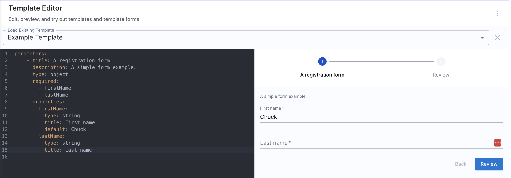

import Tabs from '@theme/Tabs';
import TabItem from '@theme/TabItem';

Workflows are stored in the Software Catalog under the kind **“Template”.** You can create and configure your own workflows in Harness IDP using a YAML file typically named **```workflow.yaml```.** This YAML file acts as the single source of truth, describing the workflow and its metadata. Below is an overview of its configuration.

## Workflow YAML Definition
A workflow is defined through a YAML configuration file, usually named ```workflow.yaml```, which contains all the workflow’s metadata.

The syntax and guidelines for writing this YAML configuration file are inspired by Backstage Templates. Learn more about the [Backstage guidelines](https://backstage.io/docs/features/software-templates/writing-templates/#specparameters---formstep--formstep) here.

## Components of Workflow YAML
The ```workflow.yaml``` has three main components:
1. **Frontend**: Configures the input fields required for the workflow.
2. **Backend**: Configures the actions to be triggered and the orchestration pipelines to be executed.
3. **Outputs**: Configures output variables to be used after backend execution.


These components work together to facilitate workflow execution. Let’s dive deeper into each.

### [Workflow Frontend](/docs/internal-developer-portal/flows/flows-input.md)
The frontend of Harness IDP workflows is customizable to accept different types of input fields based on custom requirements. This frontend serves as the entry point, where users fill in the necessary details to execute the workflow using the input parameters described.

#### How to define the Workflow Frontend?
- You can configure one or more pages of input fields in the frontend using the ```spec.parameters``` field in your YAML configuration.
- You can define multiple input fields using the `properties` field in your YAML configuration.

<Tabs>
<TabItem value="YAML" label="YAML" default>

**Example Syntax**:
```YAML
spec:
  owner: backstage/techdocs-core
  type: service

  parameters:
    - title: A registration form
      description: A simple form example.
      type: object
      required:
        - firstName
        - lastName
      properties:
        firstName:
          type: string
          title: First name
          default: Chuck
        lastName:
          type: string
          title: Last name
```

</TabItem>
<TabItem value="Workflow Playground" label="Template Playground">




</TabItem>
</Tabs>

**Parameter Types**

A workflow definition can accept a wide range of input types, including:
- **String**: Simple text fields used for names, IDs, or environment types.
- **Integer**: Numeric inputs used for values like quotas or age limits.
- **Array**: Useful for handling multiple inputs, such as a list of dependencies or services.
- **Object**: Enables complex data structures, allowing nested fields for detailed configurations.

**User Interaction and Validation**

Here are some ways you can configure your workflow's frontend to enhance user interaction and validation:
- **UI Widgets for User Input:**
Inputs can include interactive UI components that simplify user interaction. For example, a string input can use ``ui:field: OwnerPicker`` to let users select User Groups from a dropdown list.

- **Default Values:**
You can set default values for parameters to guide users toward commonly used inputs, streamlining the onboarding process and improving user experience.

- **Field Dependency:**
Input fields can be made dynamic using ``anyOf`` or ``allOf``, making certain fields appear only based on previous user selections. For instance, selecting a "production" environment could reveal additional fields for production-specific configurations.

- **Required Fields:**
Workflows allow developers to enforce mandatory fields to ensure critical data is collected. For example, fields like age or owner can be marked as required to prevent missing essential information during onboarding.

Learn more about configuring inputs and frontend for your workflow [here](/docs/internal-developer-portal/flows/flows-input.md).

### Workflow Backend
The backend of Harness IDP workflows includes a library of steps and actions to define the workflow logic. These steps are core execution units used to trigger actions and orchestration pipelines. Input details from the frontend are passed to the backend for task execution.

#### How to define the Workflow Backend?
You can configure the backend using the ```spec.steps``` field in your YAML configuration.

**Example Syntax**:
```YAML
steps:
  - id: trigger
    name: Creating your react app
    action: trigger:harness-custom-pipeline
    input:
      url: "YOUR PIPELINE URL"
      inputset:
        project_name: ${{ parameters.project_name }}
        github_repo: ${{ parameters.github_repo }}
        github_org: ${{ parameters.github_org }}
        github_token: ${{ parameters.github_token }}
      apikey: ${{ parameters.token }}

  - id: another-step
    name: Clean up  # Trigger another pipeline
    action: trigger:harness-custom-pipeline
    input:
      url: "YOUR PIPELINE URL"
      apikey: ${{ parameters.token }}
```

#### [Supported Actions](/docs/internal-developer-portal/flows/custom-actions.md)

Workflow Actions are integration points with third-party tools, designed to take inputs from the workflow's frontend and execute specific tasks based on user input. Workflows include several built-in actions for fetching content, registering in the catalog, and performing key operations such as creating and publishing a Git repository.

Here are some examples used in a workflow:

- **Triggering Pipelines**: Using `trigger:harness-custom-pipeline` to trigger pipelines in Harness for various actions, such as creating a repository or onboarding a new service.
- **Creating Repositories**: Using `trigger:harness-custom-pipeline` to execute a pipeline with a `create-repo` stage, generating a new repository based on the provided input.
- **Logging Data**: Using `debug:log` to capture and display specific input details in the IDP Workflows Logs UI.

#### [Harness Pipeline](/docs/internal-developer-portal/flows/harness-pipeline.md)
Self-service workflows in Harness IDP are powered by **Harness Pipeline**. Each workflow’s backend is configured using Actions and Harness Pipelines.

When a workflow is executed, users provide input details required for pipeline execution. These inputs are passed into the pipeline through a workflow action, which triggers specific steps in the pipeline. These steps can perform tasks such as launching a CI/CD process, registering a service in the catalog, setting up infrastructure, etc.

### [Workflow Outputs](/docs/internal-developer-portal/flows/outputs.md)
After backend execution, each step can produce output variables, which can be displayed in the frontend. These outputs can include links to newly created resources like Git repositories, documentation pages, or CI/CD pipelines.

**Example Syntax**:
``` YAML
output:
  links:
    - title: "Repository Link"
      url: "${{ steps['repo-create'].output.repoUrl }}"
    - title: "Pipeline Dashboard"
      url: "${{ steps['deploy-pipeline'].output.pipelineUrl }}"

```
## Authentication

There are two ways in which **Workflow to Harness Pipeline authentication** works in **Harness IDP Workflows**. You can trigger a Harness Pipeline in an IDP Workflow using the following modes:

💾 **User Session Token**
- The **user's session token** is used to trigger the Harness Pipeline.
- The user must have **execute permissions** for the underlying pipeline(s) to ensure successful execution.

🔑 **Harness API Key Secret**
- A pre-configured **Harness API Key Secret** is used to trigger the Harness Pipeline.
- The user does **not** need direct access to the underlying pipeline(s); however, the API key must have the **execute permissions** for the underlying pipeline(s).

These authentication modes can be defined while using the following action: [**`trigger:harness-custom-pipeline`**](https://developer.harness.io/docs/internal-developer-portal/flows/custom-actions#1-triggerharness-custom-pipeline).

### Modes


|                              | 💾 **User Session Token**                                                                                                                                                                                                                                                                                             | 🔑 **Harness API Key Secret**                                                                                                                                                                                                                                                                                          |
|------------------------------|---------------------------------------------------------------------------------------------------------------------------------------------------------------------------------------------------------------------------------------------------------------------------------------------------------------------------------|-----------------------------------------------------------------------------------------------------------------------------------------------------------------------------------------------------------------------------------------------------------------------------------------------------------------------------------|
| **Overview**                     | The user who triggers the workflow uses their **own credentials** to trigger the pipeline. The user must have **Execute permission** for the underlying pipeline(s) to ensure successful execution.                                                                                                                            | The user triggers the workflow using a **dedicated API Key** to initiate the pipeline. In this case, the user **may not have direct access** to the underlying pipeline(s). Platform engineers can generate the necessary API token and configure it within the workflow as default, ensuring no user can access or modify the pipeline. |
| **When to use (Ideal scenario**) | The **workflow** exists in an **open scope**, while the **underlying pipeline(s)** are in a project where **All Account Users (or All Org Users)** have Pipeline Execute permission.                                                                                                                                                       | The **Pipeline** lives in a **closed project** where you do not want to give users **direct View and Execute permissions**. This is useful to hide the business/implementation.                                                                                                                                                                   |
| **Ease of setup**                | Easy to set up—requires **adding a field under parameter**s in the workflow.                                                                                                                                                                                                                                                                 | Requires **creation and management of a Harness API Key**, also configuring the workflow with the secret identifier.                                                                                                                                                                                                                  |
| **RBAC Setup**                   | Requires adding **All Account** Users (or specific users and groups) to the project where pipeline resides with the **Pipeline Execute** permission. This could be a tedious setup and can expose other pipelines in the project as well. (Ideally such pipelines should live in a dedicated project for  IDP Workflows which are open) | The Workflow and Pipeline can live in **different scopes** but can be connected with the **Platform Engineer’s API Key**.                                                                                                                                                                                                                 |


### 💾  Mode 1: User Session Token

You can trigger a pipeline in Harness IDP Workflows using the **`user session token`** mode by specifying the **`token`** setup in your **`parameters.properties`** section of the **Workflow YAML**.

#### 1. Defining the **`token`** setup:
This is defined under the `parameter.properties` spec to extract the user session token. This token is then used to execute the pipeline.

:::warning
The **`token`** property used to fetch the **Harness Auth Token** is hidden on the **Review Step** using **`ui:widget: password`**. However, for this to function correctly in a **multi-page workflow**, the token property must be included under the **first `page`**.
```YAML {12}
parameters:
  - title: <PAGE-1 TITLE>
    properties:
      property-1:
        title: title-1
        type: string
      property-2:
        title: title-2
    token:
      title: Harness Token
      type: string
      ui:widget: password
      ui:field: HarnessAuthToken
  - title: <PAGE-2 TITLE>
    properties:
      property-1:
        title: title-1
        type: string
      property-2:
        title: title-2
  - title: <PAGE-n TITLE>
```
:::

```YAML
token:
    title: Harness Token
    type: string
    ui:widget: password
    ui:field: HarnessAuthToken
```

#### 2. Referencing the **`token`** in the **`steps`** spec of the Workflow YAML:
You'll need to reference the **`token`** within the **steps** section using the following format:
```YAML
apikey: ${{ parameters.token }}
```

#### Example YAML:
```YAML {22}
parameters:
  - title: Deploy service
    required:
      - username
    properties:
      username:
        title: Username
        type: string
    token:
      title: Harness Token
      type: string
      ui:widget: password
      ui:field: HarnessAuthToken
steps:
  - id: trigger
    name: Run Deploy service
    action: trigger:harness-custom-pipeline
    input:
      url: pipeline url
      inputset:
        username: ${{ parameters.username }}
      apikey: ${{ parameters.token }}
output:
  links:
    - title: Pipeline Details
      url: ${{ steps.trigger.output.PipelineUrl }}
```


#### YAML Breakdown:
- In the above example, the **`apikey`** parameter retrieves its value from **Harness Token**, which is defined in the **`parameters.properties`** section as a required input.
- Without the **`token`** parameter input, the pipeline won't be executed.
- [Take a look at this example for further clarification.](https://github.com/harness-community/idp-samples/blob/eb9988020d3917c0bca7daccb354ba670626221b/tutorial-self-service-flow-template.yaml#L64-L68)

### 🔑 Mode 2: Harness API Key Secret
You can also trigger a pipeline in an IDP Workflow using a **pre-configured Harness API Key**.  Here's how you can set this up:
- Create a [Harness API Key Secret](https://developer.harness.io/docs/platform/get-started/tutorials/add-secrets-manager#create-secrets).
- Store it in your [Harness Secret Manager](https://developer.harness.io/docs/platform/secrets/secrets-management/harness-secret-manager-overview).
- The secret must be stored in the [**Account Scope**](https://developer.harness.io/docs/platform/secrets/secrets-management/reference-secrets-in-custom-sm) to ensure accessibility for workflow execution.
- The secret must have ```execute permissions``` to the underlying pipeline(s).

:::caution
Other secret managers are **not supported** for storing secrets with this feature. You must use **[Harness Secret Manager](https://developer.harness.io/docs/platform/secrets/secrets-management/harness-secret-manager-overview)** to store your secret and authenticate via this mode. Since this secret is only relevant within Harness, it does not pose a security concern.
:::

#### Referencing the **`secret`** in the **`steps`** spec:
```YAML
apiKeySecret: "secretId"
```

Here, ```secretId``` refers to the identifier of the secret which stores the **Harness API Key**. You can retrieve this ``secretId`` from the **Harness Secret Manager**.

#### Example YAML:
```YAML {17}
parameters:
  - title: Deploy service
    required:
      - username
    properties:
      username:
        title: Username
        type: string
steps:
  - id: trigger
    name: Run Deploy service
    action: trigger:harness-custom-pipeline
    input:
      url: pipeline url
      inputset:
        username: ${{ parameters.username }}
      apiKeySecret: "secretId"
output:
  links:
    - title: Pipeline Details
      url: ${{ steps.trigger.output.PipelineUrl }}
```

The **`apiKeySecret`** field retrieves its value from **`secretId`**, which is the Harness secret identifier.

:::info
Authentication using the user session token is **no longer required** in case you are using the Harness API Key Secret authentication mode.
:::

## Example YAML
Here's an example of a single-page workflow:
<Tabs>

<TabItem value="IDP 2.0 (New)">

```YAML
apiVersion: harness.io/v1
kind: Workflow
type: service
identifier: reactapp
name: Create a new service
owner: d.p@harness.io
spec:
  output:
    links:
      - title: Pipeline Details
        url: ${{ steps.trigger.output.PipelineUrl }}
  parameters:
    - title: Service Details
      required:
        - project_name
        - template_type
        - public_template_url
        - repository_type
        - repository_description
        - repository_default_branch
        - direct_push_branch
        - slack_id
      properties:
        token:
          title: Harness Token
          type: string
          ui:widget: password
          ui:field: HarnessAuthToken
        projectId:
          title: Project Identifier
          description: Harness Project Identifier
          type: string
          ui:field: HarnessProjectPicker
        template_type:
          title: Type of the Template
          type: string
          description: Type of the Template
        public_template_url:
          title: Give a Public template URL
          type: string
          description: Give a Public Cookiecutter Template
        repository_type:
          type: string
          title: Repository Type
          enum:
            - public
            - private
          default: Public
        repository_description:
          type: string
          title: Add a description to your repo
          description: Auto-generated using Self-Service-Flow of Harness-IDP
        owner:
          title: Choose an Owner for the Service
          type: string
          ui:field: OwnerPicker
          ui:options:
            allowedKinds:
              - Group
  steps:
    - id: trigger
      name: Creating your react app
      action: trigger:harness-custom-pipeline
      input:
        url: https://app.harness.io/ng/account/account_id/module/idp/orgs/org_id/projects/project_id/pipelines/pipeline_id/pipeline-studio/?storeType=INLINE
        inputset:
          project_name: ${{ parameters.project_name }}
          template_type: ${{ parameters.template_type }}
          public_template_url: ${{ parameters.public_template_url }}
        apikey: ${{ parameters.token }}
metadata:
  description: A Workflow to create a new service
  tags:
    - nextjs
    - react
    - javascript
```
</TabItem>

<TabItem value="IDP 1.0">

```YAML
apiVersion: scaffolder.backstage.io/v1beta3
kind: Template
# some metadata about the Workflow itself
metadata:
  name: react-app
  title: Create a new service
  description: A Workflow to create a new service
  tags:
    - nextjs
    - react
    - javascript
# these are the steps which are rendered in the frontend with the form input
spec:
  owner: d.p@harness.io
  type: service
  parameters:
    - title: Service Details
      required:
        - project_name
        - template_type
        - public_template_url
        - repository_type
        - repository_description
        - repository_default_branch
        - direct_push_branch
        - slack_id
      properties:
        # This field is hidden but needed to authenticate the request to trigger the pipeline
        # DO NOT Remove this field.
        token:
          title: Harness Token
          type: string
          ui:widget: password
          ui:field: HarnessAuthToken
        projectId:
            title: Project Identifier
            description: Harness Project Identifier
            type: string
            ui:field: HarnessProjectPicker
        template_type:
          title: Type of the Template
          type: string
          description: Type of the Template
        public_template_url:
          title: Give a Public template URL
          type: string
          description: Give a Public Cookiecutter Template
        repository_type:
          type: string
          title: Repository Type
          enum:
            - public
            - private
          default: Public
        repository_description:
          type: string
          title: Add a description to your repo
          description: Auto-generated using Self-Service-Flow of Harness-IDP
        owner:
          title: Choose an Owner for the Service
          type: string
          ui:field: OwnerPicker
          ui:options:
            allowedKinds:
              - Group
  #steps that are executed in series in the Workflow backend
  steps:
    - id: trigger
      name: Creating your react app
      action: trigger:harness-custom-pipeline
      input:
        url: "https://app.harness.io/ng/account/account_id/module/idp/orgs/org_id/projects/project_id/pipelines/pipeline_id/pipeline-studio/?storeType=INLINE"
        inputset:
          project_name: ${{ parameters.project_name }}
          template_type: ${{ parameters.template_type }}
          public_template_url: ${{ parameters.public_template_url }}
        apikey: ${{ parameters.token }}
  # some outputs which are saved along with the job for use in the frontend
  output:
    links:
      - title: Pipeline Details
        url: ${{ steps.trigger.output.PipelineUrl }}
```
</TabItem>
</Tabs>

 ## Workflows Playground
:::caution
The Workflows Playground **does not render accurate previews** for **advanced user inputs** and **complex use cases** such as conditional fields or complex input formats. It is recommended to use the editor only for **lightweight input previews**. For accurate validation of **advanced inputs**, test the Workflow Form Inputs in an **actual Workflow execution**.
:::

Harness IDP also provides a **built-in editor** to help you build your **Workflow's Frontend**. It offers a real-time preview of the corresponding UI based on the YAML definition. Here, you can create a new workflow or edit an existing one.  '

**Note:** The editor is for **preview purposes** only; changes made here cannot be saved. Once you have tested the modifications, you must manually copy the updated YAML and add it to the Workflow definition YAML stored in your Git provider.

Here's how you can access the playground:
1. Go to your **Workflows** page. Click on the **three dots** in the top right corner and select **Open Playground**.

2. Select **Edit Template Form**.

3. Choose an existing workflow or begin creating a new one.


## Syntax Essentials

### Input Parameters
The input fields in **parameters** can be structured sequentially. Since it accepts an array, you can either have all input fields on a single page or divide them into multiple pages, rendering them as different steps in the form.

These fields are built using the [**React JSON Schema**](https://rjsf.netlify.app) library. The library includes many fields which can be used with the `ui:field` property of an input field. `ui:options` in the same field are used to customize the field behavior.

You can explore more about the different input types available in this library. Check out the [documentation](https://rjsf-team.github.io/react-jsonschema-form/docs/) and an interactive [playground](https://rjsf-team.github.io/react-jsonschema-form/) to experiment with various examples.

<details>
<summary>Example YAML</summary>

```YAML
apiVersion: scaffolder.backstage.io/v1beta3
kind: Template
metadata:
  name: v1beta3-demo
  title: Test Action Workflow
  description: Workflow Demo
spec:
  owner: backstage/techdocs-core
  type: service
  parameters:
    - title: A registration form
      description: A simple form example.
      type: object
      required:
        - firstName
        - lastName
      properties:
        firstName:
          type: string
          title: First name
          default: Chuck
          ui:autofocus: true
          ui:emptyValue: ''
          ui:autocomplete: given-name
        lastName:
          type: string
          title: Last name
          ui:emptyValue: ''
          ui:autocomplete: family-name
        nicknames:
          type: array
          items:
            type: string
          ui:options:
          orderable: false
        telephone:
          type: string
          title: Telephone
          minLength: 10
          ui:options:
            inputType: tel
# ... pipeline details will follow
```

</details>

### Templating Syntax
Variables in **Workflow YAML** are wrapped in `${{ }}` and are used to connect different parts of the workflow. All form inputs from the **parameters** section can be accessed using this syntax.

For example, `${{ parameters.project_name }}` inserts the value of `project_name` entered by the user in the UI. This allows seamless passing of values from the form into different workflow steps, making input variables reusable. These strings retain the type of the parameter.

The `${{ parameters.project_name }}` pattern is specifically used in **Workflow YAML** to pass parameters from the UI to the input of the `trigger:harness-custom-pipeline` step.

The templating engine used for this YAML is **[Nunjucks](https://mozilla.github.io/nunjucks/)**.

**Important Note:**
The `${{ parameters.x }}` syntax is supported only within the **steps** section when configuring the **Workflows Backend**. It **cannot** be used within the **properties** section to reference another parameter.

<details>
<summary>Example YAML</summary>

```YAML
spec:
  parameters:
    - title: Service Details
      properties:
        projectId:
            title: Project Identifier
            description: Harness Project Identifier
            type: string
            ui:field: HarnessProjectPicker
        template_type:
          title: Type of the Template
          type: string
          description: Type of the Template
          ui:readonly: $${{ parameters.another_field}}  ## NOT SUPPORTED
  steps:
    - id: trigger
      name: Creating your react app
      action: trigger:harness-custom-pipeline
      input:
        url: "https://app.harness.io/ng/account/account_id/module/idp/orgs/org_id/projects/project_id/pipelines/pipeline_id/pipeline-studio/?storeType=INLINE"
        inputset:
          project_id: ${{ parameters.projectId }}  ## SUPPORTED
          template_type: ${{ parameters.template_type }} ## SUPPORTED
```
</details>
