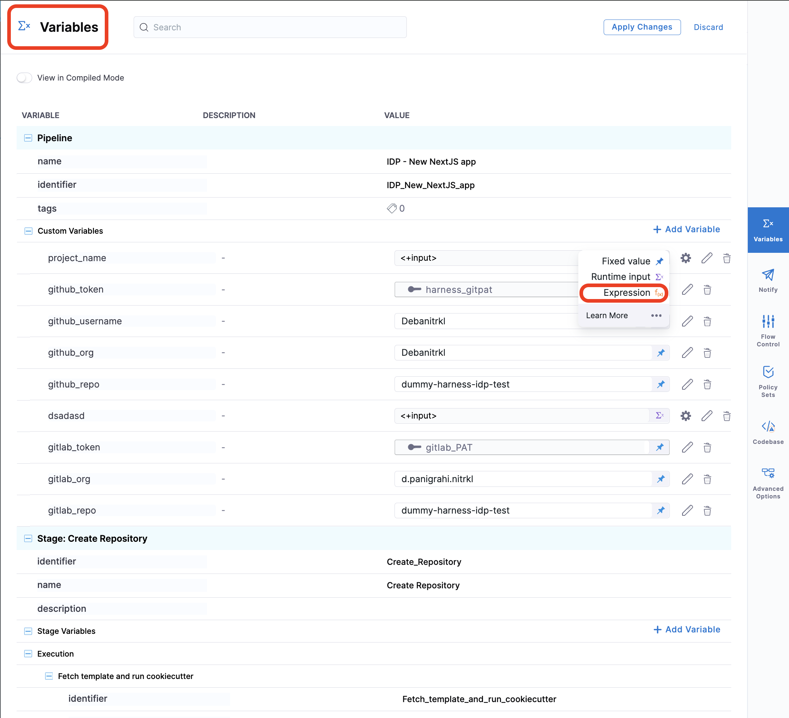

<DocsTag  backgroundColor= "#cbe2f9" text="Tutorial"  textColor="#0b5cad"  />

This tutorial is designed to help a platform engineer to get started with Harness IDP. We will create a basic service onboarding pipeline that uses a software template and provisions an application templated by cookiecutter for a developer. After you create the software template, developers can choose the template on the **Workflow** page and enter details such as a name for the application and the path to their Git repository. The service onboarding pipeline creates a new repository and adds a `catalog-info.yaml` to it and registers it back into your software catalog all using the new **Developer Portal** stage. 

Users (developers) must perform a sequence of tasks to create the application. First, they interact with a software template. A software template is a form that collects a user's requirements. After a user submits the form, IDP executes a Harness pipeline that onboard the new service. Usually the pipeline fetches a cookiecutter template code, creates a new repository, and interacts with third-party providers such as cloud providers, Jira, and Slack.

## Prerequisites

Before you begin this tutorial, make sure that you have completed the following requirements:

- Enable Harness IDP for your account.
- Make sure you are assigned the [IDP Admin Role](https://developer.harness.io/docs/internal-developer-portal/rbac/resources-roles#1-idp-admin) or another role that has full access to all IDP resources. 
- Create a **GitHub** connector named `democonnector` at the account scope. This connector should be configured for a GitHub organization (personal accounts are currently not supported by this tutorial). 

## Create a Pipeline

Begin by creating a pipeline for onboarding the service.

To create a **Developer Portal** stage, perform the following steps:

1. Go to **Admin** section under IDP, select **Projects**, and then select a project.

You can also create a new project for the service onboarding pipelines. Eventually, all the users in your account should have permissions to execute the pipelines in this project. For information about creating a project, go to [Create organizations and projects](/docs/platform/organizations-and-projects/create-an-organization/).


2.  Then select **Create a Pipeline**, add a name for the pipeline and select the type as **Inline**


3. Go to the variables and create all the variables whose values you're going to provide as runtime inputs using the workflows. Here's the list of variables you need to create, make sure you name them exactly the same as mentioned below as we use the same names in the workflows. 

- organization
- public_cookiecutter_template_url
- repository_type
- repository_description
- repository_default_branch
- direct_push_branch


4. The YAML below defines an IDP Stage with a number of steps ([as described here](https://developer.harness.io/docs/internal-developer-portal/flows/idp-stage/#execution-steps)) that will perform the actions to onboard the new service. Copy the YAML below, then in the Harness Pipeline Studio go to the YAML view and paste below the existing YAML.

:::info

You need to have completed all the steps under **[Prerequisites](#prerequisites)** for the below given YAML to work properly 

Please update the `connectorRef: <the_connector_name_you_created_under_prerequisites>` for all the steps it's used, also here we are assuming the git provider to be GitHub please update the `connectorType` for `CreateRepo`, `DirectPush` and `RegisterCatalog` step in case it's other than GitHub. Also, under the slack notify step for `token` add the token identifier, you have created above as part of prerequisites. 

:::

```YAML
  stages:
    - stage:
        name: self-service-flow
        identifier: selfserviceflow
        description: ""
        type: IDP
        spec:
          execution:
            steps:
              - step:
                  type: CookieCutter
                  name: CookieCutter
                  identifier: idpcookiecutter
                  spec:
                    templateType: public
                    publicTemplateUrl: <+pipeline.variables.public_cookiecutter_template_url>
                    cookieCutterVariables:
                      app_name: <+pipeline.variables.project_name>
              - step:
                  type: CreateRepo
                  name: Create Repo
                  identifier: createrepo
                  spec:
                    connectorType: Github
                    connectorRef: account.democonnector
                    organization: <+pipeline.variables.organization>
                    repository: <+pipeline.variables.project_name>
                    repoType: public
                    description: <+pipeline.variables.repository_description>
                    defaultBranch: <+pipeline.variables.repository_default_branch>
              - step:
                  type: CreateCatalog
                  name: Create IDP Component
                  identifier: createcatalog
                  spec:
                    fileName: <+pipeline.variables.catalog_file_name>
                    filePath: <+pipeline.variables.project_name>
                    fileContent: |-
                      apiVersion: backstage.io/v1alpha1
                      kind: Component
                      metadata:
                        name: <+pipeline.variables.project_name>
                        description: <+pipeline.variables.project_name> created using self service flow
                        annotations:
                          backstage.io/techdocs-ref: dir:.
                      spec:
                        type: service
                        owner: test
                        lifecycle: experimental
              - step:
                  type: DirectPush
                  name: Push Code into Repo
                  identifier: directpush
                  spec:
                    connectorType: Github
                    connectorRef: account.democonnector
                    organization: <+pipeline.variables.organization>
                    repository: <+pipeline.variables.project_name>
                    codeDirectory: <+pipeline.variables.project_name>
                    branch: <+pipeline.variables.direct_push_branch>
              - step:
                  type: RegisterCatalog
                  name: Register Component in IDP
                  identifier: registercatalog
                  spec:
                    connectorType: Github
                    connectorRef: account.democonnector
                    organization: <+pipeline.variables.organization>
                    repository: <+pipeline.variables.project_name>
                    filePath: <+pipeline.variables.catalog_file_name>
                    branch: <+pipeline.variables.direct_push_branch>
          cloneCodebase: false
          caching:
            enabled: false
            paths: []
          platform:
            os: Linux
            arch: Amd64
          runtime:
            type: Cloud
            spec: {}
  variables:
    - name: test_content
      type: String
      description: ""
      required: false
      value: devesh
    - name: project_name
      type: String
      description: ""
      required: false
      value: <+input>
    - name: organization
      type: String
      description: ""
      required: false
      value: <+input>
    - name: public_cookiecutter_template_url
      type: String
      description: ""
      required: false
      value: <+input>
    - name: repository_type
      type: String
      description: ""
      required: false
      value: <+input>.default(private).allowedValues(private,public)
    - name: repository_description
      type: String
      description: ""
      required: false
      value: <+input>
    - name: repository_default_branch
      type: String
      description: ""
      required: false
      value: <+input>
    - name: direct_push_branch
      type: String
      description: ""
      required: false
      value: <+input>
    - name: catalog_file_name
      type: String
      description: ""
      required: false
      value: catalog-info.yaml
```

4. Now Save the pipeline. 

:::info

Software Templates currently support pipelines that are composed only of [IDP Stage](https://developer.harness.io/docs/internal-developer-portal/flows/idp-stage)[custom stage](https://developer.harness.io/docs/platform/pipelines/add-a-stage/#add-a-custom-stage) and [CI stage with Run step](https://developer.harness.io/docs/continuous-integration/use-ci/run-step-settings/#add-the-run-step) with codebase disabled. Additionally, all inputs, except for [pipeline input as variables](https://developer.harness.io/docs/platform/variables-and-expressions/harness-variables/#pipeline-expressions), must be of [fixed value](https://developer.harness.io/docs/platform/variables-and-expressions/runtime-inputs/#fixed-values).



:::

## Create a Software Template

Now that our pipeline is ready to execute when a project name and a GitHub repository name are provided, let's create the UI counterpart of it in IDP. This is powered by the [Backstage Software Template](https://backstage.io/docs/features/software-templates/writing-templates). Create a `workflow.yaml` file anywhere in your Git repository. Usually, that would be the same place as your cookiecutter template. We use the [react-jsonschema-form playground](https://rjsf-team.github.io/react-jsonschema-form/) to build the template. [Nunjucks](https://mozilla.github.io/nunjucks/) is templating engine for the IDP templates.

[Source](https://github.com/harness-community/idp-samples/blob/main/tutorial-self-service-flow-template.yaml)

```YAML
apiVersion: scaffolder.backstage.io/v1beta3
kind: Template
metadata:
  name: new-service
  title: Create a new service
  description: A Workflow to create a new service
  tags:
    - nextjs
    - react
    - javascript
spec:
  owner: owner@company.com
  type: service
  parameters:
    - title: Service Details
      required:
        - project_name
        - organization_name
        - public_template_url
        - repository_type
        - repository_description
        - repository_default_branch
        - direct_push_branch
      properties:
        public_template_url:
          title: Public Cookiecutter Template URL
          type: string
          default: https://github.com/devesh-harness/test-cookicutter
          description: URL to a Cookiecutter template. For the tutorial you can use the default input     
        organization_name:
          title: Git Organization
          type: string
          description: Name of your organization in Git      
        project_name:
          title: Name of your service
          type: string
          description: Your repo will be created with this name
        repository_type:
          type: string
          title: Repository Type
          enum:
            - public
            - private
          default: public
        repository_description:
          type: string
          title: Add a description to your repo
        repository_default_branch:
          title: Name of your Default Branch
          type: string
          default: main 
        direct_push_branch:
          title: Name of your Develop branch
          type: string
          default: develop  
        owner:
          title: Choose an Owner for the Service
          type: string
          ui:field: OwnerPicker
          ui:options:
            allowedKinds:
              - Group
        # This field is hidden but needed to authenticate the request to trigger the pipeline
        token:
          title: Harness Token
          type: string
          ui:widget: password
          ui:field: HarnessAuthToken
  steps:
    - id: trigger
      name: Bootstrapping your new service
      action: trigger:harness-custom-pipeline
      input:
        url: "YOUR PIPELINE URL HERE"
        inputset:
          organization: ${{ parameters.organization_name }}
          project_name: ${{ parameters.project_name }}
          public_cookiecutter_template_url: ${{ parameters.public_template_url }}
          repository_type: ${{ parameters.repository_type }}
          repository_description: ${{ parameters.repository_description }}
          repository_default_branch: ${{ parameters.repository_default_branch }}
          direct_push_branch: ${{ parameters.direct_push_branch }}
        apikey: ${{ parameters.token }}

  output:
    links:
      - title: Pipeline Details
        url: ${{ steps.trigger.output.PipelineUrl }}
```

Replace the `YOUR PIPELINE URL HERE` with the pipeline URL that you created.


This YAML code is governed by Backstage. You can change the name and description of the Workflow. The Workflow has the following parts:

1. Input from the user
2. Execution of pipeline


Let's take a look at the inputs that the Workflow expects from a developer. The inputs are written in the `spec.parameters` field. It has two parts, but you can combine them. The keys in `properties` are the unique IDs of fields (for example, `github_repo` and `project_name`). If you recall, they are the pipeline variables that we set as runtime inputs earlier. This is what we want the developer to enter when creating their new application.

The YAML definition includes fields such as cloud provider and database choice. They are for demonstration purposes only and are not used in this tutorial.

### Authenticating the Request to the Pipeline

The Workflow contains a single action which is designed to trigger the pipeline you created via an API call. Since the API call requires authentication, Harness has created a custom component to authenticate based of the logged-in user's credentials.

The following YAML snippet under `spec.parameters.properties` automatically creates a token field without exposing it to the end user.

```yaml
token:
  title: Harness Token
  type: string
  ui:widget: password
  ui:field: HarnessAuthToken
```

:::info

The `token` property we use to fetch **Harness Auth Token** is hidden on the Review Step using `ui:widget: password`, but for this to work the token property needs to be mentioned under the first `page` in-case you have multiple pages.

```YAML
# example workflow.yaml
...
parameters:
  - title: <PAGE-1 TITLE>
    properties:
      property-1:
        title: title-1
        type: string
      property-2:
        title: title-2
    token:
      title: Harness Token
      type: string
      ui:widget: password
      ui:field: HarnessAuthToken
  - title: <PAGE-2 TITLE>
    properties:
      property-1:
        title: title-1
        type: string
      property-2:
        title: title-2
  - title: <PAGE-n TITLE>  
...
```
:::

That token is then used as part of `steps` as `apikey`

```yaml
  steps:
    - id: trigger
      name: ...
      action: trigger:harness-custom-pipeline
      input:
        url: ...
        inputset:
          key: value
          ...
        apikey: ${{ parameters.token }}
```

### Register the Workflow in IDP

Use the URL to the `workflow.yaml` created above and register it by using the same process for [registering a new software component](/docs/internal-developer-portal/get-started/register-a-new-software-component).

## Use the Self Service Workflows

Now navigate to the **Workflows** page in IDP. You will see the newly created Workflow appear. Click on **Choose**, fill in the form, click **Next Step**, then **Create** to trigger the automated pipeline. Once complete, you should be able to see the new repo created and bootstrapped in your target GitHub organization!

### Unregister/Delete Workflow

1. Navigate to the **Catalog** page, and select **Template** under Kind.


2. Select the Workflow Name you want to Unregister.
3. Now on the Workflow overview page, click on the 3 dots on top right corner and select **Unregister Entity**.


4. Now on the Dialog box select **Unregister Location**.


5. This will delete the Workflow.

## Extended Reading

1. [How to add conditional Inputs in Workflow?](https://developer.harness.io/docs/internal-developer-portal/flows/flows-input#conditional-inputs-in-workflows) 

2. [How to upload a file in a Workflow?](https://developer.harness.io/docs/internal-developer-portal/flows/flows-input#upload-a-file-using-workflows)

3. [How to ingest data dynamically into Workflows?](https://developer.harness.io/docs/internal-developer-portal/flows/dynamic-picker)
