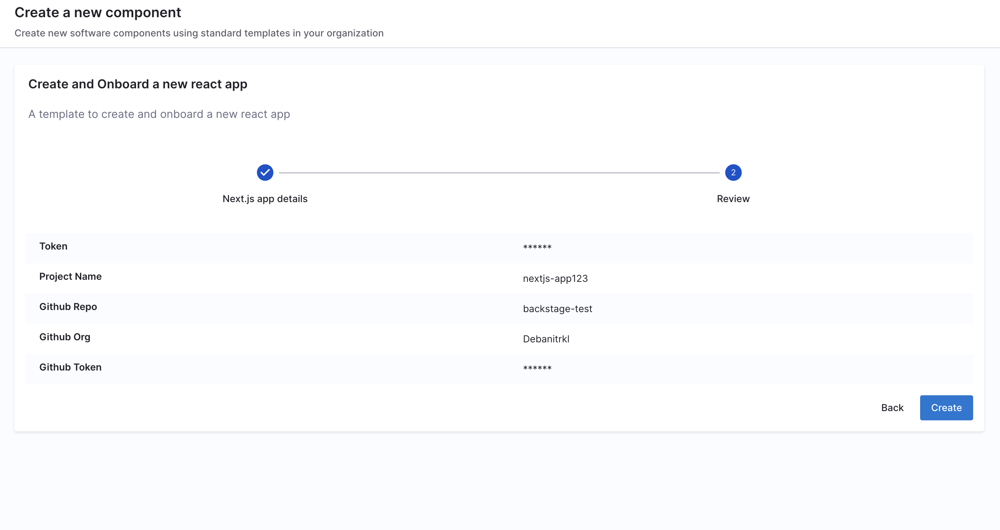

<DocsTag  backgroundColor= "#cbe2f9" text="Tutorial"  textColor="#0b5cad"  />

<DocVideo src="https://www.youtube.com/embed/0GoK3SD1rxs?si=RCMDhlPhoC5qZh3J" />

This tutorial is designed to help a platform engineer to get started with Harness IDP. We will create a basic service onboarding pipeline that uses a software Workflow and provisions a Next.js application for a developer. After you create the software Workflow, developers can choose the Workflow on the **Create** page and enter details such as a name for the application and the path to their Git repository. The service onboarding pipeline creates a hello world repository for storing code.

Your users (developers) must perform a sequence of tasks to create the application. First, they interact with a software Workflow. A software Workflow is a form that collects a user's requirements. After a user submits the form, IDP executes a Harness pipeline that onboard the new service. Usually the pipeline fetches a _hello-world_ skeleton code, creates a new repository, and interacts with third-party providers such as cloud providers, Jira, and Slack.


## Prerequisites

Before you begin this tutorial, make sure that you fulfil the following requirements:

- Enable Harness IDP for your account.
- Obtain a CI or CD license if you do not have one. This is a temporary requirement.

## Create a pipeline

Begin by creating a pipeline for onboarding the service.

### Create a Build or Custom stage

To create a Build or Custom stage, perform the following steps:

1. In the sidebar of the Harness application, select **Projects**, and then select a project.

You can also create a new project for the service onboarding pipelines. Eventually, all the users in your account should have permissions to execute the pipelines in this project. For information about creating a project, go to [Create organizations and projects](/docs/platform/organizations-and-projects/create-an-organization/).

2. Select **Pipelines**, and then select **Create a Pipeline**.

3. In **Pipeline Studio**, select **Add Stage**.


4. In **Select Stage Type**, select **Custom Stage**. (If you have a Harness CI license, you could also use the Build stage type. However, for this tutorial, we recommend that you use the Custom Stage type.)


5. In **Stage Name**, enter a name for the stage, and then click **Set Up Stage**.

6. Select **Add step**, and then, in the menu that appears, select **Add Step**.

A sidebar with available steps is displayed.

7. Select **Container Step** to run a Python CLI called [cookiecutter](https://github.com/cookiecutter/cookiecutter). We need a publicly available Python image for this purpose. You can use Container Step for any such project generators (for example, [yeoman](https://yeoman.io/)).

:::info note
In the CI or Build stage type, container step is named Run, and it has the same functionality.
:::


8. Configure the step as follows:

   1. Enter a name for the step. For example, name it `Create React app`.

   2. You can enter `10m` (10 minutes) in the Timeout field.

   3. In **Container Registry**, create or choose an anonymous Docker connector that connects to DockerHub (`https://registry.hub.docker.com/v2/`).

   4. In **Image**, enter `python`.

   Before we write the command, we must make an infrastructure choice, which means that we specify where the pipeline executes. You can execute the pipeline on your own infrastructure or on the Harness platform. If you have an existing delegate set up for deployments, you can use the associated connector and specify its Kubernetes namespace. If you want to use the Harness platform, you have to use the CI or Build stage type instead of the Custom stage type and choose the Harness platform as your infrastructure.

   :::info note
   Depending upon our operation, we might have to adjust the memory limit of the container. If required, you can change Limit Memory from `500Mi` to `4000Mi`.
   :::

### Cookiecutter Scripts Based on your SCM

import Tabs from '@theme/Tabs';
import TabItem from '@theme/TabItem';

<Tabs>
<TabItem value="GitHub">

5. Paste the following cookiecutter-based script into **Command**.

   The script performs the following tasks:

   1. Generates a basic Next.js app.

   2. Creates a repository with the contents. The sample code used in the command is available [here](https://github.com/harness-community/idp-samples/tree/main/idp-pipelines/cookiecutter-react-app), which essentially is a [cookiecutter project](https://cookiecutter.readthedocs.io/en/stable/tutorials/tutorial2.html). You can choose from available [cookiecutter projects](https://www.cookiecutter.io/templates) or create your own project from scratch.

   ```sh
   # Testing path
   pwd

   # Pre-cleanup in case pipeline fails

   rm -rf idp-samples/
   rm -rf "<+pipeline.variables.project_name>"

   # Clone skeleton
   git clone https://github.com/harness-community/idp-samples

   # Generate code to be pushed
   pip install cookiecutter
   cookiecutter idp-samples/idp-pipelines/cookiecutter-react-app/ app_name="<+pipeline.variables.project_name>" --no-input

   # Add catalog-info.yaml content
    echo "apiVersion: backstage.io/v1alpha1
    kind: Component
    metadata:
      name: <+pipeline.variables.project_name>
      description: This is a nextjs app.
      annotations:
        backstage.io/techdocs-ref: dir:.
    spec:
      type: documentation
      lifecycle: experimental" > catalog-info.yaml


   # Create repository
   curl -L -i -X POST -H "Accept: application/vnd.github+json" -H "Authorization: Bearer <+pipeline.variables.github_token>" https://api.github.com/orgs/<+pipeline.variables.github_org>/repos -d "{\"name\":\"<+pipeline.variables.github_repo>\",\"description\":\"<+pipeline.variables.project_name> - A Next.js app\",\"private\":false}"

   # Push the code
   cd <+pipeline.variables.project_name>/
   git init -b main
   git config --global user.email "support@harness.io"
   git config --global user.name "Harness Support"
   git add .
   git commit -m "Project init and Added catalog-info.yaml"
   git remote add origin https://github.com/<+pipeline.variables.github_org>/<+pipeline.variables.github_repo>.git
   git push https://<+pipeline.variables.github_token>@github.com/<+pipeline.variables.github_org>/<+pipeline.variables.github_repo>.git

   # Add catalog-info.yaml location to catalog
    curl --location 'https://idp.harness.io/<+account.identifier>/idp/api/catalog/locations' \
    --header 'x-api-key: Harness PAT' \
    --header 'Harness-Account: <+account.identifier>' \
    --data-raw '{"type":"url","target":"https://github.com/<+pipeline.variables.github_org>/<+pipeline.variables.github_repo>/blob/main/catalog-info.yaml"}'
   ```

:::info

In the above script you need to add the **[Personal Access Token](https://developer.harness.io/docs/platform/automation/api/add-and-manage-api-keys/#create-personal-api-keys-and-tokens)** to make the API call to register your catalog, 

:::


6. Click **Apply Changes**.


### Manage variables in the pipeline

The script uses several pipeline variables. The variables are as follows:

- `<+pipeline.variables.project_name>`
- `<+pipeline.variables.github_username>`
- `<+pipeline.variables.github_token>`
- `<+pipeline.variables.github_org>`
- `<+pipeline.variables.github_repo>`

Except for the secrets all the variables should have a [runtime input type](https://developer.harness.io/docs/platform/variables-and-expressions/runtime-inputs/#runtime-inputs) and the variable name should match with the parameter name used in the Workflow as the values would be pre-populated from the values entered as input in the below IDP Workflow.

For eg: `<+pipeline.variables.project_name>` variable is pre-populated by `project_name: ${{ parameters.project_name }}` under `input set:` in the below given Workflow.

</TabItem>
<TabItem value="GitLab">

5. Paste the following cookiecutter-based script into **Command**.

   The script performs the following tasks:

   1. Generates a basic Next.js app.

   2. Creates a repository with the contents. The sample code used in the command is available [here](https://github.com/harness-community/idp-samples/tree/main/idp-pipelines/cookiecutter-react-app), which essentially is a [cookiecutter project](https://cookiecutter.readthedocs.io/en/stable/tutorials/tutorial2.html). You can choose from available [cookiecutter projects](https://www.cookiecutter.io/Workflows) or create your own project from scratch.

   ```sh
   # Testing path
   pwd

   # Pre-cleanup in case pipeline fails

   rm -rf idp-samples/
   rm -rf "<+pipeline.variables.project_name>"

   # Clone skeleton
   git clone https://github.com/harness-community/idp-samples

   # Generate code to be pushed
   pip install cookiecutter
   cookiecutter idp-samples/idp-pipelines/cookiecutter-react-app/ app_name="<+pipeline.variables.project_name>" --no-input


   # Add catalog-info.yaml content
    echo "apiVersion: backstage.io/v1alpha1
    kind: Component
    metadata:
      name: <+pipeline.variables.project_name>
      description: This is a nextjs app.
      annotations:
        backstage.io/techdocs-ref: dir:.
    spec:
      type: documentation
      lifecycle: experimental" > catalog-info.yaml

   # Create repository
   curl --request POST --header "PRIVATE-TOKEN: <+pipeline.variables.gitlab_token>" "https://gitlab.com/api/v4/projects" --form "name=<+pipeline.variables.gitlab_repo>" --form "description=<+pipeline.variables.project_name> - A Next.js app" --form "visibility=public"

   # Push the code
   cd <+pipeline.variables.project_name>/
   git init -b main
   git config --global user.email "support@harness.io"
   git config --global user.name "Harness Support"
   git add .
   git commit -m "Project init"
   git remote add origin https://gitlab.com/<+pipeline.variables.gitlab_org>/<+pipeline.variables.gitlab_repo>.git
   git push --set-upstream https://oauth2:<+pipeline.variables.gitlab_token>@gitlab.com/<+pipeline.variables.gitlab_org>/<+pipeline.variables.gitlab_repo>.git main
   
   # Add catalog-info.yaml location to catalog
    curl --location 'https://idp.harness.io/ACCOUNT_ID/idp/api/catalog/locations' \
    --header 'x-api-key: Harness PAT' \
    --header 'Harness-Account: Account_ID' \
    --data-raw '{"type":"url","target":"https://gitlab.com/<+pipeline.variables.gitlab_org>/<+pipeline.variables.gitlab_repo>/blob/main/catalog-info.yaml"}'   

   ```

6. Click **Apply Changes**.


    ### Manage variables in the pipeline

    The script uses several pipeline variables. The variables are as follows:

- `<+pipeline.variables.project_name>`
- `<+pipeline.variables.gitlab_username>`
- `<+pipeline.variables.gitlab_token>`
- `<+pipeline.variables.gitlab_org>`
- `<+pipeline.variables.gitlab_repo>`

Except for the secrets all the variables should have a [runtime input type](https://developer.harness.io/docs/platform/variables-and-expressions/runtime-inputs/#runtime-inputs) and the variable name should match with the parameter name used in the Workflow as the values would be pre-populated from the values entered as input in the below IDP Workflow.

For e.g., : `<+pipeline.variables.project_name>` variable is pre-populated by `project_name: ${{ parameters.project_name }}` under `input set:` in the below given Workflow.

</TabItem>
</Tabs>

You can use the **Variables** button on the floating sidebar on the right-hand side to open the Variables page for the pipeline.


You can create any number of pipeline variables and decide their value type. Some variables, such as a GitHub token, a username, and organization, can have a fixed value. The token used in the code above is a Harness secret whose value is decoded during pipeline execution.

Variables such as project name and GitHub repository are runtime inputs. They are needed at the time of pipeline execution. When creating a new variable, you can specify its type in the UI. For more information about reference variables, go to the [reference documentation](/docs/platform/variables-and-expressions/harness-variables/) on pipeline variables.

### Create a software Workflow definition in IDP

Now that our pipeline is ready to execute when a project name and a GitHub repository name are provided, let's create the UI counterpart of it in IDP. This is powered by the [Backstage Software Workflow](https://backstage.io/docs/features/software-Workflows/writing-Workflows). Create a `Workflow.yaml` file anywhere in your Git repository. Usually, that would be the same place as your skeleton hello world code. We use the [react-jsonschema-form playground](https://rjsf-team.github.io/react-jsonschema-form/) to build the Workflow. [Nunjucks](https://mozilla.github.io/nunjucks/) is templating engine for the IDP Workflows.  

<Tabs>
<TabItem value="GitHub">

[Source](https://github.com/harness-community/idp-samples/blob/main/Workflow-github.yaml)

```yaml
apiVersion: scaffolder.backstage.io/v1beta3
kind: Workflow
metadata:
  name: onboard-services
  title: Create and Onboard a new react app
  description: A Workflow to create and onboard a new react app
  tags:
    - nextjs
    - react
    - javascript
spec:
  owner: debabrata.panigrahi@harness.io
  type: service
  parameters:
    - title: Next.js app details
      required:
        - project_name
        - github_repo
        - github_org
      properties:
        project_name:
          title: Name of your new app
          type: string
          description: Unique name of the app          
        github_repo:
          title: Name of the GitHub repository
          type: string
          description: This will be the name of Repository on Github
        github_org:
          title: Name of the GitHub Organisation
          type: string
          description: This will be the name of Organisation on Github
        github_token:
          title: GitHub PAT
          type: string
          ui:widget: password
        token:
          title: Harness Token
          type: string
          ui:widget: password
          ui:field: HarnessAuthToken
  steps:
    - id: trigger
      name: Creating your react app
      action: trigger:harness-custom-pipeline
      input:
        url: "YOUR PIPELINE URL"
        inputset:
          project_name: ${{ parameters.project_name }}
          github_repo: ${{ parameters.github_repo }}
          github_org: ${{ parameters.github_org }}
          github_token: ${{ parameters.github_token }}
        apikey: ${{ parameters.token }}
    # The final step is to register our new component in the catalog.
  output:
    links:
      - title: Pipeline Details
        url: ${{ steps.trigger.output.PipelineUrl }}
```
</TabItem>
<TabItem value="GitLab">

[Source](https://github.com/harness-community/idp-samples/blob/main/Workflow-gitlab.yaml)

```yaml
apiVersion: scaffolder.backstage.io/v1beta3
kind: Workflow
metadata:
  name: onboard-services
  title: Create and Onboard a new react app
  description: A Workflow to create and onboard a new react app
  tags:
    - nextjs
    - react
    - javascript
spec:
  owner: debabrata.panigrahi@harness.io
  type: service
  parameters:
    - title: Next.js app details
      required:
        - project_name
        - gitlab_repo
        - gitlab_org
      properties:
        project_name:
          title: Name of your new app
          type: string
          description: Unique name of the app          
        gitlab_repo:
          title: Name of the Gitlab repository
          type: string
          description: This will be the name of Repository on Gitlab
        gitlab_org:
          title: Name of the Gitlab Organisation
          type: string
          description: This will be the name of Organisation on Gitlab
        gitlab_token:
          title: Gitlab PAT
          type: string
          ui:widget: password
        token:
          title: Harness Token
          type: string
          ui:widget: password
          ui:field: HarnessAuthToken
  steps:
    - id: trigger
      name: Creating your react app
      action: trigger:harness-custom-pipeline
      input:
        url: "YOUR PIPELINE URL"
        inputset:
          project_name: ${{ parameters.project_name }}
          gitlab_repo: ${{ parameters.gitlab_repo }}
          gitlab_org: ${{ parameters.gitlab_org }}
          gitlab_token: ${{ parameters.gitlab_token }}
        apikey: ${{ parameters.token }}
    # The final step is to register our new component in the catalog.
  output:
    links:
      - title: Pipeline Details
        url: ${{ steps.trigger.output.PipelineUrl }}
```

</TabItem>
</Tabs>

This YAML code is governed by Backstage. You can change the name and description of the software Workflow. The Workflow has the following parts:

1. Input from the user
2. Execution of pipeline





Let's take a look at the inputs that the Workflow expects from a developer. The inputs are written in the `spec.parameters` field. It has two parts, but you can combine them. The keys in `properties` are the unique IDs of fields (for example, `github_repo` and `project_name`). If you recall, they are the pipeline variables that we set as runtime inputs earlier. This is what we want the developer to enter when creating their new application.

The YAML definition includes fields such as cloud provider and database choice. They are for demonstration purposes only and are not used in this tutorial.

### Adding the owner

By default the owner is of type **Group** which is same as the **[User Group](https://developer.harness.io/docs/platform/role-based-access-control/add-user-groups/#built-in-user-groups)** in Harness. In case the owner is a user you have to mention it as `user:default/debabrata.panigrahi`, and it should only contain the username not the complete email ID. 

### Authenticate the request

Once you have written all the inputs that the Workflow requires, you must add the following YAML snippet under `spec.parameters.properties`.

```yaml
token:
  title: Harness Token
  type: string
  ui:widget: password
  ui:field: HarnessAuthToken
```

:::info

The `token` property we use to fetch **Harness Auth Token** is hidden on the Review Step using `ui:widget: password`, but for this to work the token property needs to be mentioned under the first `page` in-case you have multiple pages.

```
# example workflow.yaml
...
parameters:
  - title: <PAGE-1 TITLE>
    properties:
      property-1:
        title: title-1
        type: string
      property-2:
        title: title-2
    token:
      title: Harness Token
      type: string
      ui:widget: password
      ui:field: HarnessAuthToken
  - title: <PAGE-2 TITLE>
    properties:
      property-1:
        title: title-1
        type: string
      property-2:
        title: title-2
  - title: <PAGE-n TITLE>  
...
```
:::

Also the token input is used as a parameter under `steps` as `apikey`

```yaml
  steps:
    - id: trigger
      name: ...
      action: trigger:harness-custom-pipeline
      input:
        url: ...
        inputset:
          key: value
          ...
        apikey: ${{ parameters.token }}
```

This is a custom component we created to authenticate the call to execute the pipeline on the basis of the logged-in user's credentials.

### Action to trigger the pipeline

:::info

The Workflow actions currently supports only [custom stage](https://developer.harness.io/docs/platform/pipelines/add-a-stage/#add-a-custom-stage) and codebase disabled [CI stage with Run step](https://developer.harness.io/docs/continuous-integration/use-ci/run-step-settings/#add-the-run-step), also all input, except for [pipeline input as variables](https://developer.harness.io/docs/platform/variables-and-expressions/harness-variables/#pipeline-expressions), must be of [fixed value](https://developer.harness.io/docs/platform/variables-and-expressions/runtime-inputs/#fixed-values).


:::

The `spec.steps` field contains only one action, and that is to trigger a Harness pipeline. Update the `url` and replace it with the URL of your service onboarding pipeline. Also, ensure that the `inputset` is correct, and it contains all the runtime input variables that the pipeline needs.

### Register the Workflow

Use the URL to the `workflow.yaml` created above and register it by using the same process for [registering a new software component](/docs/internal-developer-portal/get-started/quickstart-guides/register-a-new-software-component).

Now navigate to the **Create** page in IDP. You will see the newly created Workflow appear. Try it out!

### Unregister/Delete Workflow

1. Navigate to the **Catalog** page, and select **Template** under Kind.


2. Select the Workflow Name you want to Unregister.
3. Now on the Workflow overview page, click on the 3 dots on top right corner and select **Unregister Entity**.


4. Now on the Dialog box select **Unregister Location**.


5. This will delete the Workflow.

## Extended Reading

1. [How to add conditional Inputs in Workflow?](https://developer.harness.io/docs/internal-developer-portal/flows/flows-input#conditional-inputs-in-workflows) 

2. [How to upload a file in a Workflow?](https://developer.harness.io/docs/internal-developer-portal/flows/flows-input#upload-a-file-using-workflows)

3. [How to ingest data dynamically into Workflows?](https://developer.harness.io/docs/internal-developer-portal/flows/dynamic-picker)