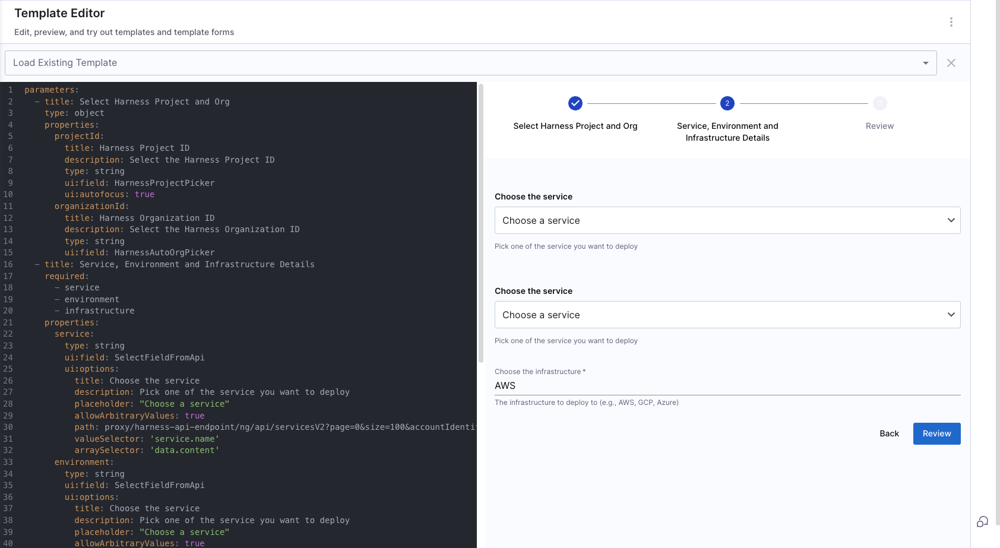

<DocsTag  backgroundColor= "#cbe2f9" text="Tutorial"  textColor="#0b5cad"  />

In this tutorial, we will use an IDP Workflow to deploy a Kubernetes Service. We will guide you through deploying a Guestbook application using IDP Workflows powered by a Harness CD pipeline. This Guestbook application utilizes a publicly available Kubernetes manifest and Docker image.

This tutorial is designed for users who are already CD customers and are new to IDP, looking to automate their CD pipelines using IDP workflows. If you are new to CD, please refer to the [CD onboarding guide](https://developer.harness.io/docs/category/new-users) to set up a CD pipeline before attempting this tutorial.

## Before you begin 

Verify that you have the following:

1. **GitHub Connector**
2. **A Kubernetes cluster with Harness Delegate Installed**. Use your own Kubernetes cluster, or we recommend using [K3D](https://k3d.io/v5.5.1/) for installing Harness Delegates and deploying a sample application in a local development environment.
   - Check [Delegate system requirements](/docs/platform/delegates/delegate-concepts/delegate-requirements).
3. **A working CD pipeline** 

### Harness CD Pipeline

Here we are using a Harness CD pipeline created following this tutorial "**(Deploy using Kubernetes Manifest)[https://developer.harness.io/docs/continuous-delivery/get-started/cd-tutorials/manifest]**"

1. Copy the contents of [canary-pipeline.yml](https://github.com/harness-community/idp-samples/blob/main/idp-pipelines/tutorial-cd-guestbook.yaml).

2. In your Harness pipeline YAML editor, paste the YAML.
3. Select **Save**.

   You can switch to the **Visual** editor and confirm the pipeline stage and execution steps as shown below.

   <DocImage path={require('./static/canary.png')} width="60%" height="60%" title="Click to view full size image" />

:::info

In the pipeline YAML, we have included `service`, `environment`, and `infrastructure` as variables to be defined using Workflows. 

:::

## Create a Workflow

Now that our pipeline is ready to execute when a project name and a GitHub repository name are provided, let's create the UI counterpart of it in IDP. Create a `workflow.yaml` file anywhere in your Git repository. 

In the following `workflow.yaml` we have added defaults for the `service`, `environment` and `infrastructure` corresponding to the tutorial we followed to create the pipeline above. We have also used Dynamic Workflow Picker to fetch the Harness Entities you have access to. 

### Configure Dynamic Picker

1. [Create a Backend Proxy](https://developer.harness.io/docs/internal-developer-portal/flows/dynamic-picker#step-1-create-a-backend-proxy)
2. Add the following under the endpoints

```YAML
proxy:
  endpoints:
    /harness-api-endpoint:
      target: https://app.harness.io
      pathRewrite:
        /api/proxy/harness-api-endpoint/?: /
      headers:
        x-api-key: ${PROXY_HARNESS_TOKEN}
```
3. Add the [Harness Personal Access Token](https://developer.harness.io/docs/platform/automation/api/add-and-manage-api-keys/#create-personal-api-keys-and-tokens) as a variable. 

4. Save the configuration


```YAML
apiVersion: scaffolder.backstage.io/v1beta3
kind: Template
metadata:
  name: Deploy k8s service
  title: Deploy a Kubernetes Service
  description: Uses Harness CD to deploy a kubernetes service.
spec:
  owner: cd_team
  type: environment
  parameters:
    - title: Select Harness Project and Org
    type: object
    properties:
      projectId:
        title: Harness Project ID
        description: Select the Harness Project ID
        type: string
        ui:field: HarnessProjectPicker
        ui:autofocus: true
      organizationId:
        title: Harness Organization ID
        description: Select the Harness Organization ID
        type: string
        ui:field: HarnessAutoOrgPicker
    - title: Service, Environment and Infrastructure Details
      required:
        - service
        - environment
        - infrastructure
      properties:
        service:
          type: string
          ui:field: SelectFieldFromApi
          ui:options:
            title: Choose the service
            description: Pick one of the service you want to deploy
            placeholder: "Choose a service"
            allowArbitraryValues: true
            path: proxy/harness-api-endpoint/ng/api/servicesV2?page=0&size=100&accountIdentifier=ACCOUNT_ID&orgIdentifier={{parameters.organizationId}}&projectIdentifier={{parameters.projectId}}&includeAllServicesAccessibleAtScope=true
            valueSelector: 'service.name'
            arraySelector: 'data.content'
        environment:
          type: string
          ui:field: SelectFieldFromApi
          ui:options:
            title: Choose the environment
            description: Pick the environment where you want to deploy
            placeholder: "Choose a environment"
            allowArbitraryValues: true
            path: proxy/harness-api-endpoint/ng/api/environmentsV2?page=0&size=100&accountIdentifier=ACCOUNT_ID&orgIdentifier={{parameters.organizationId}}&projectIdentifier={{parameters.projectId}}
            valueSelector: 'environment.name'
            arraySelector: 'data.content'
        infrastructure:
          type: string
          ui:field: SelectFieldFromApi
          ui:options:
            title: Choose the infrastructure
            description: The infrastructure to deploy to (e.g., AWS, GCP, Azure)
            placeholder: "Choose an infrastructure"
            allowArbitraryValues: true
            path: proxy/harness-api-endpoint/ng/api/infrastructures?page=0&size=100&environmentIdentifier=ENV_ID&accountIdentifier=ACCOUNT_ID&orgIdentifier={{parameters.organizationId}}&projectIdentifier={{parameters.projectId}}
            valueSelector: 'infrastructure.name'
            arraySelector: 'data.content'
        token:
          title: Harness Token
          type: string
          ui:widget: password
          ui:field: HarnessAuthToken
  steps:
    - id: trigger
      name: Deploy your Application
      action: trigger:harness-custom-pipeline
      input:
        url: YOUR PIPELINE URL HERE
        inputset:
          pipeline.variables.service: ${{ parameters.service }}
          pipeline.variables.infrastructure: ${{ parameters.infrastructure }}
          pipeline.variables.environment: ${{ parameters.environment }}
        apikey: ${{ parameters.token }}
  output:
    links:
      - title: Pipeline Details
        url: ${{ steps.trigger.output.PipelineUrl }}
```

Replace the `YOUR PIPELINE URL HERE` with the pipeline URL that you created, along with the `ACCOUNT_ID` and `ENV_ID` placeholder. 





<details>
<summary>Authenticating the Request to the Pipeline</summary>

The Workflow contains a single action which is designed to trigger the pipeline you created via an API call. Since the API call requires authentication, Harness has created a custom component to authenticate based of the logged-in user's credentials.

The following YAML snippet under `spec.parameters.properties` automatically creates a token field without exposing it to the end user.

```yaml
token:
  title: Harness Token
  type: string
  ui:widget: password
  ui:field: HarnessAuthToken
```

That token is then used as part of `steps` as `apikey`

```yaml
  steps:
    - id: trigger
      name: ...
      action: trigger:harness-custom-pipeline
      input:
        url: ...
        inputset:
          key: value
          ...
        apikey: ${{ parameters.token }}
```
</details>

### Register the Workflow in IDP

Use the URL to the `workflow.yaml` created above and register it by using the same process for [registering a new software component](/docs/internal-developer-portal/get-started/register-a-new-software-component).


### Use the Self Service Workflows

Finally, it's time to execute your Workflow. Every execution leads to a deployment.

1.  Navigate to the **Workflows** page in IDP. You will see the newly created Workflow appear. Click on **Choose**, fill in the form, click **Next Step**, then **Create** to trigger the automated pipeline

    - Observe the execution logs as Harness deploys the workload and checks for steady state.
    - After a successful execution, you can check the deployment on your Kubernetes cluster using the following command:

      ```bash
      kubectl get pods -n default
      ```

    - To access the Guestbook application deployed by the Harness pipeline, port forward the service and access it at [http://localhost:8080](http://localhost:8080)
      ```bash
      kubectl port-forward svc/guestbook-ui 8080:80
      ```

### Congratulations!🎉

You've just learned how to use Harness IDP Workflows to deploy an application.

