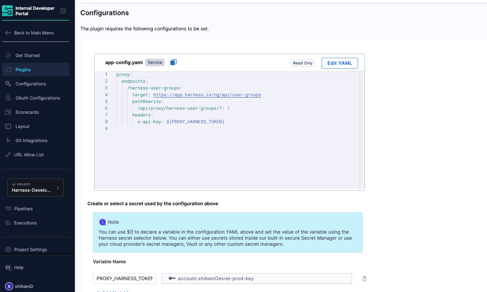
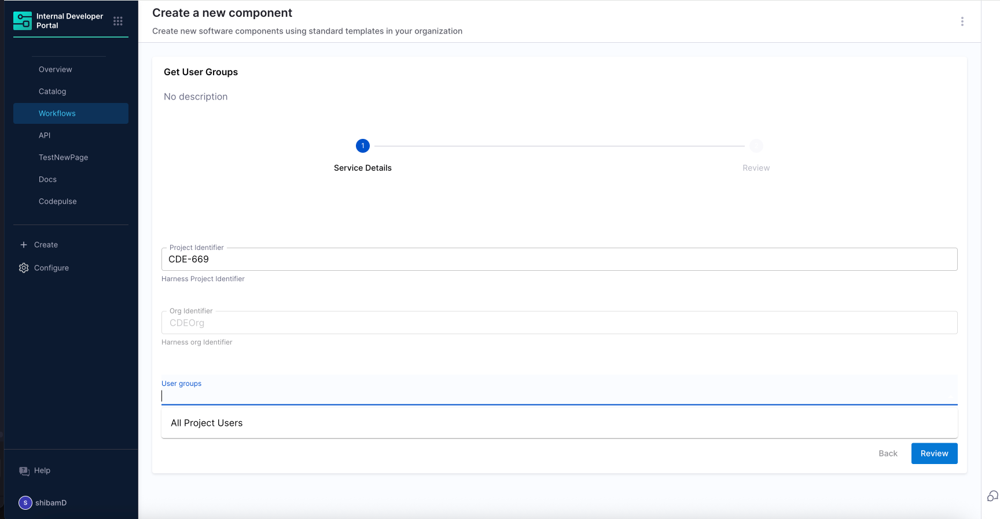

# Creating Dynamic Pickers with Backend Proxy

## Introduction

In this tutorial, you'll learn how to create a workflow form with a dynamic dropdown that fetches data from an external API using Harness IDP's backend proxy feature. Specifically, you'll build:

- A workflow form with a dynamic dropdown menu for selecting User Groups
- A backend proxy configuration that securely connects to the Harness API
- A dependent field relationship where the Organization is automatically selected based on the chosen Project

This approach allows you to present users with real-time data from your systems, creating more dynamic and powerful self-service experiences in your Internal Developer Portal.


### Prerequisites

Before starting, ensure you have the following:

* **Access to Harness IDP** with permissions to create Workflows and configure Backend Proxies.
* The target API endpoint to fetch data for the dynamic dropdown.
  In this example, we will use the [Get User Groups API](https://apidocs.harness.io/tag/User-Group#operation/getUserGroupList), which returns a list of user groups within a given project and organization.


## Explore the API and Set Up the Backend Proxy

To power your dynamic dropdown, you will use Harness’s public API to fetch user groups for a given project and organization. This data will be used to populate the options in your Workflow form.

#### Understand the API

The API you will use is:

```
GET /ng/api/user-groups?accountIdentifier=<account>&orgIdentifier=<org>&projectIdentifier=<project>
```

This endpoint returns a list of user groups associated with the provided account, org, and project identifiers. You can try this API via [Harness API Explorer](https://apidocs.harness.io/tag/User-Group#operation/getUserGroupList) to see the expected response format and query parameters.

But here's the thing — Workflows cannot directly call external APIs from the UI. That's where **backend proxies** come in.

#### Set Up the Backend Proxy

To safely expose this API to your Workflow UI, you need to define a backend proxy. Here’s how you can do it:

1. Go to **IDP > Plugins > Configure Backend Proxies**.
2. Add a new proxy configuration.
3. Use the following YAML definition to register the proxy:

```yaml
proxy:
  endpoints:
    /harness-user-groups:
      target: https://app.harness.io/ng/api
      pathRewrite:
        /api/proxy/harness-user-groups/?: /
      headers:
        x-api-key: ${PROXY_HARNESS_TOKEN}
```

Let’s break this down:

* `/harness-user-groups` is the proxy path that your Workflow will call.
* The proxy forwards the request to the Harness public API (`https://app.harness.io/ng/api`).
* The `pathRewrite` ensures that requests to `/api/proxy/harness-user-groups` map correctly to the API path `/user-groups`.
* The `x-api-key` header authenticates the request. You can securely store this token as an environment variable.


Once saved, this proxy will become accessible from your Workflow form logic. It ensures the API is securely routed through the backend while keeping your tokens safe and abstracted from the frontend.

## Create the Workflow and Add the Dynamic Picker

With the backend proxy in place, you can now build a Workflow that uses it to fetch user groups dynamically. Start by going to **IDP > Workflows** and clicking **Create Workflow**. In the UI, fill in basic information like the name, identifier, type (`harness_project`), and owner. Once saved, switch to **YAML View** to define the form parameters and logic.

This Workflow form is designed to collect a few key inputs:

* A secure Harness token (optional, if required for downstream API or pipeline access)
* A project selected manually using `HarnessProjectPicker`
* An org auto-derived using `HarnessAutoOrgPicker`
* A dynamic dropdown that calls the proxy you created to fetch user groups

Here’s the full YAML:

```yaml
apiVersion: harness.io/v1
kind: Workflow
name: Get User Groups
identifier: get_user_groups
type: harness_project
owner: user:account/shibam.dhar@harness.io
metadata: {}
spec:
  output:
    links:
      - title: Pipeline Details
        url: ${{ steps.trigger.output.PipelineUrl }}
  lifecycle: production
  parameters:
    - title: Service Details
      properties:
        token:
          title: Harness Token
          type: string
          ui:widget: password
          ui:field: HarnessAuthToken

        projectId:
          title: Project Identifier
          description: Harness Project Identifier
          type: string
          ui:field: HarnessProjectPicker

        orgId:
          title: Org Identifier
          description: Harness Org Identifier
          type: string
          ui:field: HarnessAutoOrgPicker

        # highlight-start
        harness_group:
          type: string
          ui:field: SelectFieldFromApi
          ui:options:
            title: User groups
            path: proxy/harness-user-groups/user-groups?orgIdentifier={{parameters.orgId}}&projectIdentifier={{parameters.projectId}}
            arraySelector: data.content
            valueSelector: identifier
            labelSelector: name
        # highlight-end

  steps:
    - id: trigger
      name: Creating your application
      action: trigger:harness-custom-pipeline
      input:
        url:
          - Harness Pipeline URL
        inputset:
          service_name: ${{ parameters.service_name }}
        apikey: ${{ parameters.token }}

  ownedBy:
    - user:account/shibam.dhar@harness.io
```
- `ui:field: SelectFieldFromApi`: This special field type tells Harness to create a dropdown that fetches options from an API endpoint.
- `path: proxy/harness-user-groups/user-groups?...`: This points to the backend proxy we configured earlier, passing the selected org and project as query parameters using template variables (`{{parameters.orgId}}` and `{{parameters.projectId}}`).
- `arraySelector: data.content`: This tells the picker where to find the array of items in the API response. In this case, the Harness API returns user groups inside a nested path `data.content`.
- `valueSelector: identifier` and `labelSelector: name`: These define which properties from each user group object should be used as the dropdown's value (stored internally) and label (displayed to the user).



When you run this Workflow, the experience is fully dynamic. After selecting a project, the org field auto-fills, and the user group dropdown fetches data from your proxy in real-time. It displays the group names and passes their identifiers under the hood — exactly what you want for automation or pipeline inputs.


