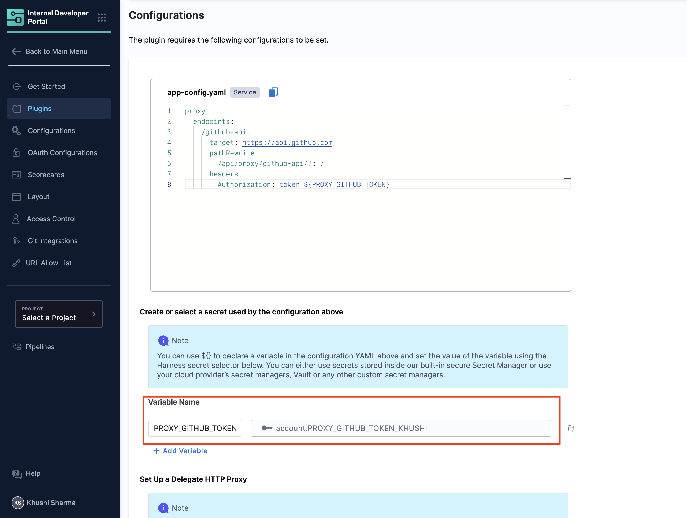
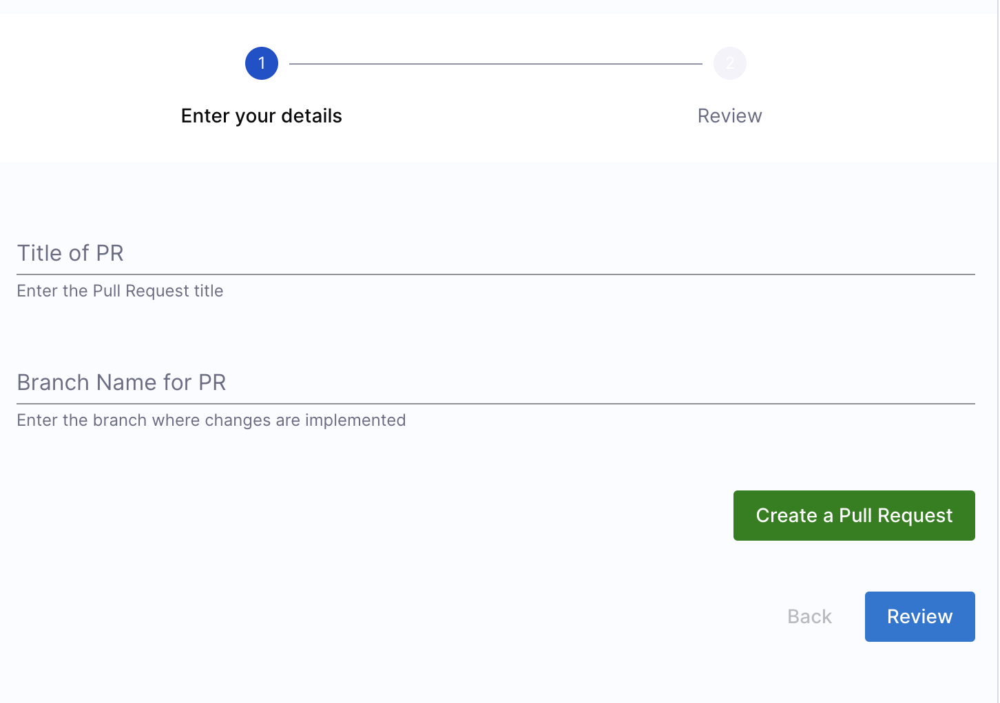

import Tabs from '@theme/Tabs';
import TabItem from '@theme/TabItem';

[Dynamic Pickers](/docs/internal-developer-portal/flows/dynamic-picker.md) in **Harness IDP Self-Service Workflows** enable users to interact with input form fields and receive real-time options, ensuring validation for workflow creators. These dynamic pickers allow users to select input values dynamically, making workflows more interactive.

The primary goal of this tutorial is to help you understand the following concepts and features in detail: 

✔ [**Conditional API requests**](/docs/internal-developer-portal/flows/dynamic-picker#conditional-api-requests)

✔ [**Updating Fields using Form Context**](/docs/internal-developer-portal/flows/dynamic-picker#updating-fields-using-form-context)

✔ [**Live User Validation using API Requests**](/docs/internal-developer-portal/flows/dynamic-picker#live-user-validation-using-api-requests)

These features allow users to dynamically filter results based on previous inputs and make customizable API requests with real-time validation. 

## Pull Request Creator Workflow
For new hires and developers, the onboarding process can be complex and overwhelming. It often takes days for developers to become familiar with the system and start contributing effectively.

This tutorial demonstrates how to build a **GitHub Pull Request Creator Workflow** that significantly reduces the time required for a developer's first pull request—from days to just a few minutes. This tutorial aims to provide a detailed understanding of the various features of Dynamic Pickers.

The workflow enables developers to:
- **Select a repository** where they want to contribute.
- **Validate branch details** auto-fetched using Dynamic Pickers.
- **Provide additional details** required to create a pull request.


## Pre-Requisites
Before starting, ensure you meet the following requirements: 
- **Harness IDP is enabled** for your account. Refer to this guide for setup instructions.
- You have [**IDP Admin Role access**](https://developer.harness.io/docs/internal-developer-portal/rbac/resources-roles/?_gl=1*1h45u39*_gcl_au*MTM1MTQwNTM4MS4xNzM5ODU0OTEy*_ga*NTc0NTQ1NDY5LjE3Mzk4NTQ5MTI.*_ga_46758J5H8P*MTc0MDM5NTIwOS44LjEuMTc0MDM5NTIxMC41OS4wLjA.#1-idp-admin) or a role with full access to IDP resources.
- [**Git Integration**](/docs/internal-developer-portal/get-started/setup-git-integration.md#connector-setup) is configured and setup for your Harness IDP account.
- A [**GitHub token**](https://docs.github.com/en/authentication/keeping-your-account-and-data-secure/managing-your-personal-access-tokens) is stored as a secret in Harness IDP for API authentication. You can add the token as a secret directly while creating a [Backend Proxy](/docs/internal-developer-portal/flows/workflows-tutorials/pull-request-creator#defining-a-backend-proxy).

## Creating the Workflow
The workflow is built in the following steps:
1. [**Define a Backend Proxy**](/docs/internal-developer-portal/flows/workflows-tutorials/pull-request-creator#defining-a-backend-proxy): Establish authentication for API requests from the workflow frontend to the third-party provider (GitHub).
2. [**Create a Repository Picker**](/docs/internal-developer-portal/flows/workflows-tutorials/pull-request-creator#creating-a-repository-picker): Implement a dynamic picker field in the workflow frontend to fetch available GitHub repositories.
3. [**Auto-update Repository Details**](/docs/internal-developer-portal/flows/workflows-tutorials/pull-request-creator#auto-updating-repository-details): Fetch and store context data (e.g., repository name, branch, and type) and display it for user validation.
4. [**Add Live User Validation**](/docs/internal-developer-portal/flows/workflows-tutorials/pull-request-creator#adding-live-user-validation): Allow users to enter additional details and validate auto-updated information before creating a pull request.

## Defining a Backend Proxy
To enable the workflow frontend to make **authenticated API requests** to **GitHub**, a Backend Proxy is required. **Read more about configuring a Backend Proxy [here](/docs/internal-developer-portal/flows/dynamic-picker.md#creating-a-dynamic-workflow-picker).**

### Adding the Backend Proxy Configuration
1. Navigate to Harness IDP and click **"Configure"** from the main menu.


2. Under the **"Plugins"** page, search for **"Configure Backend Proxies"** by Harness IDP. Ensure this plugin is enabled.


3. Add the following configuration in ``app-config.yaml`` under the **"Configurations"** tab:
```
proxy:
  endpoints:
    /github-api:
      target: https://api.github.com
      pathRewrite:
        /api/proxy/github-api/?: /
      headers:
        Authorization: token ${PROXY_GITHUB_TOKEN}

```

#### Configuration Details
- ``github-api``: Unique endpoint name for the backend proxy.
- ``target``: Points to the API base URL (GitHub).
- ``pathRewrite``: Ensures proper API request routing.
- ``headers``: Includes the GitHub authentication token (stored as a secret in Harness IDP).


#### Important Notes
- Use a **unique token** name. Avoid system-defined names like GITHUB_TOKEN, as these might conflict with system variables.
- The token name itself does not matter, as long as a **corresponding secret** is set up in Harness IDP.

### Saving and Verifying the Configuration
1. Click **"Save Configurations"** to apply the backend proxy setup.
2. To verify, make a request to the proxy endpoint:
``
https://idp.harness.io/{ACCOUNT_IDENTIFIER}/idp/api/proxy/github-api/user
``
3. The proxy endpoint URL:
``
https://idp.harness.io/{ACCOUNT_IDENTIFIER}/idp/api/proxy/github-api/
``
mirrors the GitHub API base URL (https://api.github.com/), allowing you to use any GitHub API endpoint by appending the correct path.
4. For more details on consuming **Harness IDP APIs**, refer to the Harness API Documentation.

Once verified, the backend proxy is ready to authenticate API requests within the workflow. 

## Creating a Repository Picker
Now, let's define the [**Workflow Frontend**](/docs/internal-developer-portal/flows/worflowyaml.md#workflow-frontend) in the Workflow YAML configuration. A **Repository Picker** dynamically fetches GitHub repositories based on the provided GitHub username. This feature is based on conditional API requests in self service workflows. 

**Read more about conditional API requests in Dynamic Pickers [here](/docs/internal-developer-portal/flows/dynamic-picker#conditional-api-requests).** 

### Required Fields
- **GitHub Username**: A text field that accepts a **GitHub username** as input.
- **Choose Repository**: A **Dynamic Picker field** that fetches and displays repositories based on the entered username.

:::info
Please ensure that this workflow is configured to accept the end user's **GitHub username** as input, rather than the **organization's name**. For more details on this request, refer to the [GitHub API documentation](https://docs.github.com/en/rest/repos/repos?apiVersion=2022-11-28#list-repositories-for-the-authenticated-user).
:::

### YAML Configuration
<Tabs>
<TabItem value="YAML" label="YAML" default>

```YAML {12,14}
parameters:
  - title: Enter your details
    properties:
      gitUsername:
        title: Repository Owner Username
        description: Enter the GitHub repository owner username.
        type: string
      repoPicker:
        title: GitHub Repositories
        type: string
        description: Select a GitHub repository
        ui:field: SelectFieldFromApi
        ui:options:
          path: proxy/github-api/users/{{parameters.gitUsername}}/repos
          valueSelector: full_name
```
</TabItem>

<TabItem value="Frontend" label="Workflow Frontend" default>


</TabItem>
</Tabs>

### YAML Breakdown
- ``gitUsername``: A simple text input field that accepts a **GitHub username** as a string. This input is required to fetch repositories associated with the user.
- ``repoPicker``: A Dynamic Picker field that **retrieves and displays repositories** based on the GitHub username input.

#### Key Attributes
- ``ui:field``: Must be set to ``SelectFieldFromApi`` to enable dynamic selection.
- ``title``, ``description``, and ``placeholder``: Text fields that guide the user on what information to enter.
- ``path``: Specifies the API endpoint format:
``proxy/endpoint-name/API-path``

Here, endpoint-name is ``github-api``, as defined in the backend proxy.

#### Dynamic Path Reference
The ``gitUsername`` variable is referenced in the Dynamic Picker field path, ensuring that when a user enters a GitHub username, the picker dynamically fetches and displays all associated repositories.

**``path``:** ``proxy/github-api/users/{{ parameters.gitUsername }}/repos``

This setup ensures that the repository list updates dynamically based on the entered username.

## Auto-updating Repository Details
Once a repository is selected, the workflow should **automatically fetch and display repository details**. 

**Read more about auto-updating input fields in Workflows [here](/docs/internal-developer-portal/flows/dynamic-picker#updating-fields-using-form-context).**

### Required Fields
- **Repository Name**: Name of the repsoitory, Auto-fetched, read-only.
- **Repository Branch**: Origin Branch of the repository, Auto-fetched, but editable.
- **Repository Type**: Visibility of the repository, Auto-fetched, read-only.

### YAML Configuration
<Tabs>
<TabItem value="YAML" label="YAML" default>

```YAML {14,16,27,35,43}
parameters:
    - title: Repo Picker
      properties:
        gitUsername:
          title: Github username
          description: Enter your Github username
          type: string
        repoPicker:
          title: GitHub Repositories
          type: string
          description: Pick one of GitHub Repos
          ui:field: SelectFieldFromApi
          ui:options:
            path: proxy/github-api/users/{{parameters.gitUsername}}/repos
            valueSelector: full_name
            setContextData: 
              repoName: name
              branch: default_branch
              type: visibility                 
        repositoryName:
          title: Repo Name
          readonly: true
          description: Repository Name
          type: string            
          ui:field: ContextViewer
          ui:options:
            getContextData: {{formContext.repoName}}
        branchName:
          title: Default Branch
          readonly: true
          description: Default Branch
          type: string
          ui:field: ContextViewer
          ui:options:
            getContextData: {{formContext.branch}}          
        typeName:
          title: Visibility
          readonly: true
          description: Visibility
          type: string     
          ui:field: ContextViewer
          ui:options:
            getContextData: {{formContext.type}}
```

</TabItem>

<TabItem value="Frontend" label="Workflow Frontend" default>


</TabItem>
</Tabs>

### YAML Breakdown
To make the workflow more dynamic, repository details such as **name, branch, and type** need to be fetched and displayed automatically.

#### Data Fields Stored in Form Context
The following values are retrieved and stored in **form context**:
- ``repoName``: Repository name
- ``branch``: Default branch
- ``type``: Repository visibility (Public/Private)

#### Defining Context Data
Context data is stored in the ``ui:options`` section within the Dynamic Picker field using the ``setContextData``property:
```YAML {1}
setContextData: 
    repoName: name
    branch: default_branch
    type: visibility   
```

#### Auto-updating Input Fields
Once context data is set, we use ``getContextData`` to auto-update the input fields dynamically.
- **repositoryName** and **typeName** are **read-only** (using the ```readonly``` tag) fields (users cannot modify them)
- **originBranchName** remains **editable** so users can specify a branch if required.
```YAML {5,7}
originBranchName:
    title: Default Branch
    description: Default Branch where you want the changes pulled into. 
    type: string
    ui:field: ContextViewer
    ui:options:
        getContextData: {{formContext.branch}}
```
**Field References**
- ``originBranchName`` is the frontend input field.
- ``formContext.branch`` retrieves and automatically updates this field based on the GitHub API response.

## Adding Live User Validation
Before creating a pull request, users should validate auto-updated details and provide additional inputs. 

**Read more about adding live user validation in Workflows [here](/docs/internal-developer-portal/flows/dynamic-picker#live-user-validation-using-api-requests).** 

### Required Fields
- **PR Title**: User input for the Pull Request title.
- **New Branch**: User input for the branch name where changes are implemented.
- **Custom Button**: Triggers GitHub API call for validation and PR creation.

### YAML Configuration
<Tabs>
<TabItem value="YAML" label="YAML" default>

```YAML {16,18,20,22}
parameters:
  - title: Enter your details
    properties:
      titlePR:
        title: Title of PR
        description: Enter the Pull Request title
        type: string

      newBranch:
        title: Branch Name for PR
        description: Enter the branch where changes are implemented
        type: string

      customValidate:
        type: string
        ui:field: ValidateAndFetch
        ui:options:
          button: 
            title: Create a Pull Request
          path: proxy/github-api/repos/{{parameters.gitUsername}}/{{parameters.repositoryName}}/pulls
          request: 
            method: POST
            headers: 
              Content-Type: application/json
            body: 
              title: "{{parameters.titlePR}}"
              head: "{{parameters.newBranch}}"
              base: "{{parameters.originBranchName}}"
            setContextData:
              prUrl: html_url
```
</TabItem>

<TabItem value="Frontend" label="Workflow Frontend" default>



</TabItem>
</Tabs>


### YAML Breakdown
To finalize the workflow, we need a **validation button** that allows users to verify auto-fetched details and create a pull request.

#### Custom Validation Button
- ``customValidate``: The **custom button field** for validation and PR creation.
- ``ui:field``: Must be set to **ValidateAndFetch** to trigger validation and API calls.

#### Configurable Options in ``ui:options``
- ``button``: Defines and adds the "Create a Pull Request" button.
- ``path``: Specifies the API endpoint for the PR creation request.
- ``setContextData``: Stores additional context data upon API request execution.
```YAML {2}
setContextData:
  prUrl: html_url
```
- ``prUrl``: A workflow variable that stores the pull request URL.
- ``html_url``: The API response field containing the PR URL.

#### Defining the API Request
The **GitHub API request** is structured as a **POST request**, containing the necessary fields for PR creation. [Read more about making a POST API request here](/docs/internal-developer-portal/flows/dynamic-picker#post-method-support)
```YAML {2,5}
request: 
  method: POST
  headers: 
    Content-Type: application/json
  body: 
    title: "{{parameters.titlePR}}"
    head: "{{parameters.newBranch}}"
    base: "{{parameters.originBranchName}}"
```
**API Request Breakdown**
- ``title``: The **Pull Request title**, dynamically retrieved from the user input field ``titlePR``.
- ``head``: The **changes source branch**, retrieved from ``newBranch``.
- ``base``: The destination branch (default branch of the repository).

#### Show Form Context Live
At any time, if you need to display the **Form Context** live in your Workflow Frontend for debugging purposes, you can use the following format:  

```YAML {7}
formContext:
  title: Live Form Context 
  description: DEBUG Context
  type: string            
  ui:field: ContextViewer
  ui:options:
    getContextData: {{formContext}} 
```

Read more about the syntax [here](/docs/internal-developer-portal/flows/dynamic-picker.md#4-show-form-context-live-in-the-workflow-frontend). 

## Workflow YAML
#### Additional Notes
- Added a new field in the frontend that **retrieves and displays** the **"Pull Request URL"** stored in the **Form Context**.  
- No specific **Action** has been added for this tutorial, as its primary purpose is to help users **understand the features and concepts**.

#### Example YAML
<Tabs>
<TabItem value="YAML" label="YAML" default>

```YAML
apiVersion: scaffolder.backstage.io/v1beta3
kind: Template
metadata:
  name: Dynamic-Picker-Demo-Pull-Request-Creator
  title: Pull-Request-Creator
  description: Create a new PR
spec:
  owner: owner-id
  type: service
  parameters:
    - title: Enter your details
      properties:
        gitUsername:
          title: Repository Owner Username
          description: Enter the repository owner username
          type: string
        repoPicker:
          title: GitHub Repositories
          type: string
          description: Pick one of GitHub Repos
          ui:field: SelectFieldFromApi
          ui:options:
            path: proxy/github-api/users/{{parameters.gitUsername}}/repos
            valueSelector: full_name
            setContextData: 
              repoName: name
              branch: default_branch
              type: visibility                 
        repositoryName:
          title: Repository Name
          readonly: true
          description: Check your Repository Name
          type: string            
          ui:field: ContextViewer
          ui:options:
            getContextData: {{formContext.repoName}}          
        typeName:
          title: Visibility
          readonly: true
          description: Repository Visibility
          type: string     
          ui:field: ContextViewer
          ui:options:
            getContextData: {{formContext.type}}
        originBranchName:
          title: Default Branch
          description: Default Branch where you want the changes pulled into. 
          type: string
          ui:field: ContextViewer
          ui:options:
            getContextData: {{formContext.branch}}
        titlePR:
          title: Title of PR
          description: Enter the Title of your Pull Request
          type: string
        newBranch:
          title: Branch Name for PR
          description: Enter the name of the branch where your changes are implemented
          type: string
        customValidate:
          type: string
          ui:field: ValidateAndFetch
          ui:options:
            button: 
              title: Create a Pull Request
            path: proxy/github-api/repos/{{parameters.gitUsername}}/{{parameters.repositoryName}}/pulls
            request: 
              method: POST
              headers: 
                Content-Type: application/json
              body: 
                title: "{{parameters.titlePR}}"
                head: "{{parameters.newBranch}}"
                base: "{{parameters.originBranchName}}"
            setContextData:
              prUrl: html_url 
        latestPR_URL:
          title: Pull Request URL
          readonly: true
          description: Check your PR
          type: string
          ui:field: ContextViewer
          ui:widget: url
          ui:options:
            getContextData: {{formContext.prUrl}} 
        formContext:
          title: Live Form Context
          description: DEBUG Context
          type: string            
          ui:field: ContextViewer
          ui:options:
            getContextData: {{formContext}}
        token:
          title: Harness Token
          type: string
          ui:widget: password
          ui:field: HarnessAuthToken
  steps:
  - action: debug:log
    id: debug-pull-request
    name: Pull Request Created
    input:
      message: Hello, Your Pull Request has been created. 
```
</TabItem>

<TabItem value="Frontend" label="Workflow Frontend" default>


</TabItem>
</Tabs>