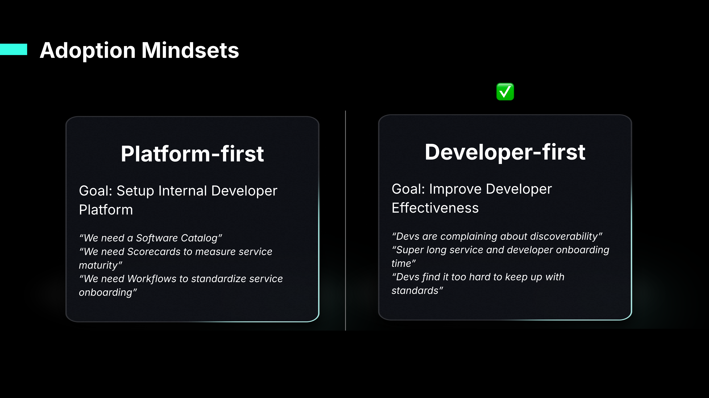
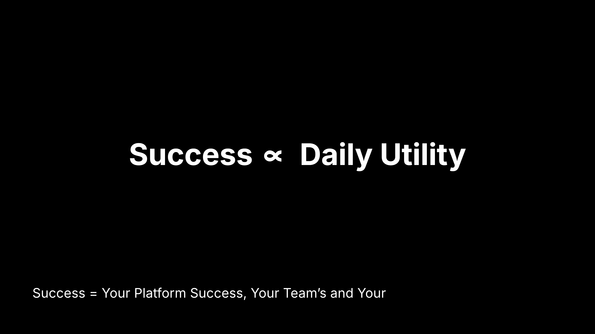
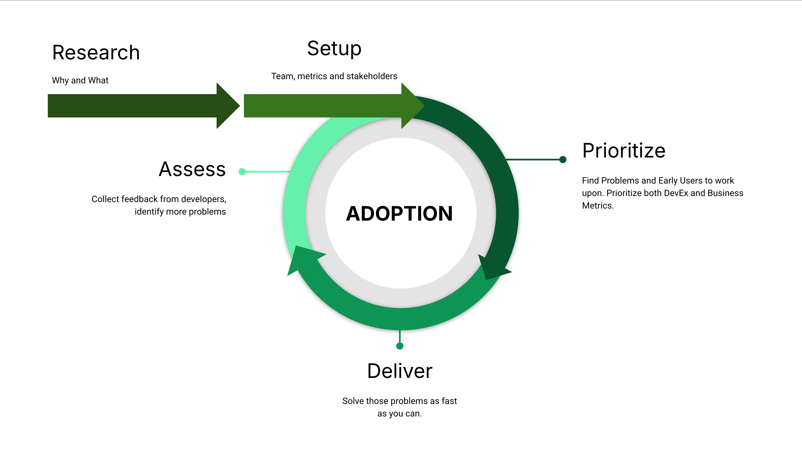
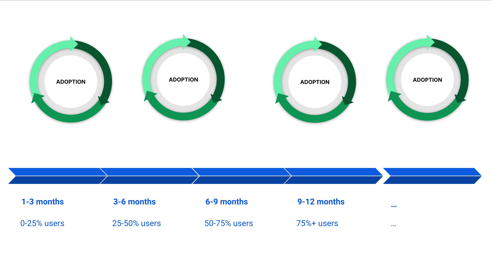
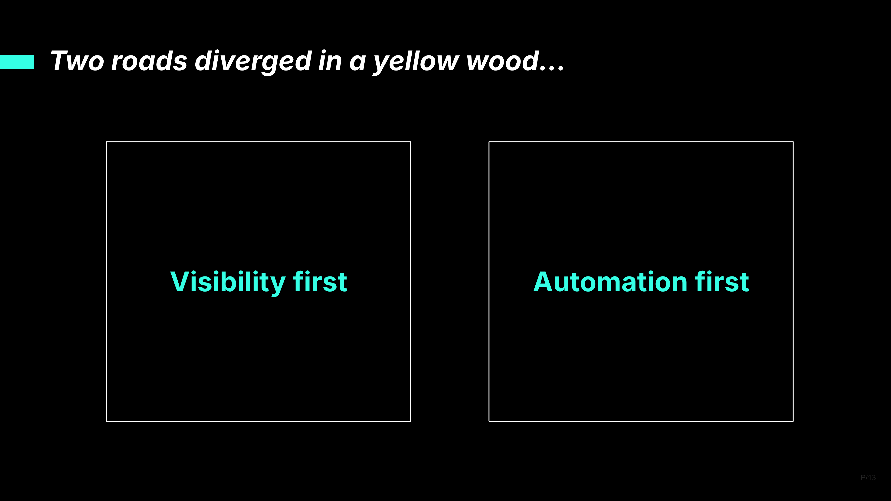
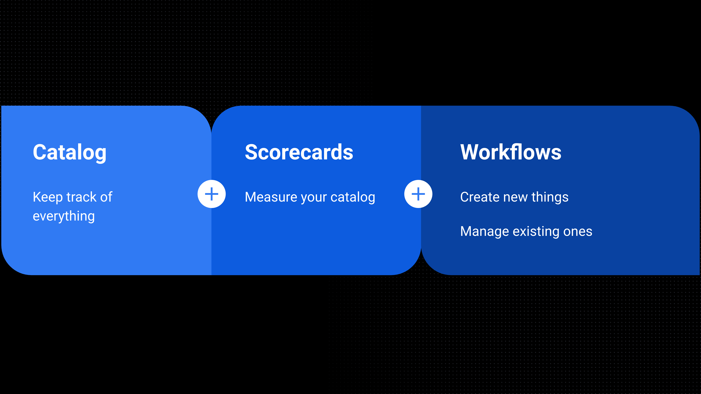
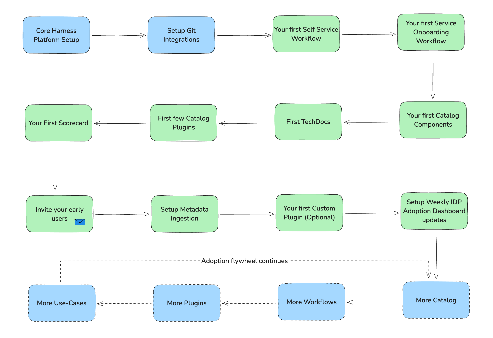

**A step-by-step implementation guide for adopting Harness Internal Developer Portal at scale.**


## Introduction

Harness Internal Developer Portal (IDP) is a unified home for developers to create, manage, and explore software effortlessly. It enables teams to:

- Quickly create software components aligned with organizational best practices.
- Manage existing components with developer-centric views that consolidate service health, deployments, alerts, and documentation.
- Discover internal tools, APIs, and services for enhanced collaboration.
- Measure and enforce maturity standards using Scorecards for Service, DevOps, and Security best practices.

The goal of this playbook is to provide actionable guidance, helping engineering leaders and platform teams achieve a successful IDP rollout.

## Top 10 IDP Use Cases

These are the top 10 standard use-cases that Harness Internal Developer Portal is used for:

| #   | Use Case                                     | Description                                                                                                                   |
| --- | -------------------------------------------- | ----------------------------------------------------------------------------------------------------------------------------- |
| 1   | **Service Ownership Tracking**               | Establish clear accountability by associating services with designated owners, enhancing transparency and reducing ambiguity. |
| 2   | **Workflow Automation**                      | Minimize repetitive tasks by automating processes, eliminating the reliance on "TicketOps."                                   |
| 3   | **Self-Service Application Onboarding**      | Streamline the onboarding process for new applications, reducing delays and errors.                                           |
| 4   | **DevOps Workflow Automation**               | Enable self-service provisioning for repositories and CI/CD pipelines, empowering developers to work autonomously.            |
| 5   | **Self-Service Infrastructure Provisioning** | Offer on-demand infrastructure creation capabilities, reducing bottlenecks.                                                   |
| 6   | **Enhanced Discoverability**                 | Centralize and improve access to internal tools, APIs, and technical documentation.                                           |
| 7   | **Docs-as-Code**                             | Promote collaboration and knowledge-sharing through code-driven documentation processes.                                      |
| 8   | **Service Maturity Enforcement**             | Monitor and enhance service quality with Scorecards evaluating DevOps, security, and service maturity.                        |
| 9   | **Migration Tracking**                       | Gain real-time insights into software migrations across the organization’s catalog, ensuring alignment with strategic goals.  |
| 10  | **Developer Onboarding**                     | Equip new hires with easy access to essential resources, accelerating their ramp-up time.                                     |

Since IDPs have traditionally been built from scratch, there are few other use-cases that can be considered that IDP can address. However, they are often harder to implement and take longer to be adopted by developers.

## Adoption Mindsets



When it comes to adopting an Internal Developer Portal (IDP), organizations generally approach it with one of the two mindsets: the **Platform-First Mindset** or the **Developer-First Mindset**. While both have their merits, our research shows that a Developer-First Mindset leads to significantly higher adoption success.

### Platform-First Mindset

This mindset is driven by the platform engineering team’s desire to standardize and optimize the organization’s developer platform. It often stems from recognizing gaps in existing systems, such as:

- A lack of robust catalogs for service discovery.
- The absence of comprehensive scorecards to measure service or DevOps maturity.
- Poor visibility into CI/CD processes and other observability dashboards.

While these goals are valid and can improve overall efficiency, a Platform-First Mindset risks overlooking the immediate, tangible needs of developers. If the primary focus is on building a portal as part of a broader platform strategy without addressing everyday developer pain points, the adoption may struggle. Projects with this mindset often face challenges such as:

- Limited early engagement from developers due to perceived misalignment with their pain points.
- Feedback loops that highlight a lack of practical utility, resulting in stalled adoption efforts.
- Risk of project abandonment if initial traction and developer buy-in are insufficient.

### Developer-First Mindset ✅

A Developer-First Mindset, on the other hand, focuses on solving the real, day-to-day challenges that developers face. This mindset emphasizes:

- Simplifying application and developer onboarding.
- Reducing friction by automating repetitive tasks.
- Making standards and best practices easily accessible and actionable.

Organizations with this mindset prioritize developer utility and aim to address common pain points, such as overwhelming and fragmented tools and inefficiencies that delay developers’ ability to ship code.

By putting developers at the center, this approach fosters higher engagement and more enthusiastic adoption.

### Recommendation

To achieve maximum success with IDP adoption, you should strive for a Developer-First Mindset. Focusing on developer utility ensures that the portal delivers tangible value to the end users (Developers), making it an indispensable part of their daily workflow. By addressing developer pain points first, you can build trust and momentum, leading to broader adoption and long-term viability.

## Developer Daily Utility



Developer Daily Utility is the most critical metric for IDP adoption, reflecting the portal's integration into developers’ daily workflows. Without frequent engagement, even a well-setup Catalog with all the Plugins, Scorecards and Workflows won’t sustain adoption.

Ensure IDP addresses daily needs of your developers like quick access to services, real-time insights, and simplified workflows. It should also seamlessly connect with existing tools like IDEs and CI/CD pipelines.

Harness tracks "Monthly Active Users" (MAU) as an indicator of engagement. You can find all IDP Adoption details in the built-in dashboard. We highly recommend setting up weekly alerts to this dashboard so that you can keep track of adoption in your inbox.

[Check out IDP Adoption Dashboard](https://developer.harness.io/docs/internal-developer-portal/get-started/how-to-track-adoption/)

## Adoption Flywheel



There are five main phases of a successful rollout of an Internal Developer Portal

1. Research: Understand Why and What
2. Setup: Establish Stakeholders and Metrics
3. Prioritize: Find top problems and early users
4. Deliver: Implementation
5. Assess: Collect feedback and adjust plan

### 1\. Research

The research phase of an IDP is extremely important. The goal of this phase is to understand why your organization needs IDP and what it looks like. Conduct a thorough evaluation of the current development environment, identifying inefficiencies and pain points such as tool fragmentation, lack of visibility or workflow bottlenecks. Focus on high-impact problems that justify adopting an IDP and ensure they align with developer priorities. Avoid adoption driven solely by trends or competitor activities without addressing real challenges.

Pitfalls to avoid:

- Don't look out for an IDP just because you see others in the industry doing so. Identify your own unique challenges in improving developer experience and evaluate if that is one of the top IDP use-cases as defined above.
- Even after identifying DevEx problems, it’s important to understand the frequency and ROI of it. If the problem only occurs once a quarter, once a year, then it’s not good enough. IDP may not be the answer. If the problem is frequent enough that it can become a daily utility, then yes, that's a good sign.

### 2\. Setup

This phase has two main goals

1. Identify owners and stakeholders
2. Identify success criteria and KPIs

#### Owners and Stakeholders

Usually the Internal Developer Portal initiative is owned by the Head of Developer Experience or the Head of Platform Engineering. If these organizations do not exist, then it falls back to the DevOps team. Sometimes, IDPs are also owned by SREs.

You should have 1-2 Platform Engineers who understand the product in depth and have some experience with the Software Development Lifecycle at your organization. These Platform Engineers should go through the IDP Getting Started and understand the basics of how the Harness Platform, Catalog, Scorecards and Workflows work. [https://developer.harness.io/docs/internal-developer-portal/get-started/](https://developer.harness.io/docs/internal-developer-portal/get-started/)

You should also have a Platform Product Manager whose main responsibility is to collect feedback from your Developers, create Roadmap and evangelise solutions that you will launch. In case you do not have a Platform Product Manager, the Engineering Manager/Director can also take up this as a part time responsibility. The key is to ensure there is someone who can create the feedback loop with Developers and other Stakeholders. And it should not be the Platform Engineers implementing IDP.

Once you have identified the central team who will own IDP, you should work very closely with other stakeholders such as

- DevOps (CI/CD)
- Infrastructure
- Engineering Architects
- Application security

You should share responsibilities with stakeholders from these teams and invite them to provide Workflows, create Scorecards and set standards in the IDP. Be inclusive and collaborative with them, otherwise they will create tool fragmentation and impact your IDP rollout.

#### Success Criteria and KPIs

You must measure and track some Developer Experience KPIs which align with your IDP initiative. Monthly Active Users, Onboarding speed and Developer Satisfaction levels are a few examples. If you already have such metrics aligned with the business then use them. You can also start with DORA metrics. If you want to keep things extremely simple, run a bi-annual survey where ask developers to score their productivity from 0-100. We recommend using platforms such as [Harness Software Engineering Intelligence](https://www.harness.io/products/software-engineering-insights) for measuring developer effectiveness.

### 3\. Prioritize

Start small by focusing on a few teams and avoid overpromising features to thousands of developers. You need to identify your early users and understand their top DevEx problems. This product strategy is well explained in [Crossing the Chasm curve](https://en.wikipedia.org/wiki/Crossing_the_Chasm#/media/File:Technology-Adoption-Lifecycle.png) by Geoffrey Moore.

For example, this can be 2 teams, 10 developers each, so 20 people. They might be struggling with one problem that they spend a lot of manual time on. It is common and experienced by other teams as well. They are willing to give you early feedback. One of those problems could be \- let's say, every time they have to debug some customer issue, they need to raise the Jira ticket to get some access or provision some infrastructure or perform a series of tasks. And the whole process takes several hours a week. It would be amazing if the whole thing can be automated while Approval gates are put in place so that Platform Engineers can still monitor and be compliant.

Another use-case could be \- Developers find it overwhelming to manage their JIRA tickets and Pull Requests. Only if there was one place they could go and see all their tickets, PRs they have created and PRs they have to review.

The most common use-case would be \- If developers can find all software they own in one place along with relevant dashboards.

Your early users will not care about the IDP product, but they will care about the problems that you will solve for them. So instead of selling the IDP Product to them, offer solutions that can fit into their daily workflows.

### 4\. Deliver

This is where the majority of work will take place. Using Harness IDP’s Core features such as the Catalog, Self Service Workflows, Plugins, Scorecards and the core Platform which includes the IDP Pipelines \- you can implement a solution, ideally within a week. Ensure you integrate with their existing tools and provide an easy to use experience.

If the work involves setting up Catalog, seek help from the Tech Leads from the team who can provide you with details about the software they own. Don’t try to automate too much and spend a lot of time, just ask and provide repeatable self service patterns.

This approach is similar to how anyone builds features for their customers. Their experience should be your top priority.

### 5\. Assess

Once you have the solution, immediately go back to the teams who gave you the problems. Have them try out the product. This establishes trust with them. If you get good feedback, then congratulations \- you have found sticky users. Get more feedback from them, and now take the use-cases you have implemented to other teams.

Celebrate this early success with other teams and your stakeholders. Build excitement in what you are building and the problems you are solving.

And this kicks off your adoption flywheel. You will continue to expand to more teams and solve more Developer Experience problems.

## Timeline and Rollout Strategy



An iterative approach to IDP adoption ensures continuous improvement and avoids the pitfalls of overcommitment. A suggested timeline includes:

- **First 3 Months**: Engage 25% of target users, focusing on core use cases and quick wins.
- **3–6 Months**: Expand adoption to 50% by incorporating additional use cases and addressing early feedback.
- **6–9 Months**: Achieve 75% adoption through iterative refinements and team-wide rollouts.
- **Beyond 9 Months**: Stabilize utilization at 70–75% across the organization’s developer base.

It’s important to realize that IDP Adoption is best done in cycles with expanded teams and use-cases. It’s NOT a good idea to implement “all” use-cases in 3-6 months and then only release it among developers. This usually does not work as the implementation takes longer and the delayed feedback from developers negatively impacts IDP adoption.

A much more successful approach is to find early adopters and important use-cases. Then release early and release often.

## Visibility-first vs Automation-first



Another interesting observation that we have is the two archetypes of IDP Adopters

- **Visibility-first**: They focus a lot on showing things to users, enhancing discoverability by centralizing documentation, tools, and APIs. As well as creating Scorecards. These are all the “Explore” use-cases.
- **Automation-first**: They focus a lot on simplifying processes by automating workflows and repetitive tasks. These are all the “Create” and “Manage” use-cases.

While all roads lead to Rome, we have seen that customers who are “Automation-first” have higher chances of succeeding. The barrier to entry for an automation-first adopter is much, much lower because you can solve individual use-cases in a progressive manner. But since the barrier to entry is so low, these use-cases are not sticky. For example if you have provided one way to create an infrastructure, you can be pretty sure that the same developer is not creating infrastructure every other day.

Hence it’s important to maintain balance between both Visibility and Automation approaches.



## Golden Path to Adoption: Steps



This is a step-by-step guide for Platform Engineers to onboard IDP. Your mileage may way but avoid skipping any step which is not marked as optional. This will maximize your chances of success in IDP Adoption.

1. **Core Harness Platform Setup**
   1. SSO, Users and User Groups, RBAC, Hierarchy, Secret Manager, Delegate, etc.
   - *Docs and Tutorials for Reference:* [Platform access control](https://developer.harness.io/docs/category/platform-access-control), [RBAC in IDP](https://developer.harness.io/docs/internal-developer-portal/rbac/resources-roles), [Delegates](https://developer.harness.io/docs/category/delegates), [Secrets Management](https://developer.harness.io/docs/category/secrets-management)
2. **Setup Git Integrations**
   - *Docs and Tutorials for Reference:* [Setup Git Integration](https://developer.harness.io/docs/internal-developer-portal/get-started/setup-git-integration)
3. **Your first Self Service Workflow**
   1. Remove TicketOps, focus on quick automation use-cases. Ask your Platform Teams \- what is the most common type of JIRA ticket they receive
   - *Docs and Tutorials for Reference:* [Getting Started with Workflows](https://developer.harness.io/docs/internal-developer-portal/get-started/workflow-quickstart), [Self Service Workflows Overview](https://developer.harness.io/docs/internal-developer-portal/flows/service-onboarding-pipelines)
4. **Your first Service Onboarding Workflow**
   1. Standardize how a new Backend or Frontend application gets created with CI/CD pipelines and infrastructure included
   - *Docs and Tutorials for Reference:* [Create a service onboarding pipeline](https://developer.harness.io/docs/internal-developer-portal/flows/workflows-tutorials/create-a-new-service-using-idp-stage) 
5. **Your first Catalog Components**
   1. Onboard Applications, Services, APIs or Libraries owned by your first users/teams
   - *Docs and Tutorials for Reference:* [Register a Software Component in Catalog](https://developer.harness.io/docs/internal-developer-portal/catalog/register-software-component)
6. **First TechDocs**
   1. Enable TechDocs for one of those applications where documentation is available in markdown.
   2. You can also choose to onboard central documentation such as engineering handbooks if you have those written in Markdown (docs-like-code approach)
   - *Docs and Tutorials for Reference:* [Enable documentation for your Component](https://developer.harness.io/docs/internal-developer-portal/techdocs/enable-docs)
7. **First few Catalog Plugins**
   1. Look at the IDP Plugins Marketplace and enable up to 5 plugins which are the most commonly used tools in your organization.
   - *Docs and Tutorials for Reference:* [List of curated plugins supported in the Internal Developer Portal](https://developer.harness.io/docs/category/available-plugins)
8. **Your First Scorecard**
   1. Create a “Catalog Readiness” Scorecard which can help you ensure that the Catalog entries are fully updated and all annotations required by the Plugins are set
   - *Docs and Tutorials for Reference:* [Getting Started with Scorecards](https://developer.harness.io/docs/internal-developer-portal/get-started/scorecard-quickstart)
9. **Invite your early users ✉️**
   1. Send invites to 10-20 users that you have identified as early adopters. Collect feedback
10. **Setup Metadata Ingestion**
    1. Use Catalog Ingestion API to auto-fill some of the details that your early users don’t want to provide manually
    - *Docs and Tutorials for Reference:* [Catalog Ingestion API](https://developer.harness.io/docs/internal-developer-portal/catalog/catalog-ingestion/catalog-ingestion-api)
11. **Your first Custom Plugin (Optional)**
    1. Create a small widget on the Catalog to show some application metadata which is hard to find today for your developers
    - *Docs and Tutorials for Reference:* [Overview of custom plugins](https://developer.harness.io/docs/internal-developer-portal/plugins/custom-plugins/overview)
12. **Setup Weekly IDP Adoption Dashboard Updates**
    1. Ensure you are subscribed to receive weekly adoption reports from IDP.
    - *Docs and Tutorials for Reference:* [Adoption Dashboard](https://developer.harness.io/docs/internal-developer-portal/dashboard/custom-dashboards)

From this point onwards, onboard more teams, solve newer use-cases, onboard their Catalog Components and build more Workflows!

## Miscellaneous Adoption Tips and Tricks

- Create an internal Slack/Teams channel called **#harness-idp-adoption**. Announce new features and ask users to share feedback (both good and bad).
- No two portals please. Avoiding creating fragmentation for Developers when it comes to their IDP use-cases.
- Onboarding is not the same as Adoption. Onboarding refers to one or more Platform Engineers setting up the tool with Authentication, Authorization and other configuration. Adoption refers to active usage by Developers. Onboarding is a pre-requisite to Adoption.

### Central vs Distributed Catalog definition YAML files

Catalog completeness is key to a successful Internal Developer Portal (IDP). Achieving this requires choosing the right approach for managing `catalog-info.yaml` files. Below, we break down **centralized and distributed strategies** and highlight how Harness IDP tools, like the Create Catalog step and automation scripts, can make onboarding faster and easier. 

#### Centralized Catalog Management:

All catalog definition YAML files are stored in a single, central repository or location. This is made possible by using the `backstage.io/source-location` annotation, which links the catalog entry in the central repository to the actual source repository of the service. Most IDP plugins, including tools like Scorecards, use this annotation to reference the source code, ensuring functionality like documentation, scorecard evaluations, and dependency analysis works seamlessly, even when the YAML file is not colocated with the service.

This flexibility allows organizations to maintain a single, centralized IDP repository for catalog files while retaining the ability to inspect and interact with the source code directly.

Here's an example annotation:

```YAML
## Example catalog-info.yaml
...
annotations:
  backstage.io/source-location: url:https://github.com/org/service-repo
...
```
**Implementation Details:**

1. Repository Setup:

Create a dedicated repository named service-catalog or similar, containing all `catalog-info.yaml` files. Structure the repository with directories representing teams or projects. For example:

```bash
/service-catalog/
  team-a/
    service-a/catalog-info.yaml
    service-b/catalog-info.yaml
  team-b/
    service-c/catalog-info.yaml
```
#### Distributed Catalog Management:

Catalog definition YAML files are stored within each service's own repository, allowing teams to manage their own catalog entries. By colocating the `catalog-info.yaml` file with the service's code, the `backstage.io/source-location` annotation becomes redundant for most operations because the source code and metadata are already in the same repository. If necessary, the `backstage.io/source-location` annotation can be made to point to additional repositories or locations related to the service. 

**Implementation Details:**

1. Repository Setup:

Each service repository should include the `catalog-info.yaml` file at the root or within a dedicated `catalog/` directory. Example:

```bash
/service-repo/
  catalog/
    catalog-info.yaml
```
#### Harness IDP Tools for Catalog Population

1. **Automation Script for Bulk Onboarding:**

Harness provides a [Python script](https://developer.harness.io/docs/internal-developer-portal/catalog/catalog-scripts) that automates the generation and registration of `catalog-info.yaml` files across multiple repositories. This script is particularly useful for organizations aiming to onboard many services simultaneously.

**Key Features of the Script:**

- *Automated YAML Generation:* Scans your repositories to generate catalog-info.yaml files automatically.

- *Batch Registration:* Registers multiple services into the catalog in a single operation.

- *Customization:* Allows filtering repositories using regex patterns to target specific services.

2. Harness IDP’s **[Create Catalog](https://developer.harness.io/docs/internal-developer-portal/flows/idp-stage#4-create-catalog)**, **[Direct Push](https://developer.harness.io/docs/internal-developer-portal/flows/idp-stage#5-direct-push)** and **[Register Catalog](https://developer.harness.io/docs/internal-developer-portal/flows/idp-stage#6-register-catalog)** step allows teams to directly onboard services into the catalog via workflows. 

## Resources and Support

- [Harness IDP Documentation](https://developer.harness.io/docs/internal-developer-portal)
- [Getting Started](https://developer.harness.io/docs/internal-developer-portal/get-started/)
- Ask a Question or Report a Bug using [Harness Support](https://www.harness.io/support)
- Submit feature requests using [Harness Ideas Portal](https://ideas.harness.io)
- [IDP Roadmap](https://developer.harness.io/roadmap/#idp)
- Keep up with [Release Notes](https://developer.harness.io/release-notes/internal-developer-portal) for new feature announcements

By adhering to this playbook, organizations can drive impactful and sustainable IDP adoption, empowering their developers and unlocking significant long-term value. Reach out to us if you have any questions. Feel free to download this content as PDF and re-use internally to talk about Harness IDP.
