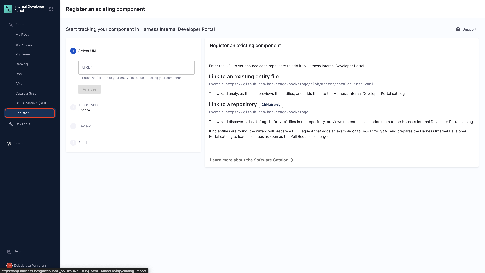
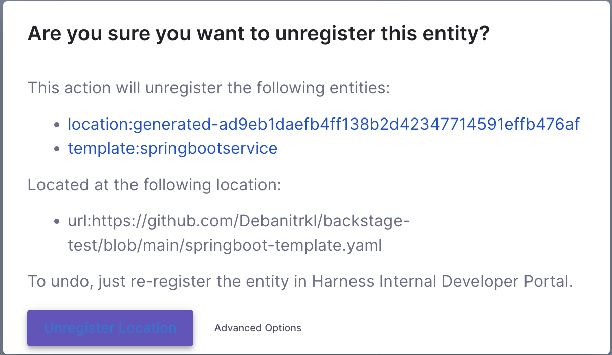

import Tabs from '@theme/Tabs';
import TabItem from '@theme/TabItem';


<Tabs queryString="version">
<TabItem value="IDP 2.0 (New)" label="IDP 2.0 (New)">

:::tip For IDP 2.0 Customers
If you're using Harness IDP 2.0, please ensure you have reviewed the [IDP 2.0 Overview guide](/docs/internal-developer-portal/idp-2o-overview/2-0-overview-and-upgrade-path.md) and are familiar with the key steps for [upgrading to IDP 2.0](/docs/internal-developer-portal/idp-2o-overview/migrating-idp-2o.md). To enable IDP 2.0, you must raise a support ticket to activate the `IDP_2_0` feature flag for your account.
:::


The **Software Catalog** is a centralized registry of all your software assets — including components, services, websites, libraries, data pipelines, and more. Think of it as a curated directory of your **entities**, helping you efficiently track ownership, metadata, and dependencies across your software ecosystem.

This guide walks you through the key changes introduced in IDP 2.0 and explains how to navigate the Catalog by creating and managing entities.

## What’s New in IDP 2.0?

Harness IDP 2.0 introduces a major upgrade to the Software Catalog. Built on a Harness-native data model, it is designed to support enterprise-scale needs with robust access control. Key improvements include:

* **Harness-native Platform Hierarchy:** Entities now support Account, Org, and Project scopes with fine-grained RBAC controls.
* **No YAML Required:** Entities can be created and managed entirely via the UI—no manual YAML editing or GitOps needed.
* **Revamped UI:** A modern interface featuring updated Catalog tables, advanced filtering, smooth navigation, and inline entity creation.

## Prerequisites (IDP 2.0)

Before using the Software Catalog in IDP 2.0, ensure:
* You have reviewed the **[IDP 2.0 Overview](/docs/internal-developer-portal/idp-2o-overview/2-0-overview-and-upgrade-path.md)** and **[Upgrading to IDP 2.0](/docs/internal-developer-portal/idp-2o-overview/migrating-idp-2o.md)** guide. 
* **IDP 2.0** is enabled behind the `IDP_2_0` Feature Flag. Contact [Harness Support](https://support.harness.io) to enable it on your account.
* You are familiar with the **[Catalog Data Model](/docs/internal-developer-portal/catalog/data-model.md)** and **[Catalog YAML](/docs/internal-developer-portal/catalog/catalog-yaml.md)** structure.

## Create an Entity (IDP 2.0)

In IDP 2.0, entity creation is simplified with full UI support and optional YAML-based creation. Entities are now “inline,” which means their entire lifecycle can be managed through the UI or API, without Git integration.

There are two ways to add and create a new entity in your catalog:
- **Create an entity via the Harness IDP UI**:
Use the **Harness UI** to create entities directly—no YAML required. This method offers a streamlined, code-free experience for adding entities.
- **Create an entity using your catalog YAML**:
You can still create entities using your **existing catalog YAML** files. Harness will automatically convert **legacy Backstage YAML** into the new Harness Catalog Entity Model and register the corresponding entity.


Let’s walk through both methods using a **Component** entity as an example:

  <Tabs groupId="creating Entity">
    <TabItem value="UI" label="Harness IDP UI">

To create a **Component** via the UI:

1. Navigate to the Harness IDP portal and click **“Create”** in the sidebar.
2. Select **Component** from the available options.
3. You’ll enter the **Visual View**, where you can fill out entity details interactively.
> Ensure your `identifier` follows [naming rules](https://developer.harness.io/docs/platform/references/entity-identifier-reference/#identifier-naming-rules). Invalid identifiers may lead to entity registration errors.


:::note
To set the owner identity, type a few characters in the Owner field to search and select a user or group from the dropdown; if no match appears, set yourself as the owner or enter any string and click `Add <arbitrary_string> as a new owner`.


:::
4. Specify the **Entity Scope** (Account, Org, or Project). For this example, choose **Account scope**. [Read more about Catalog RBAC](/docs/internal-developer-portal/rbac/catalog-rbac.md).

5. You now have two options for managing your Component configuration:
    * **Inline (default):** Manage the Component YAML directly within Harness.
    * **Remote:** Choose to store your Component YAML in a Git repository for version control, collaboration, and change tracking.
    You can either use a **Harness Code Repository** or connect to a **Third-party Git provider** like GitHub or GitLab by selecting a Git connector, repository, branch, and YAML path.
    
    > The Git Experience is ideal for teams who prefer to manage Components as code, with full version control and Git-native workflows. The changes are reflected in both YAML and execution views, via a [webhook](/docs/internal-developer-portal/git-experience/gitx-journey#workflow-execution-visibility-and-webhook-requirement) which is automatically configured on the Git connector. Learn more in the [Git Experience Journey documentation](/docs/internal-developer-portal/git-experience/gitx-journey).
6. Click **“Review YAML”** to view the synchronized YAML. Changes in the Visual View reflect live in the YAML View.

:::info
  **Note:** **YAML validation** is performed to ensure compatibility with the **Harness-native Catalog YAML** model. Any errors will be shown in the Validation logs.

  
  :::

7. If applicable, configure a plugin by referring to its documentation and adding the necessary **annotations** in the Catalog YAML.


8. Once completed, click **“Create Component”** to finalize and register the entity.


> ⚠️ **Note:** Ensure your `identifier` follows [naming rules](https://developer.harness.io/docs/platform/references/entity-identifier-reference/#identifier-naming-rules). Invalid identifiers may lead to entity registration errors.

  </TabItem>

  <TabItem value="YAML" label="Catalog YAML">

To create a Component using Catalog YAML:

1. Navigate to **Create** in the sidebar, and select **Component**.
2. In the **Visual View**, switch to **YAML View** via the toggle at the top.
   
3. Provide the YAML directly for the entity which you want to create in IDP. 
<details>
<summary>Example YAML</summary>
```yaml
apiVersion: harness.io/v1
kind: component
name: artist-web
identifier: artistweb
type: service
owner: user:account/shibam.dhar@harness.io
spec:
  lifecycle: production
metadata:
  tags:
    - java
  description: place to be for artists
```
</details>

> You can even paste your existing Backstage YAML if available. Harness will auto-convert it into the native format.


> ⚠️ **Note:** Ensure your `identifier` follows [naming rules](https://developer.harness.io/docs/platform/references/entity-identifier-reference/#identifier-naming-rules). Invalid identifiers may lead to entity registration errors.

:::note
You can always set the owner identity using your email ID, a group name, or any custom string that fits. Just type the value directly in the owner field. If it’s a group name it will auto resolve to the group ID or it will assign an arbitrary string.

:::

4. Define the **scope** of the entity in two ways: either switch to the Visual View and select the desired scope, or specify the **[projectIdentifier](/docs/internal-developer-portal/catalog/catalog-yaml.md#projectidentifier)** or **[orgIdentifier](/docs/internal-developer-portal/catalog/catalog-yaml.md#orgidentifier)** directly in the YAML to set the project or organization scope.

5. You now have two options for managing your Component configuration:
    * **Inline (default):** Manage the Component YAML directly within Harness.
    * **Remote:** Choose to store your Component YAML in a Git repository for version control, collaboration, and change tracking.
    You can either use a **Harness Code Repository** or connect to a **Third-party Git provider** like GitHub or GitLab by selecting a Git connector, repository, branch, and YAML path.
    
    > The Git Experience is ideal for teams who prefer to manage Components as code, with full version control and Git-native workflows. The changes are reflected in both YAML and execution views, via a [webhook](/docs/internal-developer-portal/git-experience/gitx-journey#workflow-execution-visibility-and-webhook-requirement) which is automatically configured on the Git connector. Learn more in the [Git Experience Journey documentation](/docs/internal-developer-portal/git-experience/gitx-journey).
6. Add any plugin configurations by including the relevant **annotations**.
7. Click **“Create Component”** to complete the process and register your entity.

  </TabItem>
</Tabs>


## Delete an Entity (IDP 2.0)

You can remove any entity from the Catalog using the steps below:

1. Open the Software Catalog and locate the entity to delete.
2. Click the three-dot menu on the entity card or details view.
3. Select **Delete** from the dropdown. The entity will be permanently removed.


## Next Steps (IDP 2.0)

Now that you've learned how to create, populate, and delete Catalog entities, here’s what to explore next:

1. Deep dive into the **[Catalog Data Model](/docs/internal-developer-portal/catalog/data-model.md)** to understand entity types and relationships.
2. Learn the structure of **[Catalog YAML](/docs/internal-developer-portal/catalog/catalog-yaml.md)** and how to author compliant definitions.
4. Customize and manage a **[custom Catalog UI](/docs/internal-developer-portal/catalog/catalog-ui.md)** for tailored workflows.
5. Learn how to **[configure RBAC](/docs/internal-developer-portal/rbac/catalog-rbac.md)** for Catalog entities. 

</TabItem>
<TabItem value="IDP 1.0" label="IDP 1.0">

In Harness IDP, software components represent entities within your organization's ecosystem, such as services, libraries, APIs, or other resources. These components are defined in a `catalog-info.yaml` file, which describes their metadata, ownership, relationships, and lifecycle.

Let's start by adding your software components to IDP. To do this, create a `catalog-info.yaml` file in your Git repository and register its URL to add the component to your catalog.

<DocVideo src="https://www.youtube.com/embed/YgtIMDGMzJE?si=AYnisVn-lHX-4STw" />

## Create a new catalog-info.yaml (IDP 1.0)

1. To add a software component, you need to create a `catalog-info.yam` file in its repository. In the case of a mono-repo, this file should be created at the root of the repository. While the file can technically reside anywhere (e.g., `.harness/catalog-info.yaml`), placing it in a standard location ensures consistency. You can use the following YAML code as a template:

```YAML
apiVersion: backstage.io/v1alpha1
kind: Component
metadata:
  name: my-new-service
  description: Description of my new service
  tags:
    - java
  links:
    - url: https://admin.example-org.com
      title: Admin Dashboard
      icon: dashboard
      type: admin-dashboard
spec:
  type: service
  lifecycle: production
  owner: team-a
  system: project-x
```

Following are the key fields that you must update:

- `metadata.name`. This should be a unique name for your component. Usually, it is the name of the service.
- `metadata.description` - A description for your new component.
- `spec.type` - The new software component could be a `service`, `library`, `website`, or any other type.
- `spec.owner` - The user group identifier of the team that owns the component.

2. Once the file is created in your Git repo, copy the full URL to the file. For example, `https://github.com/harness-community/idp-samples/blob/main/catalog-info.yaml`.

## Register the software component (IDP 1.0)

1. Next, navigate to your Harness IDP module, and from the left navigation menu, select **Register**.



<Tabs queryString="Git-Provider">
<TabItem value="other-git-provider" label="Other Git Providers">

2. Enter the URL to your new `catalog-info.yaml`.


</TabItem>
<TabItem value="harness-code-repo-enabled" label="Harness Code Repository">

2. Copy the URL for `catalog-info.yaml` and paste it on the field to Register the component. 


</TabItem>
</Tabs>

3. Select **Import**.


The new component will be available in your catalog.


 

## Delete/Unregister Software Components (IDP 1.0)

1. Navigate to the Catalog page and select Component under Kind. Here, we will deregister the software component registered above.


2. Select the component name you want to Unregister from the list
3. Now on the component overview page, click on the 3 dots on top right corner and select **Unregister Entity**.


4. Now on the Dialog box select **Unregister Location**.



5. This will delete the software component.

## Troubleshooting (IDP 1.0)

#### Failed to register

If, after registering an entity, you're unable to find the same in your catalog, check the Devtools Plugin for Unprocessed Entities. If it's under the **Pending** tab, wait a few minutes for registration to complete. If it's under the **Failed** tab. Try re-registering the entity.


#### Missing required fields/Invalid YAML schema.

In case of a `InputError`, check for `missingProperty` details and add the required property to your `catalog-info.yaml`.


</TabItem>
</Tabs>


