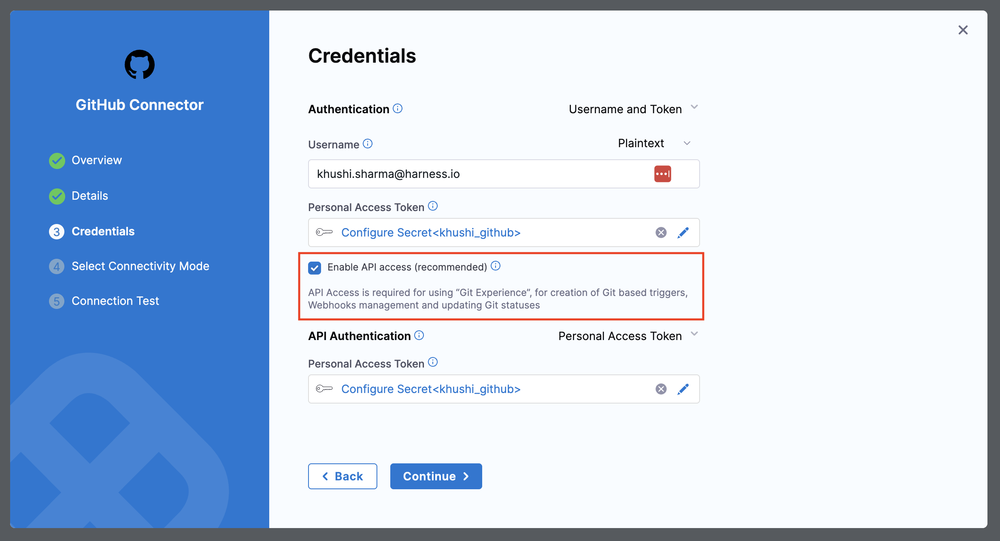

import DocImage from '@site/src/components/DocImage';
import DocVideo from '@site/src/components/DocVideo';
import Tabs from '@theme/Tabs';
import TabItem from '@theme/TabItem';

## Import Entities from Git

In Harness IDP, you can create new entities by importing their YAML definitions stored in Git repositories directly into Harness IDP. This feature allows teams to reuse pre-defined configurations, onboard services faster, and migrate from existing repositories.

---

### Prerequisites

Before you begin, ensure:
- You have a Git connector configured in Harness IDP (Harness Code Repository, GitHub, GitLab, Bitbucket, or Azure Repos) to import your entity YAMLs. Go to [Configure Git Connector](https://developer.harness.io/docs/platform/connectors/code-repositories/connect-to-code-repo) to learn more. 
- **API Access is enabled** for your Git connector (required for Harness Git Experience). For connection types where API access is not enabled by default, you must enable it from the Git connector settings. Refer to [enable API access](https://developer.harness.io/docs/platform/connectors/code-repositories/ref-source-repo-provider/git-hub-connector-settings-reference#enable-api-access).

---

### Import an Entity from Git

To use the Import from Git feature in IDP 2.0, **Backstage YAML is not supported directly**. Since IDP 2.0 uses a new data model, existing YAMLs from IDP 1.0 (Backstage-native) must be converted. To learn more about converting IDP 1.0 YAMLs to IDP 2.0 YAMLs, go to [Converting IDP 1.0 YAMLs](/docs/internal-developer-portal/catalog/catalog-yaml.md#converting-existing-entity-yamls-idp-20).

To learn more about entity scope rules, connector constraints, and advanced import options, go to [Import Entity in Harness IDP](/docs/internal-developer-portal/catalog/import-entity).

<Tabs>
<TabItem value="Interactive Guide">

<DocVideo src="https://app.tango.us/app/embed/e6bb7067-f9f0-4280-ab71-9571d476936b" title="Import a Workflow from Git using a YAML" />

</TabItem>
<TabItem value="Step-by-Step">

#### Step 1: Navigate to Import

1. Go to **Harness IDP** → **Create**
2. At the bottom of the page, find the option to create a new entity by importing YAML from Git. 
3. Click on **Import from Git**

#### Step 2: Select Entity Scope

1. Select the **Entity Scope** (Account, Organization, or Project level)
2. The scope you select determines where your entity will be created. 

:::warning Important
Make sure your imported YAML includes the appropriate scope identifiers (`projectIdentifier` and `orgIdentifier`) — otherwise, it will result in an error.
:::

#### Step 3: Choose Git Provider

Select your Git provider type:

**Option A: Harness Code Repository**

If using Harness Code Repository, provide the following details:
- **Repository**: Git repository where your entity YAML is stored
- **Git Branch**: Branch of your repository where your entity YAML is stored
- **YAML Path**: Path to your YAML file

**Option B: Third-Party Provider**

If using a third-party Git provider (GitHub, GitLab, Bitbucket, Azure Repos), provide:
- **Git Connector**: Git connector configured in your Harness IDP
- **Repository**: Git repository where your entity YAML is stored
- **Git Branch**: Branch of your repository where your entity YAML is stored
- **YAML Path**: Path to your YAML file

#### Step 4: Import the Entity

1. Review the details you've entered.
2. Click **Import**
3. The entity will be created in your IDP directly from the YAML file stored in Git

</TabItem>
</Tabs>

