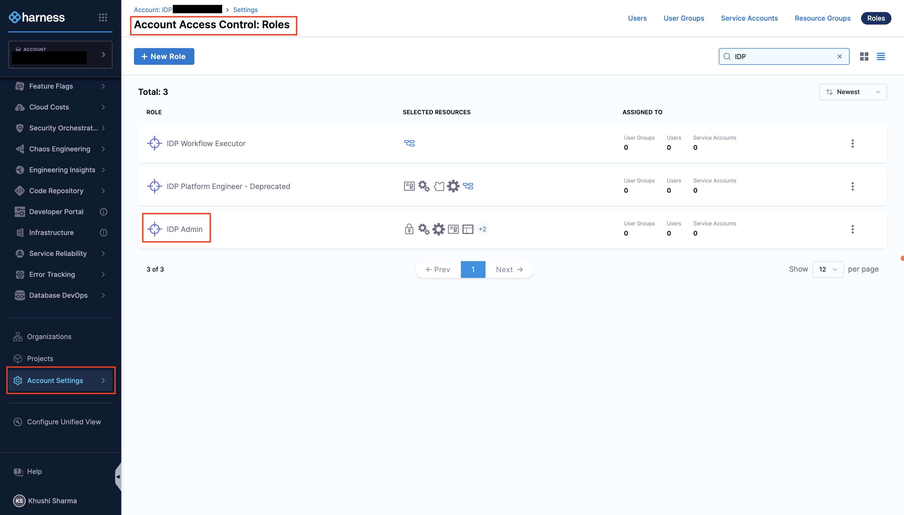

import RedirectIfStandalone from '@site/src/components/DynamicMarkdownSelector/RedirectIfStandalone';

<RedirectIfStandalone label="Step 1: Configure Git Integrations" targetPage="/docs/internal-developer-portal/get-started"/>

import Tabs from '@theme/Tabs';
import TabItem from '@theme/TabItem';

This guide will walk you through the first steps of onboarding to Harness IDP, including enabling the module, configuring Git connectors, populating your catalog, and importing Harness entities.

---

## Before you begin

### Provision the IDP admin role 

- **Harness IDP** must be provisioned for the given account.
- Only users with the **Harness Account Admin** role or assigned **IDP Admin** role can configure IDP. Go to [Assign Roles and Resource Groups](/docs/platform/role-based-access-control/add-user-groups#assign-roles-and-resource-groups) to assign roles.

---

## Configure Git integrations
You land on the IDP module by navigating from the sidebar after logging into your Harness account. We strongly recommend users to follow the onboarding guide by selecting **Get Started**, for a seamless onboarding resulting in a catalog with software components.

<DocVideo src="https://app.tango.us/app/embed/e910ff06-1277-4812-aed3-0f5c7f70bc8d?skipCover=true&defaultListView=false&skipBranding=false&makeViewOnly=true&hideAuthorAndDetails=true" title="Start Internal Developer Portal in Harness" />

Now that you are on the onboarding wizard, let us get started with setting up Git connectors to onboard the software components.

### Setup Git connectors

The software components in IDP are defined using YAML files, which are typically stored in your Git repositories. Configuring a connector for these Git providers is essential to fetch and manage these YAML files.

The following Git providers are supported:

- [Harness Code Repository](https://www.harness.io/products/code-repository)
- GitHub ([Cloud](/docs/platform/connectors/code-repositories/connect-to-code-repo#connect-to-github) & [Enterprise](https://docs.github.com/en/enterprise-server@3.14/admin/overview/about-github-enterprise-server))
- [GitLab](/docs/platform/connectors/code-repositories/connect-to-code-repo#connect-to-gitlab) (Cloud & Self Hosted)
- [Bitbucket](/docs/platform/connectors/code-repositories/connect-to-code-repo#connect-to-bitbucket)

> **Note:** Multiple Connectors with different hostnames can be used for a single Git Provider at once. While setting up the connector, both Account & Repo type URLs are supported. Connection through Harness platform and delegate is supported.

<Tabs>
<TabItem value="Interactive Guide">

<DocVideo src="https://app.tango.us/app/embed/76371411-0ce5-49f6-82f8-7aa90098d559?skipCover=true&defaultListView=false&skipBranding=false&makeViewOnly=true&hideAuthorAndDetails=true" title="Configure Git Connectors" />

</TabItem>
<TabItem value="Step-by-Step">

#### Set up Git connectors

1. Select **Harness Code Repository** if enabled, or choose your preferred **Git Provider** from the available options.
2. From the dropdown under **Select Connector**, either select an already present connector or create **+New Connector**.
3. Configure the Connector as per the [documentation](/docs/platform/connectors/code-repositories/connect-to-code-repo).
4. Select **Apply Selected** to use the connector.
5. After the connection test runs, select **Finish** to save the connector.

</TabItem>
</Tabs>

---

## Next steps

Now that you have completed the initial setup:

- [Create and manage catalog entities](/docs/internal-developer-portal/catalog/overview)
- [Set up workflows for self-service](/docs/internal-developer-portal/flows/overview)
