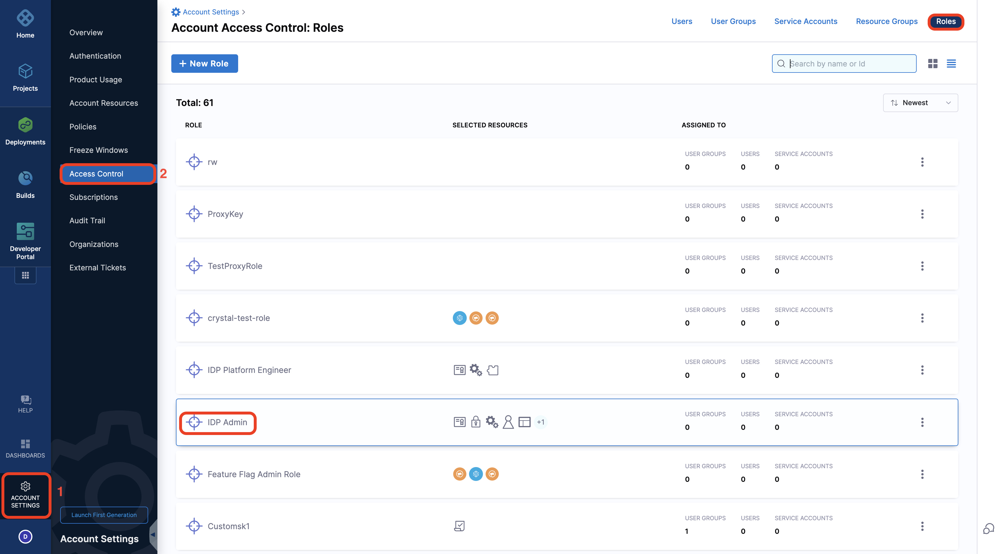
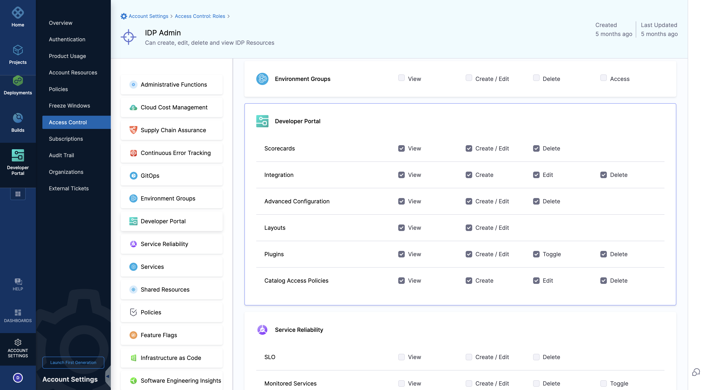
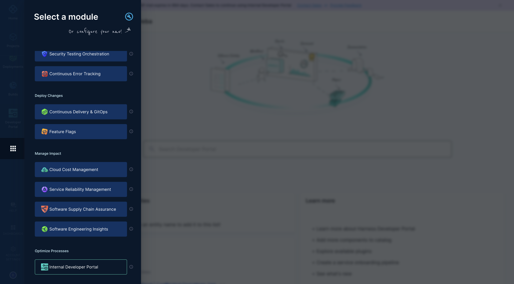
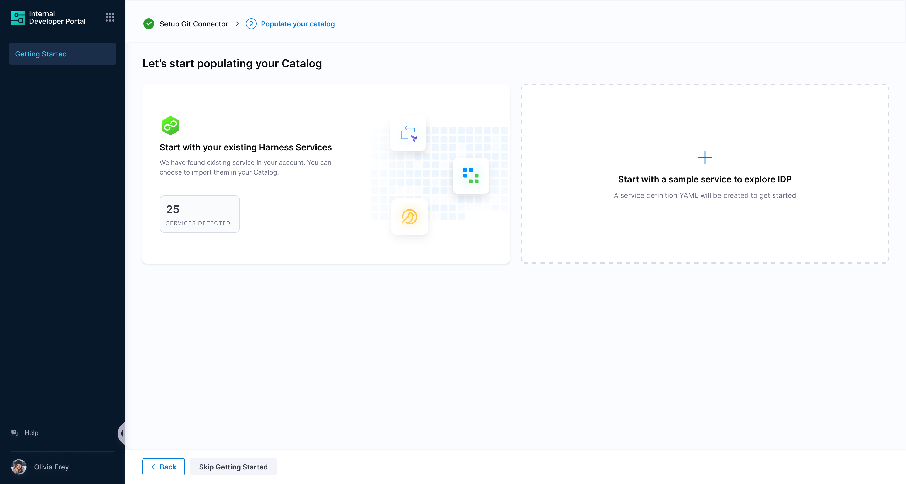
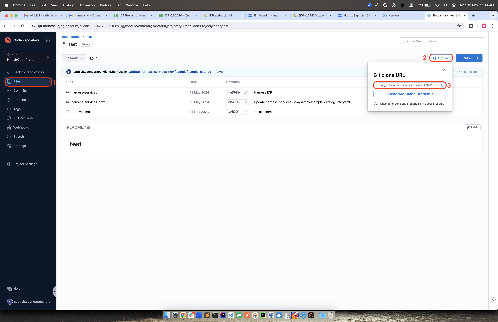
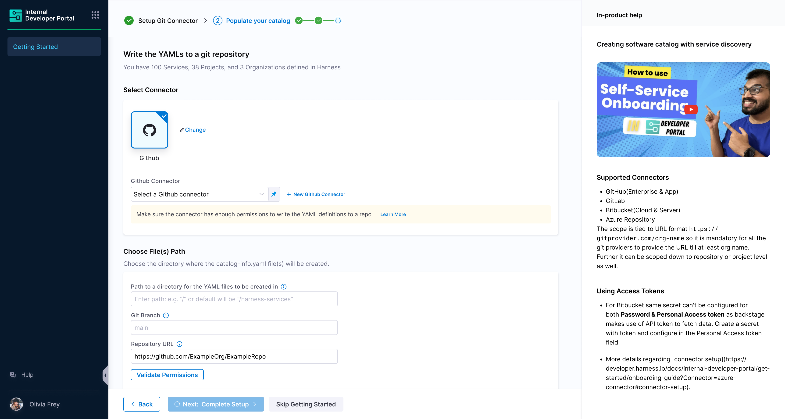
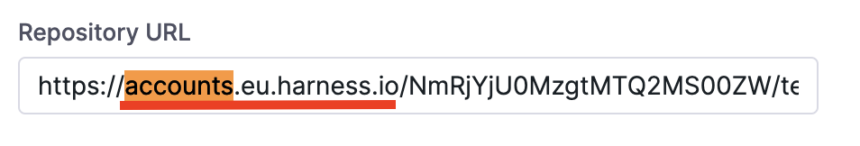
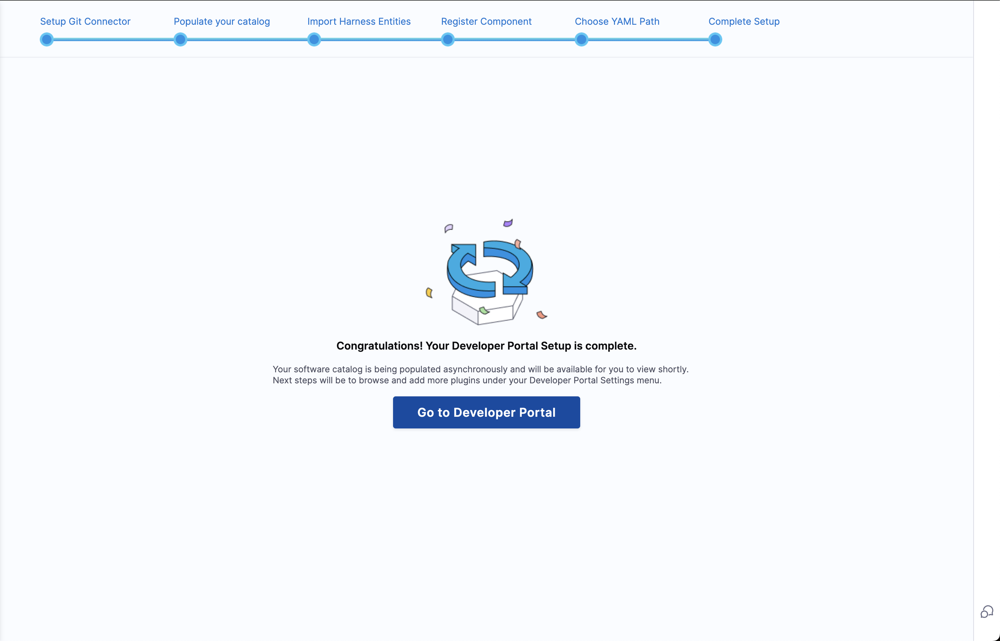
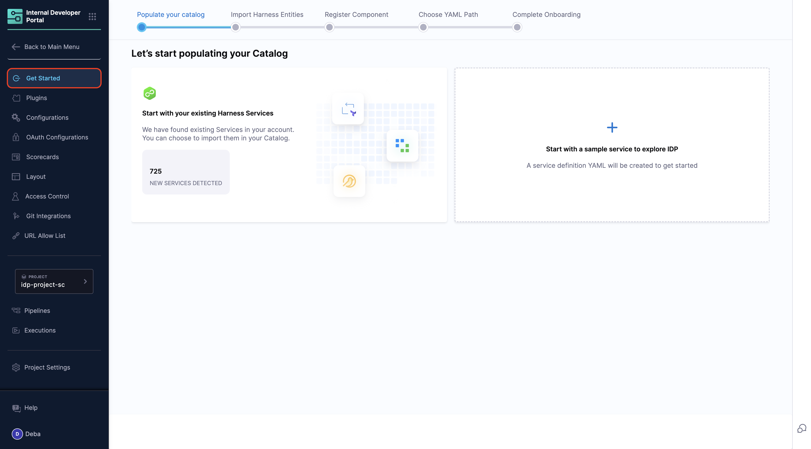

## Prerequisites
Ensure your team is ready for IDP 2.0 onboarding by reviewing the [breaking changes](/docs/internal-developer-portal/idp-2o-overview/2-0-overview-and-upgrade-path.md) list and understanding the key [essentials of upgrading to IDP 2.0](/docs/internal-developer-portal/idp-2o-overview/migrating-idp-2o.md).

> ⚠️ Rollback is not straightforward, so it's critical to thoroughly understand the scope and impact of these changes.

## Enabling IDP 2.0 

Once you're confident about upgrading:

* **Submit a Support Ticket**: 
  Raise a ticket with [Harness Support](https://support.harness.io) to enable the `IDP_2_0` feature flag on your account.

* **Join an Upgrade Call (Early Access Customers)**: 
  Our team will schedule a call with you to walk through the upgrade process and enable the feature flag.

* **Enable in a Test Environment First (Recommended)**: 
  If you have a **test or staging environment**, enable IDP 2.0 there first. This allows your team to safely explore the new experience before enabling it in production.

## Pre-requisites

- IDP must be provisioned for the given account.
- Only users with the **Harness Account Admin** role or assigned **IDP Admin** role can configure IDP. Here's the detailed [documentation on how to assign roles](https://developer.harness.io/docs/platform/role-based-access-control/add-user-groups/#assign-roles-and-resource-groups)

## Getting Started

1. You land on the IDP module by navigating from the sidebar after logging into your Harness account. We strongly recommend users to follow the onboarding guide selecting the **Get Started**, for a seamless onboarding resulting in a catalog with software components.

2. Now that you're on the onboarding wizard, let's get started with setting up Git connectors to onboard the software components.

## Connector Setup

The software components in IDP are defined using YAML files, which are typically stored in your git repositories hence configuring a connector for these git providers is essential to fetch and manage these YAML files.

The following set of git providers are supported:

- [Harness Code Repository](https://www.harness.io/products/code-repository)
- GitHub ([Cloud](https://developer.harness.io/docs/platform/connectors/code-repositories/connect-to-code-repo#connect-to-github) & [Enterprise](https://docs.github.com/en/enterprise-server@3.14/admin/overview/about-github-enterprise-server))
- [GitLab](https://developer.harness.io/docs/platform/connectors/code-repositories/connect-to-code-repo#connect-to-gitlab) (Cloud & Self Hosted)
- [Bitbucket](https://developer.harness.io/docs/platform/connectors/code-repositories/connect-to-code-repo#connect-to-bitbucket)

### Setting up Git Connectors

1. Select **Harness Code Repository** if enabled, or choose your preferred **Git Provider** from the available options.

2. From the dropdown under **Select Connector** either select an already present connector or create **+New Connector**.
3. Configure the Connector as per the [documentation](https://developer.harness.io/docs/platform/connectors/code-repositories/connect-to-code-repo).
4. Select **Apply Selected** to use the connector.
5. After the connection test runs, select Finish to save the connector.

## Onboarding Path

After setting up the connector, you'll be presented with two onboarding paths:

### Import Harness Services

- This option imports all the services from your Harness account into IDP. This includes all the services from all the projects in your account.
- The services are imported as **Component** entities in IDP. The metadata for these entities is derived from the service configuration in Harness.
- The entities are created with metadata including Name, Description, Owner, Type, and Lifecycle stage.
- Once imported, you can view and manage these entities in the IDP catalog.

**For Harness Code Repository:**
- **Repo Path** - Go to the Code Repository and under files select **Clone** and copy the repository path.

**For Other Git Providers:**
- **Connector** - Select the connector of the git provider you want to use.
- **Repo** - Enter the full path to your repo. Example: `https://github.com/user-name/onboarding-test.git`
- The provided repo URL should belong to the same organization/project for which the connector has been setup.
- Path - Defaults to harness-services. Can be changed as well.

### Start with Sample Service

- User will be shown a demo service metadata in the form of the `catalog-info.yaml`.

- This will be added to the git provider with the same configuration options as above.

**For Harness Code Repository:**
- **Connector** - The connector is selected by default.
- **Directory Path** - Give a path for the directory in which you want to write the `catalog-info.yaml` files.

- **Repo Path** - Go to the Code Repository and under files select **Clone** and copy the repository path.

> **Note:** Once you copy the repository path replace the `git.eu.harness.io` with `accounts.eu.harness.io`.

**For Other Git Providers:**
- Same configuration as described in the Import Harness Services section.
- Provided repo should exist with a valid default HEAD branch.
- Branch - Can be new branch / some existing branch. In both cases, the commit will be done on top of the base HEAD branch.

## Create and Register Entities

- Once the required details are entered and submitted for importing, we will push the generated entity YAML files to the repo and path provided.
- You will see two commits - one during the sync process and another asynchronously, which will consist of remaining entities pushed in an asynchronous manner.
- The time frame for asynchronous operation (second commit) will depend on the repo size and number of revisions the provided repo has.
- In the background, the catalog are also imported into IDP along with their associated configs.

## Catalog

- User can navigate to the IDP homepage to get started. Catalog will start showing up software components once the asynchronous operation is completed.
- Since during the onboarding flow Harness will not be able to discover the complete metadata of the entity, the **owner** field will be set to **Unknown**.
- As part of the IDP provisioning, Harness users and groups are imported to IDP. With this in place, customers can start editing the catalog info YAML definition to update the owner for each entity.

- Post onboarding, users can import any number of entities into Harness IDP using the [register component flow](https://developer.harness.io/docs/internal-developer-portal/catalog/register-software-component). This flow expects you to provide the complete URL where the entity definition is stored.

## Onboard Services Post Getting Started

- You can add new services to the IDP after the initial onboarding flow. Simply navigate to **Admin**, select **Get Started**, and you'll find the Onboard Service Wizard available for use.

## Recommendations

If you're using GitHub connector, you can go with App based authentication which provides higher number of API requests in an hour window for your catalog to be in sync with the latest updates without resulting in rate limit error. Read more about [GitHub Apps](https://docs.github.com/en/apps/creating-github-apps/setting-up-a-github-app/rate-limits-for-github-apps)
