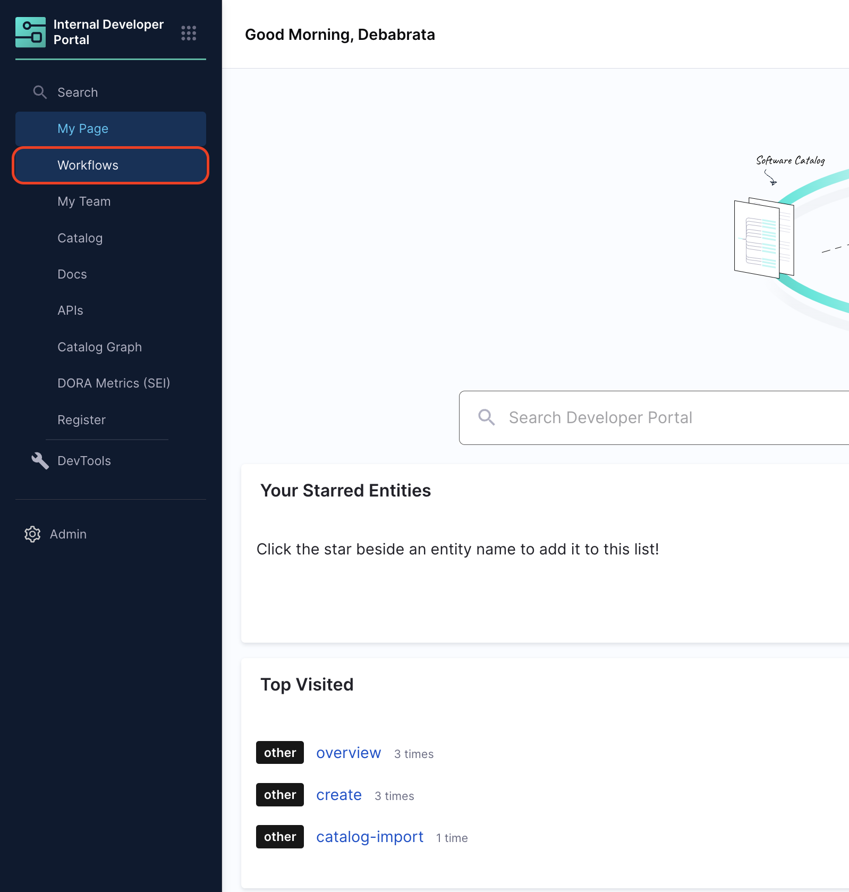
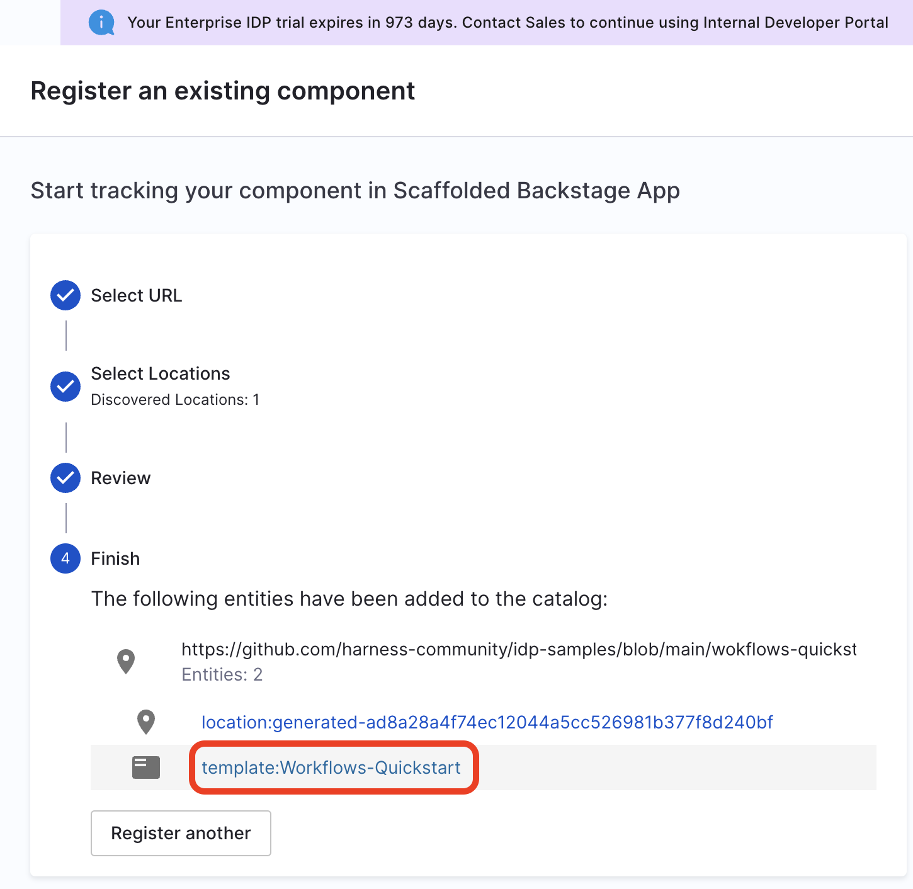
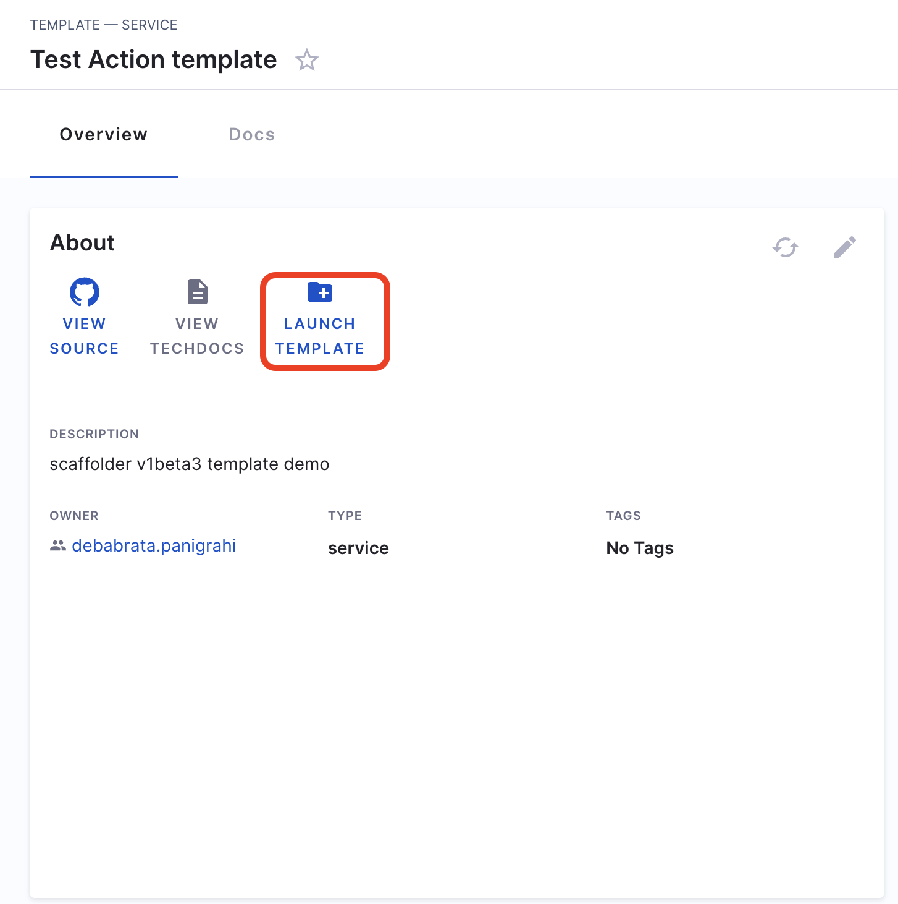
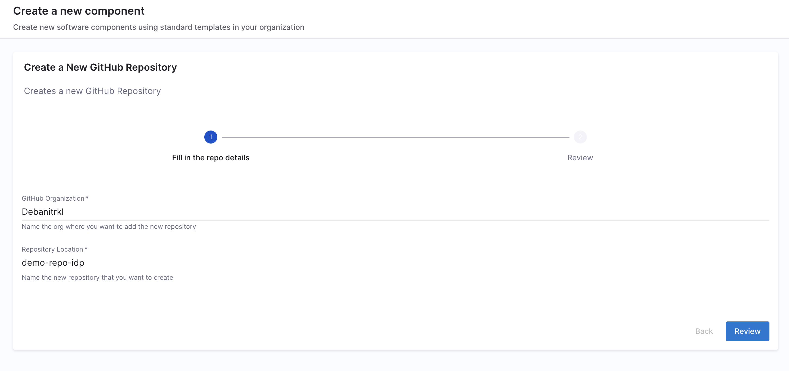
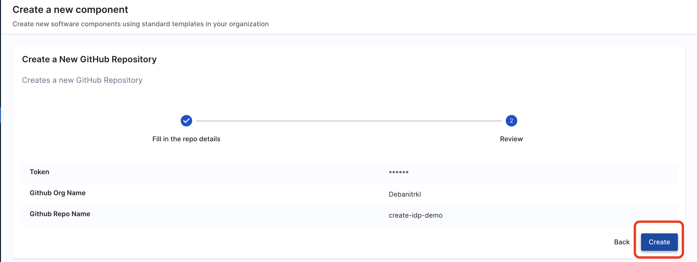

**Service and Infrastructure onboarding** in today's world is slow, manual and tedious. Developers often spend days—or even weeks—setting up new software and completing Day-2 operations. This inefficiency arises from either waiting for ticket resolutions (TicketOps) or manually handling repetitive tasks, which results in a poor developer experience and decreased productivity.

Harness IDP addresses these challenges with **Self-Service Workflows**.

Workflows enable developer self-service by automating manual tasks and processes. Using Workflows, platform engineering teams can:
- Automate new service onboarding.
- Simplify Day 2 operations for developers.
- Provide developers with **golden paths** to production that include guardrails and best practices.

This quickstart tutorial will guide you through setting up a Workflow in IDP to automate GitHub repository onboarding for users. While this tutorial uses GitHub as the git provider, the same steps can be applied to other git providers as well.

:::info
This tutorial is designed for **IDP 1.0**. If you're using **IDP 2.0**, please refer to the IDP 2.0 documentation for updated workflows and processes.
:::

## Prerequisites (IDP 1.0)

Before you begin, ensure you have the following:

1. **GitHub Account**: You need a GitHub account and organization where repositories will be created.
2. **Harness Account**: Access to Harness with IDP enabled.
3. **GitHub Personal Access Token**: A token with repository creation permissions.
4. **Basic understanding** of Harness Pipelines and IDP concepts.

## Tutorial: Create a GitHub Repository Workflow

### Step 1: Add Connector

1. In your **Harness Account** go to **Connectors** under **Project Setup**.

2. **Create a Connector** for your **GitHub Account** where you want to create the new repository. 

3. Now Create a **Personal Access Token** for your **GitHub Account** by following the steps mentioned in the [Documentation](https://docs.github.com/en/authentication/keeping-your-account-and-data-secure/managing-your-personal-access-tokens#creating-a-personal-access-token-classic) and use it to authenticate the connector.

### Step 2: Create Variables

1. Now once the connector is tested successfully, navigate to **Pipeline** and start with **Create a Pipeline**.


2. Now start with **Create a Pipeline**.


3. Add a **Name**, select the type as **Inline** and **Continue**.


4. **Add Stage** and **Select Stage Type** as **Developer Portal**. 


5. Select the infrastructure as **Harness Cloud**. 


6. Now under **Execution** add the **Create Repo** step. 

7. Add a **Name** and **Timeout** for the step. 

8. Select **GitHub** as **Git Provider**.

9. Add the **Connector** you created [above](#add-connector).

10. Now under **Organization** and **Repository Name** add the variables you created as **Expressions** (`<+pipeline.variables.github_org>` and `<+pipeline.variables.github_repo>`).

11. Add a **Repository Description**, **Apply Changes**. 


12. **Save** the pipeline.

13. Now create **Pipeline Variables** by navigating to the right side nav **Variables**.


14. Now **Add Variable** for both `github_org` and `github_repo` and set them as **Runtime Inputs**.


15. **Save** the Pipeline and copy the **Pipeline URL**.

### Step 3: Create the Workflow YAML

The following is the example Workflow with [Workflows Action](https://developer.harness.io/docs/internal-developer-portal/flows/custom-actions#1-triggerharness-custom-pipeline) to create a new repository. 

```YAML
apiVersion: scaffolder.backstage.io/v1beta3
kind: Template
# some metadata about the template itself
metadata:
  name: Workflows-Quickstart
  title: Create a New GitHub Repository
  description: Creates a new GitHub Repository 
spec:
  owner: service.owner
  type: service
  # these are the steps which are rendered in the frontend with the form input
  parameters:
    - title: Fill in the repo details
      required:
        - github_org_name
        - github_repo_name
        - github_username
      properties:
        github_org_name:
          title: GitHub Organization
          type: string
          description: Name the org where you want to add the new repository
        github_repo_name:
          title: Repository Location
          type: string
          description: Name the new repository that you want to create 
        github_username:
          title: GitHub Username
          type: string
          description: Add Your GitHub Username 
        token:
          title: Harness Token
          type: string
          ui:widget: password
          ui:field: HarnessAuthToken       
  # here's the steps that are executed in series in the scaffolder backend
  steps:
    - id: trigger
      name: Onboarding a New GitHub Repository
      action: trigger:harness-custom-pipeline
      input:
        url: "URL_of_the_Harness_Pipeline_Created_Above"
        inputset:
          github_org: ${{ parameters.github_org_name }}
          github_repo: ${{ parameters.github_repo_name }}
          github_username: ${{parameters.github_username}}
        apikey: ${{ parameters.token }}
    # The final step is to register our new component in the catalog.

  output:
    links:
      - title: Pipeline Details
        url: ${{ steps.trigger.output.PipelineUrl }}

```

In the above Workflow we have used the [Harness Trigger Workflow Action](https://developer.harness.io/docs/internal-developer-portal/flows/custom-actions#1-triggerharness-custom-pipeline), which takes the **exact variable name** `github_org` and `github_repo` you created for your pipeline as input and a **token** as `apikey`

:::warning
The **token** property used to fetch the **Harness Auth Token** is hidden on the Review Step using ``ui:widget: password``. However, for this to function correctly in a **multi-page workflow**, the token property must be included under the **first page**.

```YAML {12}
parameters:
  - title: <PAGE-1 TITLE>
    properties:
      property-1:
        title: title-1
        type: string
      property-2:
        title: title-2
    token:
      title: Harness Token
      type: string
      ui:widget: password
      ui:field: HarnessAuthToken
  - title: <PAGE-2 TITLE>
    properties:
      property-1:
        title: title-1
        type: string
      property-2:
        title: title-2
  - title: <PAGE-n TITLE>  
```
:::

11. Copy the above Workflow file in your git provider, replace the value of `input.url` under `steps` with the Harness pipeline URL you created and save it as `workflow.yaml`. 

## Register Workflow in IDP (IDP 1.0)

12. In the left navigation, select **Workflows**, and then select **Register New Workflow**.




13. Enter the URL to your new `workflow.yaml`.


14. Select **Import**.


15. Now click on the Workflow name



## Use Workflows to Create a Repo (IDP 1.0)

16. Once you're on the entity page for Workflow, **Launch the Workflow**.



17. Now fill the fields as:
    - Repository Location: Add a name for the repository you wanted to create. 
    - GitHub Organization: Add the org where you want to add your new repository, usually GitHub URL are of the format `https://github.com/org_name/repo_name/` 



18. Now Trigger the flow, it will create a new GitHub repo. 



## Delete the Workflow (IDP 1.0)

If you want to unregister or delete the Workflow follow the steps mentioned [here](https://developer.harness.io/docs/internal-developer-portal/flows/service-onboarding-pipelines#deleteunregister-template).
