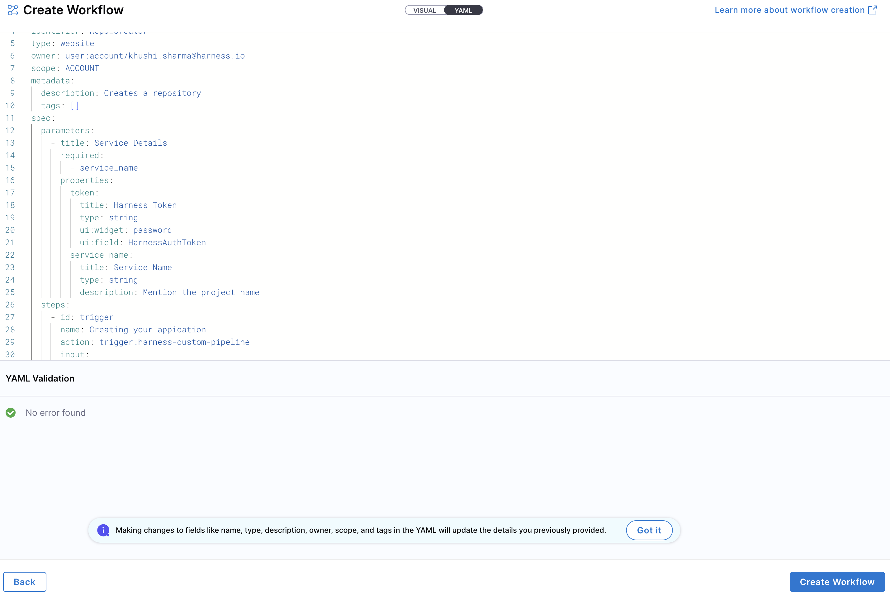
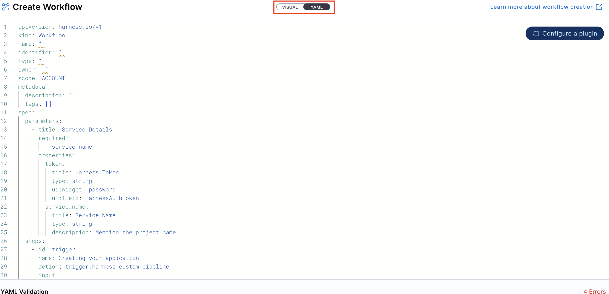
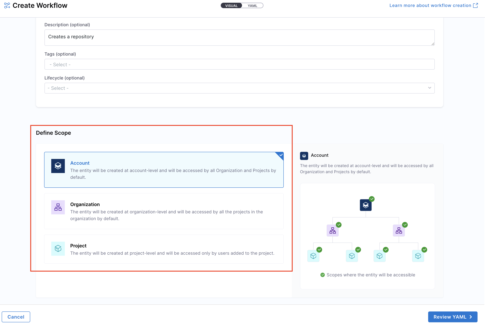
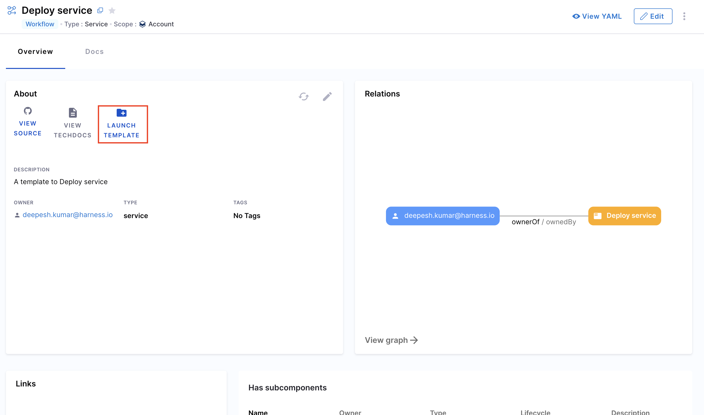
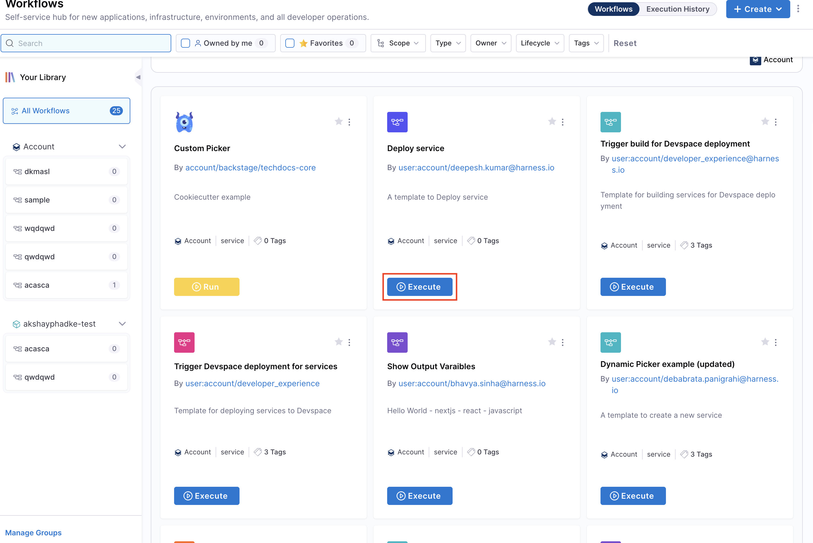

import Tabs from '@theme/Tabs';
import TabItem from '@theme/TabItem';

:::tip For IDP 2.0 Customers
If you're using Harness IDP 2.0, please ensure you have reviewed the [IDP 2.0 Overview guide](/docs/internal-developer-portal/idp-2o-overview/2-0-overview-and-upgrade-path.md) and are familiar with the key steps for [upgrading to IDP 2.0](/docs/internal-developer-portal/idp-2o-overview/migrating-idp-2o.md). To enable IDP 2.0, you must raise a support ticket to activate the `IDP_2_0` feature flag for your account.
:::

**Service and Infrastructure onboarding** in today's world is slow, manual and tedious. Developers often spend days—or even weeks—setting up new software and completing Day-2 operations. This inefficiency arises from either waiting for ticket resolutions (TicketOps) or manually handling repetitive tasks, which results in a poor developer experience and decreased productivity.

Harness IDP addresses these challenges with **Self-Service Workflows**.

Workflows enable developer self-service by automating manual tasks and processes. Using Workflows, platform engineering teams can:
- Automate new service onboarding.
- Simplify Day 2 operations for developers.
- Provide developers with **golden paths** to production that include guardrails and best practices.

This guide will take you through the journey of creating, configuring and executing a Workflow.

## What's new for Workflows in IDP 2.0?
Harness IDP 2.0 represents a major evolution of the Internal Developer Portal, built on a Harness-native data model designed for enterprise-scale environments and robust access control. Here's what's changing in IDP 2.0 for **Workflows**:

- **Harness-native Platform Hierarchy:** Workflows now support Account, Org, and Project scopes, with built-in, fine-grained RBAC.

- **No YAML Required:** Create and modify Workflows directly within the UI—no need to manage YAML files or deal with Git operations

## Prerequisites (IDP 2.0)
Before getting started with **Workflows** in IDP 2.0, ensure you have the following prerequisites: 
* You have reviewed the **[IDP 2.0 Overview](/docs/internal-developer-portal/idp-2o-overview/2-0-overview-and-upgrade-path.md)** and **[Upgrading to IDP 2.0](/docs/internal-developer-portal/idp-2o-overview/migrating-idp-2o.md)** guide. 
* **IDP 2.0** is enabled behind the `IDP_2_0` Feature Flag. Contact **[Harness Support](https://support.harness.io)** to enable it on your account.
* You should have a clear understanding of **[Managing Workflows](/docs/internal-developer-portal/flows/manage-workflow-2o.md)** and **[Workflow YAML](/docs/internal-developer-portal/flows/worflowyaml.md)** to effectively configure and use the components of a Workflow.
* It's recommended to have a **Harness Pipeline** in place, which acts as the orchestrator for Self-Service Workflows.
  Learn more about **[setting up Harness IDP Pipelines here](/docs/internal-developer-portal/flows/harness-pipeline.md)**.

## Create a Workflow (IDP 2.0)
In IDP 2.0, you can create **Workflows** directly from the Harness IDP UI —eliminating the need to manually manage YAML files. With this release, "inline workflows" are fully supported, allowing you to manage the entire workflow lifecycle through the UI or APIs—no Git operations required. Learn more about **[Self Service Workflows](/docs/internal-developer-portal/flows/overview.md)** here. 

There are two ways for you to add and create a new Workflow in your IDP:
- **Create a Workflow via the Harness IDP UI**: Use the Harness UI to create Workflows directly—no YAML required. This method offers a streamlined, code-free experience for adding entities.
- **Create a Workflow using your Workflow YAML**: You can still create Workflows using your existing Workflow YAML files. Harness will automatically convert legacy Backstage YAML into the new Harness-native Data Model and register the corresponding Workflow.

Let's try creating a **Workflow** using both the methods: 

<Tabs>
  <TabItem value="UI" label="Harness IDP UI">
  To create a new **Workflow**, navigate to the Harness IDP portal and click on **"Create"** from the side-bar menu. Choose **Workflow** from the panel, and follow these steps:

  1. **Fill in the Workflow Details**: Provide the necessary information such as the Workflow name, description, and other metadata.

  2. **Define the Workflow Steps**: Configure the steps that the Workflow will execute. This includes specifying the actions, inputs, and outputs for each step.

  3. **Set Permissions and Scope**: Define who can access and execute the Workflow, and specify the scope (Account, Org, or Project).

  4. **Review and Save**: Review the Workflow configuration and save it to make it available for execution.

  
  
  :::info
  **Note:** **YAML validation** is performed to ensure compatibility with the **Harness-native Data Model**. Any errors will be shown in the Validation logs.
  :::

  5. **Test the Workflow**: Once created, you can test the Workflow to ensure it works as expected.
  
  :::info
  If you have a **legacy Backstage YAML**, you can still use it to create a **Workflow**. Harness will automatically convert it into the **Harness-native Data Model** format.
  :::

1. You'll be redirected to the **Visual View**. You can switch to the **YAML View** using the toggle at the top of the screen. This allows you to directly edit the Workflow's YAML definition.

2. **Define the Workflow Scope**: Specify whether the Workflow should be available at the Account, Organization, or Project level. This determines who can access and execute the Workflow.

3. **Configure Workflow Parameters**: Set up the input parameters that users will need to provide when executing the Workflow.

4. **Define Workflow Steps**: Configure the actions that the Workflow will perform, including any integrations with external systems or Harness services.

5. **Save and Publish**: Once you've configured all aspects of the Workflow, save it to make it available for execution.

  </TabItem>
  <TabItem value="YAML" label="Workflow YAML">

To create a **Workflow** using YAML:

1. Navigate to the Harness IDP portal and click **"Create"** in the sidebar.
2. Select **Workflow** from the available options.
3. Switch to the **YAML View** by clicking the toggle.
4. Paste your **Workflow YAML** in the editor or create a new one using the Harness-native format.
5. **Define the Workflow Scope**: Specify the scope (Account, Org, or Project) for the Workflow.
6. **Save and Publish**: Review the YAML and save the Workflow.

  </TabItem>
</Tabs>

## Execute a Workflow (IDP 2.0)
Once you've created a Workflow, you can execute it in several ways:

1. **From the Catalog**:
   * Navigate to the **Catalog** and find the Workflow entity.
   * Click on the Workflow to open its details page.
   * Click **Launch** to execute the Workflow.

2. **From the Workflows Page**:
   * Go to the **Workflows** section from the main navigation.
   * Find and select the desired Workflow.
   * Click **Launch** to execute it.

## Delete a Workflow (IDP 2.0)
To delete a Workflow:
* Go to the **Workflows** page.
* Locate the Workflow you want to remove.
* Click the **three-dot menu** (•••) in the top-right corner of the Workflow card.
* Select **Delete** from the dropdown menu.
* Confirm the deletion when prompted.

## Next Steps (IDP 2.0)

Now that you've created your first Workflow, explore these next steps:

* **[Advanced Workflow Configuration](/docs/internal-developer-portal/flows/manage-workflow-2o)** to learn about complex workflow patterns
* **[Custom Actions](/docs/internal-developer-portal/flows/custom-actions)** to extend workflow capabilities
* **[Workflow RBAC](/docs/internal-developer-portal/rbac/workflows-rbac)** to control access and permissions
* **[Pipeline Integration](/docs/internal-developer-portal/flows/harness-pipeline)** to orchestrate complex automation workflows
