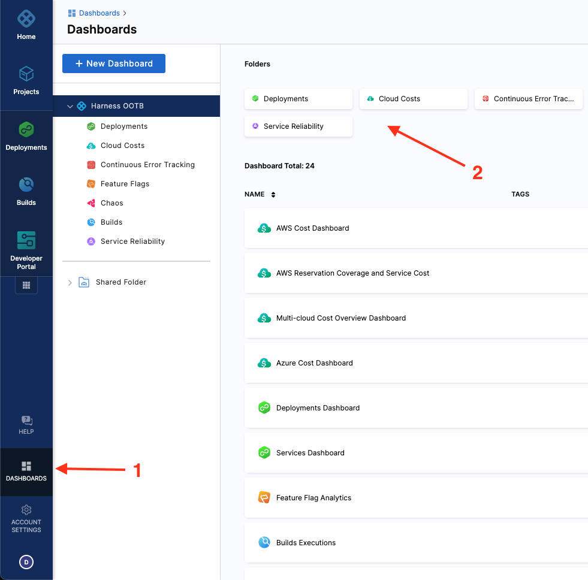
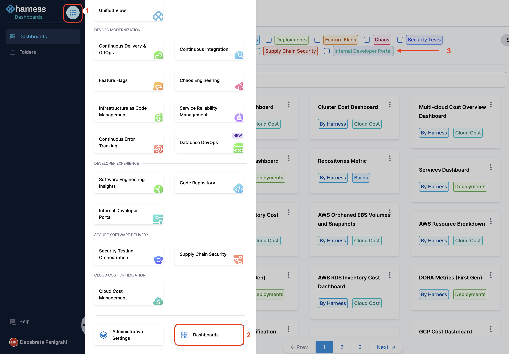
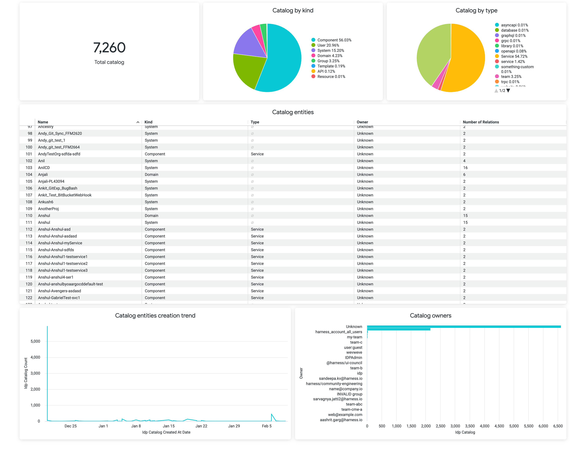
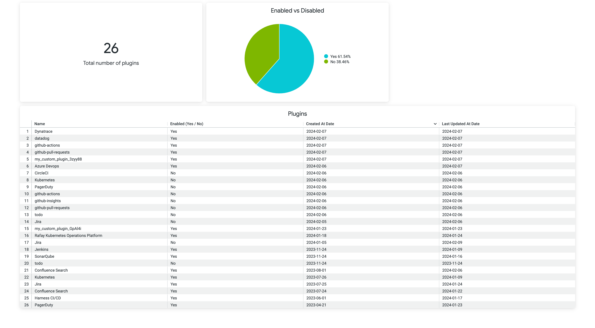
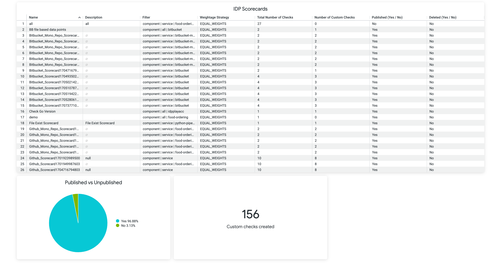
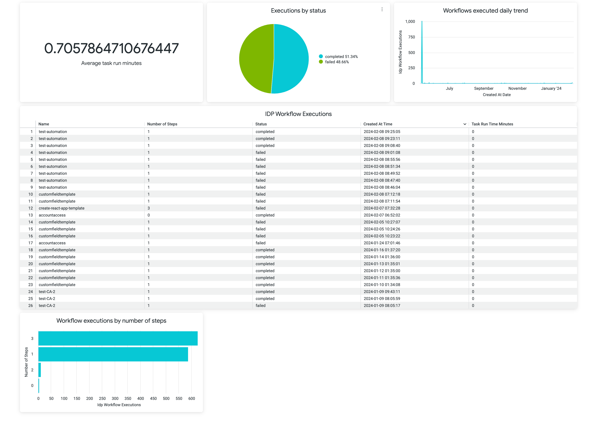

## Introduction

Custom Dashboards are a Harness Platform Feature, that allows you to key metrics and data related to your module. You can customize the dashboards to show specific metrics and data relevant to your needs, and access them from a central location. The Harness Dashboards provide actionable insights out of your IDP, so you can enable good developer experience in your org. 

:::info

- You can create custom dashboards at the **account** scope only.
- Make sure you have the `Manage` permissions for **Dashboards** to create, edit, and delete custom dashboards.
- Make sure you have the `View` permissions for **Dashboards** to view the custom dashboards.

:::

## Navigate to Dashboards

To view and access dashboards, select **DASHBOARDS** from the left navigation in your Harness account. You can filter the data on the dashboards for IDP module by selecting the module name from the top of the page. 

#### Present Left Nav

#### New Left Nav

### Out of the Box Dashboards

At present we provide 4 out of the box dashboards for IDP. 

1. Dashboard describing the state of catalog, which includes, Number of registered entities, catalog kind and type. 

2. Dashboard describing the plugins details.

3. Dashboard with overview of all the scorecards and their respective checks. 

4. Dashboard describing the Workflow Execution details

## Create Dashboard
It is recommended to refer [this documentation](https://developer.harness.io/docs/platform/dashboards/create-dashboards) first to get a basic overview on how to create dashboards.

### Explore

An Explore is a starting point for a query that is designed to explore a particular subject area. This topic describes the various explores available for monitoring your developer portal, and the data the provide. The following is list of explores available for visualizing IDP data.

//TODO: Add the List of explores when available. 

Follow this [documentation](https://developer.harness.io/docs/platform/dashboards/create-visualizations-and-graphs) to create visualizations and graphs

## Dashboard Best Practices

Follow this [documentation](https://developer.harness.io/docs/platform/dashboards/dashboard-best-practices) to know more. 

