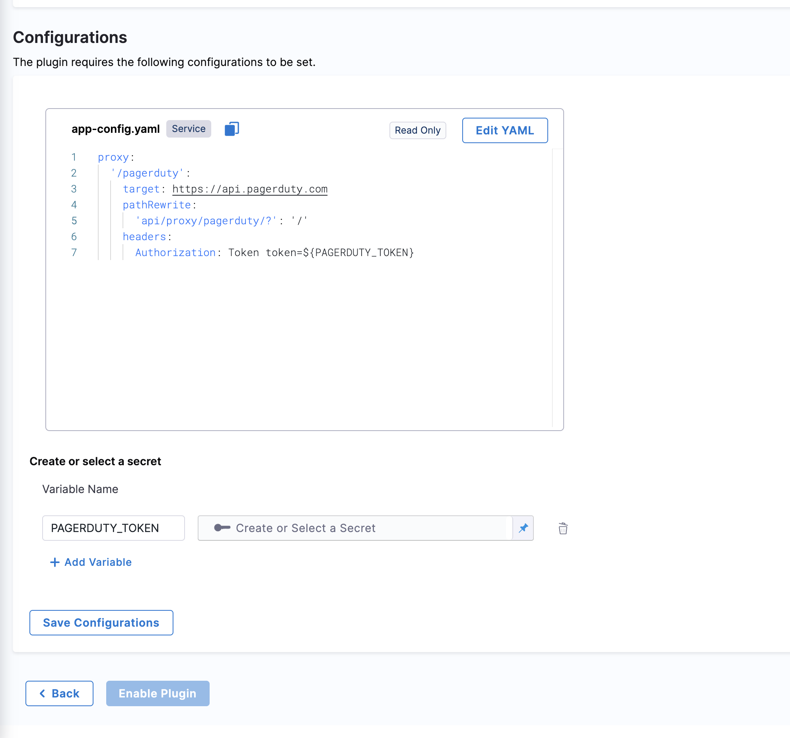

## Introduction

Plugins are often used to show additional metadata about a software component in the software catalog. For example, plugins show information about CI/CD pipelines, alerts, incidents, and project status. [Read More](https://developer.harness.io/docs/internal-developer-portal/plugins/overview)

Now that you have [populated your Catalog with Software Components](/docs/internal-developer-portal/get-started/register-a-new-software-component), you can use plugins to extend the functionality of Harness IDP and to customize IDP to suit your needs. This document provides step-by-step instructions on how to enable a plugin in Harness IDP.

## Pre-requisites

Before you enable a new plugin, ensure that the following prerequisites are met:

- [Harness IDP is provisioned and accessible](/docs/internal-developer-portal/get-started/enabling-module).
- [Catalog is populated with Software Components](/docs/internal-developer-portal/get-started/register-a-new-software-component)

## Plugin types

Harness IDP offers a set of curated plugins that you can enable. Here are some plugin types that you can consider:

- A card in the software catalog. For example, [PagerDuty](https://developer.harness.io/docs/internal-developer-portal/plugins/available-plugins/pagerduty).
- A plugin with a tab in the catalog. For example, [GitHub Insights](https://developer.harness.io/docs/internal-developer-portal/plugins/available-plugins/github-insights).
- A plugin with both cards and tabs (multiple components).
- (Optional) A plugin with both UI and backend with server-side logic to fetch, process, and display data from external systems. For example, [Jenkins](https://developer.harness.io/docs/internal-developer-portal/plugins/available-plugins/jenkins) 
- A plugin with both UI and backend parts and a database. For example, a [TODO plugin](https://github.com/backstage/community-plugins/tree/main/workspaces/todo/plugins/todo#backstage-communityplugin-todo).
- A full page plugin. For example, [GraphQL](https://github.com/backstage/community-plugins/tree/main/workspaces/graphiql/plugins/graphiql#backstage-communityplugin-graphiql).
- [Custom Plugins](https://developer.harness.io/docs/category/custom-plugins): Users can create their own [frontend Backstage plugins](https://developer.harness.io/docs/internal-developer-portal/plugins/build-a-frontend-plugin) and add them to the IDP.

These are just a few examples of plugin types available in Harness IDP. Depending on your requirements, you can choose the plugin type that best aligns with your needs and enables the desired functionality.

Once you have selected the desired plugin type, follow the documented instructions for enabling the plugin. The process might involve configuration, activation, and layout update steps that vary by plugin.

## Enable a plugin

To enable a plugin, follow these steps:

1. Log in to Harness, and then select **Developer Portal** > **Admin** > **Plugins**. 
All administrative configurations, such as plugins, layouts, connectors, configurations, and access control are provided on the **Admin** page, and require the users to have the **Harness Account Admin** role or the **IDP Admin** role. The **Plugins** page showcases a collection of curated plugins categorized as enabled and disabled plugins.


2. The **Plugins** navigation option directs the user to the plugins list page, which showcases a collection of curated plugins. On this page, there are distinct sections dedicated to enabled plugins, custom plugins and other plugins available in the marketplace, providing a clear differentiation between the three categories.


3. Select the desired plugin card. 

The **Plugin details** page is displayed. The page provides information such as the plugin's name, details, layout, and configurations. It also includes an option to add a plugin secret. The plugin's layout section is read-only and displays the exported cards, tabs, or pages provided by the plugin.




4. (Optional) If you want to customize the plugin's configuration, in the **Configurations** section, edit the default configuration YAML. 

5. Update the plugin secret token value as specified in the configuration YAML. Make sure that the secret token name is the same as given in the configuration YAML.

6. After verifying all the configurations and secret details, **save the configuration**. If the configuration YAML is valid, the plugin configuration is saved. Otherwise, appropriate messages are displayed.

7. To enable the plugin, select **Enable Plugin**. The plugin is moved to the **Enabled Plugins** section on the **Plugins** page.

8. To return to the **Plugins** page, select **Back**.

:::info

The [layout management](https://developer.harness.io/docs/internal-developer-portal/layout-and-appearance/catalog) is handled by-default once you enable the plugin. In-case you want to modify the elements that are exported from the plugin according to your need you can **edit the layout** for **Service** by going to **Admin** -> **Layout** -> **Catalog Entities**. The elements might include cards, tabs, and pages.

For instance, if the [PagerDuty](http://localhost:3001/docs/internal-developer-portal/plugins/available-plugins/pagerduty) plugin exports one tab, in order to be displayed in your catalog entity, the layout is updated with elements as displayed below.


:::

### Update the `catalog.info.yaml`

1. Once you've enabled the plugin, you need to add the corresponding `annotations` in your `catalog-info.yaml` file.

```YAML
apiVersion: backstage.io/v1alpha1
kind: Component
metadata:
  # ...
  annotations:
    pagerduty.com/integration-key: [INTEGRATION_KEY]
spec:
  type: service
  # ...
```

- Once the annotation is added, you can commit the changes to your `catalog-info.yaml` and refresh the software component to sync with the latest changes and view the Jenkins plugin card component overview page and the tab on top of the page. 


You should now be able to view the enabled plugins in the catalog section of Harness IDP. 
