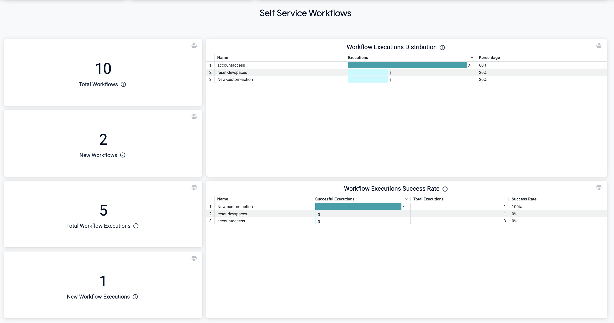

We provide an out-of-the-box adoption dashboard to help you with tracking Harness IDP adoption inside your organization. You can find this Dashboard under [Custom Dashboards](https://developer.harness.io/docs/category/harness-dashboards). 

## Navigate to Dashboards

To view and access dashboards, select **DASHBOARDS** from the left navigation in your Harness account. You can filter the data on the dashboards for IDP module by selecting the module name from the top of the page. 

#### Old Left Nav

#### New Left Nav

## Adoption Dashboard

This Dashboard let you view activities on your IDP for a given **Aggregation Period**.

  - Software Catalog
  
  

  - Self Service Workflows 

  

  - Scorecards

  

You can [download](https://developer.harness.io/docs/platform/dashboards/download-dashboard-data) the dashboard data and share it with your teams, executive or anyone who's not yet started with IDP yet to help them understand the usage of Harness IDP in your engineering organization.